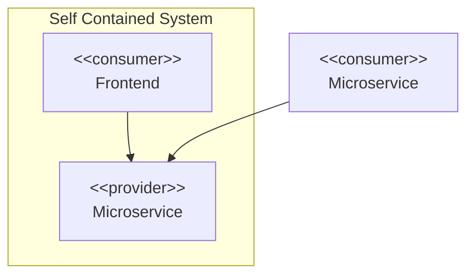

# API Segregation

To keep REST APIs as simple as possible and to avoid dependencies, microservices should not offer a single API for all consumers but instead provide specific APIs for different consumer types.

Further arguments for the segregation of interfaces can be found in the following articles:

- [RoleInterface (Martin Fowler)](https://martinfowler.com/bliki/RoleInterface.html)
- The [Interface segregation principle](https://en.wikipedia.org/wiki/Interface_segregation_principle): "Clients should not be forced to depend upon interfaces that they do not use."
- [Backends for Frontends (Sam Newman)](https://samnewman.io/patterns/architectural/bff/)

## Example: Self Contained System

The backend of a typical Self Contained System must serve two consumer types.

- Its frontend
- Other applications

In the sense of API segregation, the SCS should offer at least two independent APIs.

- One API used exclusively by the SCS's frontend
- At least one API consumed by other applications

## Motivation

The frontend has different requirements for the API than other business applications.

- Different authentication mechanism than in service-to-service communication (e.g. OAuth2 Authorization Code Flow vs. Client Credentials Flow vs. API Gateway Token)
- Internal details required for operations or error handling, which are not relevant or accessible to other consumer applications
- Reading a lot of information (the whole resource tree) with only a few requests. Consumer applications typically only need exactly one specific resource, which is transferred with as little overhead as possible.
- Tendentially a small number of requests (caused by users), while consumer applications trigger many requests (caused by automated processes).
- During operations and error handling, authorized users must be able to perform manipulations that are not available to a consumer application.

New requirements towards the frontend (or consuming microservices) should be implementable without changing the API of the other consumer type.

## Conclusion

The example shows that the requirements of the different consumer types can be very different. Segregating into several role-specific APIs is the simplest way to meet the different requirements of different consumer types.
