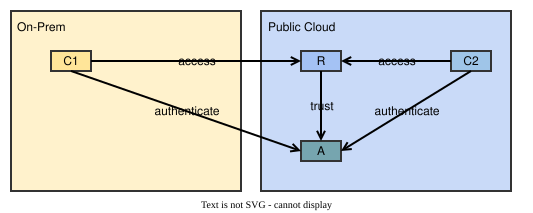
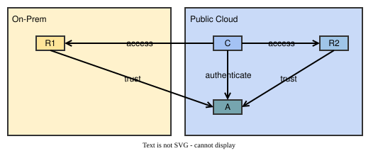
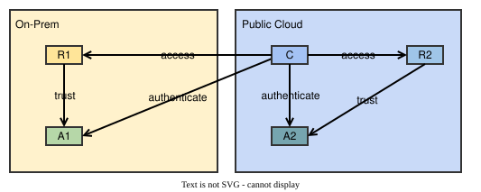

# Cross-platform authentication

It might not be possible for a system to run all its microservices just on one platform. Maybe the majority of the
system's microservices run in a public cloud, but some of its microservices must run on-prem for governance reasons.
In this case, the system's microservices will generally have to communicate with each other across platform
boundaries and access to functions and data must also be protected across the platforms. Regarding access to
OAuth2/OIDC-protected resources, several scenarios are possible under such circumstances. The following sections
will discuss some of these scenarios for the example of a system that runs microservices mainly in a public cloud but
also has to run some microservices on-prem.

**Note:** The diagrams on this page must not be understood as showing specific architectures advocated by jEAP. The
diagrams are just meant to illustrate some possible cross-platform authentication scenarios. Also, the platforms
"on-prem" and "public cloud" are used just as examples in the diagrams.

## One or two authorization servers?

Ideally, access to all resources of a system should be managed by one authorization server which runs on the same
platform as the majority of the system's microservices, i.e. the public cloud for the example system. If this is not
possible and access to the system's resources has to be managed by two different authorization servers, care should
be taken to not duplicate configurations on the two servers. For each of the system's resources, access should only
be managed by one of the authorization servers, typically the one running on the same platform as the resource.

## Accessing a resource in the public cloud

Let's assume one of the system's resources in the public cloud has to be accessed by other microservices in the
public cloud as well as by a microservice of the system running on-prem. The following figure shows a typical setup
for this scenario.

The resource R in the public cloud trusts the authorization server A in the public cloud. Both clients, the one
on-prem and the one in the public cloud, authenticate against the authorization server A in the public cloud. The
authorization server A must be accessible not just within the public cloud but also from clients running on-prem.

## Accessing a resource on-prem

Let's assume one of the system's on-prem resources has to be accessed by one of the system's public cloud
microservices, which also needs to access another system resource in the public cloud. The following figure shows a
typical setup for this scenario.

The resource R1 on-prem as well as the resource R2 in the public cloud trust the authorization server A in the public
cloud. The client C in the public cloud authenticates against the authorization server A in the public cloud. In this
setup the on-prem resource trusts the public cloud authorization server with its access management. This could be a
problem if the reason why the resource is running on-prem were some security or governance concerns as the same
concerns could also object to managing access to the resource in the public cloud. If this is the case, the following
setup could fix the problem:

Here, the on-prem resource R1 only trusts the on-prem authorization server A1 with its access management. Access to
the resource R1 now only depends on things under on-prem control. However, in this setup the on-prem authorization
server must be accessible by the system's public cloud microservices.

See [Configuring different authorization servers](../calling-secured-rest-apis-from-java.md#configuring-different-authorization-servers)
for how to configure a microservice to access resources protected by different authorization servers. Configuring
different authorization servers in a microservice is usually also needed if the microservice's clients are accessing
resources of different systems (with each system protecting its own resources with its own authorization server(s)).

## Moving a resource from one platform to another

Let's assume one of the system's on-prem resources with access management on-prem is to be moved to the public cloud
and we also want to move the resource's access management to the public cloud authorization server. If the resource R
must stay constantly available without interruption during its transition from one platform to the other, the moved
resource R must temporarily accept tokens issued by the on-prem authorization server in addition to tokens issued by
the public cloud authorization server. Otherwise, if the moved resource were only to accept tokens issued by the
public cloud authorization server, this would interrupt its service for clients holding a still valid token issued
previously by the on-prem authorization server.

The moved resource R temporarily trusts both authorization servers, the "old" one on-prem (A1) and the "new" one in
the cloud (A2). Therefore, the clients C1 and C2 can use tokens from both authorization servers to access the
resource. We plan for the resource R to stop trusting the A1 authorization server after all of R's clients stopped
fetching tokens from A1 and after the tokens that have been issued by A1 expired. After that the temporary
relationships shown as dotted lines in the figure above will no longer exist. During the transition period duplicated
OAuth2/OIDC clients for accessing R are configured in A1 and A2.

Temporarily accepting tokens from the "old" authorization server after the transition of the resource to the new
platform and the "new" authorization server would e.g. not be required if the resource's URL would change with the
transition. In this case, clients would simply access the moved resource under the new URL and would authenticate
against the new authorization server.

See [Configuring multiple authorization servers](../protecting-rest-apis/rest-api-authentication-and-authorization.md#configuring-multiple-authorization-servers)
for how to configure more than one trusted authorization server in a resource.

## UI clients

jEAP recommends to build applications as self-contained systems or, if that is not possible, to apply the backend
for frontend (BFF) pattern. In both cases, the UI of an application only accesses one backend. Therefore, the UI 
usually also only has to authenticate against one authorization server, the one that manages access to its backend's
resources. The UI's backend might have to access a resource that has its access managed by another authorization server.
This however is of no concern to the UI.

In the example below C1 is a UI client accessing the backend R1|C2 which trusts the authorization server A1 with its
access management. At the same time, the backend R1|C2 has to access a resource R2 that trusts its access management
to another authorization server A2. The UI client does not access R2 directly as access to R2 is encapsulated by
R1|C2. Therefore, the UI client C1 does not have to trust the authorization server A2.

## Token propagation

With [token propagation](../calling-secured-rest-apis-from-java.md#token-propagation),
a microservice of a system does not fetch its own token from an authorization server to access a resource but
instead uses a token that was [passed along in a request](../calling-secured-rest-apis-from-java.md#token-propagation)
to the microservice. When a system uses more than one authorization server and the system's microservices make use of
token propagation, determining the authorization server(s) a resource should trust might not be straightforward as
the client accessing the resource is not the one that obtained the access token from an authorization server in the
first place.

In the example above, C1 could be a UI client acting on behalf of a user authenticated against the authorization
server A1. R1|C2 could be a backend-for-frontend resource R1 accessing another resource R2 on behalf of the user as
client C2. R1|C2 would use the same token to access R2 as was used to access R1 (token propagation). The resource R2
would have to trust the authorization server(s) which R1 trusts for its access management. This in addition to the
authorization server A2 that manages access to R2 for other microservices like C3.

To restrict propagation of tokens to intended use cases, the
[audience claim](../tokens/tokens-in-the-blueprint-microservice.md#reserved-claims) of a token can be used to restrict token
usage to intended resources. See also [Audience validation](../audience-restriction/audience-validation.md).

## Examples

The [jme-security-example](https://github.com/jme-admin-ch/jme-security-example) shows
examples for authentications using different authorization servers (Keycloak, mock server).

## Related

- [Authentication and authorization](../index.md) — the overview of authentication and authorization in jEAP: authentication contexts, functional and data authorization, OpenID Connect and OAuth2.
- [Calling secured REST APIs from Java](../calling-secured-rest-apis-from-java.md) — configure clients for different authorization servers and token propagation.
- [Authentication and authorization for REST APIs](../protecting-rest-apis/rest-api-authentication-and-authorization.md) — configure multiple trusted authorization servers in a resource.
- [Integrating different authorization servers](integrating-different-authorization-servers.md) — integrate authorization servers with differing token formats.
- [Audience validation](../audience-restriction/audience-validation.md) — restrict token usage to intended resource servers.
