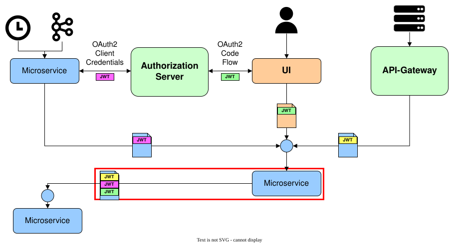

# Calling secured REST APIs from Java

Microservices frequently call **REST APIs** of other microservices that are protected against unauthorized access. To do so, the caller must authenticate itself to the provider of the API, which then authorizes the caller accordingly. In the jEAP Blueprint Microservice, authentication and authorization of the caller of a REST API are based on **OAuth2** (see [OIDC in the Blueprint Microservice](oidc-in-the-blueprint-microservice.md)). A caller (also called **client**) must identify itself with an **access token** issued by a central authorization server. Two cases need to be distinguished:

- The microservice calls the other service with its own access token (system context).
- The microservice uses a token that it has itself received from a caller (token propagation).

## Integration

**Spring Security** supports OAuth2 directly. The starter **jeap-spring-boot-security-client-starter** implements the OAuth2-based authentication of a client towards a resource as prescribed by the jEAP Blueprint Microservice.

> **Note:** The `jeap-spring-boot-security-client-starter` comes automatically as a dependency of the `jeap-spring-boot-security-starter` and up to version 17.43.0 was even an integral part of it. As of version 18.0.0, the client-related functionality of the jEAP Security Starter is also available as the separate dependency `jeap-spring-boot-security-client-starter`.

Adding the `jeap-spring-boot-security-client-starter` as a dependency:

```xml
<dependency>
    <groupId>ch.admin.bit.jeap</groupId>
    <artifactId>jeap-spring-boot-security-client-starter</artifactId>
</dependency>
```

To use the starter, an OAuth2 authorization server must be available (e.g. [Keycloak](authorization-servers/keycloak.md) or the [OAuth2 mock server](testing/oauth2-mock-server.md)).

## Configuration

To access a REST API in the system context, the following properties must be configured:

| Property | Value |
| --- | --- |
| `spring.security.oauth2.client.registration.our-client-name.client-id` | ID of an OAuth2 client configured in an authorization server |
| `spring.security.oauth2.client.registration.our-client-name.client-secret` | Secret (password) of the OAuth2 client |
| `spring.security.oauth2.client.registration.our-client-name.authorization-grant-type` | `client_credentials` |
| `spring.security.oauth2.client.registration.our-client-name.provider` | `auth-server-name` (refers to the configuration of an OAuth2 provider named "auth-server-name" under `spring.security.oauth2.client.provider.auth-server-name.*`) |
| `spring.security.oauth2.client.provider.auth-server-name.issuer-uri` | URI of the authorization server |

The jEAP Security Starter only provides its client functionality if such a client configuration is present.

### Configuring different authorization servers

If a microservice has to call REST APIs whose access management is handled by different authorization servers, each of these authorization servers must be configured under `spring.security.oauth2.client.provider.{auth-server}.*`. The configuration of an OAuth2 client for a specific provider under `spring.security.oauth2.client.registration.{client-name}.*` must then reference the corresponding provider name with `spring.security.oauth2.client.registration.{client-name}.provider={auth-server}`.

See [Spring Boot Property Mappings](https://docs.spring.io/spring-security/reference/servlet/oauth2/login/core.html#oauth2login-boot-property-mappings) in the Spring Security documentation for details on configuring OAuth2 clients in the Spring Security client registry through Spring Boot properties.

## Accessing protected resources

A protected resource is accessed with the Spring **RestClient**. The Spring **RestTemplate** is not supported.

## Creating a client instance

The Spring RestClient provides a convenient builder for creating its instances. With the **JeapOAuth2RestClientBuilderFactory**, the jEAP Security Starter provides a factory that creates specially pre-configured client builder instances. The builder can then be configured further as needed, e.g. by setting a base URL, before the desired client instance is created.

Example: creating a RestClient builder

```java
RestClient.Builder oAuth2RestClientBuilder = jeapOAuth2RestClientBuilderFactory.createForClientId("default");
RestClient oAuth2RestClient = oAuth2RestClientBuilder.baseUrl(url).build();
```

Currently, three factory methods for RestClient builder instances are available:

| Method | Behavior of the created client instances | Token context |
| --- | --- | --- |
| `createForClientRegistryId(String clientRegistryId)` | All outgoing requests carry an OAuth2 access token that is obtained from the authorization server using the client configuration referenced by `clientRegistryId`. | "System" |
| `createForTokenFromIncomingRequest()` | All outgoing requests carry the OAuth2 access token from the current incoming request if such a token is present; otherwise, no token is added to the outgoing requests. | Token propagation if possible, otherwise no token |
| `createForClientRegistryIdPreferringTokenFromIncomingRequest(String clientRegistryId)` | A mix of `createForClientRegistryId()` and `createForTokenFromIncomingRequest()`: if the current incoming request contains an access token, this token is used; otherwise, a token is obtained from the authorization server using the client configuration referenced by `clientRegistryId`. | Token propagation if possible, otherwise "System" |

## Examples

### System context

An example project for authentication in the system context is available at [jme-security-client-service](https://github.com/jme-admin-ch/jme-security-example/tree/main/jme-security-client-service). The project
implements an unprotected REST API that simply delegates incoming requests to the protected REST API of the corresponding
resource examples (see [Authentication and authorization for REST APIs](protecting-rest-apis/rest-api-authentication-and-authorization.md#examples)). The example contains the following components:

- **PartnerController:** Calls the OAuth2-protected REST endpoint of the resource example. It uses a RestClient instance created with the JeapOAuth2RestClientBuilderFactory. In a local deployment, it is reachable at [http://localhost:8090/jme-security-client-service/api/partners](http://localhost:8090/jme-security-client-service/api/partners).
- **InfoController:** Calls the REST endpoint of the resource example that is protected with basic authentication. It uses a RestClient instance created with the standard RestClient builder. In a local deployment, it is reachable at [http://localhost:8090/jme-security-client-service/api/info](http://localhost:8090/jme-security-client-service/api/info).
- **OtherSystemController:** Calls the OAuth2-protected REST endpoint using a second authorization server at [http://localhost:8280](http://localhost:8280). This simulates calling a service of another business application. It uses a RestClient instance created with the JeapOAuth2RestClientBuilderFactory *with a different client ID* ("jeap-microservice-examples-oauth-client-other-system"). In a local deployment, it is reachable at [http://localhost:8090/jme-security-client-service/api/othersystem](http://localhost:8090/jme-security-client-service/api/othersystem).

The example requires an authorization server with a matching configuration. Locally and in the DEV environment, an instance of the [OAuth2 mock server](testing/oauth2-mock-server.md) is used for this; other environments usually provide a [Keycloak](authorization-servers/keycloak.md) server. In general, the authorization server must be configured to issue tokens for the system context that contain the roles required to access the OAuth2-protected REST endpoints of the resource example projects (see [Authentication and authorization for REST APIs](protecting-rest-apis/rest-api-authentication-and-authorization.md#examples)).

### Token propagation

Token propagation describes the case where a microservice uses the access token it was called with to call another microservice. The second microservice is then accessed with the permissions of the access token received by the first microservice. Depending on the origin, this token may have been issued for different contexts. The figure below shows how access tokens from the system, user and B2B contexts can be used to call a microservice, and how this microservice can then use these tokens to access another microservice. The token propagation is marked with a red rectangle in the figure.



An example demonstrating authentication with token propagation is available: The example microservice [jme-security-clientresource-service](https://github.com/jme-admin-ch/jme-security-example/tree/main/jme-security-clientresource-service) acts both as an OAuth2 resource and as an OAuth2 client at the same time. As an OAuth2 resource, the example microservice supports the same API as the resource example from [Authentication and authorization for REST APIs](protecting-rest-apis/rest-api-authentication-and-authorization.md#examples). As an OAuth2 client, it can access this resource example. The example microservice runs locally on port 8082.

The idea is that the token propagation example projects can be placed transparently between a client for the system context (see above) and a resource from [Authentication and authorization for REST APIs](protecting-rest-apis/rest-api-authentication-and-authorization.md#examples). To this end, the token propagation example microservice forwards all requests of the client example microservice directly to the resource example microservice. In doing so, the token propagation example microservice uses differently configured client instances for different endpoints and thus demonstrates use cases for each of the three factory methods of the JeapOAuth2RestClientBuilderFactory, in particular also for token propagation.

To establish the call chain client example microservice → token propagation example microservice → resource example microservice, add the request parameter `target=clientresource` to the call of the client example microservice. Locally, for example, call [http://localhost:8090/jme-security-client-service/api/partners?target=clientresource](http://localhost:8090/jme-security-client-service/api/partners?target=clientresource) instead of [http://localhost:8090/jme-security-client-service/api/partners](http://localhost:8090/jme-security-client-service/api/partners). The client example microservice will then call the token propagation example microservice instead of the resource example microservice.

## Further documentation

- [Spring RestClient documentation](https://docs.spring.io/spring-framework/reference/integration/rest-clients.html#rest-restclient)
- [Spring Security OAuth2 Client WebMvc documentation](https://docs.spring.io/spring-security/site/docs/current/reference/htmlsingle/#oauth2client)

## Related

- [Authentication and authorization](index.md) — the overview of authentication and authorization in jEAP: authentication contexts, functional and data authorization, OpenID Connect and OAuth2.
- [Authentication and authorization for REST APIs](protecting-rest-apis/rest-api-authentication-and-authorization.md) — protect the REST APIs that are called here.
- [OIDC in the Blueprint Microservice](oidc-in-the-blueprint-microservice.md) — the OAuth2/OIDC flows used in the Blueprint Microservice.
- [Integrating different authorization servers](authorization-servers/integrating-different-authorization-servers.md) — accept tokens from several authorization servers on the resource side.
- [Cross-platform authentication](authorization-servers/cross-platform-authentication.md) — token propagation across platforms.
- [OpenID Connect / OAuth2 mock server](testing/oauth2-mock-server.md) — local authorization server for development.
- [Keycloak](authorization-servers/keycloak.md) — the authorization server used in the target environments.
