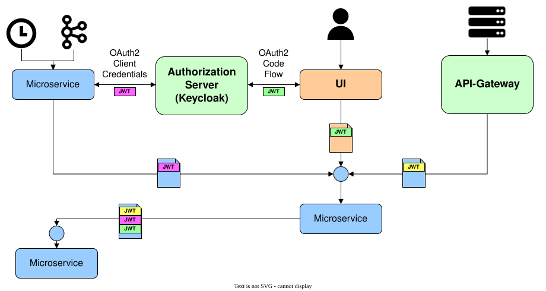

# Authentication and authorization

The goal of **authentication** and **authorization** is to prevent unauthorized users from gaining
access to data or systems, and to ensure traceability (who did what, and when?). **Authentication**
proves that a user really is who they claim to be (proof of identity). **Authorization** grants
specific rights to an authenticated user. In a microservice architecture, every call to a
microservice must be authenticated and authorized.

This section collects the concepts and the practical guidance for authentication and authorization
in jEAP applications: the authentication contexts and token formats, how to secure REST APIs with the
jEAP Security Starter, how to call secured APIs from Java, how token audiences are defined and
validated, and how secured APIs are tested.

## Data authorization and functional authorization

There are two forms of authorization. **Functional authorization** determines whether a user may
execute a function. It is usually based on roles and can be checked before the function runs, for
example with Spring Security annotations on the REST endpoint. **Data authorization** determines
whether a user may access specific data. It cannot always be checked before the function runs,
because the data often has to be loaded first. Data is usually organized in data spaces, for example
the data of one user or of one company (multi-tenancy).

Example: a user wants to change the delivery address of an order in a customer portal. To do so, the user
needs the "edit order" role; users without this role, or users who are not logged in, cannot change orders at
all. On every such request, the service checks whether the user is logged in and has this role. If not, the
request is rejected before any business logic runs (functional authorization). Only if the user has the role
does the service load the order from the database. Only with the loaded order can the service check whether the
user is also authorized to change this specific order, namely whether the order belongs to the data space the
user may access (data authorization): a business partner user may only change the orders of their own company,
whereas a customer service clerk of the organization operating the portal, who has the same role, may change
the orders of all companies because they process orders on behalf of every business partner.

## OpenID Connect and OAuth2

Authentication and authorization in jEAP are based on established standards rather than on proprietary
protocols: **OAuth2** and **OpenID Connect (OIDC)**. This lets jEAP applications use the standard support
for these protocols in Spring Security, and it lets the same mechanisms work for all clients, whether they
are a web UI, another microservice or an external system.

The two standards play different roles. **OAuth2 covers authorization**: a client obtains an **access
token** from a central **authorization server** and presents it with every call to a microservice. The
microservice verifies the token and derives from it who is calling and with which rights. **OpenID Connect
covers identity**: it builds on OAuth2 and adds the authentication of the user, so that the client learns who
the user is (through an ID token) and how to reach and verify the authorization server (through OpenID Connect
Discovery). In short, OpenID Connect establishes who the caller is, and OAuth2 governs what the caller may do.

How jEAP applies these standards is described in
[OIDC in the Blueprint Microservice](oidc-in-the-blueprint-microservice.md).

## Authentication contexts

An authorization always takes place within a context. jEAP distinguishes three contexts:

- In the **user context**, a request is made by a user, usually through a web UI or a mobile
  application. The called system must check whether the **user** is authorized to execute the request.
  A user can be a **natural person**, a **business partner**, or an **employee**. These groups differ
  in their requirements, particularly for data authorization: a natural person usually may access only
  their own data, a business partner the data of their company, and an employee all data, always
  within the limits of their rights.
- In the **system context**, a request is made on behalf of an internal system, for example another
  microservice. This is the case, for example, when a system reacts to an event. The calling system
  then acts as a technical user, and the called system must check whether this technical user is
  authorized to execute the request. Because each calling system uses its own technical user, the
  called system can grant different rights to different calling systems.
- In the **B2B context**, a request is made on behalf of an external system, for example a system of
  a partner company. The calling system must first have registered through an **API subscription**,
  and the called system must check whether this subscription is authorized to execute the request. A
  subscription is bound to one business partner and may only access that business partner's data.

The different authentication contexts: in green the user context (a user accesses the system through the UI),
in yellow the B2B context (an external system calls through the API gateway), and in magenta the system context
(between two microservices). In addition, any of these contexts can be passed on to the next service in a REST
call (token propagation).

## Vertical and horizontal authentication

**Vertical authentication** covers a client (web application, mobile app, fat client) calling a
microservice. **Horizontal authentication** covers a microservice calling another microservice.
Horizontal authorization has two cases:

- **Token propagation**: the request is made in the context of the original caller by passing on its
  access token. A backend for frontend (BFF) is a typical example: the original caller is the user,
  and the BFF calls another backend service, which checks for itself whether the user has the right
  to make this call. From the second service's point of view, the request was made in the context of
  the user.
- **System context**: the request is made in the context of the calling system, not of the original
  caller. This is needed, for example, when a system makes a call that the original user would not be
  allowed to make themselves. The called system must check whether the calling system is authorized
  to execute the request.

## Further reading

To learn more about how authentication and authorization work in jEAP, **start with** these two pages:

- [OIDC in the Blueprint Microservice](oidc-in-the-blueprint-microservice.md) — how the OpenID Connect / OAuth2
  roles map to the components of a business application, and which OAuth2 flows are used in the user, system and
  B2B contexts.
- [Role concept in the Blueprint Microservice](role-concept.md) — user roles and business partner roles, and the
  role models simple roles, semantic roles and authorities.

**Then continue** with whatever you are working on:

- [Protecting REST APIs](protecting-rest-apis/index.md) — securing the REST APIs of a microservice with the jEAP
  Security Starter, and authorizing requests against the roles of the token.
- [Calling secured REST APIs from Java](calling-secured-rest-apis-from-java.md) — calling a protected REST API from
  a microservice, in the system context or with token propagation.
- [Testing](testing/index.md) — running and testing secured REST APIs without a real authorization server, with
  the OAuth2 mock server and the jEAP security test support.
- [Authorization servers](authorization-servers/index.md) — Keycloak as the authorization server, authorizing
  consuming applications, and working with several authorization servers.
- [Tokens](tokens/index.md) — the access, refresh and ID tokens of the Blueprint Microservice, token introspection
  and keeping access tokens small.
- [Audience restriction](audience-restriction/index.md) — restricting the use of an access token to the resources it
  was issued for.

## Related

- [Current-User Endpoint](../frontend/current-user-endpoint.md) — the endpoint of the jEAP Security Starter through which a frontend reads the user information and authorizations of the current bearer token.
- [Concepts](../index.md) — the overview of all jEAP concepts.

