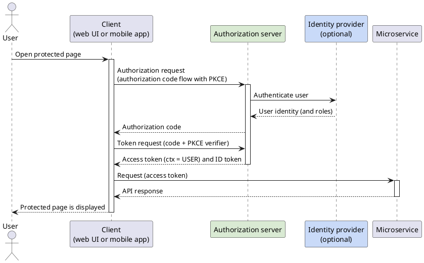
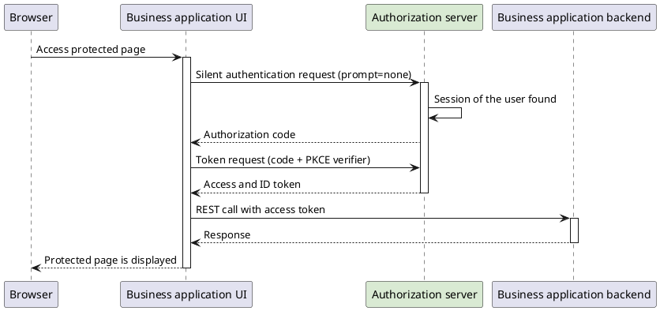
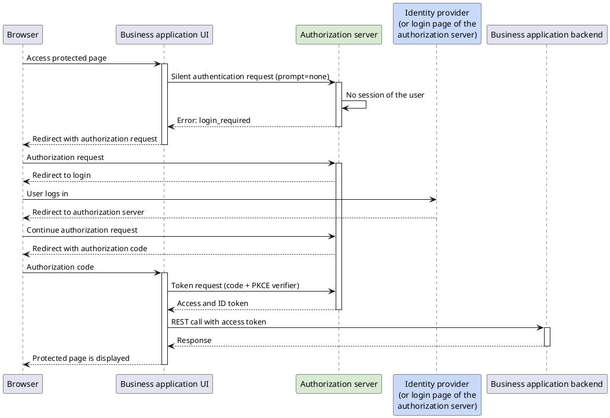
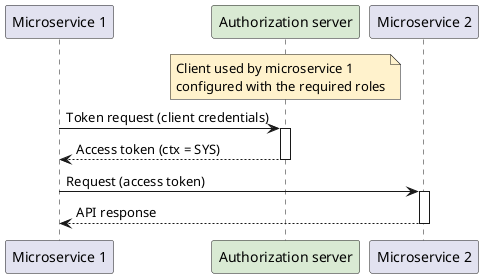
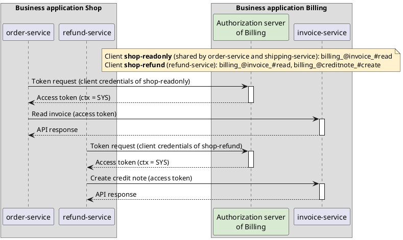
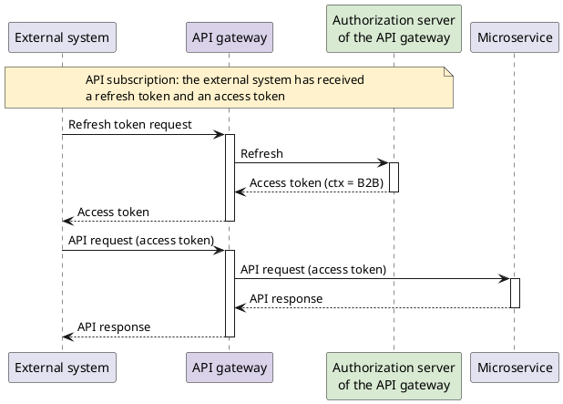

# OIDC in the Blueprint Microservice

**OAuth2** is a protocol for standardized and secure API authorization for desktop, web and mobile applications.
Its goal is that a **resource owner** (usually a user) can grant an application (called the **client** or
**relying party**) access on their behalf to a protected resource (for example an API) on a **resource server**.
For the resource server to allow the access, the client must present an **access token** to it. The access token
is issued by an **authorization server** once it has verified the identity of the resource owner and the
authorization of the client. OAuth2 does not prescribe what an access token has to look like, but signed
**JSON Web Tokens (JWT)** are often used.

**OpenID Connect (OIDC)** builds on OAuth2 and extends it with information about the identity of the resource
owner. Whereas with OAuth2 the client only receives an access token from the authorization server, with OpenID
Connect it additionally receives an ID token with information about the user. OpenID Connect also standardizes
how a client discovers the endpoints and the signing keys of an authorization server (OpenID Connect Discovery).

> **Example OAuth2: a third-party app posting to a social network**
>
> A social network provides an API through which posts can be published. A third-party app can use it to publish
> content from the app directly to the user's feed. In this case the app is the client, and the social network is
> both the authorization server and the resource server. The app is not interested in the identity of the user; it
> only wants to access the user's resource (the feed) on the user's behalf.

> **Example OpenID Connect: social login at a website**
>
> Many websites let users log in with the account of a large identity provider instead of creating a new account
> with its own password. In this case the website's backend is the client and the identity provider is the
> authorization server. The backend reads the information about the user from the ID token and thereby identifies
> the user. The access token, on the other hand, is not needed, because no further resources are going to be
> accessed on the user's behalf.

## OAuth2 roles in the Blueprint Microservice

The Blueprint Microservice uses OAuth2/OIDC and JOSE/JWT ([JOSE](https://jose.readthedocs.io): Javascript Object
Signing and Encryption) for authentication and authorization. The OAuth2 roles map to the components of a
business application as follows:

| OAuth2 role | In the Blueprint Microservice |
| --- | --- |
| Resource owner | A user (natural person, employee or business partner user), a system (technical user), or a business partner that has subscribed to an API |
| Client | A web UI or mobile app (user context), a microservice (system context), or an external system calling through an API gateway (B2B context) |
| Authorization server | An OAuth2/OIDC authorization server, e.g. [Keycloak](authorization-servers/keycloak.md) or, for local development, the [OAuth2 mock server](testing/oauth2-mock-server.md). In the B2B context, the API gateway's authorization server |
| Resource server | A microservice offering a REST API, protected with the jEAP Security Starter (see [Authentication and authorization for REST APIs](protecting-rest-apis/rest-api-authentication-and-authorization.md)) |

Regardless of the context, all access tokens are signed JWTs in the same
[format](tokens/tokens-in-the-blueprint-microservice.md). Besides the reserved JWT claims (`iss`, `sub`, `aud`, `exp`,
...), an access token carries the [authentication context](index.md#authentication-contexts) in the private claim
`ctx` (`USER`, `SYS` or `B2B`) and the roles of the resource owner in the claims `userroles` and `bproles` (see
[Role concept in the Blueprint Microservice](role-concept.md)). The authorization server therefore not only
authenticates the resource owner, it also acts as the source of the resource owner's roles, either by managing
them itself or by obtaining them from an external role management system.

## Contexts and flows

The Blueprint Microservice distinguishes three [authentication contexts](index.md#authentication-contexts).
Which OAuth2 flow is used to obtain an access token depends on the context:

| Context | `ctx` claim | Who obtains the token | OAuth2/OIDC flow |
| --- | --- | --- | --- |
| [User context](#user-context) | `USER` | The UI (web UI or mobile app) on behalf of the logged-in user | OpenID Connect authorization code flow with PKCE |
| [System context](#system-context) | `SYS` | The calling microservice for itself (technical user) | OAuth2 client credentials flow |
| [B2B context](#b2b-context) | `B2B` | The external system, from the API gateway, on the basis of its API subscription | No flow against the business application's authorization server; the API gateway's authorization server issues the tokens |

In every context, the client sends the access token as a *Bearer* token in the HTTP `Authorization` header of
its requests to a microservice. A microservice that itself has to call another microservice can either pass the
access token it received on (**token propagation**, i.e. the call stays in the context of the original caller)
or obtain a token of its own in the system context (see
[Calling secured REST APIs from Java](calling-secured-rest-apis-from-java.md)).

### How a microservice validates access tokens

The validation of access tokens is the same in all contexts. The called microservice verifies the signature of
the token with the public key of the authorization server and checks the token's validity period, its issuer
(`iss`), its audience (`aud`) and its context (`ctx`). It then knows who is calling (a user, a system or a business
partner) and which roles the caller holds, and can decide whether the request is allowed. The details of this
process are described in [JWT access token authorization flow in jEAP Security](protecting-rest-apis/jwt-access-token-authorization-flow.md).

So that the public keys do not have to be distributed to all microservices, each microservice fetches them itself
from the JWK Set endpoint of the authorization server, which it locates through the authorization server's OpenID
Connect Discovery document. A microservice can trust several authorization servers at the same time. For each of
them it is configured for which contexts the server is allowed to issue tokens, for example a business
application's authorization server for the user and system contexts and the API gateway for the B2B context (see
[Configuring multiple authorization servers](protecting-rest-apis/rest-api-authentication-and-authorization.md#configuring-multiple-authorization-servers)).

## User context

When a user logs in to a client (web UI or mobile application), the client performs an OpenID Connect
**authorization code flow with PKCE** against the authorization server and thereby obtains an access token (and an
ID token). Web UIs and mobile apps are *public clients*: they cannot keep a client secret, which is why PKCE
(Proof Key for Code Exchange) is used to bind the authorization code to the client instance that requested it.
The implicit flow, which used to be an alternative for browser-based clients, is deprecated and is not used.

How the authorization server authenticates the user is of no concern to the client. The authorization server may
authenticate the user itself, or it may delegate the authentication to an external identity provider (for example
by SAML or OpenID Connect federation), possibly one that also provides the user's roles. This is where the
Blueprint Microservice benefits most from the standards: the proprietary protocols of identity providers and role
management systems are encapsulated in the authorization server, and every UI and microservice only speaks
OAuth2/OIDC.

When the client then calls a microservice, it sends the access token along as a bearer token. The microservice
validates the token as [described above](#how-a-microservice-validates-access-tokens) and then knows who the user
is and which roles the user holds.

### Login flow of a web UI

Single sign-on is provided by the authorization server: it keeps a session for the logged-in user, so that a user
who has already logged in to one application of the SSO domain does not have to log in again when opening
another one. When a web UI starts, it usually does not know whether such a session exists. It therefore first
sends a **silent authentication request** to the authorization server (an authorization request with the
parameter `prompt=none`, typically in a hidden iframe), which the authorization server answers without any user
interaction: with an authorization code if the user has a session, and with the error `login_required` otherwise.

If the user has a session, the UI exchanges the authorization code for tokens and can display the protected
page right away. If the user has no session, the UI has to decide whether the requested page may be displayed
without a login. If so, the page is displayed without further interaction with the authorization server. If the
user has to be logged in, the UI redirects the browser to the authorization server with a regular authorization
request. The authorization server presents its login page, or redirects the user to the external identity
provider it delegates the authentication to. After a successful login, the browser is redirected back to the UI
with an authorization code, the UI exchanges it for tokens, and the protected page can be displayed.

#### Access with an existing session at the authorization server

#### Access without an existing session at the authorization server

### Renewing access tokens

Access tokens in the user context are short-lived. In web UIs, they are renewed by **silent refresh**, i.e. by
repeating the silent authentication request (`prompt=none`) against the authorization server as long as the
user's session exists. Refresh tokens should not be used in web UIs, because the browser is not a good place to
store long-lived credentials. Mobile apps, which can protect secrets more reliably, may use refresh tokens
instead. See [Tokens in the Blueprint Microservice](tokens/tokens-in-the-blueprint-microservice.md#refresh-token).

## System context

In the system context, a microservice acts as a **technical user**. Technical users are managed directly in the
authorization server as OAuth2 clients with client credentials (in Keycloak: a client with a service account),
together with the roles they hold. A microservice obtains an access token for itself with the **client
credentials flow**: it authenticates at the authorization server with its client ID and client secret and receives
an access token with `ctx` = `SYS` and its roles in the `userroles` claim. Since there is no user involved, no
OpenID Connect login takes place and no ID token is issued.

When the microservice then calls another microservice, it sends the token along as a bearer token. The called
microservice validates the token as [described above](#how-a-microservice-validates-access-tokens) and then knows
which system is calling and which roles it holds. The clients are created and authorized by the business
application that offers the called service. Clients are granted to consuming *business applications*, not to
individual microservices: several microservices of the same business application may share a client if they need
exactly the same rights, whereas a microservice that needs different rights gets a client of its own, following the
principle of least privilege (see
[Authorizing Keycloak clients for consuming application resources](authorization-servers/authorizing-keycloak-clients-for-consuming-applications-resources.md)).

In a jEAP microservice, the client credentials flow, the caching and the renewal of the access token are handled
by the jEAP Security Client Starter (see [Calling secured REST APIs from Java](calling-secured-rest-apis-from-java.md)).

### Calling a service of another business application

Calling a service of another business application works in principle in the same way as a call between two
microservices of the same business application. The difference is that the authorization server of the **target
system** is used, i.e. the authorization server that manages access to the called service. The called business
application authorizes the calling business application by configuring one or more clients with the roles required
for the calls in its authorization server (for Keycloak, see
[Authorizing Keycloak clients for consuming application resources](authorization-servers/authorizing-keycloak-clients-for-consuming-applications-resources.md)).
The calling microservices then obtain access tokens from that authorization server with the client credentials
flow, exactly as in the system context within one business application.

Note that since a calling microservice may also need tokens from its own authorization server, it may have to be
configured to trust several authorization servers (see
[Configuring different authorization servers](calling-secured-rest-apis-from-java.md#configuring-different-authorization-servers)).

**Example:** The business application *Billing* offers an API that is called by three microservices of the
business application *Shop*: *order-service* and *shipping-service* only read invoices, whereas *refund-service*
additionally creates credit notes. *Billing* therefore creates two clients in its authorization server: a
read-only client shared by *order-service* and *shipping-service*, and a second client with the additional
right for *refund-service*.

## B2B context

In the B2B context, an external system (for example a system at a partner company) calls the API of a business
application through an **API gateway**. The external system does not log in at the business application's
authorization server. Instead, it registers beforehand with an **API subscription** at the API gateway, which is
bound to one business partner. At subscription time, the external system receives a refresh token and an access
token from the API gateway. Whenever the access token expires, the external system uses the refresh token to
obtain a new access token from the API gateway (OAuth2 refresh token flow).

The access tokens are therefore not issued by the business application's authorization server but by the API
gateway (or its own authorization server). They nevertheless have the same [format](tokens/tokens-in-the-blueprint-microservice.md)
as all other access tokens: `ctx` = `B2B`, and the roles of the subscription in the `bproles` claim, restricted to
the business partner the subscription was created for. When the external system calls the API with the access
token, the API gateway forwards the request with the token to the microservice. The microservice validates the
token as [described above](#how-a-microservice-validates-access-tokens), using the public keys of the API gateway,
and then knows on behalf of which business partner the request is made and which roles the subscription holds.

For this, the microservice trusts the API gateway as an additional issuer that is only allowed to issue tokens in
the B2B context (see the `b2b-gateway` properties in
[Authentication and authorization for REST APIs](protecting-rest-apis/rest-api-authentication-and-authorization.md#configuration)).

## Further documentation

- [RFC 6749: The OAuth 2.0 Authorization Framework](https://tools.ietf.org/html/rfc6749)
- [RFC 6750: The OAuth 2.0 Authorization Framework: Bearer Token Usage](https://tools.ietf.org/html/rfc6750)
- [RFC 7636: Proof Key for Code Exchange by OAuth Public Clients (PKCE)](https://www.rfc-editor.org/rfc/rfc7636)
- [RFC 7165: Use Cases and Requirements for JSON Object Signing and Encryption (JOSE)](https://www.rfc-editor.org/rfc/rfc7165.txt)
- [OAuth 2.0 Security Best Current Practice](https://datatracker.ietf.org/doc/html/draft-ietf-oauth-security-topics)
- [OAuth2 documentation on OAuth.net](https://oauth.net/2/)
- [OpenID Connect specifications](https://openid.net/developers/specs/)

## Related

- [Authentication and authorization](index.md) — the overview of authentication and authorization in jEAP: authentication contexts, functional and data authorization, OpenID Connect and OAuth2.
- [Tokens in the Blueprint Microservice](tokens/tokens-in-the-blueprint-microservice.md) — format and claims of the tokens used.
- [JWT access token authorization flow in jEAP Security](protecting-rest-apis/jwt-access-token-authorization-flow.md) — how a microservice validates a token and derives the authorization from it.
- [Authentication and authorization for REST APIs](protecting-rest-apis/rest-api-authentication-and-authorization.md) — configuring the trusted authorization servers and the API gateway in a microservice.
- [Calling secured REST APIs from Java](calling-secured-rest-apis-from-java.md) — obtaining a token in the system context, and token propagation (passing a received token on to another microservice).
- [Integrating different authorization servers](authorization-servers/integrating-different-authorization-servers.md) — using authorization servers that do not issue tokens in the jEAP format.
- [Keycloak](authorization-servers/keycloak.md) — configuring the authorization server.
- [OpenID Connect / OAuth2 mock server](testing/oauth2-mock-server.md) — the authorization server for local development.
