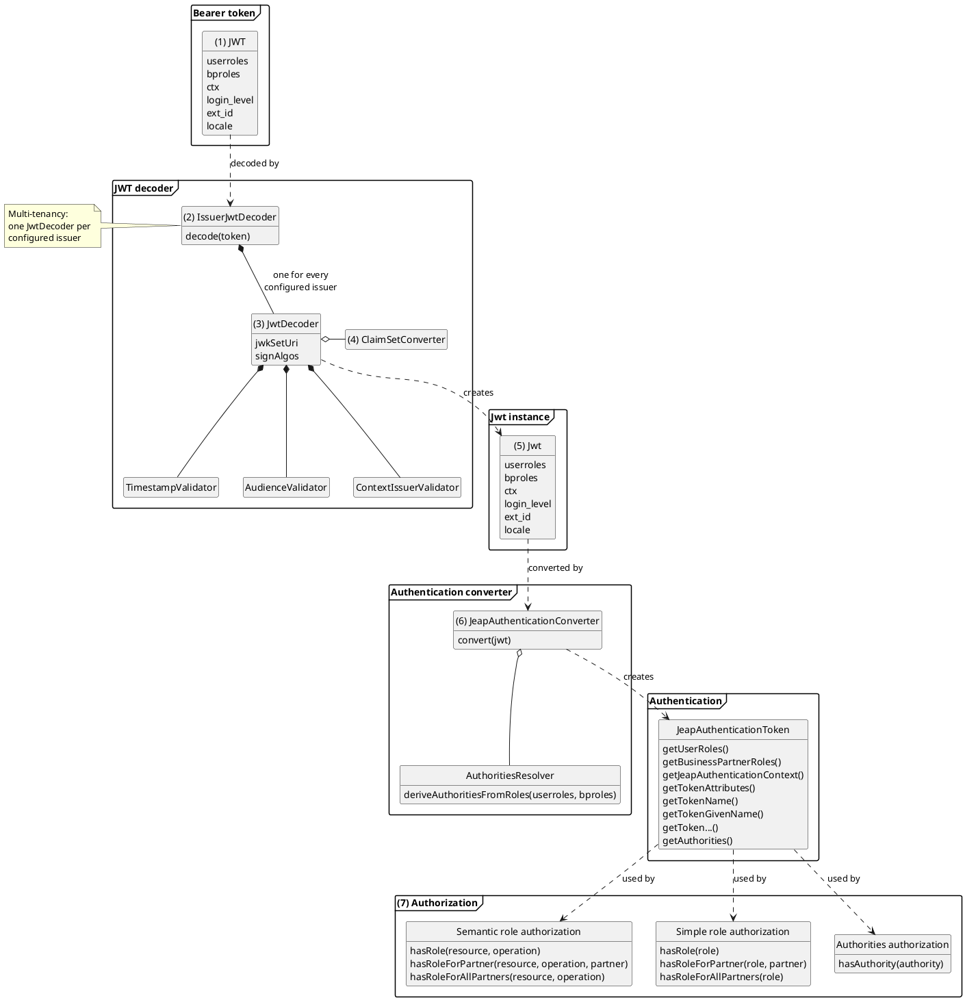

# JWT access token authorization flow in jEAP Security

The following diagram shows the flow of an authorization against an OAuth2 access token in jEAP Security.

1. An HTTP request with a JWT bearer token in the HTTP `Authorization` header arrives.
2. The token is processed according to the jEAP Security configuration that the application has set up for the
   specific issuer of the token (`iss` claim), e.g. the configuration for Keycloak vs. the configuration for the
   B2B gateway (see [Integrating different authorization servers](../authorization-servers/integrating-different-authorization-servers.md)).
3. The token is decoded by a `JwtDecoder` configured for the issuer, and its timestamp, signature, audience and
   context are validated.
4. The claims of the token are transformed by the
   [claim set converter](../authorization-servers/integrating-different-authorization-servers.md#transforming-access-tokens-with-claim-set-converters)
   configured for the issuer.
5. The `JwtDecoder` creates a `Jwt` instance from the (transformed) token.
6. The `JeapAuthenticationConverter` creates a jEAP-specific Spring Security token authentication
   (`JeapAuthenticationToken`) from the `Jwt`. The authorities of the authentication are derived from the roles of
   the authentication by a configurable authorities resolver.
7. The authorization check then takes place on the basis of the created authentication. jEAP supports three
   different ways of interpreting the authentication for authorization:
   [semantic roles](rest-api-authorization-with-semantic-roles.md),
   [simple roles](rest-api-authorization-with-simple-roles.md) and
   [authorities](rest-api-authorization-with-authorities.md).

## Related

- [Authentication and authorization](../index.md) — the overview of authentication and authorization in jEAP: authentication contexts, functional and data authorization, OpenID Connect and OAuth2.
- [Authentication and authorization for REST APIs](rest-api-authentication-and-authorization.md) — integrating jEAP Security into a REST API.
- [Integrating different authorization servers](../authorization-servers/integrating-different-authorization-servers.md) — per-issuer configuration and claim set converters.
- [Tokens in the Blueprint Microservice](../tokens/tokens-in-the-blueprint-microservice.md) — the claims jEAP Security expects in a token.
- [Role concept in the Blueprint Microservice](../role-concept.md) — simple roles, semantic roles and authorities.
- [Authorization with semantic roles](rest-api-authorization-with-semantic-roles.md)
- [Authorization with simple roles](rest-api-authorization-with-simple-roles.md)
- [Authorization with authorities](rest-api-authorization-with-authorities.md)
