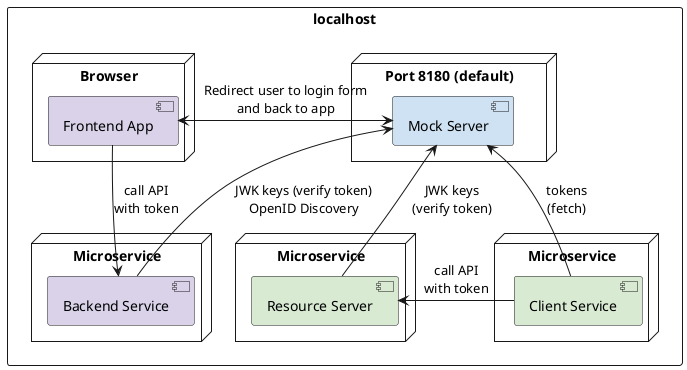
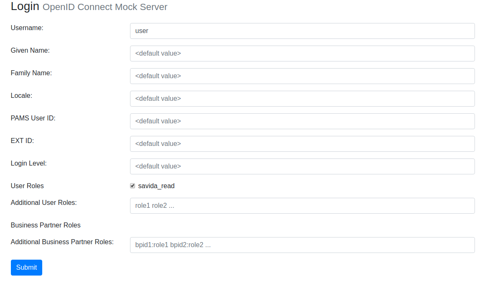

# OpenID Connect / OAuth2 mock server

The jEAP OAuth2 mock server provides a configurable OAuth2 / OpenID Connect server. The tokens it issues can be
enriched with the desired roles, either through configuration (for microservices) or through a login form (for UIs).
This makes it possible to test frontends and microservices that depend on token-based authorization locally or in
development environments without an authorization server.

## Structure

- [jme-security-auth-scs](https://github.com/jme-admin-ch/jme-security-example/tree/main/jme-security-auth-scs):
  example configuration for the OAuth2 mock server, can be started locally
- [jeap-oauth-mock-server](https://github.com/jeap-admin-ch/jeap-oauth-mock-server):
  implementation of the mock server, included as a simple JAR dependency in the example OAuth2 mock server



For detailed documentation on OAuth / OpenID Connect see
[OIDC in the Blueprint Microservice](../oidc-in-the-blueprint-microservice.md) and
[Tokens in the Blueprint Microservice](../tokens/tokens-in-the-blueprint-microservice.md).

## Usage

1. Create an OAuth2 mock server in your own project following the template
   [jme-security-auth-scs](https://github.com/jme-admin-ch/jme-security-example/tree/main/jme-security-auth-scs)
   and adapt the configuration as needed. The template shows the setup in a multi-module project. If the mock
   server instance is not part of a multi-module project, use `jeap-oauth-mock-server-instance` directly
   as the Maven project parent. Unlike in the template above, the `jeap-oauth-mock-server` dependency then does not
   have to be declared explicitly.

   ```xml
   <parent>
       <groupId>ch.admin.bit.jeap</groupId>
       <artifactId>jeap-oauth-mock-server-instance</artifactId>
       <version>use-the-latest-version-here</version>
       <relativePath/> <!-- lookup parent from repository -->
   </parent>
   ```

2. Start the mock server locally for local tests, for example with a run configuration in IntelliJ.
3. Configure the OAuth configuration of the microservices and the UI for the local profile (see below).
4. If the mock server should also be used in a test environment, adapt the `Jenkinsfile` and `manifest-example.yml`
   so that the service is deployed.

### Login form



## Out of scope

- Limitation: after a deployment, the mock server can only redirect to frontends that are reachable via **https**.
  This means that either a local mock server must be used for local tests as well, or the UI must be exposed locally
  under an https URI.
- No support (yet) for logout or silent refresh from the UI.

## Example configuration of the mock server

### Clients

- Clients must be configured. Either
  - for microservice-to-microservice calls: client credentials OAuth flow, for which at least a *client-id* and a
    *client-secret* must be configured
  - for UIs: authorization code flow, for which at least a *client-id* and a *registered-redirect-uri* are required. The
    redirect URI must match the URI under which the frontend application runs and which it sends to the OAuth
    server as the redirect URI for the redirect back to the application after the login (e.g. `http://localhost:4200/...`)
  - The business partner roles (`bproles`) and user roles (`userroles`) stored with the clients are
    - client credentials flow: the roles that are assigned to the client and delivered in the access token
    - authorization code flow: the roles that are available for selection in the login form
- Users are only required for the login via UI (authorization code flow)
  - By default, the mock server sends the names and roles from the configuration file in the access token
  - The values can be adapted in the login form for individual test cases or automated tests
  - `userroles` / `bproles` can also be configured per user; these are selected by default in the login form

### Complete example configuration

```yaml
oauth-mock-data:
  clients:
    - # Mandatory
      client-id: "example-client"
      # Optional, required for client_credential flows only (SYS context / service-to-service authenthication)
      client-secret: "{noop}secret"

      # Optional, required for UI logins only (user context / authorization_code flows)
      registered-redirect-uri: ["http://localhost:4200/startpage", "http://localhost:4200/silent-refresh.html"]

      # Optional
      # In the SYS context, this is the list of roles assigned to the client
      # In the USER context, this is used to build the list of available roles in the login form
      bproles:
        "12345": ["partner-read"]
        "67890": ["partner-read", "partner-write"]
      userroles: ["partner-read", "partner-write", "partners-list"]

      # Optional
      context: "USER"                   # USER for UI login or SYS for service-to-service authenthication (B2B is not supported by the mock server)
      audience: ["example-resource"]    # Audience for which the token is issued, used to restrict token usage to the intended target

      # Optional, represents default values
      scope: ["openid"]
      access-token-validity-seconds: 3600
      refresh-token-validity-seconds: 3600

  # List of users to be used for interactive logins (authorization_code flow)
  users:
    - id: "user"
      # Optional default values for the user's attributes. Can be overridden in the login form.
      given-name: "Henriette"
      family-name: "Muster"
      locale: "DE"
      preferred-username: "12345"
      ext-id: "1123"
      admin-dir-uid: "U12345678"
      login-level: "S3"

      # roles to pre-select in the login form (only applies to the first user, which is defaulted in the login form)
      bproles:
        "12345": ["partner-read"]
        "67890": ["partner-read"]
      userroles: ["partners-list"]
```

### Issuing access and ID tokens with a custom format (custom JWT claims)

**Note:** This section applies to OAuth2 mock server versions 2.1.0 and later.

By default, the OAuth2 mock server issues tokens according to the specification in
[Tokens in the Blueprint Microservice](../tokens/tokens-in-the-blueprint-microservice.md). If the mock server is
used with a client that expects a different token format, the content of the access / ID tokens can be customized
in an instance of the mock server.

To do so, simply provide a bean implementing `OAuth2TokenCustomizer<JwtEncodingContext>`. This is best done
by using `AbstractJwtTokenCustomizer` as the base class. For example:

```java
// For Spring to instantiate this class, a file org.springframework.boot.autoconfigure.AutoConfiguration.imports
// with the following content has to be created in the folder resources/META-INF/spring, see https://docs.spring.io/spring-boot/reference/features/developing-auto-configuration.html.
// Exception: the class is located in ch.admin.bit.jeap.oauth.mock.server.token
package ch.admin.bit.jeap.oauth.mock.server.token;

@Component
@RequiredArgsConstructor
public class MyTokenCustomizer extends AbstractJwtTokenCustomizer {

    /** Provides access to the client/user mock data */
    private final OAuthMockData oauthMockData;

    @Override
    protected void customizeAccessToken(JwtEncodingContext context, Map<String, Object> claims) {
        // There is a convenience method in the base class to get the current client ID:
        String clientId = getClientIdFromSecurityContext();
        claims.put("custom", "value");
    }

    @Override
    protected void customizeIdToken(JwtEncodingContext context, Map<String, Object> claims) {
        claims.put("custom", "value");
    }
}
```

### Dynamic scope bproles

**Note:** Available from jEAP OAuth2 mock server version 2.23.0.

The OAuth2 mock server supports the
[dynamic scope `bproles:*`](../tokens/minimizing-access-token-sizes.md#access-token-for-a-specific-business-partner).
The use of the scope can be enabled per client with the property `bproles-scope-enabled`:

```yaml
oauth-mock-data:
  clients:
    - client-id: "bproles-scoped-example-client"
      ....
      bproles-scope-enabled: true
```

The OAuth2 mock server will then populate the `bproles` claim in access tokens only for the business partner(s)
requested by the client in the `bproles:*` scope parameter.

Dynamic scopes are supported by the mock server in the authorization code flow (user context) and in the client
credentials flow (system context).

### Token introspection and roles pruning

The OAuth2 mock server supports [roles pruning](../tokens/token-introspection.md). This feature can be
activated per client with the property `roles-pruning-enabled`:

```yaml
oauth-mock-data:
  clients:
    - client-id: "roles-pruning-example-client"
      ....
      roles-pruning-enabled: true
```

When roles pruning is activated, the OAuth2 mock server removes the claims `userroles` and `bproles` from the access
tokens. Instead, a new claim `roles_pruned_chars` is inserted, which states the total number of characters of the
removed claims.

The maximum permitted combined size (in characters) of the claims `userroles` and `bproles` in an access token can be
configured at the application level with the optional property `roles-pruning-limit`. The default value is
**8000 characters**.

## Example configuration of the clients

### Angular UIs with angular-auth-oidc-client

Example configuration of an Angular UI in `auth.clientConfiguration.json`:

```json
{
  "stsServer": "http://localhost:8180",  // <-- default base URI of the OAuth2 mock server
  "client_id": "example-client",         // <-- must match the client ID in the OAuth2 mock server
  ...
}
```

## Microservice as a client of an OAuth2 resource server

```yaml
spring:
  security:
    oauth2:
      client:
        registration:
          jeap-microservice-examples-oauth-client:
            client-id: "jeap-microservice-examples-oauth-client"    # Client ID must match the mock server configuration
            client-secret: "secret"                                 # Client secret must match the mock server configuration
            authorization-grant-type: "client_credentials"
            provider: "kc-oidc-provider"
            scope: "openid"
        provider:
          kc-oidc-provider:
            issuer-uri: "http://localhost:8180"                    # Base URI of the mock server
```

## Microservice as an OAuth2 resource server

```yaml
spring:
  security:
    oauth2:
      resourceserver:
        jwt:
          jwk-set-uri: "http://localhost:8180/.well-known/jwks.json"
jeap:
  security:
    oauth2:
      resourceserver:
        jwt:
          validation:
            contextissuers:
              USER: "http://localhost:8180"  # Must match the base URI of the mock server for tokens to be accepted
              SYS: "http://localhost:8180"   # Must match the base URI of the mock server for tokens to be accepted
```

## Debug logging in the mock server

If the logging already built into the mock server is not sufficient, the following log settings in the mock server
(`application.yml`) can help analyze OAuth issues:

```yaml
logging.level.org.springframework.security.oauth2: DEBUG
logging.level.org.springframework.security.jwt: DEBUG
logging.level.org.springframework: DEBUG
```

## Related

- [Authentication and authorization](../index.md)
- [OIDC in the Blueprint Microservice](../oidc-in-the-blueprint-microservice.md)
- [Tokens in the Blueprint Microservice](../tokens/tokens-in-the-blueprint-microservice.md)
- [Token introspection](../tokens/token-introspection.md)
- [Minimizing access token sizes](../tokens/minimizing-access-token-sizes.md)
- [Audience validation](../audience-restriction/audience-validation.md)
- [Keycloak](../authorization-servers/keycloak.md)
