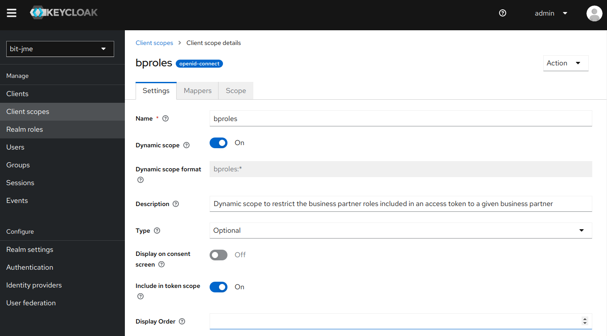
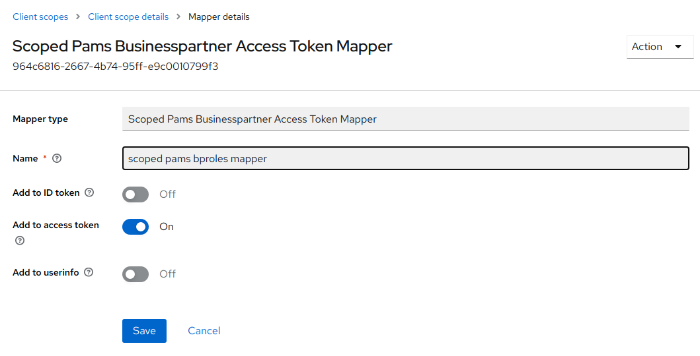
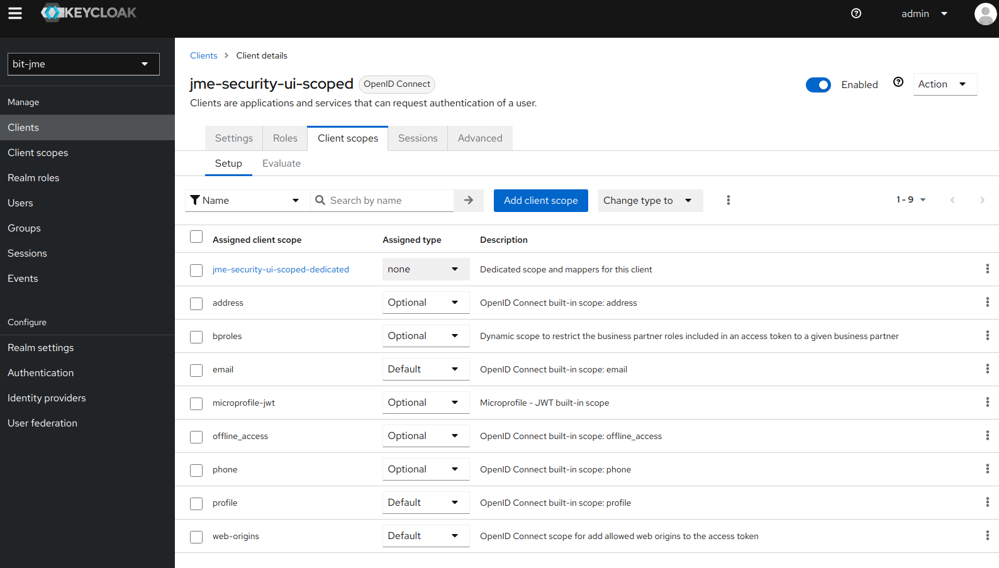

# Minimizing access token sizes

In HTTP requests from a client to a resource, access tokens usually are provided to the resource as bearer tokens in
HTTP authentication headers. If a user is authorized to act on behalf of a lot of business partners, its access
token's size might exceed limits established by applications or network components. This page describes technical
solutions to work around such limits.

## Access token for a specific business partner

Often, a user authorized to act on behalf of a lot of business partners is carrying out work for just one of those
business partners at a time. For such cases, the user could successfully carry out his work for a business partner
with only an access token containing just the roles the user has been granted for this business partner. An access
token with only the user's roles for one business partner would be much smaller than an access token containing all
the roles for all the business partners the user is authorized for.

The jEAP Keycloak plugin provides a specific custom token mapper named "Scoped Businesspartner Access Token
Mapper" which allows to restrict the business partner roles included in an access token to a given business partner.
The requested business partner has to be specified in an authentication request as the variable part of the dynamic
Keycloak scope `bproles`.

To request an access token that only contains the user's business partner roles for the partner with the id
`123-abcd-987-ef`, the authentication request would have to specify (at least) the following authentication scope:

```text
openid bproles:123-abcd-987-ef
```

Additional scope parameters like `profile`, `address`, etc. can be provided as well in the usual way, i.e. by adding
them to the space separated list.

### Access token for all business partners

The "*" can be used as variable part of the dynamic `bproles` scope to request a token that includes the roles of all
the business partners a user has been authorized for:

```text
openid bproles:*
```

This could allow an application to first identify the partners for which a user is authorized in order to let the
user choose the partner for which to carry out work. After the user selected a partner, the application could request
a token specific to this partner to effectively carry out the work.

Be aware that specifying "*" instead of a specific business partner id might result in a large access token.

### Access token without business partner roles

If the dynamic `bproles` scope is not specified in the authentication request, the "Scoped Businesspartner
Access Token Mapper" will not include any business partner roles in the token:

```text
openid
```

### Configuration

#### Enable dynamic scopes

To be able to use the dynamic scope `bproles`, the (currently experimental) Keycloak feature "dynamic scopes" has to
be enabled for the Keycloak instance running the jEAP Keycloak plugin, e.g. by starting Keycloak with the following
option:

```text
--features=dynamic-scopes
```

#### Configure the dynamic scope `bproles`

Keycloak only accepts authentication requests with known scopes. Therefore, the scope `bproles` must be configured as
a dynamic scope in the Keycloak realms which should support the use of the "Scoped Businesspartner Access Token
Mapper".

In the realm menu on the left side select "Client scopes" and then press the button "Create client scope" to add the
scope "bproles" as an optional dynamic scope to the realm:



Make sure "Include in token scope" is set to "on". In the tab "Mappers" of the newly created `bproles` scope, press
the button "Add mapper" and select "By configuration" and then select the "Scoped Businesspartner Access Token
Mapper" from the list. Name your mapper instance and activate it at least for "Add to access token".



#### Configure the client

In the realm menu on the left side select "Clients" and then the tab "Client list". From the client list, select the
client to be configured for using the dynamic `bproles` scope and select the tab "Client scopes". Make sure the
`bproles` scope is listed under "Assigned client scopes" with "Assigned type" "Optional". If the `bproles` scope is
missing, add it by clicking the "Add client scope" button.



#### Interaction with other scopes and mappers

If your Keycloak configuration configures other token mappers that also add business partner roles to a token,
they will be executed in addition to the "Scoped Businesspartner Access Token Mapper". If you only want business partner
roles from the "Scoped Businesspartner Access Token Mapper" in your tokens, make sure no other mapper contributing
business partner roles is active.

### Example

The [jEAP security example project](https://github.com/jme-admin-ch/jme-security-example)
gives examples for

- configuring the [jEAP OAuth2 mock server](../testing/oauth2-mock-server.md#dynamic-scope-bproles) to support the dynamic scope
  `bproles`
- configuring Java clients to request an access token restricted to a certain business partner by specifying the
  corresponding `bproles` scope
- configuring a UI client to request an access token restricted to a certain business partner by specifying the
  corresponding `bproles` scope

For details, see the section "Restricting business partner roles in tokens using the dynamic scope 'bproles:*'" in
the project's [readme](https://github.com/jme-admin-ch/jme-security-example/blob/main/README.md).

## Opaque/lightweight access tokens

The OAuth2 standard does not mandate that an access token must be a JWT explicitly enumerating user authorizations.
An access token can also just be an opaque string with only the authorization server knowing the authorizations
attached to the token. The validity of such a token and the associated user authorizations can be queried at the
authorization server's token introspection endpoint when providing the access token as a parameter. Access to the
token introspection endpoint is restricted to authenticated and authorized clients, specifically "confidential
clients". The jEAP security library supports transparent token introspection. For details, see
[Token introspection](token-introspection.md).

Keycloak does not support opaque access tokens; it always issues readable JWT tokens. However, starting with Keycloak
version 23 (released in November 2023), the content of an access token and the content of a corresponding token
introspection endpoint response can differ in terms of the user information they contain. This was made possible by
adding the new "**Add to token introspection**" switch to token mappers, complementing the existing "*Add to access
token*" switch. Keycloak version 24 officially introduced **lightweight access tokens**. In this version, a new token
mapper switch "**Add to lightweight access token**" explicitly determines whether a mapper adds information to a
lightweight access token or not. By default, this switch is off for most standard mappers.

There are two ways to configure Keycloak to issue only lightweight access tokens for a client:

- In a specific client's configuration, navigate to the "Advanced" tab in the "Advanced Settings" section and set the
  option "**Always use lightweight access token**" to "on".
- Apply a **client profile** containing the **executor** "**use-lightweight-access-token**" to a client via a
  **client policy** configured in the "Realm settings" in the "Client policies" tab.

Lightweight access tokens allow the activation of token mappers on a client for the introspection endpoint but not for
access tokens. If the token mappers adding a user's authorizations (roles) are not activated on lightweight
access tokens for a client, then access tokens issued to that client will contain only limited user information,
in particular the tokens won't contain the user's authorizations. For users that are granted many roles this will
significantly reduce token sizes, thus making its tokens lightweight.

If a client uses such a lightweight access token to authorize a request to a resource, the resource cannot directly
derive the user's authorizations from the token. Instead, the resource must first query the Keycloak token
introspection endpoint, providing the token as a parameter to retrieve the user's authorizations. These additional
queries to the Keycloak token introspection endpoint are part of the costs associated with using lightweight tokens.
Other potential costs include increased latency for resource responses due to introspection queries. The jEAP
Security library can [cache introspection results](token-introspection.md#caching-of-introspection-results) in the
resource to reduce these costs.

### Configuration

#### Enable required mappers on lightweight tokens

By default, most token mappers do not contribute to lightweight access tokens. Consequently, lightweight access tokens
contain only minimal information by default, which is the intended purpose.

If you require specific information to be included in lightweight access tokens (e.g. subject, given name, family name,
locale, certain IDs, etc.), you must enable the "Add to lightweight access token" switch on the mappers that provide this information.
Mappers that contribute user information are typically located in the default scope `profile`.

The jEAP security library for backend services validates whether an issuer is authorized to authenticate clients in a
specific context. Therefore, the `ctx` claim must be included in a token if the token is going to be processed by the
jEAP security library.

#### Configure a client profile for lightweight tokens

A flexible approach to leveraging Keycloak's lightweight token feature is to allow clients to decide whether they need
a lightweight access token or not. This can be implemented with the following steps:

- Create a new *optional* scope `lightweight-access-token`.
  - Set the option "Include in token scope" to `on`.
- Create a new client profile `lightweight-access-token-profile`.
  - Add the executor `use-lightweight-access-token` to the profile.
- Create a new client policy `lightweight-access-token-policy`.
  - Add a condition of type `client-scopes` to the policy.
    - Configure the `expected scopes` option with the `lightweight-access-token` scope as an *optional* scope.
  - Add the profile `lightweight-access-token-profile` to the policy.
- Add the scope `lightweight-access-token` as *optional* scope to the client that should be able to fetch a
  lightweight access token.
- When making an authentication request to Keycloak with the client, include the scope `lightweight-access-token` in
  the request's `scope` parameter.

By including or excluding the `lightweight-access-token` scope in an authentication request, the client can choose
whether to request a lightweight access token or not.

## Jeap Roles Pruning Token Mapper

The jEAP Keycloak plugin provides a Jeap Roles Pruning Token Mapper which will
remove the `userroles` and `bproles` claims from a token if the number of characters used by those claims exceeds a
given limit. If the mapper pruned the roles, it will add the claim `roles_pruned_chars` which will contain the number
of characters the pruned claims would have contained.

The Jeap Roles Pruning Token Mapper can be used to restrict the sizes of access tokens, as the sizes of those tokens
usually are dominated by the number of roles a user has. If a user has more roles than should be fitted in an access
token, the Jeap Roles Pruning Token Mapper can be used to prune those roles from the token.

If a client uses an access token that had its roles pruned by the Jeap Roles Pruning Token Mapper to authorize a
request to a resource, the resource cannot directly derive the user's authorizations from the token. Instead, the
resource must first query the Keycloak token introspection endpoint, providing the access token as a parameter to
retrieve the user's authorizations. These additional queries will add increased latency to the resource's responses.

### Configuration

The Jeap Roles Pruning Token Mapper has one configuration option: the maximum allowed accumulated number of characters
in the `userroles` and `bproles` claims. The default configuration is 8000.

It must be noted that this number does not directly translate to the maximum size added by the claims to a JWT token.
A JWT first uses UTF-8 encoding for characters and then applies a Base64 encoding. UTF-8 encoding will use more than
one byte for non-ASCII characters, and Base64 encoding will add one third of the initial size to the encoded size.

Therefore, the default limit of 8000 characters translates to 10666 bytes in the access token if the roles only use
ASCII characters. If the roles also contain some non-ASCII characters, additional space will be used by these
characters. A standard access token usually would be smaller than 2KB when the roles were excluded. Therefore, the
default limit of 8000 characters for roles should result in tokens that are still noticeably smaller than 16KB even if
some non-ASCII characters are used in roles. 16KB is the limit AWS puts on the size of an HTTP header field and
therefore on access tokens that are transferred as bearer tokens.

## Access token compression

Large access tokens commonly occur when a user has identical permissions for a significant number of business
partners. These tokens are, in principle, well-suited for effective compression. Since HTTP/2 supports header
compression, switching from HTTP/1.1 to HTTP/2 could address issues caused by excessively large headers.

## Further documentation

- [Keycloak client scopes](https://www.keycloak.org/docs/latest/server_admin/#_client_scopes)
- [OAuth 2.0 Token Introspection (RFC 7662)](https://datatracker.ietf.org/doc/html/rfc7662)

## Related

- [Authentication and authorization](../index.md) — the overview of authentication and authorization in jEAP: authentication contexts, functional and data authorization, OpenID Connect and OAuth2.
- [Role concept in the Blueprint Microservice](../role-concept.md) — user roles and business partner roles.
- [Tokens in the Blueprint Microservice](tokens-in-the-blueprint-microservice.md) — token types and claims.
- [Token introspection](token-introspection.md) — resolving pruned or lightweight tokens at the authorization server.
- [Keycloak](../authorization-servers/keycloak.md) — about the Keycloak authorization server.
- [OpenID Connect / OAuth2 mock server](../testing/oauth2-mock-server.md) — dynamic scope support in the mock server.
