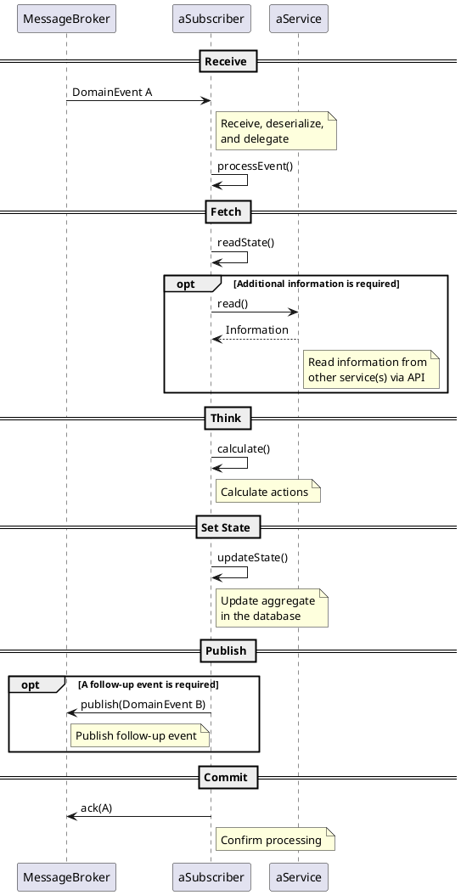

# At Least Once Delivery

Ideally, we could guarantee that every published event is processed by the subscriber exactly once. In practice this isn't possible, because we're dealing with a distributed system. In certain circumstances, the sender (publisher, message broker) may be unable to determine whether the event has reached the recipient (subscriber, message broker).

"At least once delivery" means that the sender guarantees that the recipient receives the message at least once.

To guarantee this, the sender will, in case of doubt, resend the message. If the message has already reached the recipient in an earlier attempt, the recipient will receive the message multiple times. This requires that the recipient's processing of the event is idempotent.

## Idempotent Processing of Events

Processing of an event is idempotent if it "doesn't matter" whether the event is processed exactly once or multiple times.

For it to "not matter", the processing service (subscriber) must fulfill two conditions:

| | |
| --- | --- |
| Aggregate state | The state of the aggregate after processing the n-th instance of the event must be identical to the state after the first successful processing of an event instance. |
| Published events | It must be guaranteed that all **follow-up events** are published at least once (**at least once**). If follow-up events are published more than once (permitted), they must be semantically identical (same statement).  **Warning:** only if the publication of follow-up events is guaranteed can it be ensured that the **distributed transaction** spread across multiple services is fully carried out. |

### Prerequisites

A few prerequisites must be fulfilled for an event to be processed idempotently.

#### Creating an Aggregate

The relationship between the event and the aggregate must be unambiguous.

##### Approaches

| | |
| --- | --- |
| Business ID | The aggregate has a unique business ID. This can also be a composite ID.  Example blacklist: the combination of provider and blacklist version is unique. |
| IdempotenceId | The service stores the IdempotenceId of the event that led to the aggregate on the aggregate itself. |

#### Modifying Aggregates

For an event that modifies an existing aggregate to be processed idempotently, the following prerequisites must be fulfilled:

- The follow-up event documents only information about the new state (if at all).
- The service can determine whether the change has already been made.

##### Approaches

- The target state of the aggregate can be computed independently of the current state in the database.
- The service records the IdempotenceId of the event during the mutation. It is thereby able to determine that the mutation for this event has already taken place.

#### Deleting Aggregates

Deleting an aggregate can lead to a follow-up event (AggregateDeletedEvent). It must be ensured that the follow-up event can still be published even if the aggregate was already deleted by an earlier instance of the event.

##### Approaches

| | |
| --- | --- |
| No payload | If the follow-up event contains only the resource reference of the deleted aggregate, and this reference is contained in the event, the follow-up event can be derived from the event.  **Note:** it's desirable to avoid a payload altogether anyway. |
| Soft delete | If the aggregate isn't physically deleted from the database, but only has its status set to "deleted", the follow-up event can be published at any time. |

## Sequence of Processing an Event

The following sequence diagram illustrates the processing of a domain event. For an "at least once delivery" system, an event can be received an arbitrary number of times.

Even if the processing of the event by this service was successful, it's possible that the event is received again, because:

- the event required a retry on another service, or
- because the event is a follow-up event of an event that required a retry.

The Act phase is critical. During this phase, the aggregate is updated in the database and, if required, follow-up events are published. The system is only consistent if either both or neither action was carried out. This is a **distributed transaction!**

The question is which sequence is better. The reasons for the chosen sequence are:

| | |
| --- | --- |
| Avoiding race conditions | Since the follow-up event is published after the aggregate is updated, it's guaranteed that a read by a subscriber of the follow-up event will succeed. |
| Avoiding incorrect events | If the follow-up event is published first, there's a risk that the subsequent update fails. We would then have published a state that the aggregate will never reach. |
| Likelihood of errors | It's much more likely that an error occurs while updating the aggregate than while publishing the follow-up event. |

:::caution
Regardless of which sequence is chosen, this cannot guarantee that the state change in the database and the sending of the follow-up events happen atomically, i.e. completely or not at all. However, the jEAP Messaging Library offers a way to achieve this atomic behavior with an implementation of the [Transactional Outbox](../../../building-blocks/index.md) pattern.
:::
