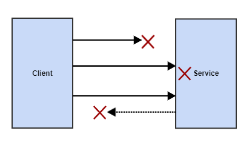
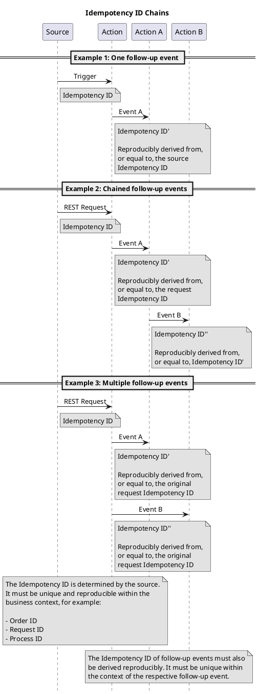

# Idempotency

## Introduction

This article provides concrete implementation examples for idempotent behavior in the microservices blueprint. Idempotent behavior is necessary to correctly process domain events with [at least once delivery](at-least-once-delivery.md) via Kafka, and is also described and required by the Styleguide and Naming Convention for REST APIs.

## Motivation

When communicating in a distributed system over the network, a client **cannot** distinguish between the following three error scenarios:

- The request never reached the service.
- The request reached the service, but no response came back from the service.
- The service processed the request, but the response was lost.



One option (after a timeout or error) would be to ask the service whether it has processed the request. However, the more common approach is to call the service again (retry). For this, the service must be implemented so that it can correctly handle repeated calls → **the implementation of the service function must be idempotent.**

## Definition

Idempotency is a property of certain operations in mathematics and computer science: applying them multiple times does not change the result beyond the initial application. In other words, an operation can be applied one to n times and — provided the starting state hasn't changed — always leads to the same end state.

Examples of idempotent operations:

- Deleting an object multiple times leads to the same end state: the object no longer exists.
- A PUT on a REST resource only creates it once, even if the operation is called repeatedly, e.g. due to a detected timeout or connection interruption.
- Sending the same event multiple times has no effect, because the recipient is designed to reach the same end state even after processing it multiple times.

Examples of non-idempotent operations:

- A database record is created for each consumed event; if the event is processed multiple times, the same record is created multiple times.
  - Mitigation: use an idempotence ID to check whether a record has already been created.
- The REST call `DELETE /record/oldest` ("delete oldest entry") deletes another record on every retry.
  - Mitigation: supply an idempotence ID header to check whether the request has already been processed.

## Kafka / Messaging

Why idempotent behavior is necessary for messages with Kafka, and how this forms a distributed transaction together with database modifications and follow-up events, is described in [at least once delivery](at-least-once-delivery.md).

### What Makes a Good Idempotence ID?

An idempotence ID can be used to reliably determine whether requests or events have already been processed. The consumer uses it, for example, to compare it against its persistent state, or passes the ID on in produced follow-up events so that downstream consumers can perform the same check.

The scope of the ID depends on the business context — for requests, e.g. unique within the context of an aggregate root in the request (order, customs declaration, ...); for events, e.g. per event type.

Suitable IDs are therefore:

- Reproducibly derivable from the event or request that triggered the processing.
- Unique within the scope of the business entity being mutated, or within the scope of the event type.

#### Examples

| Entity | Operation | Request/Event | Idempotence ID | Description of the Example |
| --- | --- | --- | --- | --- |
| Order | Create | REST request | Order ID | The order ID is assigned by the request source (UUID) and is unique. If a create request with the same ID is received twice, it is therefore a duplicate. |
| Order | Modify | REST request | Modification request ID | The requester assigns a unique ID for the modification (e.g. UUID), which can be used as the idempotence ID by the action it triggers. If the requester retries, it will send the same request with the same ID again. |
| Process | Create | REST request | Process ID | The process ID is assigned by the request source (UUID) and is unique. If a create request with the same ID is received twice, it is therefore a duplicate. |
| Process | Notify creation | Event | Process ID | A process is only created once, so the process ID is unique within the context of the ProcessCreatedEvent. |

#### Deriving Idempotence IDs for Follow-Up Events or Follow-Up Requests

:::caution
When requests or events are processed and lead to follow-up events or follow-up requests, care must be taken to ensure that the idempotence IDs of the follow-up requests/events are derived reproducibly. That is, reprocessing the original request/event must produce the same idempotence ID!
:::

##### Example Scenarios



### jEAP Messages (Event, Command)

Message types are already prepared for idempotent processing: the `Message.MessageIdentity.idempotenceId` attribute should be used to implement the **idempotent consumer pattern**. An idempotent consumer processes a message that has been received multiple times in such a way that the same result is achieved in the end — for example, the triggered action is executed exactly once, or a database insert is only performed if it hasn't already been triggered by an earlier, identical message. Idempotent behavior when inserting a record into a database can, for example, be achieved as shown in the following example code by associating the record with the idempotence ID of the domain event. The jEAP Messaging Library offers developers the [`@IdempotentMessageHandler`](idempotent-message-handler.md) annotation as a way to easily automate this behavior, without having to associate records with idempotence IDs themselves.

### Message Consumer

```java
@KafkaListener(topics = {TopicConfiguration.NAME})
public void consume(final OrderCreatedEvent event, Acknowledgment ack) {
    // Example Step 1: Creating a persistent entity unless it has been created before, based on the idempotence ID in the event
    Optional<Order> existingOrder = repository.findByIdempotenceId(event.getIdentity().getIdempotenceId());
    Order order;
    if (existingOrder.isEmpty()) {
        order = loadOrder(event.getReferences().getOrderReferences().getOrderId());
        repository.save(order);
    } else {
        order = existingOrder.get();
        log.info("Consumed event, order entity already exists for idempotence ID" + event.getIdentity().getIdempotenceId());
    }

    // Example Step 2: Triggering a side-effect-free / read-only call regardless of whether it has been done already
    ValidationResult validationResult = getValidationResult(order);

    // Example Step 3: Publishing a follow-up event without being able to know whether it has been published before - the downstream consumer
    //                 needs to be idempotent and will be in a consistent state even when consuming the same event twice. Pass on the idempotence
    //                 ID from the original event to make sure a consistent idempotence ID is used in case the event is published more than once.
    //                 See "Event Producer" below for how to imlpemention an event producer
    eventProducer.publishOrderValidatedEventSync(event.getIdentity().getIdempotenceId(), validationResult);

    // Acknowledge the event after successful processing. Ack on errors is handled by the error handler.
    ack.acknowledge();
}
```

### Message Producer

Processing events with side effects, such as database updates or the production of follow-up events, is typically implemented as a distributed transaction to achieve eventual consistency (see [at least once delivery](at-least-once-delivery.md)). It must therefore also be ensured that follow-up events were really published successfully. Publishing events via the Spring Kafka template generally happens asynchronously, and by default only uses a logging listener for error handling — meaning errors during publishing are only noticed if the logs are monitored.

To ensure transactionality, acknowledgment of the original event must be blocked until the follow-up event has been published (or sent to the error service by the error handler):

```java
@KafkaListener(topics = {TopicConfiguration.NAME})
public void consume(final MyEvent event, Acknowledgment ack) {
    // ... consumer logic ...
    kafkaTemplate.send(topicConfiguration.getTopicName(), event).get(30, TimeUnit.SECONDS); // .send() returns Future, .get() blocks until completed
    ack.acknowledge();
}
```

This is somewhat of a tradeoff between consistency and throughput, which should be a suitable choice for a typical business application. For high-throughput requirements, other suitable patterns may need to be used.

:::info
To support the common case where one or more messages may only be sent if database changes are persisted at the same time, the jEAP Messaging Library offers an implementation of the [Transactional Outbox](../../../building-blocks/index.md) pattern.
:::

## REST Calls

The Styleguide and Naming Convention for REST APIs describes which HTTP methods on REST APIs must exhibit idempotent behavior.

### Read-Only HTTP Methods

**Purely read-only** methods (GET, HEAD, POST as GET-with-body, OPTIONS) must be implemented as purely read-only operations, **free of side effects** or any persistent modification on the server side. In that case, they already meet the idempotency requirement.

### PUT

```java
// Business service example (simplified)
@Component
class OrderService {
    private OrderRepository repository;

    /** Create a new order unless an order with the given ID already exists */
    @Transactional
    void createOrder(Order order) {
        if (!repository.orderExistsById(order.getId())) {
            repository.save(order);
        }
    }

    /** Deletes the order with the given ID if it exists */
    void deleteOrderIfExists(String orderId) {
        repository.deleteIfExists(orderId);
    }
}

// REST Controller PUT example
@RestController
class ExampleController {
    private OrderService orderService;
    // ...

    // Demonstrates idempotent request handling by checking for previous processing of the transmitted entity
    // using an ID supplied by the client
    @PutMapping("/order/{orderId}")
    public void create(@PathVariable("orderId") String orderId, @RequestBody Order order) {
        // The order service will only create a new order if the order with the given ID doesn't exist yet
        orderService.createOrder(order);
    }
}
```

### POST

For POST, the styleguide doesn't require idempotent implementation, but recommends it. One option is to achieve this with a client-supplied ID:

```java
// See PUT example for OrderService component

// REST Controller POST example
@RestController
class ExampleController {
    private OrderService orderService;
    // ...

    // Demonstrates idempotent request handling by checking for previous processing of the transmitted entity
    // using an ID supplied by the client
    @PostMapping("/order")
    public void create(@RequestBody Order order)
        // The order service will only create a new order if the order with the given ID doesn't exist yet
        orderService.createOrder(order);
    }
}
```

### DELETE

```java
// See PUT example for OrderService component

// REST Controller DELETE example
@RestController
class ExampleController {
    private OrderService orderService;
    // ...

    // Demonstrates idempotent DELETE request handling by only deleting an entity if it exists
    @DeleteMapping("/order/{orderId}")
    public void deleteOrder(@PathVariable("orderId") String orderId) {
        orderService.deleteOrderIfExists(orderId);
    }
}
```

## Topics

- [At Least Once Delivery](at-least-once-delivery.md)
- [Idempotent Message Handler](idempotent-message-handler.md)

## Further Documentation

- Styleguide and Naming Convention for REST APIs
- Kafka How-To
- [https://docs.spring.io/spring-kafka/docs/current/reference/html/](https://docs.spring.io/spring-kafka/docs/current/reference/html/)
