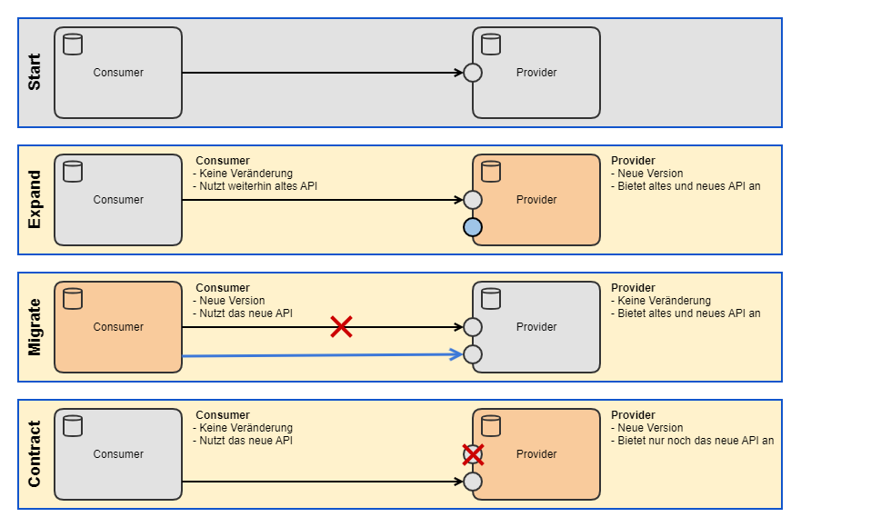
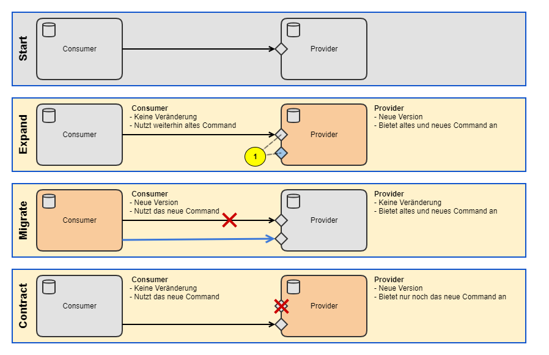
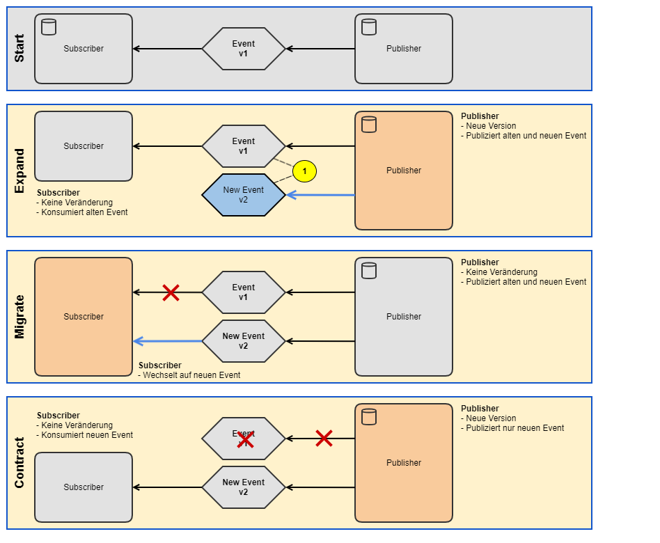
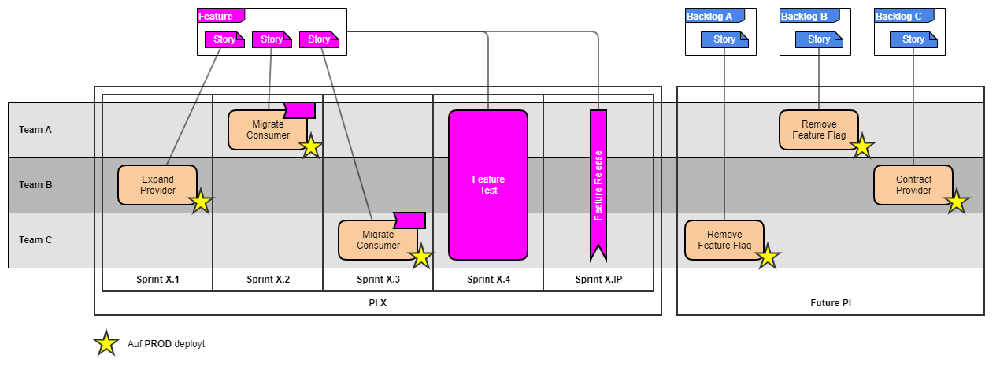
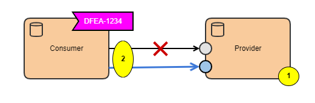
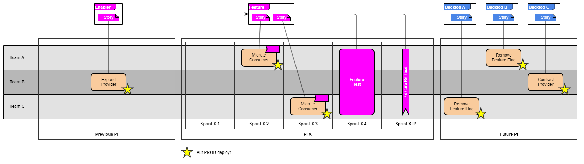

# Expand - Migrate - Contract

## Idea

A change that would require more than one component to be deployed AT THE SAME TIME is split into multiple changes, each of which can be deployed independently.

## Motivation

With Continuous Delivery, components must be independently deployable; changes that require coordinated, simultaneous deployment of multiple components must be split into compatible steps.

## When to apply which strategy

> Whenever possible, an evolutionary Expand/Migrate/Contract strategy without a new major version should be used!

- REST APIs can in many cases be extended in a backward-compatible way: [Evolution and Versioning of REST APIs](../rest-apis/evolution-versioning.md)
- Messaging interfaces can, thanks to Avro, often be extended in a compatible way: [Evolution of Messages](../messaging/evolution-of-messages/index.md)

## Procedure for EMC with a new, incompatible major version

The procedure is always the same:

| Step | Description |
| --- | --- |
| EXPAND | The provider offers a new interface |
| MIGRATE | The consumers (1..N) migrate to the new interface |
| CONTRACT | The provider removes the old, no-longer-used interface |

The following illustrates the procedure for the typical interface types. The procedure is always identical, regardless of the interface type.

### REST API

### Command

1. Not Avro-compatible:
    - New major version of the Command
        - New name of the Avro schema
        - New names of the Java classes

### Event

1. Not Avro-compatible:
    - New major version of the Event
        - New name of the Avro schema
        - New names of the Java classes

## Expand-Migrate-Contract & Messaging

The following recommendations should be observed when applying Expand-Migrate-Contract in the context of jEAP messaging.

For a discussion of the recommended migration strategies, see [Evolution of Messages](../messaging/evolution-of-messages/index.md).

### EMC Message Evolution

With this strategy, incompatible changes are split into several smaller, compatible steps. Each step is zero-downtime and without breaking changes. This approach is preferred according to [Evolution of Messages](../messaging/evolution-of-messages/index.md). The procedure is as follows:

1. Expand: a compatible change is made to the Avro schema (e.g. adding a new optional attribute) and a new minor/patch version of the message type is published
2. Migrate: all consumers/producers migrate to the first new version by updating the version of the Maven dependency for the message type
3. Migrate/Contract: a further compatible change is made to the Avro schema (e.g. removing an old, no-longer-needed attribute) and a second new minor/patch version of the message type is published
4. Contract: all consumers/producers migrate to the second new version by updating the version of the Maven dependency for the message type

> Both changes are Avro-schema-compatible between reader and writer—one change in BACKWARD mode, the other in FORWARD mode. Because these migration steps use different compatibility modes, the **Kafka Schema Registry subject** must use compatibility mode `NONE`; this must not be confused with the compatibility mode declared for a message type version.
>
> See [Evolution of Messages](../messaging/evolution-of-messages/index.md)

### Strategy: EMC Message Replacement

> Whenever possible, the **EMC Message Evolution** strategy should be preferred! See [Evolution of Messages](../messaging/evolution-of-messages/index.md)

| Recommendation | Description | Reason |
| --- | --- | --- |
| New message | With this strategy, an independent, new message is defined - not a new message version of the old message. It's recommended to name the new message `<oldMessageName>V2<postfix>`. Example: **JmeDeclarationCreatedV2Event**, **JmeCreateDeclarationV2Command**. If the new message consists of further Avro records, it's also recommended to add the version to the namespace as well (e.g. `@namespace("ch.admin.bit.jme.declaration.v2")`). This makes the record definition self-contained, so the new version doesn't need to reference objects of a previous version. | Completely independent of the old message: no restrictions from Avro compatibility rules, no conflicts in the Java code |
| New topic | The new message should be published on a new topic. From the naming convention this follows: `<system>-<context>-declarationcreated-v2`, `<system>-<context>-createdeclaration-v2` | Unchanged subscribers wouldn't be able to process the new messages on the topic |
| Same idempotence ID | The idempotence ID of the corresponding new and old message must be identical | Until the subscriber migrates to the new message/topic, the publisher has already published messages to the new topic. As soon as the subscriber migrates to the new message/topic, it will receive some messages that it has already processed as "old" messages |
| Start with earliest | The subscriber should read all messages from the new topic. See [Kafka consumer configs: auto.offset.reset](https://kafka.apache.org/documentation/#consumerconfigs_auto.offset.reset) | If the subscriber were to start with the default "latest", there would be a risk that it misses some messages |

## Expand-Migrate-Contract & CD & SAFe

### Ideal sequence

The following image illustrates the typical sequence of Expand-Migrate-Contract in the context of Continuous Delivery and SAFe.

In the example, we assume that an API used by two consumers needs to be extended in an incompatible way for a feature.

#### Deployment sequence

As a general rule, the extended provider must be deployed first (see note below):

- Take the dependency into account during PI planning
- Plan the expand of the provider/publisher early in the PI
- Start the migrate as late as possible, so the deployment of the change doesn't need to wait for the provider

Note: theoretically, the components could also be deployed in the reverse order if the use of the not-yet-available API is disabled by a feature flag. However, CDC tests don't know the state of the feature flag. As a result, a compatibility test ([Can-I-Deploy](https://docs.pact.io/pact_broker/can_i_deploy/)) would report an error, since the consumer contract references an API that isn't yet available in the target environment.

#### Scope of the feature

- The feature comprises Expand & Migrate
- Contract stories aren't part of the feature - they're planned by the PO as part of maintenance

The reason is that the feature must be completed within one PI. The contract stories can only be implemented after the feature has been released. Since the release potentially happens late, or only after the PI, the contract stories would prevent the feature from being completed.
In addition, the contract stories aren't relevant to the business value of the feature. They represent technical debt, which the PO schedules as part of maintenance.

#### Deployment vs. release

With Continuous Delivery, we want to deploy components to production as quickly as possible. However, the deployment must not lead to an unwanted, partial release of the feature.
Therefore, consumers must implement a feature flag that determines whether they use the old or the new API. The feature flag is activated by the feature release.

#### Feature architecture

The feature architecture for this example would look as follows, and declares which feature flag is used to release the feature.

| Step | Description |
| --- | --- |
| 1 | Provider offers the new API |
| 2 | Consumer integrates the new API; usage is activated by the feature flag `WVS_COMMUNICATION_JEAP_1234_NEW_API` |

### With Expand-Enabler

If needed, the expand can be implemented in an earlier PI using an enabler (no business value).

