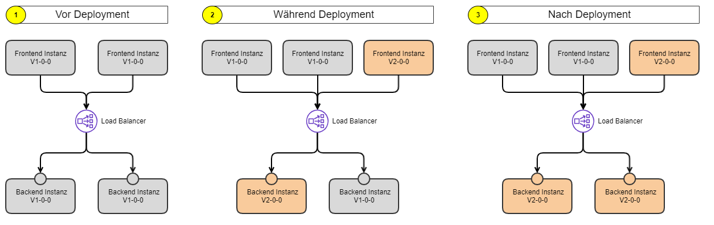
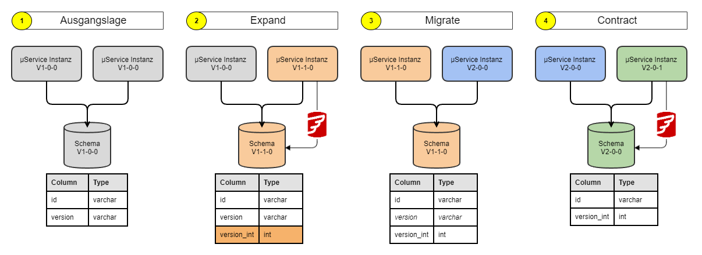

# Zero-Downtime Deployments

In a zero-downtime deployment of a component, it's unavoidable that both versions of the component are active in parallel between the start of the first instance of the new version and the stop of the last instance of the old version.
This requires special attention, because it means **breaking changes** are **not permitted even within the component**!

Two typical examples:

- Frontend & backend of an SCS
- Microservice & DB

## Frontend & backend of an SCS

The frontend and backend of an SCS are typically integrated via a REST API. For an SCS, the frontend and backend form a single deployment unit. This means the frontend and backend are deployed at the same time. However, since multiple instances are active simultaneously, a combination of old and new is still unavoidable during the deployment. As a result, a seemingly simple extension can turn into a breaking change!

| Step | Description |
| --- | --- |
| 1 | Before the deployment starts, all frontend and backend instances are compatible |
| 2 | The first instance of the new backend has started; potentially, the first instances of the new frontend are also already starting. The load balancer distributes requests from the frontend instances across all backend instances. Requests from the old frontend may be routed to the new backend. Requests from the new frontend may be routed to an old backend |
| 3 | Old frontend instances may still be active after the deployment |

### Solution approach

The extension of the SCS must be split into at least two steps (Expand, Migrate). If the extension makes an old API redundant, a third step (Contract) follows.

| Step | Description | Reason |
| --- | --- | --- |
| Expand | An extended version of the SCS is deployed (preparation): extended, backward-compatible backend API; unchanged frontend, which only uses the old API | The deployment is possible without downtime, because the frontend instances only generate requests that **all** backend instances can process |
| Migrate | This version of the SCS contains: the extended backend; the new frontend, which uses the new API | The deployment is possible without downtime, because now **all** backend instances support both the old and the new API |
| Contract | If an old API has become redundant, its removal must happen in a separate step | The deployment is possible without downtime, because there are no more frontend instances that still access the old API |

## Microservice & DB

In some cases, changes to the data model require the Expand-Migrate-Contract approach for a zero-downtime deployment, because multiple instances of the microservice are active in parallel. A good article on this topic can be found here: [Update your Database Schema Without Downtime](https://thorben-janssen.com/update-database-schema-without-downtime/)

Backward-compatible (uncritical) changes are:

- Adding a table, view, or nullable column (or a column with a default value)
- Deleting a table, view, or column that's no longer used
- Deleting constraints

Not backward-compatible, and therefore critical, are:

- Renaming a table, view, or column
- Changing the data type of a column
- Removing a table, view, or column that's still used by the current software

The procedure for a non-backward-compatible change (e.g. changing the data type of a column) is illustrated below.

| # | Comment | Rollback |
| --- | --- | --- |
| 1 | All microservice instances and the DB schema are at V1-0-0 | N/A |
| 2 | Version **V1-1-0** extends the DB schema in a backward-compatible way (new column added). Instances of version V1-0-0 only read and write the old column. Instances of version V1-1-0 **READ** data from the new **OR** the old column (V1-0-0 still writes new data to the old column), and **WRITE** data to both the old **AND** the new column (V1-0-0 still reads from the old column). Data migration: once all instances of version V1-0-0 have been replaced by instances of V1-1-0, the missing data can be copied from the old to the new column | ✅ |
| 3 | Version **V2-0-0** of the microservice only uses the new column. This is now possible because the new column is sufficient for instances at V1-1-0, and is required in order to be able to delete the old column in the next step | ✅ |
| 4 | Version **V2-0-1** deletes the old column. This is now possible because all active instances no longer know about the old column | ❌ |
