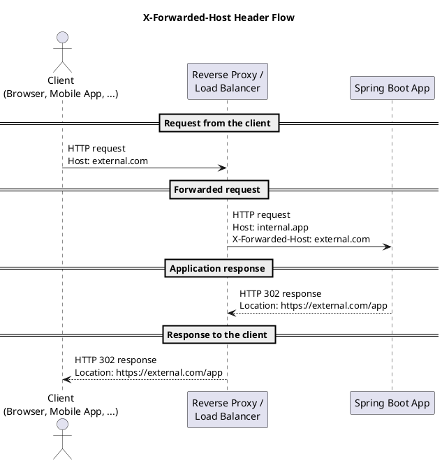

# Redirects and Reverse Proxies

## Overview

When **HTTP requests are routed through load balancers, reverse proxies, or web application firewalls**, the host name (to an internal address), and possibly also the protocol or port, typically changes along the way. Because of this, the target host on which the web application runs receives information via HTTP headers about which endpoint the client's request was originally directed to.

If, for example, a **redirect** is sent to the client with an **absolute URL**, that URL must contain the address of the resource **from the client's perspective**, since the client cannot produce a successful request using internal host names or incorrect protocol/port information.



*Note*: the information from the headers below is normally consolidated into the standard [Forwarded](https://developer.mozilla.org/en-US/docs/Web/HTTP/Headers/Forwarded) header. Which proxy/LB/WAF products use which headers is implemented differently depending on the vendor.

| Header | Purpose | Content | Example |
| --- | --- | --- | --- |
| **`X-Forwarded-Host`** | The `X-Forwarded-Host` header is a de-facto standard header for identifying the original host requested by the client in the [`Host`](https://developer.mozilla.org/en-US/docs/Web/HTTP/Headers/Host) HTTP request header. | host name | external-host.com |
| **`X-Forwarded-Proto`** | The `X-Forwarded-Proto` request header helps you identify the protocol (HTTP or HTTPS) that a client used to connect to your load balancer. | originatingProtocol | https |
| **`X-Forwarded-Port`** | The `X-Forwarded-Port` request header helps you identify the destination port that the client used to connect to the load balancer. | port number | 443 |
| **`X-Forwarded-For`** | The `X-Forwarded-For` request header helps you identify the IP address of a client. | client-ip-address[, client-ip-address]2 | 46.21.12.12 |

## Spring Boot Web MVC / Tomcat & Redirects with a Reverse Proxy

In the default configuration (`forward-headers-strategy=NATIVE`), **Spring delegates HTTP redirects to Tomcat**, and Tomcat uses [Spring's preconfiguration](https://docs.spring.io/spring-boot/docs/current/reference/htmlsingle/#howto.webserver.use-behind-a-proxy-server.tomcat) of the [`RemoteIpValve`](https://tomcat.apache.org/tomcat-8.5-doc/api/org/apache/catalina/valves/RemoteIpValve.html) to determine the location in redirects, taking the `X-Forwarded-*` headers into account. What's particularly important is the **preconfiguration of the IP addresses** of trusted proxies. By default, these are limited to internal IP addresses. Forwarding headers are only accepted for these IP addresses.

Spring Boot has a number of configuration settings relevant to running behind a reverse proxy, three of which are examined in more detail here:

| Property | Effect | Default |
| --- | --- | --- |
| `server.forward-headers-strategy` | Whether and how Spring takes forwarding headers into account (NATIVE: the embedded web server is used for this, FRAMEWORK: a Spring filter implements the logic, NONE: headers are ignored). | The value NATIVE is automatically activated if the Spring Boot app runs on Kubernetes or a [cloud platform](https://docs.spring.io/spring-boot/api/java/org/springframework/boot/cloud/CloudPlatform.html#enum-constant-summary) known to Spring Boot, otherwise NONE |
| `server.tomcat.use-relative-redirects` | The `Location` header in HTTP responses is set relatively (i.e. not `https://host/resource`, but only `/resource`). | false, with **jeap-spring-boot-application-starter**: *true* |
| `server.tomcat.redirect-context-root` | Whether Tomcat performs a redirect on the context root. I.e. if the app runs under `/app`, `/app` is automatically redirected to `/app/`. If set to false, the app itself must perform the redirect, or handle requests without a slash internally as if a slash were present. The servlet spec requires a trailing slash; without it, exceptions can occur, e.g. when accessing static resources with Spring. | true |

### jeap-spring-boot-application-starter

In **jeap-spring-boot-application-starter**, starting with the version in **jeap-spring-boot-parent** 18.2.0, the following property is set by default via an `EnvironmentPostProcessor`. This sets the `Location` header in HTTP responses to a relative value (unless an application explicitly sets an absolute URL, e.g. for an external redirect to another application).

```java
server.tomcat.use-relative-redirects=true
```

This **configuration is set because**:

- It avoids the problem of a downgrade from HTTPS to HTTP in the `Location` header on redirects on the context root (`host/my-service` → `host/my-service/`).
- It reduces the risk of incorrect host names being used in redirects, e.g. when chaining multiple reverse proxies that aren't optimally aligned with each other.

If the configuration doesn't fit for an application, the property can simply be overridden in the application's own configuration (`application.yaml`).

## Further Documentation

- [https://docs.spring.io/spring-boot/docs/current/reference/htmlsingle/#howto.webserver.use-behind-a-proxy-server](https://docs.spring.io/spring-boot/docs/current/reference/htmlsingle/#howto.webserver.use-behind-a-proxy-server)
- [https://github.com/spring-projects/spring-boot/issues/22908](https://github.com/spring-projects/spring-boot/issues/22908)
- [https://developer.mozilla.org/en-US/docs/Web/HTTP/Headers/Forwarded](https://developer.mozilla.org/en-US/docs/Web/HTTP/Headers/Forwarded)
- [https://developer.mozilla.org/en-US/docs/Web/HTTP/Headers/X-Forwarded-For](https://developer.mozilla.org/en-US/docs/Web/HTTP/Headers/X-Forwarded-For)
- [https://developer.mozilla.org/en-US/docs/Web/HTTP/Headers/X-Forwarded-Host](https://developer.mozilla.org/en-US/docs/Web/HTTP/Headers/X-Forwarded-Host)
- [https://developer.mozilla.org/en-US/docs/Web/HTTP/Headers/X-Forwarded-Proto](https://developer.mozilla.org/en-US/docs/Web/HTTP/Headers/X-Forwarded-Proto)
