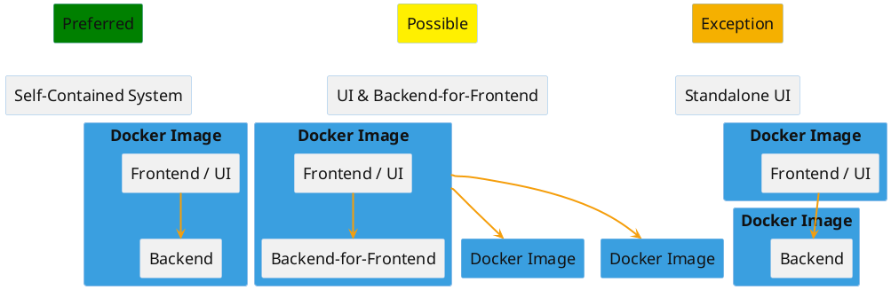

# Structuring Deployables for Frontend / Backend

## Overview

This page makes a recommendation on how to structure frontend deployments.

## Recommendation Regarding the Structuring of Frontends

The recommendation regarding the structuring of frontends and backends with respect to deployment / modularization is:

| Priority / Name | Deployment (Docker image) contains | Reasoning |
| --- | --- | --- |
| **1. SCS (Self-Contained System)** | Frontend (Angular) and backend (domain services & REST API, Java) | A self-contained system that independently generates business value, for a bounded context per Domain-Driven Design. Simpler configuration (a frontend under a sub-context is harder to implement with a plain Angular build & static file buildpack). The frontend/backend lifecycle is usually coupled anyway, deployment is simplified with an SCS. The variant with the lowest complexity. |
| 2. UI & Backend-for-Frontend | Frontend (Angular) and backend-for-frontend (REST API, Java) | Backend-for-Frontend for UIs which implement a cross-cutting concern (e.g. a business process, portal, or similar) or cannot be separated for user-experience reasons. |
| 3. Standalone UI | Frontend only (Angular); backend(s) deployed separately | Harder to configure. More complex deployment. The frontend/backend lifecycle is usually coupled anyway.  Standalone UIs are possible when **justified and agreed** with system architecture. |
| 4. Website / pure frontend without backend/API access | Frontend only (HTML/CSS or Angular) | For purely static web apps/websites without backend calls. |

:::warning
Integrating multiple backends from a single frontend is not desired:

- Authorization & security are generally harder to implement
- Complex integration logic in the frontend is undesirable → apply the BFF pattern instead
:::

## Glossary

| Term | Meaning | Deployment at DaziT |
| --- | --- | --- |
| SCS / Self-Contained System | Self-Contained System: architectural pattern, a self-contained system for a bounded context that independently generates business value.  DDD / Bounded Context | Angular frontend packaged together with the Java backend in a JAR and deployed via the Java buildpack |
| BFF / Backend-for-Frontend | A backend that offers a tailored API for a frontend and simplifies integration.  Example: a UI for cross-cutting concerns, integrating multiple microservices in the backend, for UX reasons | Angular frontend packaged together with the Java backend in a JAR and deployed via the Java buildpack |
| Standalone UI integrating multiple backend APIs | UI directly integrates multiple APIs.  Challenges: configuration per environment, testability | Angular frontend deployed via the static file buildpack.  Java backend packaged in a JAR and deployed via the Java buildpack in a separate app |
| Website / pure frontend without backend/API access | A purely static web app/website without backend calls | Website deployed via the static file buildpack |

## Further Documentation

- [https://scs-architecture.org/](https://scs-architecture.org/)
