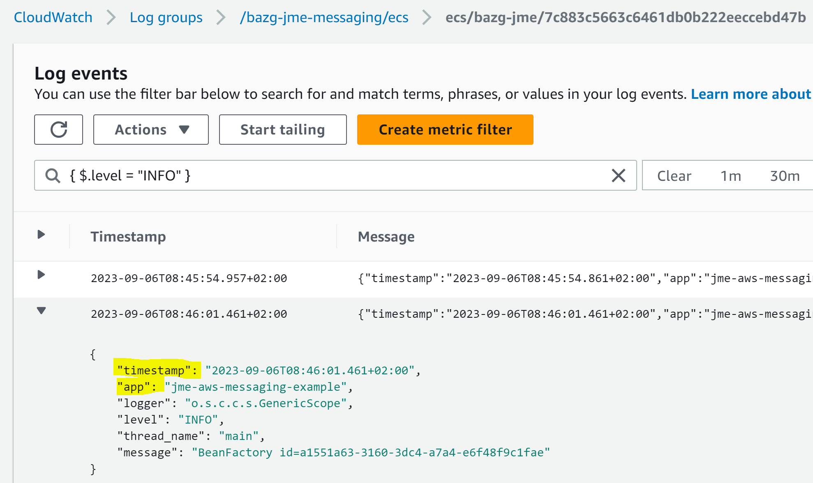
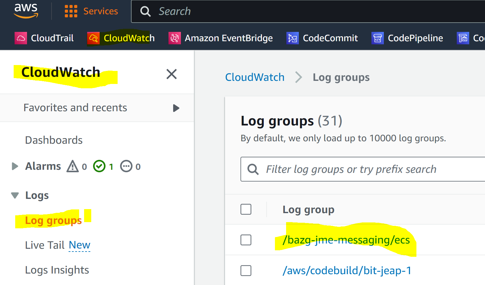
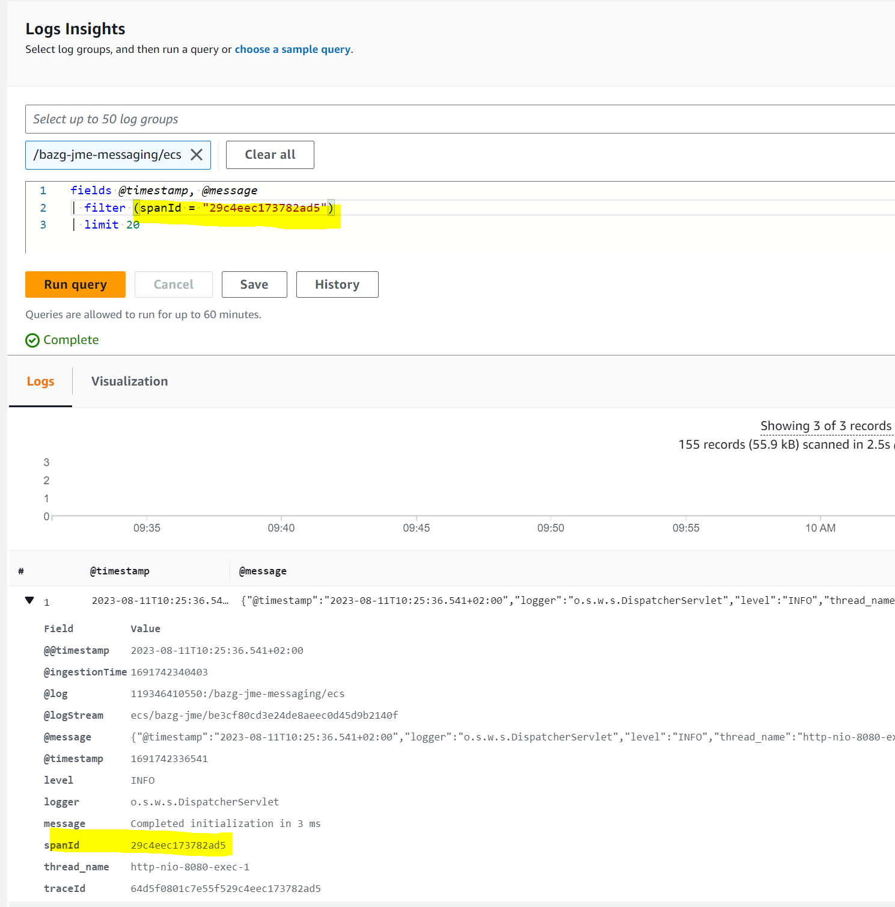

# AWS Logging

## Introduction

Logs from ECS Tasks and other workload types using jEAP are typically streamed to an AWS product named
[CloudWatch](https://aws.amazon.com/cloudwatch/). jEAP Logs are sent as structured JSON log statements to
allow for indexing and querying.

The `jeap-spring-boot-logging-starter` is a required dependency in the `jeap-spring-boot-parent`. See
[Logging](index.md) for details.

## CloudWatch Log Format

When CloudWatch is selected as the log format for the `jeap-spring-boot-logging-starter`, log entries will
be:

- Written as structured JSON data
- Containing attributes such as the app name, timestamp, trace ID, level, ...
- For a current overview of all log entry attributes see
  [logback-cloudwatch.xml](https://github.com/jeap-admin-ch/jeap-spring-boot-starters/blob/main/jeap-spring-boot-logging-starter/src/main/resources/jeap/logging/logback-cloudwatch.xml)

Basically, everything in [Logging](index.md) also applies on AWS. The only two differences are:

- The timestamp attribute, which is named `timestamp` and not `@timestamp`. `@timestamp` is a reserved name
  in AWS Logs Insights.
- The `taskDefinitionVersion` attribute on ECS, which helps to filter logs by tasks for a certain task
  definition version

```js
{
  "taskDefinitionVersion":"41",
  "timestamp":"2024-06-21T10:09:49.978+02:00",
  "app":"applicationplatform-archrepo-service",
  "logger":"c.z.h.HikariDataSource",
  "level":"INFO",
  "thread_name":"https-jsse-nio-8080-exec-6",
  "traceId":"6675354d9408d86908b236adc70ef269",
  "spanId":"c52ed3282f5f6160",
  "message":"HikariPool-2 - Start completed."
}
```

An example of a log entry in CloudWatch:



## How To Activate The Logging Format for CloudWatch

Activating the log format for CloudWatch is simple. Just set the following property, for example in a
common AppConfig profile for your app, or in `application-<profile>.yml`.

```yaml
jeap.logging.platform: cloudwatch
```

## Viewing Logs on AWS CloudWatch

### AWS Cloud Watch

1. Go to the CloudWatch product page in the AWS console
2. Select Logs > Log Groups
3. Select the log group for which you would like to see the logs



Log entries can be filtered based on JSON attributes, see
[https://docs.aws.amazon.com/AmazonCloudWatch/latest/logs/FilterAndPatternSyntax.html#matching-terms-events](https://docs.aws.amazon.com/AmazonCloudWatch/latest/logs/FilterAndPatternSyntax.html#matching-terms-events)
for details on how filter terms are structured.

For example, this screenshot shows how all log entries with level INFO are selected by using the filter
term:

```java
{ $.level = "INFO" }
```


### AWS Logs Insights

AWS Logs Insights is a slightly more advanced querying and analysis tool for logs. The query syntax is
similar to Splunk. Logs Insights offers the advantage of correlating the log statements from multiple log
groups (i.e. multiple microservices or ECS tasks) together.

1. Go to the CloudWatch product page in the AWS console
2. Select Logs > Logs Insights
3. Select the log group(s) for which you would like to see the logs
4. Enter a filter query (see
   [https://docs.aws.amazon.com/AmazonCloudWatch/latest/logs/CWL_AnalyzeLogData_Tutorials.html](https://docs.aws.amazon.com/AmazonCloudWatch/latest/logs/CWL_AnalyzeLogData_Tutorials.html))


