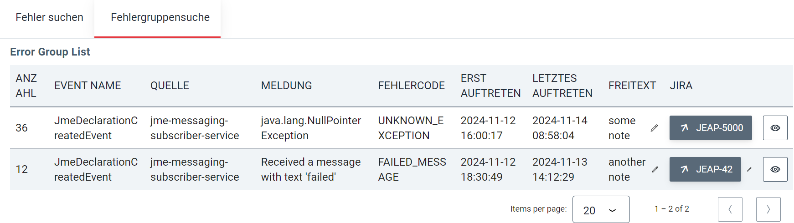
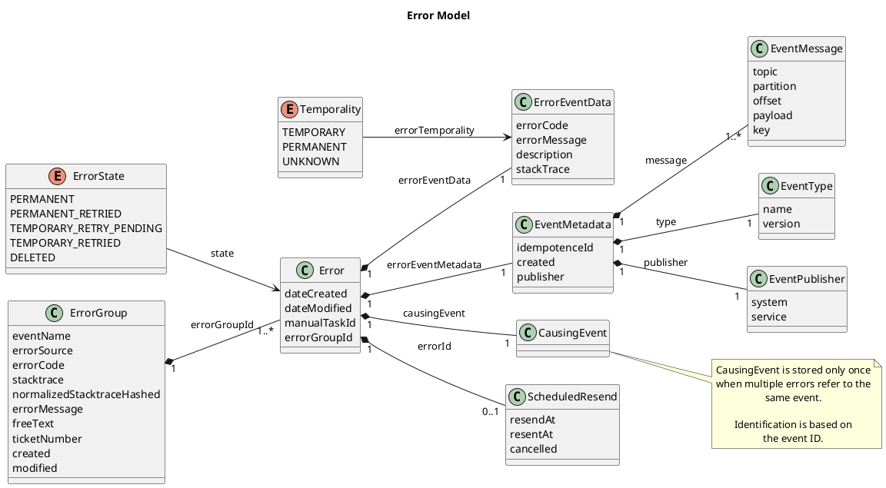

# Error Handling Service

## Overview

The Error Handling Service reads error messages (error events) from a business application's error topic and processes them (see also [Error Handling](index.md)). It can resend temporary errors to the application and, for permanent errors, create a manual task in Agir. Temporary errors that fail repeatedly are automatically converted into a permanent error. The Error Handling Service also provides a GUI that can be used to view current error messages and resend them manually. Every business application must set up its own Error Handling Service instance and extend it if desired.

### Frontend

The Error Handling Service has its own UI, which is protected with PAMS (see Integration > OAuth below). Depending on the role, different actions are possible.

For errors:

- **View** can display errors (role mandatory to use the UI)
- **Retry** can redeliver the causing message to the consumer
- **Delete** can (logically) delete/ignore an error

The UI has two views:

- The **error list** shows a list of all errors currently in the `PERMANENT` state
- **Temporary errors** shows a list of all errors currently in the `TEMPORARY_RETRY_PENDING` state, i.e. errors for messages that will automatically be resent at a certain point in time

Clicking "Details" on an error opens the detail page. Here you can see, among other things, which service produced the error and where the message came from, as well as inspect the payload of the causing message. The error can also be ignored or the message resent from here.

## Integration

An Error Handling Service instance must be created per business application. For this, a source-code repository with the following content must be created:

- A POM with the parent `jeap-error-handling-service-instance`

  ```xml
  <parent>
      <groupId>ch.admin.bit.jeap</groupId>
      <artifactId>jeap-error-handling-service-instance</artifactId>
      <version>use-the-latest-version-here</version>
      <relativePath/> <!-- lookup parent from repository -->
  </parent>
  ```

- Configuration files (`application-<env>.yml`)

An Error Handling Service instance can initially be created based on the template [jme-messaging-error-scs](https://github.com/jme-admin-ch/jme-messaging-example/tree/main/jme-messaging-error-scs). This template, however, shows the instantiation in a multi-module project and therefore does not use `jeap-errorhandling-service-instance` as a parent; it must instead explicitly add the `jeap-errorhandling-service` dependency. In the case of multi-module projects, always make sure that the `jeap-spring-boot-parent` version used by the project's parent matches the `jeap-spring-boot-parent` version used by the Error Handling Service dependency.

### Configuration

The configuration files support the following settings. An example of a complete configuration can be found in the [example project](https://github.com/jme-admin-ch/jme-messaging-example/blob/main/jme-messaging-error-scs/src/main/resources/application.yml).

#### Kafka

The Error Handling Service processes domain events or commands in the form of Kafka messages. Accordingly, configuring access to Kafka and the Kafka schema registry is a central part of the Error Handling Service configuration. The specific configuration options (`jeap.event.kafka.`) are described in the [documentation](../jeap-messaging-library/index.md) of the messaging library; see also the JME example [https://github.com/jme-admin-ch/jme-messaging-example/blob/main/jme-messaging-error-scs/src/main/resources/application.yml](https://github.com/jme-admin-ch/jme-messaging-example/blob/main/jme-messaging-error-scs/src/main/resources/application.yml). The following properties are particularly important:

```yaml
jeap:
  errorhandling:
    # Define the topic where to look for errors. This must be configured in all
    # event consumers as jeap.messaging.kafka.errorTopicName
    topic: "yoursystem-messageprocessing-failed"
    deadLetterTopicName: "yoursystem-messageprocessing-deadletter"

  messaging:
    kafka:
      systemName: YOURSYSTEMNAME
      serviceName: ${spring.application.name}
```

#### OAuth

Since the Error Handling UI is secured via OAuth, the Error Handling Service must be configured as an OAuth2 resource. The specific configuration options (`jeap.security.oauth2.resourceserver`) are described under "Authentisierung für REST-APIs" (TODO Link).

The Error Handling Service UI is intended for integration into the ePortal and accordingly integrates the ePortal widget. Consequently, a user who wants to access the UI of an Error Handling Service instance needs the corresponding roles in ePortal/PAMS.
The role names are:

```text
<systemname>_@error_#view
<systemname>_@error_#retry
<systemname>_@error_#delete
```

These roles are typically assigned to a user in PAMS for the *internal business partner* (see "Keycloak#PamsUserrolesTokenMapper", TODO Link), i.e. the user then automatically has these roles as *user roles*, valid for all business partners. (The backend only checks `hasRole(..)`, not `hasRoleForAllPartners(..)`, i.e. it is sufficient if the user has the role for any business partner.)

For error handling, a client must be configured in Keycloak as described under "Keycloak#KonfigurationsparameterClients" (TODO Link). The system name is configured under `jeap.security.oauth.resourceserver.system-name`; for the other important properties see the [example](https://github.com/jme-admin-ch/jme-messaging-example/tree/main/jme-messaging-error-scs/src/main/resources):

```yaml
jeap:
  errorhandling:
    #Define the frontend properties
    frontend:
      clientId: "error-handling-ui" # <-- Name of the client configured in Keycloak
      systemName: "jme" # <-- System name for role jme_@error
      autoLogin: true
      silentRenew: true
      renewUserInfoAfterTokenRenew: true
      applicationUrl: http://localhost:8072/error-handling/
      logoutRedirectUri: http://localhost:4199/
      mockPams: true
      pamsEnvironment: REF
 
  security:
    oauth2:
      resourceserver:
        system-name: "jme" # <-- IMPORTANT...value can of course also be referenced from above
```

#### Log Deep Link

Via the Error Handling UI, events can be opened in the corresponding log system based on the trace ID. For this, a corresponding query template is configured in the properties. The deep link can be opened in the UI, both in the "Link" column and in the detail view.

> **Note:** The query template must contain the token `{traceId}` so that the trace ID can be inserted into the query.

##### Properties

| Property | Meaning | Default |
| --- | --- | --- |
| `log.deep-link.base-url` | Base URL of the log system. | See examples |

##### Examples

| Log system | Query template |
| --- | --- |
| **Splunk (default)** ||
| AWS | |

#### Resending

By default, the resending strategy for temporary errors is resend via the `DefaultResendingStrategy`. It can be configured with the following properties:

| Property | Meaning | Default |
| --- | --- | --- |
| `jeap.errorhandling.resend.default-resend-strategy.delay` | Desired (minimum) time between receipt and resend of a failed message | 30s |
| `jeap.errorhandling.resend.default-resend-strategy.max-retries` | Upper limit on the number of resends of a failed message | 15 |
| `jeap.errorhandling.resend.default-resend-strategy.exponential-backoff-enabled` | Enable/disable exponentially increasing the time between receipt and resend of a failed message | true |
| `jeap.errorhandling.resend.default-resend-strategy.exponential-backoff-factor` | Factor by which the last interval between receipt and resend is multiplied for the next resend, when `exponential-backoff-enabled=true` | 2 |
| `jeap.errorhandling.resend.default-resend-strategy.exponential-backoff-max-delay` | Maximum time between receipt and resend of a failed message, when `exponential-backoff-enabled` is true | 1d |

If desired, a custom `ResendingStrategy` implementation can be provided as a bean to be used instead of the `DefaultResendingStrategy`.

##### Resending Headers

The following headers are set on resend:

| Name | Value | Meaning/Usage |
| --- | --- | --- |
| `jeap_eh_target_service` | Name of the service that had the error while processing the event | Used in jeap-messaging to filter out messages intended for other services |
| `jeap_eh_error_handling_service` | Name of the resending Error Handling Service | For debugging purposes |

#### Agir Task Management Integration

> **Note:** For a local setup and tests of error handling, forwarding permanent errors to Agir can be suppressed (see configuration options below). The Error Handling Service will then only log calls to Agir instead of actually executing them. This means there is no need to spin up a separate Agir instance for local tests.

To open a task in the Agir Task Management Service on error, the following properties must be defined:

| Property | Meaning | Default |
| --- | --- | --- |
| `jeap.errorhandling.task-management.service.enabled` | Should the Agir Task Management Service be connected? | true |
| `jeap.errorhandling.task-management.service.url` | URL of the Agir Task Management Service | - |
| `jeap.errorhandling.task-management.service.client-id` | Client ID of the OAuth2 client in the Spring Security client-registration configuration that the Error Handling Service uses to authenticate against the Agir Task Management Service. The corresponding client configuration must of course also exist (see "Aufruf gesichertes REST-API aus Java", TODO link). | - |

The task type submitted to Agir is called "errorhandling".

In addition, the Error Handling Service must be able to call Agir and therefore must be configured as a REST client. The specific configuration options (`spring.security.oauth2.client`) are described under "Aufruf gesichertes REST-API aus Java" (TODO Link). An example configuration of an OAuth client for Agir can look as follows:

```yaml
spring:
  security:
    oauth2:
      client:
        registration:
          jme-messaging-error-service:
            client-id: "${vcap.services.agir.credentials.clientid}"     # From the client configuration on Agir's realm (tab "Credentials")
            client-secret: "${vcap.services.agir.credentials.secret}"   # From the client configuration on Agir's realm (tab "Credentials")
            authorization-grant-type: "client_credentials"
            provider: "agir-oauth2-provider"
        provider:
          agir-oauth2-provider:
            issuer-uri: "https://ref-identity-pams.ezv.admin.ch/auth/realms/ezv-agir"  # Must be the Agir realm so that Agir accepts the token!
```

The task is defined by default via the `DefaultTaskFactory`, which can be configured with the following properties:

| Property | Meaning | Default |
| --- | --- | --- |
| `jeap.errorhandling.task-management.default-factory.errorServiceBaseUrl` | URL of the error service, for links back into the error service | - |
| `jeap.errorhandling.task-management.default-factory.priority` | Priority of the tasks | HIGH |
| `jeap.errorhandling.task-management.default-factory.system` | System the tasks are assigned to | - |
| `jeap.errorhandling.task-management.default-factory.timeToHandle` | Time a user has to handle the tasks | 1d |
| `jeap.errorhandling.task-management.default-factory.domain` | Domain the task is assigned to in Agir *(from Error Handling Service version 5.1.0)* | error-handling |
| `jeap.errorhandling.task-management.default-factory.taskReferenceName` | Title of the link to the Error Handling Service *(from Error Handling Service version 5.1.0)* | Error Service |

The task type and its display in Agir can be configured as follows *(from version 5.1.0 of the Error Handling Service)*:

```yaml
jeap.errorhandling.task-management.default-factory:
  display:
    DE:
      title: "Fehlgeschlagene Nachrichten-Verarbeitung"
      description: "Ein technischer Fehler ist aufgrund einer unverarbeitbaren Nachricht aufgetreten."
      displayName: "Nachrichten-Verarbeitungsfehler"
      displayDomain: "Error Handling"
    FR: / IT: / EN:
      # Similar to DE...
```

##### Custom TaskFactory Implementation

Alternatively, a custom `TaskFactory` implementation can be provided as a bean, to be used instead of the `DefaultTaskFactory`. This must be declared as a bean in a dedicated `AutoConfiguration` so that it is picked up.

#### Jira Issue Tracking Integration

> **Note:** Connecting an Error Handling Service instance to an issue-tracking system is optional. For a local setup and tests of error handling, the issue-tracking and Jira properties can simply be left unconfigured.

Since version 12.0.0, the Error Handling Service can create a Jira ticket for an error group on a corresponding click in the UI. The ticket's *summary* can be configured with a template and information from the error group. In the ticket's *description*, the Error Handling Service automatically includes a table with the most important data about the error group.

To connect Jira as an issue-tracking system, the following properties must be defined:

| Property | Meaning | Default |
| --- | --- | --- |
| `jeap.errorhandling.error-groups.issue-tracking.project` | The Jira project in which the ticket should be created. | - |
| `jeap.errorhandling.error-groups.issue-tracking.issue-type` | The type of ticket to create. | Bug |
| `jeap.errorhandling.error-groups.issue-tracking.issue-summary-template` | The template for the ticket summary. Supported template parameters are: `group-id`, `group-created-datetime`, `message-type`, `source`, `error-code`, `error-count` | `Processing of '{message-type}' from '{source}' fails with '{error-code}'` |
| `jeap.errorhandling.error-groups.issue-tracking.error-handling-service-group-url-template` | The URL template for a link to an error group in the Error Handling Service, with the parameter `{groupId}` as a placeholder for the group's ID. Used in the Jira ticket's description to link back to the error group in the EHS.| - |
| `jeap.errorhandling.jira.base-url` | The URL of the Jira instance. | - |
| `jeap.errorhandling.jira.username` | The username for accessing Jira and/or the name of the ticket reporter. Must be a valid Jira user. | - |
| `jeap.errorhandling.jira.password` | The password for accessing Jira, if Basic Auth is used. Can be empty if `token` is set. | - |
| `jeap.errorhandling.jira.token` | The token for accessing Jira, if Bearer Auth is used. Can be empty if `password` is set. Takes precedence over `password`. | - |

Example configuration:

```yaml
jeap:
  errorhandling:
    error-groups:
      issue-tracking:
        project: "JME"
        error-handling-service-group-url-template: "${jeap.errorhandling.frontend.application-url}/error-group-details/{groupId}"
    jira:
      base-url: "base-url"
      username: "${username.secret.from.secrets.manager}"
      token: "${token.secret.from.secrets.manager}"
```

##### Setting Up a Technical User for the Jira Integration

jEAP recommend creating a dedicated User with the minimal required permissions for the Jira integration, then creating a token with a limited lifetime for this user, and configuring this token (together with the S-User's username) in the Error Handling Service (properties: `token` and `username`).

1. Create a MAC for an S-User for automated ticket creation on Jira
2. Create the User granted minimal permissions
   - Permission to create a Jira ticket (no permission to edit or read tickets!)
   - Permission to log in to the UI, so that a token can be created there
   - Permission only on the Jira project(s) used by the Error Handling Service instance(s) to be authorized
3. Log in to the Jira UI with the User and its credentials
4. Create a PAT (Personal Access Token) in the Jira UI, in the user's "Profile" under the page menu entry "Personal Access Tokens"
   1. Configure "Automatic Expiry" for the token
5. Store the username and the generated token in the secret store used
6. Configure the username and token from the secret store in the Error Handling Service configuration

#### Error Handling

So that no message is lost, the Error Handling Service itself also uses the normal jEAP messaging mechanism for error handling in case of an error (see [Error Handling](index.md)).

However, this mechanism must not use the normal error topic in the Error Handling Service, since the Error Handling Service itself consumes from that topic. Therefore, an additional, special topic must be ordered: the **Dead Letter Topic (DLT)**. If the Error Handling Service cannot process a message, it will write it to the Dead Letter Topic.

The name of this topic must be defined according to the [Naming Conventions](../../naming-conventions.md) as follows: `<system>-messageprocessing-deadletter` (e.g. `jme-messageprocessing-deadletter`).

In principle, the Dead Letter Topic should always be empty, since messages on this topic generally indicate interrupted business processes. To monitor the Dead Letter Topic, the system team will set up corresponding **alerting**. Alerting is configured by default after ordering the Dead Letter Topic.

To integrate error handling in the Error Handling Service, the following steps must be carried out:

1. A **Dead Letter Topic** must be ordered. The maximum message size on the Dead Letter Topic must be matched to the size of the messages processed by the system.
2. The Kafka user configured in the Error Handling Service must have **write access** to this topic.
3. The Dead Letter Topic must be defined on the Error Handling Service:
   - `jeap.errorhandling.deadLetterTopicName` (e.g. `jme-messageprocessing-deadletter`)
4. These parameters must be defined on the Error Handling Service, since it also needs to send messages:
   - `jeap.messaging.kafka.systemName` (e.g. `JME`)
   - `jeap.messaging.kafka.serviceName` (e.g. `${spring.application.name}`)

An example of this configuration can be found in the jme-messaging-example project ([jme-messaging-error-scs / src / main / resources / application.yml](https://github.com/jme-admin-ch/jme-messaging-example/blob/main/jme-messaging-error-scs/src/main/resources/application.yml)):

```yaml
spring:
  application:
    name: jme-messaging-error-scs
  datasource:
    type: com.zaxxer.hikari.HikariDataSource
    driver-class-name: org.postgresql.Driver
    url: "jdbc:postgresql://localhost:5532/jeap-error-handling-service-db-local"
    hikari:
      maximum-pool-size: 10
      pool-name: "hikari-cp-${spring.application.name}"
      schema: ${spring.jpa.properties.hibernate.default_schema}
  jpa:
    properties:
      hibernate.default_schema: data
  flyway:
    # Flyway creates automatically the default schema if it doesn't exist
    default-schema: ${spring.jpa.properties.hibernate.default_schema}
  security:
    oauth2:
      client:
        registration:
          jme-messaging-error-service:
            client-id: "jme-messaging-error-service"
            client-secret: "secret"
            authorization-grant-type: "client_credentials"
            provider: "agir-oauth2-provider"
        provider:
          agir-oauth2-provider:
            issuer-uri: "${jeap.security.oauth2.resourceserver.authorization-server.issuer}"
#The servlet path must be error-handling as this is defined in the error-handling UI
server:
  servlet:
    context-path: /error-handling
jeap:
  errorhandling:
    # Define the topic where to look for errors. This must be configured in all
    # event consumer as jeap.messaging.kafka.errorTopicName
    topic: "jme-messageprocessing-failed"
    deadLetterTopicName: "jme-messageprocessing-deadletter"
    # Define the global frontend properties
    frontend:
      clientId: "error-handling-ui"
      silentRenew: true
      systemName: "jme"
      autoLogin: true
      renewUserInfoAfterTokenRenew: true
      ticketingSystemUrl: base-url/{ticketNumber}
    #Currently there is no integration of manual task service
    task-management:
      service:
        enabled: false
  reaction:
    observer:
      events:
        reaction-identified-topic: jme-reaction-identified
        reactions-observed-topic: jme-reactions-observed

  messaging:
    kafka:
      systemName: JME
      serviceName: ${spring.application.name}
  security:
    oauth2:
      resourceserver:
        system-name: "jme"
  postgresql:
    aws:
      enabled: false
  web:
    tls:
      enabled: false
  swagger:
    status: open
log:
  deep-link:
    base-url: "base-url"
management:
  # Trace every request so every demo call in this example produces a trace.
  # Spring Boot's default is 0.1 (10%). Production services should usually leave the
  # default in place (or sample even lower) to keep trace storage and cost bounded.
  tracing:
    sampling:
      probability: 1.0
```

If messages end up on the Dead Letter Topic, they can be read with a tool (e.g. Kafdrop). As with normal error handling, all messages are wrapped in a [MessageProcessingFailedEvent](message-processing-failed-event.md), and the string attributes can be read directly in the tool.

##### Retrying Message Processing on Temporary Errors

Since version 12.2.0, the Error Handling Service can retry processing of a received message when a temporary error occurs while processing it. This means received messages are no longer simply diverted to the DLT when, for example, the database has a temporary problem or is unavailable. Instead, the Error Handling Service will repeatedly retry processing the message that caused the temporary error, at a certain interval, until the temporary error (e.g. a DB outage) is resolved.

The wait time between repeated processing attempts for a temporary error can be configured with the following property:

| Property | Meaning | Default |
| --- | --- | --- |
| `jeap.errorhandling.kafka.errorhandling.retry-interval` | Time interval from the occurrence of a processing error until the next processing attempt. Accepts values that Spring can parse into a Java `Duration`. | 30s |

Anyone who wants to configure the EHS's retry behavior in more detail can provide their own Spring Kafka `BackOff` bean in their EHS instance, with the Spring bean name `KafkaErrorHandlingConfiguration.BACKOFF_BEAN_NAME`.
The default `BackOff` bean is configured in the EHS roughly as follows:

```java
    @Bean(name = BACKOFF_BEAN_NAME)
    BackOff ehsKafkaErrorHandlingBackOff() {
        return new FixedBackOff(30000, UNLIMITED_ATTEMPTS);
    }
```

#### Housekeeping

Since version 5.6.0, housekeeping takes place: to keep the database from growing indefinitely, a job runs every night that deletes certain errors from the DB.

Condition 1: error older than 6 months (the duration in months is configurable)

Condition 2: error in one of the following states:

- `TEMPORARY_RETRIED`
- `PERMANENT_RETRIED`
- `DELETED`
- `PERMANENT`

Configuration:

| Configuration key | Description | Type / Format | Default value |
| --- | --- | --- | --- |
| `jeap.errorhandling.housekeeping.scheduler.cronExpression` | Cron expression specifying when the housekeeping scheduler runs. | String (Cron) | `0 40 00 * * *` (daily at 00:40) |
| `jeap.errorhandling.housekeeping.scheduler.lockAtLeast` | Minimum duration the lock for the scheduler is held. | Duration | `5S` (5 seconds) |
| `jeap.errorhandling.housekeeping.scheduler.lockAtMost` | Maximum duration the lock for the scheduler is held. | Duration | `30M` (30 minutes) |
| `jeap.errorhandling.housekeeping.errorMaxAge` | Specifies how old errors may be before they are deleted. | Duration | `180D` (180 days) |
| `jeap.errorhandling.housekeeping.pageSize` | Number of entries per page during cleanup. Each page is deleted in its own transaction. | int | `100` |
| `jeap.errorhandling.housekeeping.maxPages` | Maximum number of pages cleaned up in one run. | int | `100000` |

#### Multi-Cluster Support

The Error Handling Service generally supports different Kafka clusters according to [Support for Multiple Kafka Clusters](../jeap-messaging-library/support-for-multiple-kafka-clusters.md). However, the following particularity must be observed:

> **Note:** The EHS consumes exclusively on the default cluster. For publishing, the cluster is taken from the event, so that there are no problems with the signature/schemas.

#### Error Group (from version 9.0.0)

> **Note:** For the Error Handling Service to be able to group the errors of a microservice, the microservice's error handling must produce exception stack-trace hashes. See [Error Handler of the jEAP Messaging Library](error-handler-of-the-jeap-messaging-library.md) for this.

With Error Handling Service 9.0.0, the concept of an "error group" is introduced. *Permanent* errors can be grouped by the EHS based on their stack-trace hashes. The stack-trace hashes are produced by the [Error Handler of the jEAP Messaging Library](error-handler-of-the-jeap-messaging-library.md) and transmitted to the Error Handling Service in the [MessageProcessingFailedEvent](message-processing-failed-event.md). A stack-trace hash is formed as a hash over the stack-trace elements of the exception that caused the error. Grouping of error stack-trace hashes happens in combination with the service, event, and error code of the error. In the EHS's error-group view, only errors in the `PERMANENT` (and `SEND_TO_MANUAL_TASK`) states are considered, i.e. permanent errors marked as deleted and ones currently in a retry are not counted.

Additional information can be attached to an error group. Currently this is free text and a Jira ticket.



Corresponding permissions are needed to view and modify error groups. The following operations are defined on the "errorgroup" resource for this purpose:

- **view** can display error groups (role mandatory to use the UI)
- **edit** can save free text and the Jira ticket

Accordingly, the following roles are needed to view and change error groups:

```text
<systemname>_@errorgroup_#view
<systemname>_@errorgroup_#edit
```

##### Connecting to Jira

A Jira ticket number can be attached to an error group. Via this number, the user can jump directly from the EHS to the Jira ticketing system. For this, the ticket system's base URL must be configured in the EHS (see the following section).

##### Configuration

| Property | Meaning | Default |
| --- | --- | --- |
| `jeap.errorhandling.error-groups.errorGroupingEnabled` | Enable or disable creation of error groups | true |
| `jeap.errorhandling.frontend.ticketingSystemUrl` | URL of a ticket in the ticketing system, with a `{ticketNumber}` placeholder | `https://jira.bit.admin.ch/browse/{ticketNumber}` |

##### Error Group Housekeeping

The EHS housekeeping periodically and automatically deletes all error groups that no longer have any errors assigned to them.

### Metrics

The Error Handling Service produces metrics about the error rate and the number of existing errors. These can be used to monitor error rates and to set up alerting based on the metrics for a business application. The following metrics are available:

| Metric | Type | Description |
| --- | --- | --- |
| `eh_created_temporary_errors` | Counter | Number of errors classified as temporary since the instance of the Error Handling Service started. Primarily intended as a basis for alerting on the error rate. In multi-instance operation of the Error Handling Service, this metric should be summed across all instances. |
| `eh_created_permanent_errors` | Counter | Number of errors classified as permanent since the instance of the Error Handling Service started. Primarily intended as a basis for alerting on the error rate. In multi-instance operation of the Error Handling Service, this metric should be summed across all instances. |
| `eh_temporary_retry_pending` | Gauge | Current number (total, in the database) of errors classified as temporary for which a retry is attempted. |
| `eh_permanent_open` | Gauge | Current number (total, in the database) of errors classified as permanent that are currently open (i.e. either a manual task is still being created for them, or one has already been opened). |
| `eh_permanent_pending_manualtask_create` | Gauge | Current number (total, in the database) of errors classified as permanent for which no manual task has yet been created (e.g. because the Manual Task Service could not be reached). |
| `eh_permanent_pending_manualtask_resolve` | Gauge | Current number (total, in the database) of errors classified as permanent that have been resolved but whose manual task has not yet been closed (e.g. because the Manual Task Service could not be reached). |
| `eh_permanent_pending_manualtask_delete` | Gauge | Current number (total, in the database) of errors classified as permanent that have been deleted but whose manual task has not yet been deleted (e.g. because the Manual Task Service could not be reached). |
| `eh_open_errors_by_cluster` | Gauge | Current number of errors that are not in a final state.<br/>Labels: `cluster` |
| `eh_error_groups_with_open_errors` | Gauge | |

The gauge metrics are sampled every 60 seconds by default. The frequency can be configured with the property `jeap.errorhandling.metrics.updateFrequencyMillis`. Each sampling performs a count on the database, so overly frequent sampling is not recommended.

### Custom Resending Strategy

The default resending strategy treats all failed messages the same way. This may not be sufficient for some cases. A business application can, however, easily define the resending behavior of the jEAP Error Handling Service itself: the business application's Error Handling Service only needs to implement its own implementation of the `ResendingStrategy` interface and expose this implementation as a Spring bean in its configuration. The business application's `ResendingStrategy` implementation has access to a large amount of information about the failed message. The [DefaultResendingStrategy](https://github.com/jeap-admin-ch/jeap-error-handling/blob/main/jeap-error-handling-service/src/main/java/ch/admin/bit/jeap/errorhandling/domain/resend/strategy/DefaultResendingStrategy.java) can be used as a template for this.

Example of a custom implementation (the **`@Primary`** annotation is important, so that Spring uses this class):

```java
@Component
@Primary
public class CustomResendingStrategy implements ResendingStrategy {

    @Override
    public Optional<ZonedDateTime> determineResend(int errorCountForEvent, EventMetadata eventMetadata, EventMetadata errorEventMetadata, ErrorEventData errorEventData, EventMessage message) {
        //....
    }
}
```

For Spring to instantiate this class, a file `org.springframework.boot.autoconfigure.AutoConfiguration.imports` must be created in the folder **resources/META-INF/spring** with the following content, see [https://docs.spring.io/spring-boot/reference/features/developing-auto-configuration.html](https://docs.spring.io/spring-boot/reference/features/developing-auto-configuration.html).

```java
ch.admin.bit.jeap.jme.messaging.error.CustomResendingStrategy
```

## Example

The [jme-messaging-example](https://github.com/jme-admin-ch/jme-messaging-example) integrates error handling. [jme-messaging-error-scs](https://github.com/jme-admin-ch/jme-messaging-example/tree/main/jme-messaging-error-scs) is the instance of the Error Handling Service in this example. [jme-messaging-error-scs/src/main/resources/application.yml](https://github.com/jme-admin-ch/jme-messaging-example/blob/main/jme-messaging-error-scs/src/main/resources/application.yml) is an example configuration for the Error Handling Service together with Agir.

## Internals

### State Model

```plantuml
@startuml
title Error Handling States

left to right direction

skinparam shadowing false
skinparam state {
  BackgroundColor White
  BorderColor Black
  ArrowColor Black
  FontColor Black
}

state "Publishing Retry\nFailed" as publishingRetryFailed
state "Error Event\nReceived" as errorEventReceived

state "Error Temporality?" as errorTemporality <<choice>>

state "TEMPORARY_RETRY_PENDING" as temporaryRetryPending #D9EAD3
state "PERMANENT" as permanent #D9EAD3

state "TEMPORARY_RETRIED" as temporaryRetried #FFFFFF
state "DELETED" as deleted #FFFFFF
state "PERMANENT_RETRIED" as permanentRetried #FFFFFF

state "RESOLVE_ON_MANUALTASK" as resolveOnManualTask #E2E2E2
state "DELETE_ON_MANUALTASK" as deleteOnManualTask #E2E2E2
state "SEND_TO_MANUALTASK" as sendToManualTask #E2E2E2

[*] --> publishingRetryFailed

publishingRetryFailed --> errorTemporality : [Failed To Publish Retry]\nCreates new error instance

publishingRetryFailed --> errorEventReceived : retry failed

errorEventReceived --> errorTemporality

errorTemporality --> temporaryRetryPending : [Temporary]\n[Retry Counter < Max. Retry Count]

errorTemporality --> permanent : [Permanent]\n[Unknown]\n[Max. Retry Count Exceeded]

temporaryRetryPending --> temporaryRetried : Scheduled automated retry timer trigger\nUser action: immediate retry (UI V2.0)\n[Retry Successful]
temporaryRetried --> [*]

temporaryRetryPending --> permanent : User action: stop retry

temporaryRetryPending --> deleted : User action: delete
deleted --> [*]

permanent --> permanentRetried : User action: retry
permanentRetried --> [*]

permanent --> deleted : User action: delete

permanent --> resolveOnManualTask : Manual resolution

permanent --> sendToManualTask : Send to manual task

note right of publishingRetryFailed
  Actionable state relevant to the user
end note

note right of temporaryRetryPending
  Actionable state relevant to the user
end note

note right of permanent
  Actionable state relevant to the user
end note

note bottom of publishingRetryFailed
  If no data for this event ID exists in the repository,
  create an empty causing-event message and metadata.
end note

note bottom of errorEventReceived
  Error Handling Service version 4.3.1
end note

@enduml
```



### Data Model


