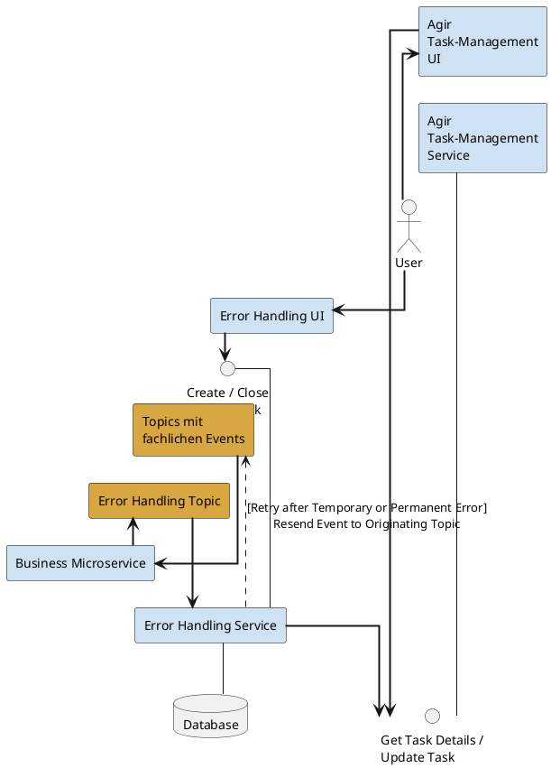

# Error Handling

## Overview

### Motivation

In a system landscape with an event-driven architecture, many **event-driven** business processes run (e.g. events on crossing a border, ...). These business events are often processed **automatically** and without user interaction as an [event](../index.md). An event often triggers further business events, so that a chain of events results. A problem that every application has to solve: what happens on **processing errors**? Events must **not be lost**, since an event that is lost is never processed and the process it belongs to then stalls.

### How it Works

As part of the [Jeap Messaging Library](../jeap-messaging-library/index.md), an error handler is automatically configured (see [Error Handler of the jEAP Messaging Library](error-handler-of-the-jeap-messaging-library.md)). If an application throws an exception while processing an event, the exception is caught by the error handler. The error handler then sends a [MessageProcessingFailed Event](message-processing-failed-event.md) to a configurable error topic and acknowledges receipt of the original event. This lets the application's event processing continue for further events without blocking.

A separate [Error Handling Service](error-handling-service.md) then reads the MessageProcessingFailed events from the topic and stores them in its own database. The Error Handling Service can then:

- On temporary errors, write the original event back into the original topic after a certain time, so that the event is processed again.
- Convert temporary errors that have occurred repeatedly into permanent errors.
- On permanent errors, create a task so that an employee can take care of the problem.

## Integration

To integrate error handling into your own business applications, the following steps must be carried out:

- An error topic must be ordered.
- A user with write access to all topics that the Error Handling Service needs to be able to resend events to must be provided for the Error Handling Service.
- Roles must be configured in PAMS for the Error Handling Service (see [Error Handling Service > OAuth](error-handling-service.md#oauth)).
- The [Jeap Messaging Library](../jeap-messaging-library/index.md) must be configured in every service that processes events.
- A dedicated instance of the Error Handling Service must be instantiated (see [Error Handling Service > Integration](error-handling-service.md#integration)).

## Example

Error handling is integrated in [jme-messaging-example](https://github.com/jme-admin-ch/jme-messaging-example). Depending on the content of the event, the jme-event-receiver throws different exceptions (see [ExampleController.java](https://github.com/jme-admin-ch/jme-messaging-example/blob/main/jme-messaging-subscriber-service/src/main/java/ch/admin/bit/jeap/jme/messaging/receiver/ExampleController.java). [jme-messaging-error-scs](https://github.com/jme-admin-ch/jme-messaging-example/tree/main/jme-messaging-error-scs) is the instance of the Error Handling Service in this example.
