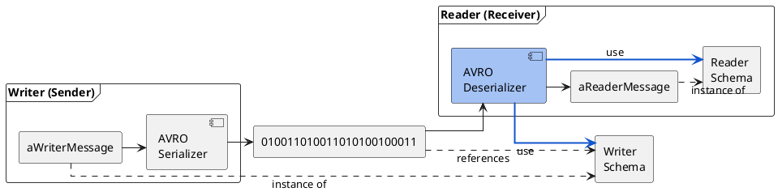
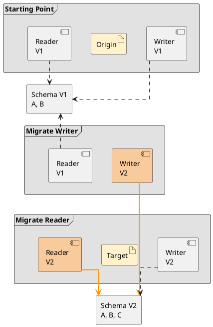
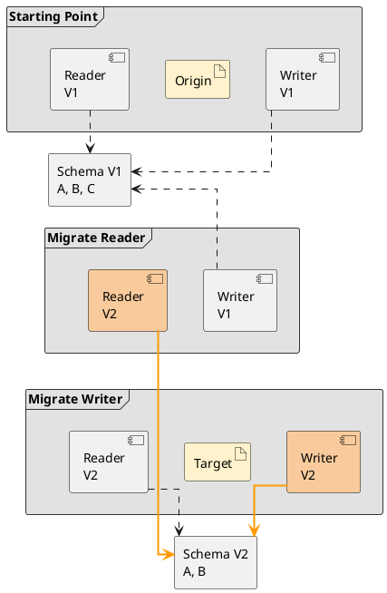
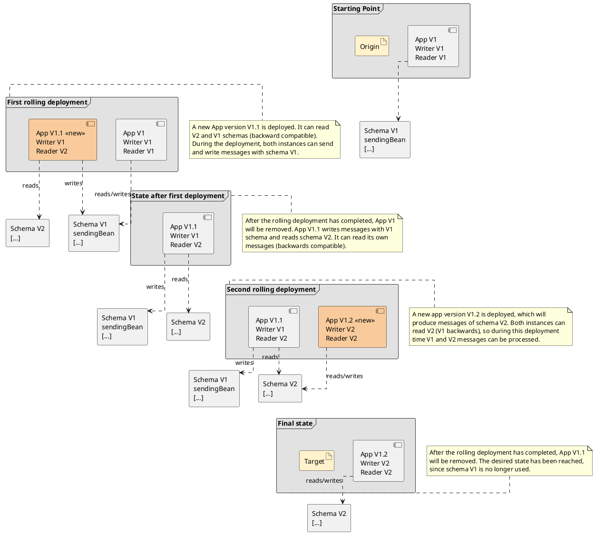

# Evolution of Messages

## Background



- AVRO allows the writer and the reader of a message to use different schema versions to process the same message instance
- The AVRO deserializer knows the WriterSchema and the ReaderSchema
    - The WriterSchema declares the content/model of the binary message as used by the writer
    - The ReaderSchema declares the expectation/model of the reader
- As long as the AVRO deserializer can instantiate a valid ReaderMessage using the information contained in the binary message, the schema versions are compatible

> **Warning: Incompatible Changes break the System.** In the context of continuous deployment it is mandatory that each change is compatible.
> Deploying an incompatible change will break the system → breaking change.

## Forward and Backward Compatibility

A compatible schema change can be either forward- or backward compatible. We have to be aware of the direction of the compatibility as this determines the required sequence of the deployments.

### Compatibility

**Forward:** Messages written with a new schema can be read by consumers using the old schema.

| Writer Schema | Compatible | Reader Schema | Comment |
| --- | --- | --- | --- |
| V1 | ❌ | V2 | New schema can't deserialize old message |
| V2 | ✅ | V1 | Old schema can deserialize new message |

**Backward:** Readers using the new schema can read messages produced with the old schema.

| Writer Schema | Compatible | Reader Schema | Comment |
| --- | --- | --- | --- |
| V1 | ✅ | V2 | New schema can deserialize old message |
| V2 | ❌ | V1 | Old schema can't deserialize new message |

### Allowed Changes

**Forward** — changes allowed for forward compatibility:

| Change | Why does it work for the reader? |
| --- | --- |
| Add mandatory field / Add optional field | The message produced using the new schema contains the additional field; the reader, using the old schema, **ignores** the additional field. |
| Delete optional field | The message produced using the new schema never contains the optional field; the reader, using the old schema, is **prepared** that the optional field is **not present**. |
| Optional → Mandatory | The message produced using the new schema always contains the field; for the reader, using the old schema, the optional field is **always present**. |
| Rename with alias | The message produced using the new schema uses the new name; the reader can map the field to the old name **iff** [AVRO aliases](https://avro.apache.org/docs/1.8.1/spec.html#Aliases) are provided. |

**Backward** — changes allowed for backward compatibility:

| Change | Why does it work for the reader? |
| --- | --- |
| Delete mandatory field / Delete optional field | The message produced using the old schema contains the field; the reader, using the new schema, **does not expect** the deleted field. |
| Add optional field | The message produced using the old schema does not contain the optional field; the reader, using the new schema, is **prepared** that the optional field is **not present**. |
| Mandatory → Optional | The message produced using the old schema always contains the field; for the reader, using the new schema, the optional field is **always present**. |
| Rename with alias | The message produced using the old schema uses the old name; the reader can map the field to the new name **iff** [AVRO aliases](https://avro.apache.org/docs/1.8.1/spec.html#Aliases) are provided. |

See also [Confluent's schema evolution documentation](https://docs.confluent.io/platform/current/schema-registry/fundamentals/schema-evolution.html).

> **Warning: Forward and Backward must not be combined.** The combination of forward- and backward compatible changes in one step always leads to an incompatible change and is therefore never allowed.

### Deployment Sequence

**Forward:** the writer has to migrate to the new schema version first.



**Backward:** readers have to migrate to the new schema version first.



## Handling Incompatible Changes

Incompatible changes have to be broken down into **multiple compatible** changes. There are (at least) two strategies:

| Strategy (EMC = Expand, Migrate, Contract) | Approach | Use When |
| --- | --- | --- |
| EMC Message Evolution | Break down multiple changes into compatible steps; all participants in the message exchange evolve together. | You have control over or close collaboration with all participants and can coordinate the evolution. **Generally the preferred strategy as it does not involve any breaking changes!** |
| EMC Message Replacement | Create a new Message Type with a new name (e.g. a `V2` infix in the name); remove the old type when all participants have migrated to the new type. | You have little control over the participants, or many participants that are difficult to coordinate. |

### EMC Message Replacement (Brute Force)

The message is replaced by a new message type (→ new major version). The replacement follows the classical EMC (Expand-Migrate-Contract) scenario.

| Step | Event – Publisher | Event – Subscriber | Command – Consumer | Command – Provider |
| --- | --- | --- | --- | --- |
| Expand | Publish both EventTypes parallel | - | - | Provides both CommandTypes in parallel |
| Migrate | - | Switch to new EventType | Switch to new CommandType | - |
| Contract | Remove old EventType | - | - | Remove support for old CommandType |

For more details see: Strategie EMC Message Replacement (TODO Link).

### EMC Message Evolution

The idea of EMC Message Evolution is to break down the incompatible change into a forward- and a backward compatible change.

Imagine you have to add and to delete mandatory fields in one message type — those two changes are conflicting:
- Adding a mandatory field (C) requires a forward change
- Deleting a mandatory field (B) requires a backward change

If we add an intermediate schema for the transition, we can apply EMC as illustrated below.

1. **Expand**
    - Writer adds new Field C using intermediate schema
    - Reader using original schema can read messages written using intermediate schema ✅
2. **Migrate**
    - Reader switches to target schema
    - Messages produced using intermediate schema can be read using target schema ✅
3. **Contract**
    - Writer switches to target schema
    - Writer and reader are using the same schema ✅



> **Note:** The evolution of enums can be a bit tricky. Please see [Evolution of Avro Enums](evolution-of-avro-enums.md) for recommendations and details.

> **Precondition:** The compatibility mode of the subject in the Kafka Schema Registry must be [NONE](#kafka-schema-registry---compatibility-mode-none), as we combine forward- and backward compatible changes. Starting with version v7.3.0 the jEAP messaging library takes care of this automatically. Contrary to that, the compatibility mode of a message type version in the [jEAP Message Type Registry](../message-type-registry/index.md) should almost never be `NONE`, as this would imply a breaking change, which usually should be avoided.

#### Compared to Message Type replacement

##### Disadvantages

- You need an intermediate schema version
- Less intuitive

##### Advantages

- You don't have to publish two messages in parallel during expand
- You don't have the overhead of initiating a new Message Type
- No problems regarding idempotency, as no duplicated messages exist

#### EMC when Consuming Events Produced in the Same Microservice

##### Versions 7.5.0 and above

Note that fully compatible schemas (compatibility mode `FULL`) can always be deployed — these steps are only for schemas that use a compatibility mode other than `FULL`.

Several improvements in jEAP messaging libraries have enabled the EMC strategy on services that send/receive messages to themselves. Let's assume that we want to remove a mandatory field from an event. In this case, we will have to proceed with a Backward Compatibility mode. The next steps are required in order to evolve message versions on those microservices.

**1)** First we will need to declare a new version of the event in the message type registry. Both events can have the same name but **must have different namespaces** in order to be used by the same Java runtime. For instance (notice the value in `@namespace`), version 1 ([`JmeBackwardSchemaEvolutionTestEvent_v1.avdl`](https://github.com/jeap-admin-ch/jeap-test-message-type-registry/blob/main/descriptor/jme/event/jmebackwardschemaevolutiontestevent/JmeBackwardSchemaEvolutionTestEvent_v1.avdl) in [`jeap-test-message-type-registry`](https://github.com/jeap-admin-ch/jeap-test-message-type-registry)):

```text
@namespace("ch.admin.bit.jme.test")
protocol JmeBackwardSchemaEvolutionTestEventProtocol {
  import idl "DomainEventBaseTypes.avdl";
  import idl "ch.admin.bit.jme.test.BeanReference.avdl";

  record JmeBackwardSchemaEvolutionTestEventReferences {
    BeanReference sendingBean;
  }

  record JmeBackwardSchemaEvolutionTestEventPayload {
    string message;
    union {null, string} test = null;
  }

  record JmeBackwardSchemaEvolutionTestEvent {
    ch.admin.bit.jeap.domainevent.avro.AvroDomainEventIdentity identity;
    ch.admin.bit.jeap.domainevent.avro.AvroDomainEventType type;
    ch.admin.bit.jeap.domainevent.avro.AvroDomainEventPublisher publisher;
    JmeBackwardSchemaEvolutionTestEventReferences references;
    JmeBackwardSchemaEvolutionTestEventPayload payload;
    union {null, string} processId = null;
    string domainEventVersion = "1.1.0";
  }
}
```

And version 2 ([`JmeBackwardSchemaEvolutionTestEvent_v2.avdl`](https://github.com/jeap-admin-ch/jeap-test-message-type-registry/blob/main/descriptor/jme/event/jmebackwardschemaevolutiontestevent/JmeBackwardSchemaEvolutionTestEvent_v2.avdl)):

```text
@namespace("ch.admin.bit.jme.test.v2")
protocol JmeBackwardSchemaEvolutionTestEventProtocol {
  import idl "DomainEventBaseTypes.avdl";

  record JmeBackwardSchemaEvolutionTestEventReferences {
  }

  record JmeBackwardSchemaEvolutionTestEventPayload {
    string message;
    union {null, string} test = null;
  }

  record JmeBackwardSchemaEvolutionTestEvent {
    ch.admin.bit.jeap.domainevent.avro.AvroDomainEventIdentity identity;
    ch.admin.bit.jeap.domainevent.avro.AvroDomainEventType type;
    ch.admin.bit.jeap.domainevent.avro.AvroDomainEventPublisher publisher;
    JmeBackwardSchemaEvolutionTestEventReferences references;
    JmeBackwardSchemaEvolutionTestEventPayload payload;
    union {null, string} processId = null;
    string domainEventVersion = "1.1.0";
  }
}
```

In the second event version, we have removed the property `sendingBean` from `JmeBackwardSchemaEvolutionTestEventReferences`, which is an allowed change in Backward Compatibility mode, as declared in the message type registry descriptor ([`JmeBackwardSchemaEvolutionTestEvent.json`](https://github.com/jeap-admin-ch/jeap-test-message-type-registry/blob/main/descriptor/jme/event/jmebackwardschemaevolutiontestevent/JmeBackwardSchemaEvolutionTestEvent.json)):

```json
{
  "eventName": "JmeBackwardSchemaEvolutionTestEvent",
  "publishingSystem": "JME",
  "description": "A simple event to demonstrate backward schema evolution",
  "documentationUrl": "https://github.com/jeap-admin-ch/jeap",
  "topic": "jme-backward-schema-evolution-test-event",
  "scope": "internal",
  "versions": [
    {
      "version": "1.0.0",
      "valueSchema": "JmeBackwardSchemaEvolutionTestEvent_v1.avdl",
      "keySchema": "ch.admin.bit.jme.test.BeanReferenceMessageKey.avdl"
    },
    {
      "version": "2.0.0",
      "valueSchema": "JmeBackwardSchemaEvolutionTestEvent_v2.avdl",
      "keySchema": "ch.admin.bit.jme.test.BeanReferenceMessageKey.avdl",
      "compatibilityMode": "BACKWARD"
    },
    {
      "version": "3.0.0",
      "valueSchema": "JmeBackwardSchemaEvolutionTestEvent_v3.avdl",
      "keySchema": "ch.admin.bit.jme.test.BeanReferenceMessageKey.avdl",
      "compatibilityMode": "NONE"
    },
    {
      "version": "4.0.0",
      "valueSchema": "JmeBackwardSchemaEvolutionTestEvent_v4.avdl",
      "keySchema": "ch.admin.bit.jme.test.BeanReferenceMessageKey.avdl",
      "compatibilityMode": "BACKWARD"
    }
  ]
}
```

Once compiled, the first event will be available on the classpath as `ch.admin.bit.jme.test.JmeBackwardSchemaEvolutionTestEvent`, whereas the second is available as `ch.admin.bit.jme.test.v2.JmeBackwardSchemaEvolutionTestEvent`.

**2)** Dependencies for both versions can now be added to the project's `pom.xml` file. Message type registries using jEAP messaging 7.5.0+ will additionally upload message type artifacts (jars) with a classifier having the same version. The classifier is important, because otherwise Maven will consider the dependency as duplicated. A valid declaration is shown below — notice the `<classifier>` tag:

```xml
<dependency>
    <groupId>ch.admin.jeap.messaging.test.messagetype.jme</groupId>
    <artifactId>jme-backward-schema-evolution-test-event</artifactId>
    <version>1.0.0</version>
</dependency>
<dependency>
    <groupId>ch.admin.jeap.messaging.test.messagetype.jme</groupId>
    <artifactId>jme-backward-schema-evolution-test-event</artifactId>
    <version>2.0.0</version>
    <classifier>2.0.0</classifier>
</dependency>
```

Once the dependencies have been added, both classes can be used in the project code.

**3)** The diagram above shows the required sequence of deployments in order to migrate from V1 to V2. The application still requires a modification before being able to reach step number one.

In step number one, the application has to be enhanced to consume messages from both V1 and V2 schemas. That way, the application is prepared in advance for future V2 producers.

Since both schemas are compatible, incoming messages can be deserialized as V2 (the mandatory field `sendingBean` will simply be ignored):

```java
@KafkaListener(topics = TOPIC,
        properties="specific.avro.value.type=ch.admin.bit.jme.test.v2.JmeBackwardSchemaEvolutionTestEvent")
public void onV2Event(ch.admin.bit.jme.test.v2.JmeBackwardSchemaEvolutionTestEvent event, Acknowledgment ack) {
    log.info("V2 Event consumed: {}", event);
    ack.acknowledge();
}
```

By setting the property `specific.avro.value.type`, we will force the deserialization of V1 and V2 events as V2. Then the application can be deployed as usual and step 2 will be reached.

Afterwards the application can be changed to send messages with schema V2 and to remove references to schema V1 (App V1.2). Then it can be deployed (step 3) and, after the deployment has completed, the application will be in the target state (step 4).

##### Versions before 7.5.0

Currently, restrictions apply in jEAP messaging with regard to [EMC message evolution](#emc-message-evolution) if a message type is consumed by the same microservice that produces it. The current implementation of jEAP messaging does not support using the same message type in different versions in one microservice version. Therefore, all consumers and producers of a certain message type in a certain microservice version have to consume and produce the same version of the message type. For such message types, only changes of the compatibility type `full` are possible. Applying incompatible changes using EMC by applying a sequence of `forward`- and `backward`-compatible changes is not possible for such message types, because producers and consumers using the new message type version will be deployed at the same time, i.e. no forward or backward order can be established, as consumers and producers of the new *and* old message type versions will be active at the same time during a rolling deployment of the microservice.

In such cases, where EMC message evolution is not possible, [EMC message replacement](#emc-message-replacement-brute-force) can be used to apply incompatible changes to a message type instead.

## Kafka Schema Registry - Compatibility Mode NONE

The Kafka schema registry allows setting a compatibility mode on each so-called "subject", which can represent e.g. a topic or a message type. The Kafka schema registry will only allow the registration of a new schema for a subject if the schema satisfies the subject's compatibility mode. When using jEAP Messaging "2.0" (annotation-based [Message Contracts](../message-contracts/index.md) and the [Message Contract Service](../message-contracts/message-contract-service.md)) it is recommended that the compatibility mode on subjects in the Kafka schema registry be **NONE**.

### Rationale

- jEAP Messaging verifies compatibility at deployment time ([can-i-deploy](../message-contracts/can-i-deploy-for-messaging.md)) and prevents deployment of an incompatible change.
    - The Kafka schema registry can detect incompatibilities only after the publisher registered the new schema version → after deployment, too late!
- There's no need to stick with one change type per subject — we can choose the appropriate strategy for each change.
    - Real world scenarios require both forward- and backward compatible changes.
- In our context, Kafka messages are not the golden data master, but simply short-lived messages.
    - We don't keep the messages forever.
    - We don't expect systems to recover state based on the message stream.
    - We don't expect a subscriber to be able to process any message ever published.

That's why, starting with version 7.3.0, the jEAP messaging library automatically sets the compatibility mode to NONE on a subject before registering a new schema for the subject in the Kafka schema registry. Therefore, developers usually won't need to interact directly with the Kafka schema registry.

## See also

- [Evolution of Avro Enums](evolution-of-avro-enums.md) — recommendations and details for evolving `enum` fields.
- [Messaging](../index.md) — the messaging concepts overview.
- [jEAP Message Type Registry](../message-type-registry/index.md) — where message type schemas and their compatibility mode are declared.
- [Message Contracts](../message-contracts/index.md) — annotation-based message contracts and the can-i-deploy check.
