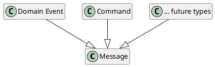

# Messaging

## Overview

In an **event-driven architecture**, messages are the most important communication channel between
microservices. Two message types can be distinguished:

- An **event** describes a significant change of state (e.g. a customs declaration was submitted, a permit
  was granted) and has a business character. When a microservice performs such a change, it informs the
  other microservices by means of an **event notification**. Since the sender does not know whether or which
  systems are interested in the notifications, and the receiver does not need to know which system generated
  the notification, this achieves **loose coupling** between the services.
- A **command** describes one system's (the sender's) request to another (the receiver) to perform a
  specific action. The sender must know which system is to read the command (**tight coupling**).

Messages are sent to a central **message broker**. Systems interested in messages can subscribe to the
message broker and are then notified of new messages. Since messages are sent across service and,
partially, system boundaries, they define an interface between two systems. Like all interfaces, they must
therefore be clearly defined and documented.

[Message Types](message-types.md) describes the basic structures that all messages must satisfy. All
message types must also be registered in the [Message Type Registry](message-type-registry/index.md).
Messages can be sent over [Kafka](kafka/index.md). The [Jeap Messaging Library](jeap-messaging-library/index.md)
provides a library for sending and receiving messages in Spring Boot.

An [error handler](error-handling/index.md) is also provided: messages whose processing produces an error
can be redelivered, and after a number of attempts (or immediately) are flagged as a permanent error and can
be routed out for manual handling.

## Example

The [Jeap Messaging Library](jeap-messaging-library/index.md) documentation describes a sample application
that sends messages with the Jeap Messaging Library over [Kafka](kafka/index.md).

## Topics

- [Message Types](message-types.md)
- [Evolution of Messages](evolution-of-messages/index.md)
- [Jeap Messaging Library](jeap-messaging-library/index.md)
- [Kafka](kafka/index.md)
- [Message Type Registry](message-type-registry/index.md)
- [Process Context Service](process-context-service/index.md)
- [Process Archive Service](process-archive-service/index.md)
- [Error Handling](error-handling/index.md)
- [Message Contracts](message-contracts/index.md)
