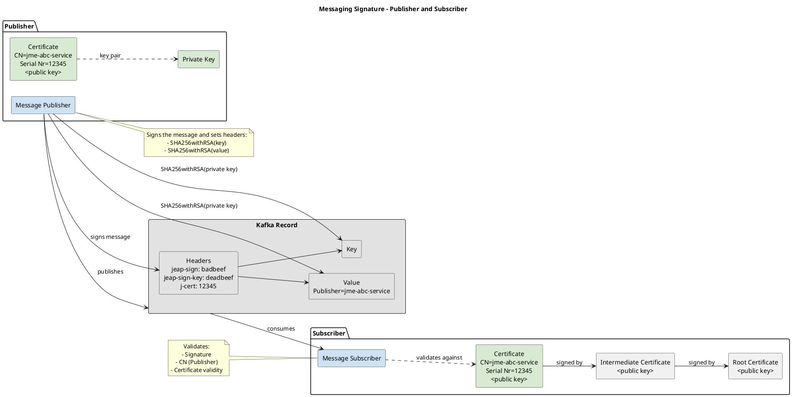

# Signing Messages and Checking Signatures Without jEAP

## Overview

An application can act as a publisher and/or as a subscriber of a jEAP message. The publisher signs the message,
specifically the value and the key, with its private key, while the subscriber validates the signature with the
public key from the publisher's certificate.



The **jEAP Messaging Library fully supports this** since [jeap-messaging](https://github.com/jeap-admin-ch/jeap-messaging)
version 8.21.0 and [jeap-spring-boot-parent](https://github.com/jeap-admin-ch/jeap-spring-boot-parent) 26.28.0. See
[jEAP Messaging Library — Signing Messages and Verifying Signatures](index.md#signing-messages-and-verifying-signatures).

The following explains the steps required on both the subscriber and publisher side if the implementation has to
be done **without the jEAP Messaging Library itself**.

**If you use jEAP, please see
[jEAP Messaging Library — Signing Messages and Verifying Signatures](index.md#signing-messages-and-verifying-signatures)
instead.**

## How To

### General Notes

The signature algorithm used is **SHA-256 with RSA** ("SHA256withRSA" when using the Java Cryptography API).

### Publisher

A publisher:

- signs the unencrypted message value (`byte[]`). Unencrypted means that the signature must take place before any
  encryption of the value.
- signs the unencrypted message key (`byte[]`), if available. Unencrypted means that the signature must take place
  before any encryption of the key.
- creates a header for the serial number with key = `jeap-cert` and value = serial number of the certificate as
  `byte[]`.
- creates a header for the message value signature with key = `jeap-sign` and value = message value signature
  (value from above) as `byte[]`.
- creates a header for the message key signature with key = `jeap-sign-key` and value = message key signature
  (value from above) as `byte[]`.
- publishes the message with the headers.

To do this, a publisher needs a certificate, the corresponding private key, and an implementation for signing with
the `SHA256withRSA` algorithm.

Here is a Java example for signing, with the performance-optimized AmazonCorrettoCryptoProvider:

```java
public byte[] createSignature(byte[] bytesToSign, PrivateKey privateKey) throws Exception {
  Signature signature = Signature.getInstance("SHA256withRSA", AmazonCorrettoCryptoProvider.PROVIDER_NAME);
  signature.initSign(privateKey);
  signature.update(bytes);

  return signature.sign();
}
```

The jEAP Messaging Library implementation can be found here:
[ByteSigner](https://github.com/jeap-admin-ch/jeap-messaging/blob/main/jeap-messaging-infrastructure/src/main/java/ch/admin/bit/jeap/messaging/kafka/signature/publisher/ByteSigner.java#L27).
How to create an instance of `PrivateKey` from a `byte[]` private key can be found here:
[PrivateKeyFactory](https://github.com/jeap-admin-ch/jeap-messaging/blob/main/jeap-messaging-infrastructure/src/main/java/ch/admin/bit/jeap/messaging/kafka/signature/publisher/PrivateKeyFactory.java#L21).

The following code shows how to extract the serial number from a `byte[]` certificate in Java:

```java
public byte[] getSerialNumber(byte[] certificateBytes) {
  CertificateFactory certificateFactory = CertificateFactory.getInstance("X.509");
  X509Certificate certificate = (X509Certificate) certificateFactory.generateCertificate(new ByteArrayInputStream(certificateBytes));
  return certificate.getSerialNumber().toByteArray();
}
```

To avoid configuration errors, the publisher should check whether the certificate (see
[SignatureCertificateHandling](https://github.com/jeap-admin-ch/jeap-messaging/blob/main/jeap-messaging-infrastructure/src/main/java/ch/admin/bit/jeap/messaging/kafka/signature/publisher/SignatureCertificateHandling.java#L32)):

- is (still) valid.
- has a CN (common name) that matches the application name.
- whether the certificate and the private key match when starting up. This is done as follows in the jEAP
  Messaging Library:
  [SignaturePublisherCheck](https://github.com/jeap-admin-ch/jeap-messaging/blob/main/jeap-messaging-infrastructure/src/main/java/ch/admin/bit/jeap/messaging/kafka/signature/SignaturePublisherCheck.java#L23).

### Subscriber

A subscriber:

- receives the message.
- extracts the certificate serial number from the header with key `jeap-cert`.
- extracts the signature of the message value from the header with key `jeap-sign`.
- extracts the signature of the message key, if available, from the header with key `jeap-sign-key`.
- gets the corresponding certificate from the configuration, i.e. the one with the serial number.
- checks the authenticity of the message value using the public key of the certificate and the signature of the
  message value (`byte[]`).
- checks the authenticity of the message key using the public key of the certificate and the signature of the
  message key (`byte[]`).

To do this, a subscriber needs the certificate (chain) of the publisher, and an implementation for validating with
the `SHA256withRSA` algorithm.

Here is a Java example of how to verify the authenticity of the message, using the performance-optimized
AmazonCorrettoCryptoProvider:

```java
public boolean doCheckAuthenticity(X509Certificate certificate, byte[] bytesToValidate, byte[] signatureBytes) throws Exception {
  PublicKey publicKey = certificate.getPublicKey();
  Signature signature = Signature.getInstance("SHA256withRSA", AmazonCorrettoCryptoProvider.PROVIDER_NAME);
  signature.initVerify(publicKey);
  signature.update(bytesToValidate);

  return signature.verify(signatureBytes);
}
```

In addition to the above, the subscriber should check the following:

- on startup:
  - are the certificate chains valid.
- on receipt of message:
  - is the certificate available.
  - is the certificate (chain) still valid.
  - does the publisher match the CN of the certificate.

In addition to the above, the subscriber could check/implement the following:

- implement a whitelist per message, which allows the configured publisher to publish messages without a
  signature (e.g. for migration scenarios).
- implement an allow-list of message types and publishers, to restrict the possible publishers.

The full subscriber logic of the jEAP Messaging Library can be found here:
[DefaultSignatureAuthenticityService](https://github.com/jeap-admin-ch/jeap-messaging/blob/main/jeap-messaging-infrastructure/src/main/java/ch/admin/bit/jeap/messaging/kafka/signature/subscriber/DefaultSignatureAuthenticityService.java).

### Remarks

In order to use the performance-optimized AmazonCorrettoCryptoProvider you should implement something similar to
what we have implemented in the jEAP Messaging Library:

```java
public static void installCryptoProvider() {
  if (correttoEnabled) {
    return;
  }
  AmazonCorrettoCryptoProvider.install();
  try {
    AmazonCorrettoCryptoProvider.INSTANCE.assertHealthy();
    correttoEnabled = true;
  } catch (Throwable throwable) {
     log.warn("Corretto crypto provider is not enabled: " + throwable.getMessage());
     correttoEnabled = false;
  }
}

public static Signature getSignatureInstance() {
  try {
    return correttoEnabled ?
      Signature.getInstance(SIGN_ALGORITHM, CORRETTO_PROVIDER_NAME) :
      Signature.getInstance(SIGN_ALGORITHM);
  } catch (Exception e) {
    throw new RuntimeException("Failed to get signature instance", e);
  }
}
```

and the following dependencies:

```xml
<dependency>
  <groupId>software.amazon.cryptools</groupId>
  <artifactId>AmazonCorrettoCryptoProvider</artifactId>
  <classifier>linux-x86_64</classifier>
</dependency>
<dependency>
  <groupId>software.amazon.cryptools</groupId>
  <artifactId>AmazonCorrettoCryptoProvider</artifactId>
  <classifier>osx-aarch_64</classifier>
</dependency>
```

## See also

- [jEAP Messaging Library — Signing Messages and Verifying Signatures](index.md#signing-messages-and-verifying-signatures) —
  the built-in signing support when using the jEAP Messaging Library.
- [Support for Multiple Kafka Clusters](support-for-multiple-kafka-clusters.md)
