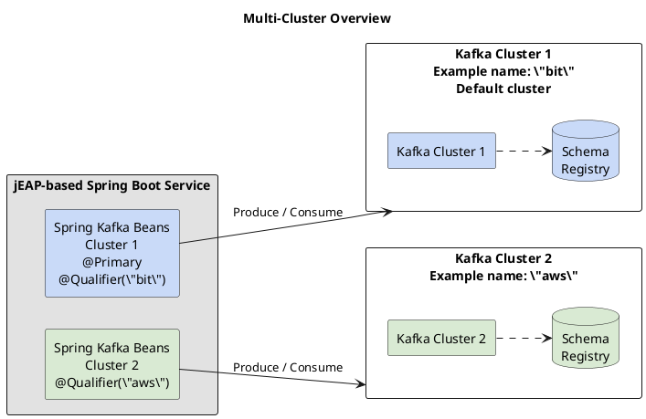
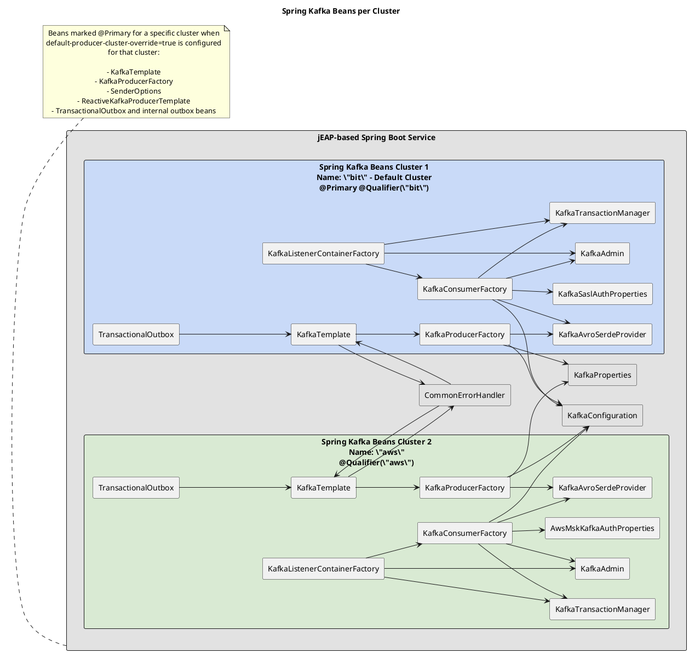

# Support for Multiple Kafka Clusters

## Introduction

jEAP Messaging supports connecting to more than one Kafka cluster since version 6. This feature is primarily
intended to support hybrid cloud use cases. See [jEAP Messaging Library — Configuration](index.md#configuration)
for a reference of all available configuration properties and more code examples.

Also, the jme-messaging-examples repository contains a multi-cluster example,
`jme-messaging-multicluster-service` — the module path referenced in the original documentation could not be
verified against the current [jme-messaging-example](https://github.com/jme-admin-ch/jme-messaging-example)
repository on GitHub (see migration notes in the summary).

## Example

For example, a Spring Boot service might connect to two different Kafka clusters and schema registries:



### Configuration

This shows a complete configuration example for two clusters. See
[jEAP Messaging Library — Configuration](index.md#configuration) for a reference of all available configuration
properties.

```yaml
jeap:
  messaging:
    kafka:
      error-topic-name: example-messageprocessing-failed
      system-name: example
      cluster:
        # Cluster configuration 1
        bit:
          bootstrap-servers: "https://example-kafka:1234"
          schema-registry-url: "https://example-registry:1234"
          username: example-user
          password: ${example-secret}
          security-protocol: SASL_SSL
        # Cluster configuration 2
        cloud:
          aws:
            glue:
              registry-name: example-registry-aws
              region: eu-central-2
              assume-iam-role-arn: arn:...
            msk:
              iam-auth-enbled: true
              bootstrap-servers: "https://example-kafka-aws:1234"
```

### Code

The beans for the default cluster are marked as `@Primary` beans. This means that you can inject Spring Kafka
beans (`KafkaTemplate` mainly) without any special qualifiers.

For non-default clusters, the bean names are prefixed with the cluster name, and annotated with
`@Qualifier(clusterName)`. These beans can be injected using the cluster name as a qualifier (see example).

| Use Case | Default Cluster | Other Clusters (for example, a cluster named "aws") |
| --- | --- | --- |
| Consumer | `@KafkaListener(topics=...)` | `@KafkaListener(topics=..., containerFactory = "awsKafkaListenerContainerFactory")` |
| Producer | `KafkaTemplate<AvroMessageKey, AvroMessage> defaultClusterTemplate` | `@Qualifier("aws") KafkaTemplate<AvroMessageKey, AvroMessage> awsClusterTemplate` |

The jme-messaging-example application contains an example of a Spring Boot service that injects Spring Kafka beans
and defines Spring Kafka listeners that produce/consume from different clusters (see the
`jme-messaging-multicluster-service` module in
[jme-messaging-example](https://github.com/jme-admin-ch/jme-messaging-example) — see the note above on this
module path).

#### Caveat When Using Lombok

Be careful when using Lombok to generate constructors (`@AllArgsConstructor`, `@RequiredArgsConstructor`) for
Spring beans. Lombok does by default not copy annotations from fields to generated constructors.

This means that `@Qualifier` annotations on fields will not be taken into account, leading to the Kafka template
for the default cluster being injected regardless of qualifier annotations on the field.

There are two options to deal with that:

1. Avoid Lombok, at least in this case.
2. Configure Lombok to copy the annotation to the generated constructor (see `lombok.copyableAnnotations` in
   [https://projectlombok.org/features/constructor](https://projectlombok.org/features/constructor)).

## Spring Kafka Bean Autoconfiguration in jeap-messaging

When the dependency jeap-messaging-infrastructure is on the classpath, it will activate the Spring autoconfiguration
support for jEAP Messaging.

1. The autoconfiguration class [KafkaConfiguration](https://github.com/jeap-admin-ch/jeap-messaging/blob/main/jeap-messaging-infrastructure-kafka/src/main/java/ch/admin/bit/jeap/messaging/kafka/KafkaConfiguration.java)
   in jeap-messaging will activate the import bean registrar
   [JeapKafkaBeanRegistrar](https://github.com/jeap-admin-ch/jeap-messaging/blob/main/jeap-messaging-infrastructure-kafka/src/main/java/ch/admin/bit/jeap/messaging/kafka/bean/JeapKafkaBeanRegistrar.java).
2. [JeapKafkaBeanRegistrar](https://github.com/jeap-admin-ch/jeap-messaging/blob/main/jeap-messaging-infrastructure-kafka/src/main/java/ch/admin/bit/jeap/messaging/kafka/bean/JeapKafkaBeanRegistrar.java)
   iterates over each cluster configured under `jeap.messaging.kafka.cluster.<clustername>`.
3. If a cluster is marked with `default-cluster=true`, this will be the default cluster. Otherwise, the first
   cluster in the YAML configuration will be the designated default cluster.
4. For each configured cluster, beans will be registered:
   1. Default cluster: bean names will not be prefixed (for example, `kafkaTemplate`). The registered beans will
      be marked as `@Primary`. Spring will prefer primary beans at injection points without a qualifier.
      - The following beans are marked `@Primary` for a cluster other than the default cluster if
        `default-producer-cluster-override=true` (supported from jEAP Messaging 7.10.0) is set for a specific
        cluster:
        1. `KafkaTemplate`
        2. `KafkaProducerFactory`
        3. `SenderOptions`
        4. `ReactiveKafkaProducerTemplate`
        5. `TransactionalOutbox` (+ internal outbox beans)
   2. Other clusters: bean names will be prefixed with the cluster name (for example, `awsKafkaTemplate`). The
      registered beans will be marked as `@Qualifier("clusterName")`. Spring will inject these beans at injection
      points when a matching qualifier is annotated (see "Code" above).

This graph shows the most relevant Spring beans that are relevant for cluster-specific producers and consumers:



## See also

- [jEAP Messaging Library](index.md) — the parent topic, including the full configuration reference.
- [Signing Messages and Checking Signatures Without jEAP](signing-messages-and-checking-signatures-without-jeap.md)
