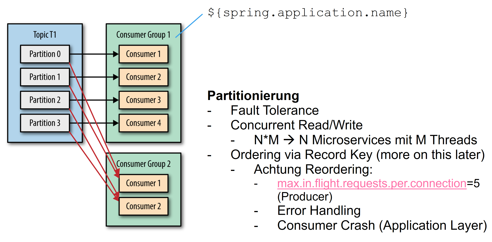

# Kafka Consumer, Producer & Topic Configuration

## Overview

Kafka is a distributed system suitable for use cases ranging from data streaming to messaging.
Accordingly, the extensive configuration of the Kafka broker, client and topic must be adapted to the
specific use case and cluster size. The jeap-messaging library sets some configuration values that are
optimized for

- **Messaging** over Kafka, with a focus on transmitting events/commands
  - I.e. the jeap-messaging defaults are not optimized for data streams, since that is not the use case
    covered by jeap-messaging
- **Durability** is weighted more heavily than latency/throughput
- **At-least-once** semantics are used to ensure that every message is processed at least once
  - Offset commit/acknowledge in the consumer only happens after successful processing or hand-off to error
    handling
  - The consumer must implement the Idempotent Consumer pattern (i.e. duplicate delivery of a message due to
    issues, re-submission from error handling, ... must not lead to duplicate processing)
- Guaranteeing the processing of events/commands even when it takes a bit longer, e.g. because database
  queries take longer under increased load
- Implementing clients **for Kafka clusters with 3+ nodes**

## jEAP / Kafka messaging defaults

The following configuration values are central to tuning the producer/consumer. **Bold** = deviation of
jeap-messaging from the Kafka client default value.

| Producer / Topic / Consumer | Parameter | jeap-messaging default | Kafka default | Reason | Description |
| --- | --- | --- | --- | --- | --- |
| **Producer** | [`acks`](https://kafka.apache.org/documentation/#producerconfigs_acks) | **all** | 1 | With the default (1), only the write to a single broker node is guaranteed. If a node fails, these writes can be lost, so for a durability-optimized setup it makes sense to wait for the write to be acknowledged by all in-sync replicas. `acks=all` means that for a write to be considered successful from the producer's perspective, at least `min.insync.replicas` replicas must be available and in sync. | The number of acknowledgments the producer requires the leader to have received before considering a request complete. This controls the durability of records that are sent. `acks=all`: this means the leader will wait for the full set of in-sync replicas to acknowledge the record. This guarantees that the record will not be lost as long as at least one in-sync replica remains alive. This is the strongest available guarantee, equivalent to `acks=-1`. |
| **Broker / Topic** | [`min.insync.replicas`](https://kafka.apache.org/documentation/#topicconfigs_min.insync.replicas) | **2** (recommended, check the broker default — otherwise it must be configured on the topic itself) | 1\* | See `acks`. \* = the default value can also be set on the broker and thus deviate from the Kafka default. | When a producer sets `acks` to "all" (or "-1"), this configuration specifies the minimum number of replicas that must acknowledge a write for the write to be considered successful. If this minimum cannot be met, the producer raises an exception (either `NotEnoughReplicas` or `NotEnoughReplicasAfterAppend`). When used together, `min.insync.replicas` and `acks` allow you to enforce greater durability guarantees. A typical scenario would be to create a topic with a replication factor of 3, set `min.insync.replicas` to 2, and produce with `acks` of "all". This ensures that the producer raises an exception if a majority of replicas do not receive a write. |
| **Broker / Topic** | [`message.max.bytes`](https://kafka.apache.org/documentation/#brokerconfigs_message.max.bytes) / [`max.message.bytes`](https://kafka.apache.org/documentation/#topicconfigs_max.message.bytes) | 1048588 | 1048588 | ~1MB. Kafka is not optimized for large record sizes. Messaging should primarily carry references to larger payloads (e.g. retrievable via S3 or HTTP). | The largest record batch size allowed by Kafka (after compression if compression is enabled). If this is increased and there are consumers older than 0.10.2, the consumers' fetch size must also be increased so that they can fetch record batches this large. This can be set per topic with the topic-level `max.message.bytes` config. |
| **Topic** | Replicas | **3** (recommended, must be configured on the topic itself) | - | 1 leader, 2 followers, tolerating the failure of one node with `min.insync.replicas=2`. A balance between current production clusters with typically 3 nodes, guaranteed replication to at least 2 nodes, and the possibility that a node fails or is briefly removed from the cluster for maintenance. | Replication factor defines the number of copies of the partition that need to be kept. See also `acks` (Producer) and `min.insync.replicas` (Topics). This value includes the leader, i.e. 1 = the partition is kept on a single node. |
| **Topic** | Partitions | Depends on the desired scaling, must be configured on the topic itself. Example: 3 for a single-instance consumer, 10 for a multi-instance consumer. | - | Kafka topics are partitioned and replicated across brokers throughout their lifetime. These partitions enable parallelization of topics, meaning data for a topic can be distributed across multiple brokers. A partition is always assigned to exactly one consumer per consumer group; with multiple partitions, multiple consumers can read a topic in parallel. However, no more partitions than necessary should be used, since increasing the number of partitions also increases the number of open server files and leads to increased replication latency. An unnecessarily high number of partitions per broker/cluster leads to performance problems in the cluster. | Number of partitions on the topic. The number of partitions limits consumer concurrency: n >= consumer count (consumer count = number of consumers in a consumer group, either on different nodes or on a single node using multiple threads). Tuning: [link](https://docs.cloudera.com/runtime/7.2.9/kafka-performance-tuning/topics/kafka-tune-sizing-partition-number.html) |
| **Consumer** | [`group.id`](https://kafka.apache.org/documentation/#consumerconfigs_group.id) | **`${spring.application.name}`** | - | Individual microservices are typically scaled 1..n times and together form a consumer group, distributing a topic's partitions across the microservices. | A unique string that identifies the consumer group this consumer belongs to. This property is required if the consumer uses either the group management functionality via `subscribe(topic)` or the Kafka-based offset management strategy. |
| **Consumer** | [`auto.offset.reset`](https://kafka.apache.org/documentation/#consumerconfigs_auto.offset.reset) | latest | latest | **Check what makes sense for the specific case!** *latest* means the consumer only reads new records (similar to publish/subscribe). *earliest* means all records still present on the topic (subject to the retention policy) are read. *none* → an offset must already exist, otherwise an exception is thrown. | What to do when there is no initial offset in Kafka, or if the current offset no longer exists on the server (e.g. because that data has been deleted). |
| **Consumer** | [`heartbeat.interval.ms`](https://kafka.apache.org/documentation/#consumerconfigs_heartbeat.interval.ms) | 3s | 3s | | |
| **Consumer** | [`session.timeout.ms`](https://kafka.apache.org/documentation/#consumerconfigs_session.timeout.ms) | 45s | 45s | | The timeout used to detect client failures when using Kafka's group management facility. The client sends periodic heartbeats to indicate its liveness to the broker. If no heartbeats are received by the broker before this session timeout expires, the broker removes the client from the group and initiates a rebalance. Note that the value must be within the allowable range configured on the broker via `group.min.session.timeout.ms` and `group.max.session.timeout.ms`. |
| **Consumer** | [`max.poll.records`](https://kafka.apache.org/documentation/#consumerconfigs_max.poll.records) | **10** | 500 | For processing events/commands, which are typically handled transactionally, this leaves on average max. 30s (`max.poll.interval.ms` / `max.poll.records`) available by default. That should be enough even under brief high load on a database. With the client default of 500, it's only about half a second per record, which is more optimized for streaming use cases. | The maximum number of records returned in a single call to `poll()`. Note that `max.poll.records` does not impact the underlying fetching behavior — the consumer caches the records from each fetch request and returns them incrementally on each poll. |
| **Consumer** | `max.poll.interval.ms` | 5min | 5min | See `max.poll.records`. | |
| **Consumer** | [`enable.auto.commit`](https://kafka.apache.org/documentation/#consumerconfigs_enable.auto.commit) | false | false\* | A commit should only happen once a message has been successfully processed. This results in at-least-once semantics rather than at-most-once semantics. Default is *false* since spring-kafka 2.3.0. | If true, the consumer's offset is periodically committed in the background. |
| **Consumer** | [`spring.kafka.listener.ack-mode`](https://docs.spring.io/spring-kafka/reference/html/#committing-offsets) | MANUAL | BATCH | The listener must acknowledge itself once the message has been processed successfully. On failure, the jEAP error handler takes care of this once the record has been successfully sent to the Error Handling Service. | |

## Integration

The configuration settings for the Kafka client and Spring Kafka can be set in `application.yml` using the
standard Spring Kafka properties `spring.kafka.*`.

### Spring Kafka configuration

See
[https://docs.spring.io/spring-boot/docs/current/reference/html/application-properties.html#application-properties.integration.spring.kafka.bootstrap-servers](https://docs.spring.io/spring-boot/docs/current/reference/html/application-properties.html#application-properties.integration.spring.kafka.bootstrap-servers)
for a complete list of all Spring Kafka properties.

| Property | Description |
| --- | --- |
| `spring.kafka.producer.properties.*` | Additional producer-specific properties used to configure the client. |
| `spring.kafka.consumer.properties.*` | Additional consumer-specific properties used to configure the client. |
| `spring.kafka.properties.*` | Additional properties, common to producers and consumers, used to configure the client. |

## Client configuration parameters

This section lists the relevant subset of client configuration parameters for Kafka. For the complete list,
see [https://kafka.apache.org/documentation/#configuration](https://kafka.apache.org/documentation/#configuration),
or for Spring Kafka
[https://docs.spring.io/spring-boot/docs/current/reference/html/application-properties.html#application-properties.integration.spring.kafka.properties](https://docs.spring.io/spring-boot/docs/current/reference/html/application-properties.html#application-properties.integration.spring.kafka.properties).

### Common

| Parameter | Default | Valid values | Importance | Description |
| --- | --- | --- | --- | --- |
| [`reconnect.backoff.max.ms`](https://kafka.apache.org/documentation/#producerconfigs_reconnect.backoff.max.ms) | 5000\* | [0,...] | Low | The maximum amount of time in milliseconds to wait when reconnecting to a broker that has repeatedly failed to connect. If provided, the backoff per host will increase exponentially for each consecutive connection failure, up to this maximum. After calculating the backoff increase, 20% random jitter is added to avoid connection storms. (\* = 5000 when using jEAP messaging, defaults to 1000 in plain Kafka) |

### Consumer

| Parameter | Default | Valid values | Importance | Description |
| --- | --- | --- | --- | --- |
| [`group.id`](https://kafka.apache.org/documentation/#consumerconfigs_group.id) | `${spring.application.name}` | | High | A unique string that identifies the consumer group this consumer belongs to. This property is required if the consumer uses either the group management functionality via `subscribe(topic)` or the Kafka-based offset management strategy. This default value is provided by jeap-messaging. |
| [`auto.offset.reset`](https://kafka.apache.org/documentation/#consumerconfigs_auto.offset.reset) | latest | [latest, earliest, none] | Medium | What to do when there is no initial offset in Kafka, or if the current offset no longer exists on the server (e.g. because that data has been deleted): earliest: automatically reset the offset to the earliest offset; latest: automatically reset the offset to the latest offset; none: throw an exception to the consumer if no previous offset is found for the consumer's group. |
| [`max.poll.records`](https://kafka.apache.org/documentation/#consumerconfigs_max.poll.records) | 10 ([link](https://github.com/jeap-admin-ch/jeap-messaging/blob/main/jeap-messaging-infrastructure-kafka/src/main/resources/jeap-messaging-kafka-defaults.properties#L13)) | [1,...] | Medium | The maximum number of records returned in a single call to `poll()`. |
| [`max.partition.fetch.bytes`](https://kafka.apache.org/documentation/#consumerconfigs_max.partition.fetch.bytes) | 1048576 (1 mebibyte) | [0,...] | High | The maximum amount of data per partition the server will return. Records are fetched in batches by the consumer. If the first record batch in the first non-empty partition of the fetch is larger than this limit, the batch will still be returned to ensure that the consumer can make progress. The maximum record batch size accepted by the broker is defined via `message.max.bytes` (broker config) or `max.message.bytes` (topic config). See `fetch.max.bytes` for limiting the consumer request size. |
| [`fetch.max.wait.ms`](https://kafka.apache.org/documentation/#consumerconfigs_fetch.max.wait.ms) | 500 | [0,...] | Low | The maximum amount of time the server will block before answering the fetch request if there isn't sufficient data to immediately satisfy the requirement given by `fetch.min.bytes`. |
| [`fetch.min.bytes`](https://kafka.apache.org/documentation/#consumerconfigs_fetch.min.bytes) | 1 | [0,...] | High | The minimum amount of data the server should return for a fetch request. If insufficient data is available the request will wait for that much data to accumulate before answering the request. The default setting of 1 byte means that fetch requests are answered as soon as a single byte of data is available, or the fetch request times out waiting for data to arrive. Setting this higher than 1 causes the server to wait for larger amounts of data to accumulate, which can improve server throughput a bit at the cost of some additional latency. |
| [`fetch.max.bytes`](https://kafka.apache.org/documentation/#consumerconfigs_fetch.max.bytes) | 52428800 (50 mebibytes) | [0,...] | Medium | The maximum amount of data the server should return for a fetch request. Records are fetched in batches by the consumer, and if the first record batch in the first non-empty partition of the fetch is larger than this value, the record batch will still be returned to ensure that the consumer can make progress. As such, this is not an absolute maximum. The maximum record batch size accepted by the broker is defined via `message.max.bytes` (broker config) or `max.message.bytes` (topic config). Note that the consumer performs multiple fetches in parallel. |
| [`session.timeout.ms`](https://kafka.apache.org/documentation/#consumerconfigs_session.timeout.ms) | 10000 (10 seconds) | | High | The timeout used to detect client failures when using Kafka's group management facility. The client sends periodic heartbeats to indicate its liveness to the broker. If no heartbeats are received by the broker before this session timeout expires, the broker removes the client from the group and initiates a rebalance. Note that the value must be within the allowable range configured on the broker via `group.min.session.timeout.ms` and `group.max.session.timeout.ms`. |
| [`heartbeat.interval.ms`](https://kafka.apache.org/documentation/#consumerconfigs_heartbeat.interval.ms) | 3000 (3s) | | High | The expected time between heartbeats to the consumer coordinator when using Kafka's group management facilities. Heartbeats ensure that the consumer's session stays active and facilitate rebalancing when new consumers join or leave the group. The value must be set lower than `session.timeout.ms`, typically no higher than 1/3 of that value. It can be adjusted even lower to control the expected time for normal rebalances. |
| [`max.poll.interval.ms`](https://kafka.apache.org/documentation/#consumerconfigs_max.poll.interval.ms) | 300000 (5 minutes) | [1,...] | Medium | The maximum delay between invocations of `poll()` when using consumer group management. This places an upper bound on the amount of time the consumer can be idle before fetching more records. If `poll()` is not called before this timeout expires, the consumer is considered failed and the group rebalances to reassign the partitions to another member. For consumers using a non-null `group.instance.id` that reach this timeout, partitions are not immediately reassigned — instead the consumer stops sending heartbeats and partitions are reassigned after `session.timeout.ms` expires. This mirrors the behavior of a static consumer that has shut down. |
| [`enable.auto.commit`](https://kafka.apache.org/documentation/#consumerconfigs_enable.auto.commit) | false\* | | Medium | If true, the consumer's offset is periodically committed in the background. (\* = false when using jEAP Messaging due to the implemented [error handler](../error-handling/index.md), defaults to true when using plain Kafka) |
| [`auto.commit.interval.ms`](https://kafka.apache.org/documentation/#consumerconfigs_auto.commit.interval.ms) | 5000 (5 seconds) | [0,...] | Low | Not applicable when using jEAP messaging due to autocommit being disabled. The frequency in milliseconds at which the consumer offsets are auto-committed to Kafka if `enable.auto.commit` is set to `true`. |
| [`partition.assignment.strategy`](https://kafka.apache.org/documentation/#consumerconfigs_partition.assignment.strategy) | RangeAssignor | Fully qualified class name | Medium | A list of class names or class types, ordered by preference, of supported partition assignment strategies that the client will use to distribute partition ownership among consumer instances when group management is used. |
| [`isolation.level`](https://kafka.apache.org/documentation/#consumerconfigs_isolation.level) | read_uncommitted | read_committed, read_uncommitted | Medium | Only relevant when Kafka transactions are actively used. See [isolation.level](https://docs.confluent.io/platform/current/installation/configuration/consumer-configs.html#consumerconfigs_isolation.level). |
| [`reconnect.backoff.ms`](https://kafka.apache.org/documentation/#producerconfigs_reconnect.backoff.ms) | 100\* | [0,...] | Low | The base amount of time to wait before attempting to reconnect to a given host. This avoids repeatedly connecting to a host in a tight loop. This backoff applies to all connection attempts by the client to a broker. (\* = 100 when using jEAP messaging, defaults to 50 in plain Kafka) |
| [`reconnect.backoff.max.ms`](https://kafka.apache.org/documentation/#producerconfigs_reconnect.backoff.max.ms) | 5000\* | [0,...] | Low | The maximum amount of time in milliseconds to wait when reconnecting to a broker that has repeatedly failed to connect. If provided, the backoff per host will increase exponentially for each consecutive connection failure, up to this maximum. After calculating the backoff increase, 20% random jitter is added to avoid connection storms. (\* = 5000 when using jEAP messaging, defaults to 1000 in plain Kafka) |

### Producer

Reference: [https://kafka.apache.org/documentation/#producerconfigs](https://kafka.apache.org/documentation/#producerconfigs)

There are 3 levels of acknowledgements that producers can choose from, depending on their use case for
Kafka. The value of `acks` varies from application to application. For an application with high durability
needs (e.g. transaction data), `acks = all` is recommended, whereas in cases where lower latency is more
important, `acks = 0` is used (e.g. a user's location data).

> **Note:** the `acks` parameter defines the number of acknowledgements that should be waited for from the
> in-sync replicas only.

| Parameter | Default | Valid values | Importance | Description |
| --- | --- | --- | --- | --- |
| [`acks`](https://kafka.apache.org/documentation/#producerconfigs_acks) | 1 | [all, -1, 0, 1] | High | |
| [`buffer.memory`](https://kafka.apache.org/documentation/#producerconfigs_buffer.memory) | 33554432 | [0,...] | High | The total bytes of memory the producer can use to buffer records waiting to be sent to the server. If records are sent faster than they can be delivered to the server, the producer will block for `max.block.ms`, after which it will throw an exception. This setting should correspond roughly to the total memory the producer will use, but is not a hard bound since not all memory the producer uses is used for buffering. Some additional memory is used for compression (if enabled) and for maintaining in-flight requests. |
| [`compression.type`](https://kafka.apache.org/documentation/#producerconfigs_compression.type) | none | `none`, `gzip`, `snappy`, `lz4` or `zstd` | High | The compression type for all data generated by the producer. The default is none (i.e. no compression). Compression applies to full batches of data, so the efficacy of batching also impacts the compression ratio (more batching means better compression). |
| [`retries`](https://kafka.apache.org/documentation/#producerconfigs_retries) | Integer.MAX_VALUE | 0 - MAX_VALUE | High | Setting a value greater than zero causes the client to resend any record whose send fails with a **potentially transient error**. This retry is no different than if the client resent the record upon receiving the error. **Allowing retries without setting `max.in.flight.requests.per.connection` to 1 can potentially change the ordering of records**, because if two batches are sent to a single partition and the first fails and is retried but the second succeeds, the records in the second batch may appear first. Note also that produce requests fail before the number of retries is exhausted if the timeout configured by `delivery.timeout.ms` expires first. Users should generally prefer to leave this config unset and instead use `delivery.timeout.ms` to control retry behavior. |
| [`batch.size`](https://kafka.apache.org/documentation/#producerconfigs_batch.size) | 16384 | [0,...] | Medium | The producer attempts to batch records together into fewer requests whenever multiple records are sent to the same partition. This helps performance on both the client and the server. This configuration controls the default batch size in bytes. No attempt is made to batch records larger than this size. Requests sent to brokers contain multiple batches, one for each partition with data available to be sent. A small batch size makes batching less common and may reduce throughput (a batch size of zero disables batching entirely). A very large batch size may use memory a bit more wastefully, since a buffer of the specified batch size is always allocated in anticipation of additional records. |
| [`delivery.timeout.ms`](https://kafka.apache.org/documentation/#producerconfigs_delivery.timeout.ms) | 120000 (2 minutes) | [0,...] | Medium | An upper bound on the time to report success or failure after a call to `send()` returns. This limits the total time a record will be delayed prior to sending, the time to await acknowledgement from the broker (if expected), and the time allowed for retriable send failures. The producer may report failure earlier than this config if an unrecoverable error is encountered, retries are exhausted, or the record is added to a batch that reached an earlier delivery expiration deadline. This value should be greater than or equal to the sum of `request.timeout.ms` and `linger.ms`. |
| [`enable.idempotence`](https://kafka.apache.org/documentation/#producerconfigs_enable.idempotence) | false | | Low | When set to 'true', the producer ensures that exactly one copy of each message is written in the stream. If 'false', producer retries due to broker failures etc. may write duplicates of the retried message in the stream. Enabling idempotence requires `max.in.flight.requests.per.connection` to be less than or equal to 5, `retries` to be greater than 0, and `acks` must be 'all'. If these values are not explicitly set by the user, suitable values are chosen; if incompatible values are set, a `ConfigException` is thrown. |
| [`max.in.flight.requests.per.connection`](https://kafka.apache.org/documentation/#producerconfigs_max.in.flight.requests.per.connection) | 5 | [1,...] | Low | The maximum number of unacknowledged requests the client will send on a single connection before blocking. Note that if this setting is greater than 1 and there are failed sends, there is a risk of message re-ordering due to retries (if retries are enabled). |
| [`metadata.max.age.ms`](https://kafka.apache.org/documentation/#producerconfigs_metadata.max.age.ms) | 300000 (5 minutes) | [0,...] | Low | The period of time in milliseconds after which a refresh of metadata is forced, even if no partition leadership changes have been seen, to proactively discover new brokers or partitions. |
| [`metadata.max.idle.ms`](https://kafka.apache.org/documentation/#producerconfigs_metadata.max.idle.ms) | 300000 (5 minutes) | [0,...] | Low | Controls how long the producer caches metadata for a topic that's idle. If the elapsed time since a topic was last produced to exceeds the metadata idle duration, the topic's metadata is forgotten and the next access forces a metadata fetch request. |
| [`max.block.ms`](https://kafka.apache.org/documentation/#producerconfigs_max.block.ms) | 60000 (1 minute) | [0,...] | Medium | Controls how long `KafkaProducer`'s `send()`, `partitionsFor()`, `initTransactions()`, `sendOffsetsToTransaction()`, `commitTransaction()` and `abortTransaction()` methods will block. For `send()`, this timeout bounds the total time waiting for both metadata fetch and buffer allocation (blocking in user-supplied serializers or partitioner is not counted). For `partitionsFor()`, this timeout bounds the time spent waiting for metadata if it is unavailable. The transaction-related methods always block, but may time out if the transaction coordinator could not be discovered or did not respond within the timeout. |
| [`max.in.flight.requests.per.connection`](https://kafka.apache.org/documentation/#producerconfigs_max.in.flight.requests.per.connection) | 5 | [1,...] | Low | The maximum number of unacknowledged requests the client will send on a single connection before blocking. **Note that if this setting is greater than 1 and there are failed sends, there is a risk of message re-ordering due to retries (if retries are enabled).** |

## Topic

Reference: [https://kafka.apache.org/documentation/#topicconfigs](https://kafka.apache.org/documentation/#topicconfigs)

| Parameter | Default | Valid values | Importance | Description |
| --- | --- | --- | --- | --- |
| Partitions | - | [1,...] | High | Number of partitions on the topic. The number of partitions limits consumer concurrency: n >= consumer count (consumer count = number of consumers in a consumer group, either on different nodes or on a single node using multiple threads). |
| Replicas | - | [1,...] | High | Replication factor defines the number of copies of the partition that need to be kept. See also `acks` (Producer) and `min.insync.replicas` (Topics). This value includes the leader, i.e. 1 = the partition is kept on a single node. |
| [`min.insync.replicas`](https://kafka.apache.org/documentation/#topicconfigs_min.insync.replicas) | 1 | [1,...] | Medium | When a producer sets `acks` to "all" (or "-1"), this configuration specifies the minimum number of replicas that must acknowledge a write for the write to be considered successful. If this minimum cannot be met, the producer raises an exception (either `NotEnoughReplicas` or `NotEnoughReplicasAfterAppend`). When used together, `min.insync.replicas` and `acks` allow you to enforce greater durability guarantees. A typical scenario would be to create a topic with a replication factor of 3, set `min.insync.replicas` to 2, and produce with `acks` of "all". This ensures that the producer raises an exception if a majority of replicas do not receive a write. **This value includes the leader**, i.e. 1 in-sync replica means the write has been acknowledged by a single node (the leader). |
| [`retention.ms`](https://kafka.apache.org/documentation/#topicconfigs_retention.ms) | 604800000 (7 days) | [-1,...] | High | This configuration controls the maximum time a log is retained before old log segments are discarded to free up space, if using the "delete" retention policy. This represents an SLA on how soon consumers must read their data. If set to -1, no time limit is applied. |
| [`retention.bytes`](https://kafka.apache.org/documentation/#topicconfigs_retention.bytes) | -1 | | High | This configuration controls the maximum size a partition (consisting of log segments) can grow to before old log segments are discarded to free up space, if using the "delete" retention policy. By default there is no size limit, only a time limit. Since this limit is enforced at the partition level, multiply it by the number of partitions to compute the topic retention in bytes. |
| [`compression.type`](https://kafka.apache.org/documentation/#topicconfigs_compression.type) | producer | [uncompressed, zstd, lz4, snappy, gzip, producer] | Medium | Specifies the final compression type for a given topic. This configuration accepts the standard compression codecs ('gzip', 'snappy', 'lz4', 'zstd'). It additionally accepts 'uncompressed', equivalent to no compression, and 'producer', which means retaining the original compression codec set by the producer. |

## Background information

For details, see *Further reading* below.

### Topic replication

A Kafka topic is distributed across multiple nodes in the cluster for scaling and fault tolerance. Each
partition of the topic is replicated n times (n = number of replicas configured on the topic):

- **Leader:** for each partition, one replica is elected leader. The leader is responsible for reading and
  writing on the partition.
- All other replicas are the **followers** of the partition.
- Together, all replicas that hold current data for the partition make up the set of **in-sync replicas**.

### Consumer groups

A Kafka topic's partitions are distributed among the consumers in a consumer group. At most as many
consumers can read concurrently as there are partitions. It doesn't matter whether these are individual
microservices or multiple Spring Kafka consumer threads.

### Rebalancing

Rebalancing happens when

- A consumer joins the consumer group
- A consumer leaves the consumer group (which can also happen due to a session timeout / missed heartbeat or
  polling timeout)
- The topic metadata changes (e.g. the number of partitions is increased)

| Pros | Cons |
| --- | --- |
| Resilient to failures | Pauses consumption |
| Scales automatically | Stateful consumer apps must rebuild state |

### Ordering

Kafka fundamentally guarantees the order of records within a partition. With the default partitioning, the
distribution is based on the hash of the record key, if set.

However, consumers should not rely too heavily on ordering, because:

- Error handling re-submits a record to a topic after failed processing
- If [`max.in.flight.requests.per.connection`](https://kafka.apache.org/documentation/#producerconfigs_max.in.flight.requests.per.connection)
  > 1 on the producer (default = 5), re-ordering can occur on transmission failures of individual records
  (e.g. on a retry)
- Errors at the application layer, e.g. a database being unavailable, can trigger redelivery
  - → the Idempotent Consumer pattern is important!

### Message size

The default setting for [https://kafka.apache.org/documentation/#brokerconfigs_message.max.bytes](https://kafka.apache.org/documentation/#brokerconfigs_message.max.bytes)
(the max. record size accepted by the broker) is ~1MB by default. jeap-messaging is not designed for
exchanging large messages. For large payloads, a reference to an object retrievable via S3/HTTP/... should be
sent instead.

## Further reading

- Kafka configuration reference: [https://kafka.apache.org/documentation/#configuration](https://kafka.apache.org/documentation/#configuration)
- Spring Kafka properties: [https://docs.spring.io/spring-boot/docs/current/reference/html/application-properties.html#application-properties.integration.spring.kafka.properties](https://docs.spring.io/spring-boot/docs/current/reference/html/application-properties.html#application-properties.integration.spring.kafka.properties)
- [https://strimzi.io/blog/2021/01/07/consumer-tuning/](https://strimzi.io/blog/2021/01/07/consumer-tuning/)
- [https://docs.cloudera.com/runtime/7.2.9/kafka-performance-tuning/topics/kafka-tune-sizing-partition-number.html](https://docs.cloudera.com/runtime/7.2.9/kafka-performance-tuning/topics/kafka-tune-sizing-partition-number.html)
- [https://kafka-tutorials.confluent.io/](https://kafka-tutorials.confluent.io/)
- [https://www.confluent.io/blog/exactly-once-semantics-are-possible-heres-how-apache-kafka-does-it/](https://www.confluent.io/blog/exactly-once-semantics-are-possible-heres-how-apache-kafka-does-it/)
- How do Kafka client heartbeats work?
  - [https://cwiki.apache.org/confluence/display/KAFKA/KIP-62%3A+Allow+consumer+to+send+heartbeats+from+a+background+thread](https://cwiki.apache.org/confluence/display/KAFKA/KIP-62%3A+Allow+consumer+to+send+heartbeats+from+a+background+thread)
  - [https://issues.apache.org/jira/browse/KAFKA-3888](https://issues.apache.org/jira/browse/KAFKA-3888)
  - [https://chrzaszcz.dev/2019/06/kafka-heartbeat-thread/](https://chrzaszcz.dev/2019/06/kafka-heartbeat-thread/)
- Replication
  - [https://www.confluent.io/blog/hands-free-kafka-replication-a-lesson-in-operational-simplicity/](https://www.confluent.io/blog/hands-free-kafka-replication-a-lesson-in-operational-simplicity/)
  - [https://medium.com/@_amanarora/replication-in-kafka-58b39e91b64e](https://medium.com/@_amanarora/replication-in-kafka-58b39e91b64e)
