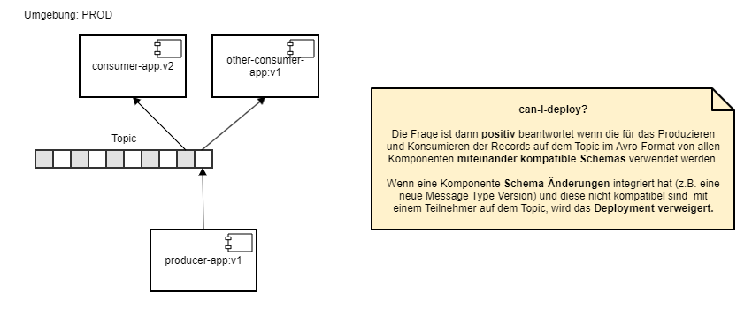
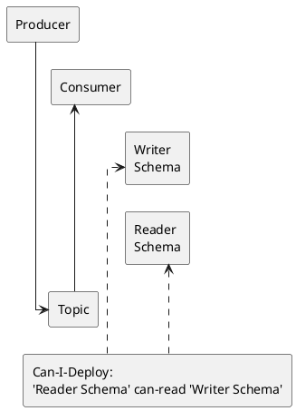
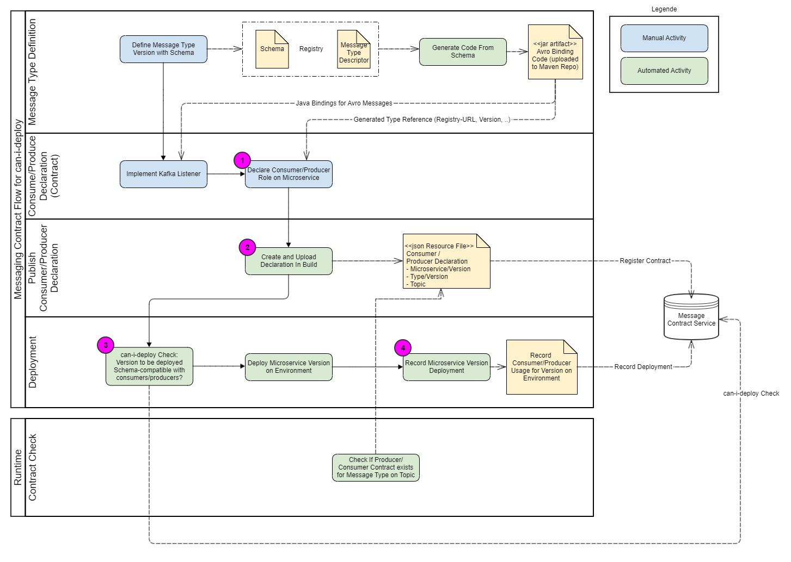

# Can-I-Deploy for Messaging

By Can-I-Deploy we mean the automatic **check of the prerequisites for a deployment to an environment**. This prevents a component from being deployed that is not compatible with the components already installed on that environment. This page describes what Can-I-Deploy means for messaging specifically — i.e. the schema-compatibility check of a message schema against an environment.

## What does Can-I-Deploy mean for messages?

Can-I-Deploy means, for messaging:

- Reader schema *"can-read"* writer schema
    - The **consumer (reader schema)** can **read the Avro record written** by the **producer (writer schema)**
    - This means the producer either uses the same schema, or one that is compatible with the reader schema — e.g. that all mandatory fields in the reader schema are also written by the writer.
    - Details: see [Evolution of Messages](../evolution-of-messages/index.md) (how it works)

The prerequisites for this are:

- The Message Contract is known (consumer / producer / type version / topic — see [Message Contracts](index.md))
    - **Consumer and producer can be matched via the topic**
    - **The producer's and consumer's schemas are known**

## How does the can-I-deploy check work?

### Schematic flow of declaring/checking Message Contracts and can-I-deploy checks

To perform a can-I-deploy check for a message consumer/producer (jEAP microservice):

1. The [Message Contracts](index.md) of the microservice version must be declared
2. The Message Contracts must be uploaded to the [Message Contract Service](message-contract-service.md) during the build
3. A can-I-deploy check (schema compatibility check) must be performed via the [Message Contract Service](message-contract-service.md) before the deployment
4. The deployment of the microservice version must be recorded on the [Message Contract Service](message-contract-service.md) by the deployment pipeline

## See also

- [Message Contracts](index.md) — what a Message Contract declares and how it is created.
- [Message Contract Service](message-contract-service.md) — where Message Contracts and deployments are recorded, and can-I-deploy checks are performed.
- [Evolution of Messages](../evolution-of-messages/index.md) — how Avro schema compatibility/evolution works.
