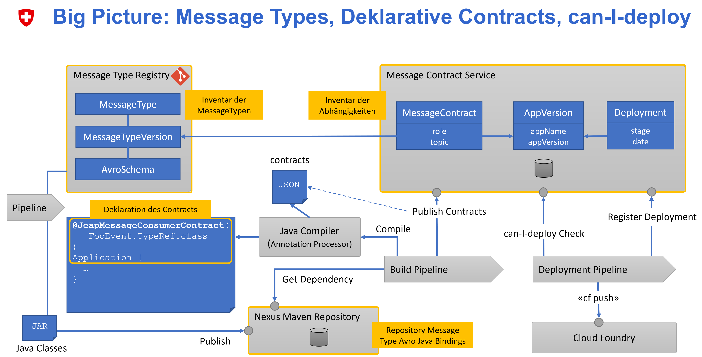
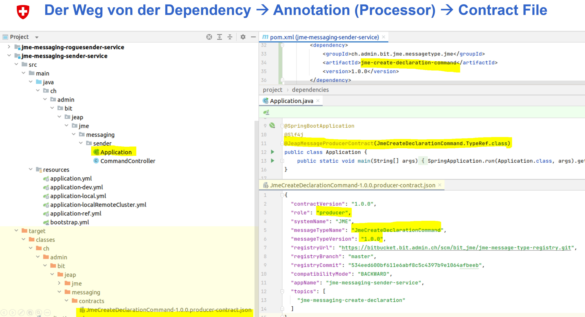
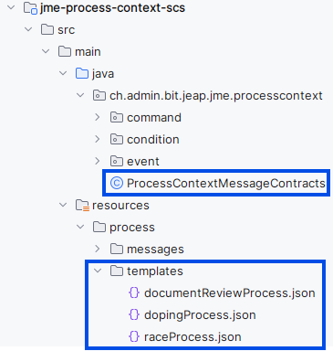
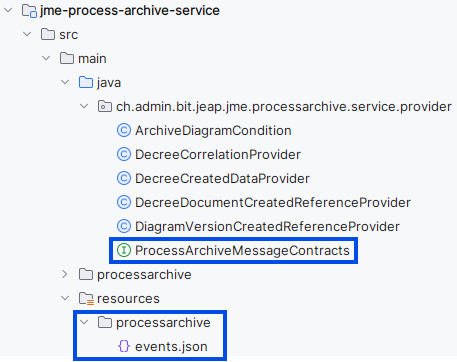

# Message Contracts

**Message Contracts** describe the contract that a microservice fulfills regarding **consuming/producing a message**. A Message Contract essentially **contains**:

- The name of the microservice (Java: the Spring Boot application name)
- The name of the message type and the version in which it is used
    - Which Avro schema is defined for that version follows from the [Message Type Registry](../message-type-registry/index.md)
- The topic on which the message is exchanged

Message Contracts serve three **goals**:

1. **Documenting the usage** of message types by producers and consumers
2. **Documenting the dependencies** between producers and consumers
3. **Validating the schema compatibility** of a consumer/producer with its counterpart on an environment before a deployment (the **"can-I-deploy" check**)

Message Contracts are **declared** using **annotations** in the microservice that uses them, and are **uploaded** to a [Message Contract Service](message-contract-service.md) during the build.

At **runtime**, a **Kafka client interceptor** validates, when a message type is consumed or produced, whether the microservice has declared a contract for it. If not, the consume/produce operation is not permitted.



*(Slide from an internal presentation on Message Contracts and can-I-deploy; some labels are in German.)*

## Declaring Message Contracts

Since the Message Contract must be statically defined for the can-I-deploy check, and cannot be determined afterwards, e.g. from metrics, the Message Contract must be declared explicitly.

This happens in the consuming/producing microservice as an annotation in the code. An annotation processor generates a contract file as JSON from this, which is then uploaded during the build (see also [Can-I-Deploy for Messaging](can-i-deploy-for-messaging.md)).

### Message Contract Annotations

Four annotations are available for declaring Message Contracts:

- `@JeapMessageConsumerContract`
- `@JeapMessageProducerContract`
- `@JeapMessageConsumerContracts`
- `@JeapMessageProducerContracts`

These annotations are part of `jeap-messaging` and can be imported from there via the `jeap-messaging-contract-annotations` module. This dependency is not explicitly required, since it is brought in as part of the generated Message Type JAR dependency.

The annotations can be placed anywhere **in the microservice**, e.g. on the Spring Boot application class, or in a module that encapsulates the Kafka integration. The microservice's name is automatically determined from the `spring.application.name` property in the `.yaml`/`.properties` files.

The annotation must reference the generated `TypeRef` inner class of the message type, e.g. `JmeCreateDeclarationCommand.TypeRef`. How the Java classes for message types are imported is described under [Usage of Message Types in Java](../jeap-messaging-library/index.md).

```java
import ch.admin.bit.jeap.messaging.annotations.JeapMessageProducerContract;
import ch.admin.bit.jeap.messaging.annotations.JeapMessageProducerContracts;
import ch.admin.bit.jeap.messaging.annotations.JeapMessageConsumerContract;
import ch.admin.bit.jeap.messaging.annotations.JeapMessageConsumerContracts;
import ch.admin.bit.jme.messagetype.createdeclarationcommand.JmeCreateDeclarationCommand;
import ch.admin.bit.jme.messagetype.declarationcreatedevent.JmeDeclarationCreatedEvent;

@JeapMessageProducerContract(JmeCreateDeclarationCommand.TypeRef.class)
@JeapMessageProducerContracts({
  JmeCreateDeclarationCommand.TypeRef.class,
  JmeDeclarationCreatedEvent.TypeRef.class
})
@JeapMessageConsumerContract(
  value = JmeCreateDeclarationCommand.TypeRef.class,
  // If the default topic for the message type is not used (e.g. for shared events), the topic can be specified explicitly.
  // This is only possible on the two *Contract annotations. Multiple topics can also be declared as an array.
  topic = {"my-topic", "my-topic-2"}
)
@JeapMessageConsumerContracts({
  JmeCreateDeclarationCommand.TypeRef.class,
  JmeDeclarationCreatedEvent.TypeRef.class,
  // All four annotations can additionally define a custom app name.
  // Normally the name is derived from the Spring Boot app name in the .yaml/.properties files.
  appName = "my-custom-app-name"
})
@SpringBootApplication
public class Application {
    public static void main(String[] args) {
        SpringApplication.run(Application.class, args).getEnvironment();
    }
}
```

An automated migration is available for migrating the contract declarations from the Message Type Registry to annotation-based contracts.

The [JME Messaging Example](https://github.com/jme-admin-ch/jme-messaging-example) also shows the use of Message Contracts.

### Message Contract Annotation Processor

The Message Contract Annotation Processor from the module [jeap-messaging-contract-annotation-processor](https://github.com/jeap-admin-ch/jeap-messaging/tree/main/jeap-messaging-contract-annotation-processor) processes the annotations at build time as a plugin in the Java compiler, and generates a contract file in JSON format from them. This is automatically uploaded to the Message Contract Service by the jEAP Microservice Build Pipeline (see also [Can-I-Deploy for Messaging](can-i-deploy-for-messaging.md)).



### Configuration of the Annotation Processor

Usually, the dependency on `jeap-messaging-contract-annotations` is enough to activate the annotation processor in the build.

However, if annotation processors are explicitly defined in the `pom.xml`, all required annotation processors must be configured there, since this disables the automatic detection mechanism.

> **Warning:** this explicit configuration is only needed in the special case where `annotationProcessorPaths` are configured explicitly in a project.

```xml
<plugin>
    <groupId>org.apache.maven.plugins</groupId>
    <artifactId>maven-compiler-plugin</artifactId>
    <configuration>
        <!-- remaining configuration -->
        <annotationProcessorPaths>
            <!-- ... other annotation processors ... -->
            <!-- This is how the jEAP Messaging Annotation Processor is explicitly activated: -->
            <path>
                <groupId>ch.admin.bit.jeap</groupId>
                <artifactId>jeap-messaging-contract-annotations</artifactId>
                <version>${jeap-messaging.version}</version>
            </path>
        </annotationProcessorPaths>
    </configuration>
</plugin>
```

## Declaring Consumer Message Contracts in the PCS and PAS

For simplified use of Consumer Message Contracts in the Process Context Service (PCS) and Process Archive Service (PAS), explicit declaration of individual Message Contracts can be avoided.

> It is strongly recommended to use the method described below, as it helps detect and avoid message-schema incompatibilities between the producer and the PAS/PCS early.

### Message Contract Template Annotation

Consumed messages can be created automatically via the `@JeapMessageConsumerContractsByTemplates` annotation. This way, message-schema incompatibilities between the producer and the PAS/PCS can be detected and avoided early. An annotation processor obtains the information from the Avro-generated message classes and the template JSON files, and generates the contract files as JSON, which are then uploaded during the build.

The annotation is part of `jeap-messaging` and can be imported via the `jeap-messaging-contract-annotations` module. This dependency is not explicitly required, since it is brought in as part of the generated Message Type JAR dependency.

The annotation must be placed inside the Process Context Service or Process Archive Service, since the template files are located within these microservices. The required template files are always located under `classpath:resources/processarchive` in the PAS, and under `classpath:resources/process/templates` in the PCS. The microservice's name is automatically determined from `spring.application.name` in the `.yaml`/`.properties` files, or can be set explicitly in the annotation.

### Configuration of the Annotation Processor {#template-annotation-processor-configuration}

> **Warning:** the `@JeapMessageConsumerContractsByTemplates` annotation does not work out of the box if `jeap-messaging-contract-annotations` is explicitly configured via `annotationProcessorPaths`.

In that case, not all message dependencies are found on the classpath, so no contracts are generated.

For all message dependencies to be found on the classpath, the Maven compiler plugin should be configured with `<annotationProcessorPaths combine.self="override"/>`:

```xml
<plugin>
  <groupId>org.apache.maven.plugins</groupId>
  <artifactId>maven-compiler-plugin</artifactId>
  <version>${maven-compiler-plugin.version}</version>
  <configuration>
    <annotationProcessorPaths combine.self="override"/>
  </configuration>
</plugin>
```

This configuration is only needed in the special case where `jeap-messaging-contract-annotations` is configured via `annotationProcessorPaths`. Normally, no additional configuration is required.

### Example PCS

[jme-process-context-example](https://github.com/jme-admin-ch/jme-process-context-example/tree/main/jme-process-context-scs)



**ProcessContractMessageContract**

```java
package ch.admin.bit.jeap.jme.processcontext;

import ch.admin.bit.jeap.messaging.annotations.JeapMessageConsumerContractsByTemplates;

// A custom app name can additionally be defined on the annotation.
// Normally the name is derived from the Spring Boot app name in the .yaml/.properties files.
// The topics are defined via the JSON files and do not need to be specified explicitly here.
// If no topic was declared, the default topic for the message type is used.
// Multiple topics can also be declared.
@JeapMessageConsumerContractsByTemplates(appName = "my-custom-app-name")
class ProcessContextMessageContracts {
}
```

### Example PAS

[jme-process-archive-example](https://github.com/jme-admin-ch/jme-process-archive-example/tree/main/jme-process-archive-service)



**ProcessArchiveMessageContract**

```java
package ch.admin.bit.jeap.jme.processarchive.service.provider;

import ch.admin.bit.jeap.messaging.annotations.JeapMessageConsumerContractsByTemplates;

@JeapMessageConsumerContractsByTemplates(appName = "my-custom-app-name")
interface ProcessArchiveMessageContracts {
}
```

## Message Contract Template Annotation Processor

The Message Contract Template Annotation Processor from the module [jeap-messaging-contract-annotation-processor](https://github.com/jeap-admin-ch/jeap-messaging/tree/main/jeap-messaging-contract-annotation-processor) processes the annotation at build time as a plugin in the Java compiler, and generates a contract file in JSON format from it. This is automatically uploaded to the Message Contract Service by the jEAP Microservice Build Pipeline (see also [Can-I-Deploy for Messaging](can-i-deploy-for-messaging.md)). The annotation processor looks for the generated Avro schema classes. If the class name matches the message name in the JSON, the contract is created using the specified topics and the generated `TypeRef` inner class.

> **Warning:** this explicit configuration is only needed in the special case where `annotationProcessorPaths` are configured explicitly in a project.

```xml
<plugin>
    <groupId>org.apache.maven.plugins</groupId>
    <artifactId>maven-compiler-plugin</artifactId>
    <configuration>
        <!-- remaining configuration -->
        <annotationProcessorPaths>
            <!-- ... other annotation processors ... -->
            <!-- This is how the jEAP Messaging Annotation Processor is explicitly activated: -->
            <path>
                <groupId>ch.admin.bit.jeap</groupId>
                <artifactId>jeap-messaging-contract-annotations</artifactId>
                <version>${jeap-messaging.version}</version>
            </path>
        </annotationProcessorPaths>
    </configuration>
</plugin>
```

## See also

- [Can-I-Deploy for Messaging](can-i-deploy-for-messaging.md) — the schema-compatibility check that relies on Message Contracts.
- [Message Contract Service](message-contract-service.md) — the service Message Contracts are uploaded to and validated against.
- [Message Type Registry](../message-type-registry/index.md) — where message-type Avro schemas are defined.
