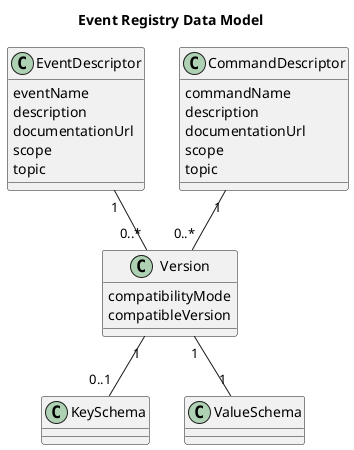

# Message Type Registry

## Overview

All message types used within a microservice landscape must be documented in a Message Type Registry. It provides
an overview of the **dependencies** between the subscribers and publishers of a message type. A dedicated Message
Type Registry should be used per **application group** within which messages are exchanged — typically this means
one registry per program. The Message Type Registry is implemented as a **Git repository** in which a
type descriptor is stored for every message type. A **validation build** ensures that the data in the registry is
internally consistent, and that existing schema versions are not changed by later modifications.

## Structure of the Registry

The type descriptors are organized hierarchically per **publishing system** under the `/descriptor` folder, with the
Avro schemas located right next to their descriptor. If a message can be published by several business
applications, the folder should be named `_shared` and the name prefix `Shared` should be used.

As an example, here is the
[jme-message-type-registry](https://github.com/jme-admin-ch/jme-message-type-registry):

```bash
jme-message-type-registry/
├── schema/
    ├── CommandDescriptor.schema.json               # JSON schema for commands, can be referenced in the IDE for code completion & validation
    └── EventDescriptor.schema.json                 # JSON schema for events, can be referenced in the IDE for code completion & validation
└── descriptor/
    ├── _common                                     # Common data structures
    └── <systemname, lowercase>/
        ├── _common                                 # Common data structures per system
        ├── command                                 # Commands of the system (same structure below as for events)
        └── event                                   # Events of the system
            └── <eventname, lowercase>/
		        ├── <eventtype>.json                # Event descriptor
    		    ├── <eventtype>_<version>.avdl      # Value schema per event version
    		    └── <eventtype>_key_<version>.avdl  # (Optional: key schema per event version)
```

Example for a system named JME with an event type `JmeDeclarationCreatedEvent`:

```bash
jme-message-type-registry/
└── descriptor/
    └── jme/                                         # Directory per system
        └── event/                                   # Events
            └── jmedeclarationcreatedevent/          # Directory per event type
                ├── JmeDeclarationCreatedEvent.json  # Event descriptor
                ├── <eventtype>_<version>.avdl       # Value schema per event version
                └── <eventtype>_key_<version>.avdl   # (Optional: key schema per event version)
```

Under `/schema` you can find the JSON schema for the descriptors, which can be used in an IDE to validate the syntax
of a descriptor
([source](https://github.com/jme-admin-ch/jme-message-type-registry/blob/main/schema/EventDescriptor.schema.json),
branch `master`):

```json
{
  "$schema": "http://json-schema.org/draft-07/schema#",
  "title": "Event Descriptor",
  "description": "JSON schema for event descriptors",
  "$ref": "#/definitions/EventDescriptor",
  "definitions": {
    "EventDescriptor": {
      "type": "object",
      "properties": {
        "eventName": {
          "type": "string",
          "minLength": 10
        },
        "definingSystem": {
          "type": "string",
          "minLength": 2
        },
        "publishingSystem": {
          "type": "string",
          "minLength": 2,
          "$comment": "deprecated - use definingSystem"
        },
        "description": {
          "type": "string"
        },
        "documentationUrl": {
          "$ref": "common.schema.json#/definitions/url"
        },
        "scope": {
          "type": "string",
          "enum": [
            "public",
            "internal"
          ]
        },
        "topic": {
          "type": "string"
        },
        "topics": {
          "minItems": 1,
          "type": "array",
          "items": {
            "type": "string"
          }
        },
        "versions": {
          "$ref": "common.schema.json#/definitions/Versions"
        }
      },
      "required": [
        "eventName",
        "description",
        "scope"
      ],
      "anyOf": [
        {
          "required": [
            "publishingSystem"
          ]
        },
        {
          "required": [
            "definingSystem"
          ]
        }
      ],
      "additionalProperties": false
    }
  }
}
```

## Data Model




A type descriptor must be created in the Message Type Registry for every message type used. It is a JSON file with
the following fields:

| Attribute | Content | Mandatory | Details |
| --- | --- | --- | --- |
| `name` | Name of the type | Y | Name according to [Naming Conventions](../../naming-conventions.md#message-types) |
| `topic` | Topic | N | Name according to [Kafka – Topic names](../kafka/index.md#topic-names) |
| `scope` | public / internal | Y | Public (across system boundaries) or system-internal message (internal) |
| `versions` | Versions of the type with Avro schemas | Y | The versions must correspond to the versions of the [Domain Event](../message-types) or command. See also [Evolution of Messages](../evolution-of-messages/index.md). |
| `compatibilityMode` | Compatibility mode (BACKWARD, FORWARD, FULL, NONE) | Y | Avro schema compatibility with the previous version, or with `compatibleVersion` if specified. See also [Evolution of Messages](../evolution-of-messages/index.md). |
| `compatibleVersion` | Version with which the Avro schema is compatible as specified (e.g. "1.2.3") | N | Default: the preceding version according to Semantic Versioning. |

## Topic

The topic can be defined at the top level of the message type descriptor — in that case, the message is exchanged
via exactly one topic.

## Common Data

Besides the type-specific value and key schemas, messages can also use shared data. This is useful, for example,
when several messages use the same key or a shared reference. For this, schemas can be placed under
`/descriptor/<system>/_common`, or, if the data should be available not just for one system but for all systems,
under `/descriptor/_common`. These can then either be used directly in the type descriptor, or integrated into
existing schemas via an import. The following conventions must be observed:

- Every record must be defined in its own file; records may reference each other via imports. The file name must
  match the record's name — including its namespace — plus the appropriate file extension.
- If a protocol must be specified (e.g. for an IDL schema), the protocol's name must match the record's name with
  the suffix `Protocol`.
- A record that has been checked into master must not be changed or deleted afterwards, since it could be used in an
  existing message. A record must also not simply get a new version under the same name in a different file, as
  this would cause conflicts in the Java namespace. Instead, a new record with a new name (e.g. including a version
  in the name) can be created.
- Common data records for the whole program must not be defined by individual systems, but must be requested from
  the registry's administrator.

**Example:** The record `BeanReferenceMessageKey` in the namespace `ch.admin.bit.jme.declaration` is defined in the
file `ch.admin.bit.jme.declaration.BeanReferenceMessageKey.avdl`. The protocol in that file is named
`BeanReferenceMessageKeyProtocol`. This record can now be used in event schemas via imports, or as a direct
reference in the event descriptor.

**Example:** The file `ch.admin.bit.jme.declaration.BeanReferenceMessageKey.avdl` from the example above must not be
deleted or changed anymore. If the bean reference changes, a new common data structure with a new name must be
created. The best approach is to use a version suffix in the name, e.g. `BeanReferenceMessageV2Key`. This structure
can then be used in new versions of an event.

If re-use is desired in the Avro schemas (e.g. a data structure is used in several message types and should not be
defined multiple times in Avro), the Message Type Registry's common data functionality must be used. **Caution:**
common data structures can make evolution more difficult, since existing common data types must not be changed.
This should therefore only be used if the data changes rarely or never. When in doubt, only Java interfaces — and no
re-use in the Avro schemas — should be used.

## Maintenance Process

To add a new type, or a new version of an existing type, the type descriptor must be changed. To do this, the Git
repository must be checked out, the changes committed to a new branch, and a pull request opened against master.
Once the verification pipeline has run successfully, the pull request may be merged to master independently. The
verification pipeline can also be run locally with `mvn verify`. Similar to a database migration, migrating to a
new version requires a [migration strategy (Avro schema evolution)](../evolution-of-messages/index.md).

## Compatibility Mode

Compatibility modes are central to a coordinated and safe [evolution of messages](../evolution-of-messages/index.md).

The Message Type Registry automatically verifies that message type versions comply with their declared
compatibility mode relative to the previous version — i.e. the schema of a new message type version that declares,
for example, *BACKWARD* compatibility, must actually be *backward-compatible* with the schema of the preceding
version. This lets developers be notified by the Message Type Registry already when defining a new schema version,
if the new schema does not match its intended (declared) compatibility mode.

The compatibility modes declared on the message type versions also make it possible to determine, at deploy time,
whether a microservice about to be deployed is compatible with the microservices already deployed in the target
environment ([can-I-deploy](../message-contracts/can-i-deploy-for-messaging.md)).

Compatibility modes can also be stored in the Kafka Schema Registry, e.g. for topics or message types, and enforced
by it. This functionality is not used by jEAP, since jEAP's compatibility check happens at [deploy time](../message-contracts/can-i-deploy-for-messaging.md), already before the
schemas are registered in the Kafka Schema Registry. Therefore, the compatibility modes declared on the message type
versions in the Message Type Registry do not need to be stored and checked in the Kafka Schema Registry as well.

## Example

The Message Type Registry for the jEAP examples can be found at
[https://github.com/jme-admin-ch/jme-message-type-registry](https://github.com/jme-admin-ch/jme-message-type-registry).
An example of a valid event is
[JmeDeclarationCreatedEvent](https://github.com/jme-admin-ch/jme-message-type-registry/blob/main/descriptor/jme/event/jmedeclarationcreatedevent/JmeDeclarationCreatedEvent.json).
An example of a valid command is
[JmeCreateDeclarationCommand](https://github.com/jme-admin-ch/jme-message-type-registry/blob/main/descriptor/jme/command/jmecreatedeclarationcommand/JmeCreateDeclarationCommand.json).

```json
{
  "eventName": "JmeDeclarationCreatedEvent",
  "publishingSystem": "JME",
  "description": "Customs declaration created event",
  "topic": "jme-messaging-declaration-created",
  "scope": "internal",
  "versions": [
    {
      "version": "1.1.0",
      "valueSchema": "JmeDeclarationCreatedEvent_v1.avdl",
      "keySchema": "JmeDeclarationCreatedEvent_key_v1.avdl"
    },
    {
      "version": "1.2.0",
      "valueSchema": "JmeDeclarationCreatedEvent_v2.avdl",
      "keySchema": "JmeDeclarationCreatedEvent_key_v2.avdl"
    },
    {
      "version": "1.3.0",
      "valueSchema": "JmeDeclarationCreatedEvent_v3.avdl",
      "keySchema": "ch.admin.bit.jme.declaration.BeanReferenceMessageKey.avdl"
    },
    {
      "version": "1.4.0",
      "valueSchema": "JmeDeclarationCreatedEvent_v4.avdl",
      "keySchema": "ch.admin.bit.jme.declaration.BeanReferenceMessageKey.avdl"
    },
    {
      "version": "1.4.1",
      "valueSchema": "JmeDeclarationCreatedEvent_v1.4.1.avdl",
      "keySchema": "ch.admin.bit.jme.declaration.BeanReferenceMessageKey.avdl",
      "compatibilityMode": "FORWARD"
    },
    {
      "version": "1.5.0",
      "valueSchema": "JmeDeclarationCreatedEvent_v5.avdl",
      "keySchema": "ch.admin.bit.jme.declaration.BeanReferenceMessageKey.avdl",
      "compatibilityMode": "BACKWARD"
    }
  ]
}
```

## See also

- [Installing the Message Types of a Message Type Registry Locally](installing-message-types-locally.md)
- [Schema Management, Confluent documentation](https://docs.confluent.io/current/schema-registry/index.html)
