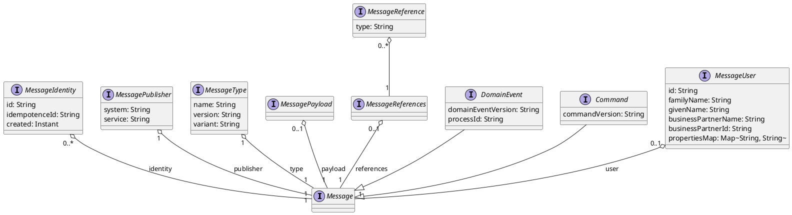

# Message Types

## Overview

All messages exchanged in the blueprint microservice must conform to a well-defined type. This
ensures that the different systems can communicate with each other without issues. Currently, two
kinds of message type are defined: events and commands. In addition to information about the
message (identifier, type) and the sending system (publisher), these contain a list of references
and an optional payload. Based on this, custom message types can be defined that, for example,
specify which references and what kind of payload must be present. These type definitions must be
collected in the [Message Type Registry](message-type-registry/index.md).



### Events

The **Domain Event** describes a base structure that all event notifications must satisfy. A
domain event always contains the following data:

| Class | Field | Description | Mandatory | Default | Scope |
| --- | --- | --- | --- | --- | --- |
| DomainEvent |  | A notification that a domain event has occurred |  |  |  |
|  | domainEventVersion | Version of the domain event structure, in [Semantic Versioning](https://semver.org/). Currently 1.1.0 | Y | 1.2.0 |  |
|  | processId | ID of a business process within which the event occurred | N | - | Business application |
| MessagePublisher |  | Component on which the event occurred. | Y |  |  |
|  | system | Name of the system (parent application) | Y | - | Global |
|  | service | Name of the service (the actual microservice) | Y | - | Global |
| MessageType |  | Type of the event. Must correspond to an event type in the [Message Type Registry](message-type-registry/index.md). | Y |  |  |
|  | name | Name of the type | Y | Message name (unqualified) | Global |
|  | version | Version of the type, in [Semantic Versioning](https://semver.org/) | Y | Version of the schema (if obtained from the Message Type Registry) |  |
|  | variant | Variant of the type. The variant can be set by business applications to distinguish events with the same type from a business perspective. | N | - |  |
| DomainEventIdentity |  | Identity of the event |  |  |  |
|  | eventId (alias for id) | Unique ID of the event notification | Y | Random (UUID) | Global |
|  | idempotenceId | If the same event is published multiple times (at-least-once delivery), this ID must always have the same value. See Guidelines and examples for implementing idempotent behavior (TODO Link) | Y | - | Event type |
|  | created | Point in time at which the domain event occurred. Transmitted as a Unix timestamp in milliseconds, in UTC. | Y | Current timestamp |  |
| MessageUser |  | User who caused the event | N |  |  |
|  | id | ID of the user | N |  |  |
|  | familyName | Last name of the user | N |  |  |
|  | givenName | First name of the user | N |  |  |
|  | businessPartnerName | Name of the business partner on whose behalf the user is acting | N |  |  |
|  | businessPartnerId | ID of the business partner on whose behalf the user is acting | N |  |  |
|  | propertiesMap | Arbitrary additional user information as key-value pairs, as `Map<String, String>` | N |  |  |
| MessageReferences |  | A set of references to arbitrary business objects. Each event type must define its own `DomainEventReferences` type, which may contain arbitrary fields of `DomainEventReference` types. References may also be optional, and arrays of reference types are likewise allowed. | N |  |  |
| MessageReference |  | Reference to a business object. Each reference defines a set of identifiers that uniquely define a business object (possible identifiers would be, for example, `personId`, `mrn`, `zsrNr`, ...). The identifiers may also be optional. In addition to the identifiers, the reference object must define which kind of business object the reference points to (see the example below). For this, a field named `type` of type `string` must be defined, containing the business name of the business object type. | N |  |  |
| MessagePayload |  | Additional payload (optional, see below) | N |  |  |

The **Default** column refers to the behavior of the `AvroDomainEventBuilder`, which should be
used as the base class for custom event builders. The **Scope** column describes the scope within
which values/IDs must be at least unique.

### Command Object

The **Command Object** describes a base structure that all commands must satisfy. It is similar
to the `DomainEvent` but contains slightly different types and fields.

| Class | Field | Description | Mandatory | Default | Scope |
| --- | --- | --- | --- | --- | --- |
| Command |  | A notification that a command should be executed |  |  |  |
|  | commandVersion | Version of the command structure, in [Semantic Versioning](https://semver.org/). Currently 1.1.0 | Y | 1.2.0 |  |
|  | processId | ID of a business process within which the command occurred | N | - | Business application |
| MessagePublisher |  | Component that sent the command | Y |  |  |
|  | system | Name of the system (parent application) | Y | - | Global |
|  | service | Name of the service (the actual microservice) | Y | - | Global |
| MessageType |  | Type of the message. Must correspond to a type in the [Message Type Registry](message-type-registry/index.md). | Y |  |  |
|  | name | Name of the type | Y | Message name (unqualified) | Global |
|  | version | Version of the type, in [Semantic Versioning](https://semver.org/) | Y | Version of the schema (if obtained from the Message Type Registry) |  |
|  | variant | Variant of the type. The variant can be set by business applications to distinguish commands with the same type from a business perspective. | N | - |  |
| MessageIdentity |  | Identity of the message |  |  |  |
|  | id | Unique ID of the message | Y | Random (UUID) | Global |
|  | idempotenceId | If the same message is published multiple times (at-least-once delivery), this ID must always have the same value. See Guidelines and examples for implementing idempotent behavior (TODO Link) | Y | - | Message type |
|  | created | Point in time at which the message was published. Transmitted as a Unix timestamp in milliseconds, in UTC. | Y | Current timestamp |  |
| MessageUser |  | User who triggered the command | N |  |  |
|  | id | ID of the user | N |  |  |
|  | familyName | Last name of the user | N |  |  |
|  | givenName | First name of the user | N |  |  |
|  | businessPartnerName | Name of the business partner on whose behalf the user is acting | N |  |  |
|  | businessPartnerId | ID of the business partner on whose behalf the user is acting | N |  |  |
|  | propertiesMap | Arbitrary additional user information as key-value pairs, as `Map<String, String>` | N |  |  |
| MessageReferences |  | A set of references to arbitrary business objects. Each message type must define its own `MessageReferences` type, which may contain arbitrary fields of `MessageReference` types. References may also be optional, and an array of references is likewise allowed. | N |  |  |
| MessageReference |  | Reference to a business object. Each reference defines a set of identifiers that uniquely define a business object (possible identifiers would be, for example, `personId`, `mrn`, `zsrNr`, ...). The identifiers may also be optional. In addition to the identifiers, the reference object must define which kind of business object the reference points to (see the example below). For this, a field named `type` of type `string` must be defined, containing the business name of the business object type. | N |  |  |
| MessagePayload |  | Additional payload (optional, see below) | N |  |  |

The **Default** column refers to the behavior of the `AvroCommandBuilder`, which should be used as
the base class for custom command builders. The **Scope** column describes the scope within which
values/IDs must be at least unique.

### The Reference Type

Every reference must define a type. This must be the type of the business object that the
reference points to. The type must have a business meaning within the domain of the business
application. Often the type of the business object can be clearly recognized from the context of
the message, but this is not always the case, and a message must also be understandable without
context. Therefore, the following things must be distinguished:

| What | Description | Where stored | Example (see below) |
| --- | --- | --- | --- |
| Role of the reference in the message | What role the reference plays in the context of the message | Name of the field in `DomainEventReferences` | alt, neu |
| Type of the reference | What kind of reference this is | Type of the field in `DomainEventReferences` | AhvReferenz |
| Type of the business object | What kind of object the reference points to | The reference's `type` variable | NatürlichePerson |

**Example 1:** The event `VerfugungErstelltEvent` indicates that a decision (*Verfügung*) has been
created. It has a reference to the created decision, which is defined by an ID and a version. The
event is structured as follows:

```java
record VerfugungErstelltEvent {
  ...                                       //Further fields of the DomainEvent
  VerfugungErstelltReferences references;   //"reference" field is of the event-specific "References" type
}

record VerfugungErstelltReferences {         //Event-specific References type
  VerfugungReference verfugung;              //Role of the reference in the event
}

record VerfugungReference {                  //Type of the reference, here identical to the role
  string type = "Verfügung";                 //Type of the business object, fixed here since a
                                              // VerfugungReferenz always points to a "Verfügung"
  string id;                                 //Identifier, here multiple
  int version;                               //Identifier, here multiple
}
```

**Example 2:** The event `VerfugungBetroffenerGeändertEvent` indicates that the affected party
(*Betroffener*) of a decision has changed. In this context, the affected party is always a natural
person. The person is identified in the event by an AHV number (Swiss social security number),
though other identifiers would also be conceivable. The event is then structured as follows:

```java
record VerfugungBetroffenerGeändertEvent {
  ...                                                    //Further fields of the DomainEvent
  VerfugungBetroffenerGeändertReferences references;     //"reference" field is of the event-specific "References" type
}

record VerfugungBetroffenerGeändertReferences {          //Event-specific References type
  AhvReference alt;                                      //Role of the reference in the event
  AhvReference neu;                                      //Role of the reference in the event
}

record AhvReference {                                    //Type of the reference, not identical to the type of the business object
                                                          // since different kinds of references to a person are used
  string type = "Person";                                //Type of the business object, fixed here since an AhvReference always
                                                          //points to a "Person"
  string ahvNummer;                                       //Identifier, here a single identifier is enough to uniquely reference the object
}
```

**Example 3:** The event `QuittungErstelltEvent` indicates that the receipt (*Quittung*) for one
or more payment transactions has been created. A receipt is always created for a set of payment
transactions, but there are different kinds of payment transactions (depending on what needs to be
paid). A payment transaction is referenced by a unique ID, from which it is not directly apparent
what kind of transaction it is.

```java
record QuittungErstelltEvent {
  ...                                       //Further fields of the DomainEvent
  QuittungErstelltReferences references;    //"reference" field is of the event-specific "References" type
}

record QuittungErstelltReferences {          //Event-specific References type
  array<BezahlvorgangReference> bezahlvorgang;  //Role of the reference in the event
}

record BezahlvorgangReference {              //Type of the reference
  string type;                               //Type of the business object, not fixed here since different
                                              //objects are possible at runtime
  string id;                                 //Identifier, here a single identifier is enough to uniquely reference the object
}
```

### Message Payload

Whether a message contains a payload depends on which message pattern is to be implemented.

| Message Pattern | Description | Payload |
| --- | --- | --- |
| Event Notification | A system sends a message to inform other systems about a change in its domain. The sender is not interested in who needs this information or what the recipient does with it, and expects no response. The sender also does not know whether, or which, data the recipient needs. [Further information](https://martinfowler.com/articles/201701-event-driven.html#EventNotification) | The event has no payload, only references to the changed business objects |
| Event-Carried State Transfer | A system sends a message to update data in other systems without those systems needing to make an additional request to the sender. The sender is not interested in who needs this information and expects no response. The sender must include all data that the recipient could potentially need. [Further information](https://martinfowler.com/articles/201701-event-driven.html#Event-carriedStateTransfer) | The event requires a payload |
| Event-Sourcing | All information needed to reconstruct the event is part of the event itself, so that if all events are known, the state of the system can be fully rebuilt. To this end, all of the event's data must be stored in the payload. [Further information](https://martinfowler.com/articles/201701-event-driven.html#Event-sourcing) | The event requires a payload |
| Commands | Commands often require a payload that corresponds to the command's parameters. Depending on the command, however, references may be sufficient (e.g. `Delete`). | Depends on the command |

## Message Types in Avro

Messages can be serialized using Avro. To do this, a separate schema must be defined for each
message type. For domain events, the name of the defined type **must** end in `Event` and define
the following fields:

| Field | Type | Remarks |
| --- | --- | --- |
| identity | `ch.admin.bit.jeap.domainevent.avro.AvroDomainEventIdentity` | **Must** have two fields `eventId` and `idempotenceId` of type `string`, and a field `created` of type `long` |
| type | `ch.admin.bit.jeap.domainevent.avro.AvroDomainEventType` | **Must** have two fields `name` and `version` of type `string` |
| publisher | `ch.admin.bit.jeap.domainevent.avro.AvroDomainEventPublisher` | **Must** have two fields `system` and `service` of type `string` |
| references | Arbitrary, name must end in `References`. | May have arbitrary fields. The field types must end in `Reference`. All fields must in turn define a field `type` of type `string`, plus any number of additional fields (the identifier(s) of the reference). Both the references and the identifiers can also be optional, e.g. by specifying `union(null, string)` as the type. |
| payload | Arbitrary, name must end in `Payload`. | This field is optional. Avro types used within the payload Avro object must not end in `Event`, `Command`, `Reference`, `References`, or `MessageKey` (unless they actually are such types), since the Avro Maven plugin would otherwise apply the additions and validations corresponding to its naming convention, which would lead to errors. |
| domainEventVersion | String |  |
| processId | String | This field is optional |
| user | `ch.admin.bit.jeap.domainevent.avro.AvroDomainEventUser` | This field is optional |

For commands, the name of the defined type **must** end in `Command` and define the following
fields:

| Field | Type | Remarks |
| --- | --- | --- |
| identity | `ch.admin.bit.jeap.messaging.avro.AvroMessageIdentity` | **Must** have two fields `id` and `idempotenceId` of type `string`, and a field `created` of type `long` |
| type | `ch.admin.bit.jeap.v.avro.AvroMessageType` | **Must** have two fields `name` and `version` of type `string` |
| publisher | `ch.admin.bit.jeap.messaging.avro.AvroMessagePublisher` | **Must** have two fields `system` and `service` of type `string` |
| references | Arbitrary, name must end in `References`. | May have arbitrary fields. The field types must end in `Reference`. All fields must in turn define a field `type` of type `string`, plus any number of additional fields (the identifier(s) of the reference). Both the references and the identifiers can also be optional, e.g. by specifying `union(null, string)` as the type. |
| payload | Arbitrary, name must end in `Payload`. | This field is optional. Avro types used within the payload Avro object must not end in `Event`, `Command`, `Reference`, `References`, or `MessageKey` (unless they actually are such types), since the Avro Maven plugin would otherwise apply the additions and validations corresponding to its naming convention, which would lead to errors. |
| commandVersion | String |  |
| processId | String | This field is optional |
| user | `ch.admin.bit.jeap.messaging.avro.AvroMessageUser` | This field is optional |

**Example schema for an event**

```json
{
  "type": "record",
  "namespace": "ch.admin.bit.jeap.domainevent.example.schema",
  "name": "AvroSchemaTestEvent",
  "fields": [
    {
      "name": "domainEventVersion",
      "type": "string"
    },
    {
      "name": "identity",
      "type": {
        "type": "record",
        "name": "ch.admin.bit.jeap.domainevent.avro.AvroDomainEventIdentity",
        "fields": [
          {
            "name": "eventId",
            "type": "string"
          },
          {
            "name": "idempotenceId",
            "type": "string"
          },
          {
            "name": "created",
            "type": {
              "type": "long",
              "logicalType": "timestamp-millis"
            }
          }
        ]
      }
    },
    {
      "name": "type",
      "type": {
        "type": "record",
        "name": "ch.admin.bit.jeap.domainevent.avro.AvroDomainEventType",
        "fields": [
          {
            "name": "name",
            "type": "string"
          },
          {
            "name": "version",
            "type": "string"
          }
        ]
      }
    },
    {
      "name": "publisher",
      "type": {
        "type": "record",
        "name": "ch.admin.bit.jeap.domainevent.avro.AvroDomainEventPublisher",
        "fields": [
          {
            "name": "systemName",
            "type": "string"
          },
          {
            "name": "serviceName",
            "type": "string"
          }
        ]
      }
    },
    {
      "name": "references",
      "type": {
        "type": "record",
        "name": "AvroSchemaTestReferences",
        "fields": [
          {
            "name": "system",
            "type": {
              "type": "record",
              "name": "SystemReference",
              "fields": [
                {
                  "name": "type",
                  "type": "string"
                },
                {
                  "name": "id",
                  "type": "string"
                }
              ]
            }
          }
        ]
      }
    },
    {
      "name": "payload",
      "type": {
        "type": "record",
        "name": "AvroSchemaTestPayload",
        "fields": [
          {
            "name": "message",
            "type": "string"
          }
        ]
      }
    },
    {
      "name": "processId",
      "type": ["null", "string"],
      "default": null
    }
  ]
}
```

**Example event in Avro IDL**

```java
protocol IdlTestProtocol {

  @namespace("ch.admin.bit.jeap.domainevent.avro")
  record AvroDomainEventPublisher {
    string system;
    string service;
  }

  @namespace("ch.admin.bit.jeap.domainevent.avro")
  record AvroDomainEventType {
    string name;
    string version;
  }

  @namespace("ch.admin.bit.jeap.domainevent.avro")
  record AvroDomainEventIdentity {
    string eventId;
    string idempotenceId;
    timestamp_ms created;
  }

  @namespace("ch.admin.bit.jeap.domainevent.avro")
  record AvroDomainEventUser {
    string? id = null;
    string? familyName = null;
    string? givenName = null;
    string? businessPartnerName = null;
    string? businessPartnerId = null;
    map<string> propertiesMap = {};
  }

  record SystemReference {
    string type;
    string id;
  }

  record IdlTestReferences {
    SystemReference system;
  }

  record IdlTestPayload {
    string message;
  }

  record IdlTestEvent {
    ch.admin.bit.jeap.domainevent.avro.AvroDomainEventIdentity identity;
    ch.admin.bit.jeap.domainevent.avro.AvroDomainEventType type;
    ch.admin.bit.jeap.domainevent.avro.AvroDomainEventPublisher publisher;
    ch.admin.bit.jeap.domainevent.avro.AvroDomainEventUser? user = null;
    IdlTestReferences references;
    IdlTestPayload payload;
    string? processId = null;
    string domainEventVersion;
  }
}
```

### Attributes of the MessageType (Name / Version)

When using [`AvroDomainEventBuilder`](https://github.com/jeap-admin-ch/jeap-messaging/blob/main/jeap-messaging-avro/src/main/java/ch/admin/bit/jeap/domainevent/avro/AvroDomainEventBuilder.java)
/ [`AvroCommandBuilder`](https://github.com/jeap-admin-ch/jeap-messaging/blob/main/jeap-messaging-avro/src/main/java/ch/admin/bit/jeap/command/avro/AvroCommandBuilder.java)
as the base class for the message builder that builds jEAP messages at runtime, the `MessageType`
information in the jEAP message is automatically populated from the following sources:

- `MessageType.type`
  - Schema name (unqualified) of the message type (e.g. `JmeSomethingHappenedEvent`)
- `MessageType.version` (in descending priority order):
  1. Version field on the generated Avro message Java class (if the message type was generated
     from the Message Type Registry using the `jeap-messaging-avro-maven-plugin`)
  2. `getSpecifiedMessageTypeVersion()` on `AvroMessageBuilder` (default: `null`). Useful for test
     messages that were not generated from the registry using the plugin.
  3. `getCommandTypeVersion()` / `getEventTypeVersion()`: methods that, in earlier versions of
     jeap-messaging, were used to provide the message's version
- `MessageType.variant`
  - The variant can be set by business applications to distinguish commands or events with the
    same type from a business perspective. For example, an event `JmePaymentCompletedEvent` could
    have the variants `paid` and `rejected`.
  - In most cases, it is better to use two different message types rather than just a variant.
    Variants are primarily used to distinguish generic events from one another within a reaction
    chain.

> **Note:** It is always recommended to use the base classes `AvroDomainEventBuilder` /
> `AvroCommandBuilder`, and therefore an Avro message builder, when sending jEAP messages. Only
> this ensures that the information in the message is filled in automatically and correctly
> wherever possible.

### Message Keys in Avro

Kafka records are key/value pairs, where the key is optional and controls the distribution of
records across a topic's partitions. In general, it is recommended to use keys only when explicit
ordering guarantees are needed. The most even distribution across partitions is achieved when no
explicit key is set (see also [Kafka How-To](kafka/kafka-how-to.md)).

If a key is to be used, a separate Avro schema can be defined for it. The name of the Avro schema
must end in `MessageKey`.

## Example

Examples of how message types are used can also be found under
[Jeap Messaging Library](jeap-messaging-library/index.md), and a collection of existing messages
under [Message Type Registry](message-type-registry/index.md).

## Further Documentation

- [Apache Avro documentation](https://avro.apache.org/)
