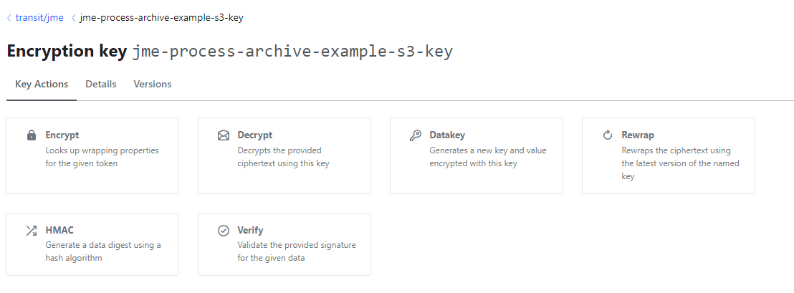

# Process Archive How-To

## Overview

This article describes the integration of a Process Archive Service instance into a business application. For documentation of the service itself, see [Process Archive Service](./index.md).

## Steps to set up a Process Archive Service

### Create a microservice instance based on the jEAP Process Archive library

The Process Archive Service is typically instantiated once per business application. Each instance generally has its own source code repository with the following content:

- Maven POM (see [jEAP Parent and Products - Current Versions](../../../jeap-version-overview.md))
  - with parent `jeap-process-archive-service-instance`

    ```xml
    <parent>
        <groupId>ch.admin.bit.jeap</groupId>
        <artifactId>jeap-process-archive-service-instance</artifactId>
        <version>use-the-latest-version-here</version>
        <relativePath/> <!-- lookup parent from repository -->
    </parent>
    ```

  - with references to
    - the Process Archive Plugin API: [`jeap-process-archive-plugin-api`](https://github.com/jeap-admin-ch/jeap-process-archive-service/tree/main/jeap-process-archive-plugin-api)
    - dependencies on **all Archive Type Version artifacts, validated by the PAS via an Avro schema**, from the Maven repository, for example:

      ```xml
      <dependency>
          <groupId>ch.admin.bit.jme.archivetype.jme</groupId>
          <artifactId>decree-document-v1</artifactId>
          <version>1</version>
      </dependency>
      ```
- Archive Type Provider class (only needed for archive data defined via Avro)
  - See [Process Archive Service](./index.md), section on Avro-defined archive data
  - Important: for a PAS instance to successfully process and validate uploaded archive data, the archive type version **must** be listed in the `ArchiveTypeProvider`!
  - Example:

    ```java
    package ch.admin.bit.jeap.jme.processarchive.service.provider;

    import ch.admin.bit.jeap.processarchive.plugin.api.archivetype.ArchiveTypeProvider;
    import ch.admin.bit.jeap.processarchive.test.decreedocument.v1.DecreeDocument;
    import ch.admin.bit.jeap.processarchive.test.diagram.v1.Diagram;
    import org.apache.avro.specific.SpecificRecordBase;
    import org.springframework.stereotype.Component;

    import java.util.List;

    @Component
    public class JmeArchiveTypeProvider implements ArchiveTypeProvider {


        @Override
        public List<Class<? extends SpecificRecordBase>> getArchiveTypeVersions() {
            return List.of(
                    ch.admin.bit.jeap.processarchive.test.decree.v1.Decree.class,
                    ch.admin.bit.jeap.processarchive.test.decree.v2.Decree.class,
                    ch.admin.bit.jeap.processarchive.test.decree.v3.Decree.class,
                    DecreeDocument.class,
                    Diagram.class);
        }
    }
    ```
- Archive type configuration for non-Avro archive types (from PAS version 11.x)
  - The PAS must know all archive types that can be archived. Avro-based archive types are registered type-safely via the `ArchiveTypeProvider` (see above). All other archive types are not automatically schema-validated and must be listed in the configuration.
  - Example:

    ```yaml
    jeap:
      processarchive:
        registry:
          types:
            - archive-type: JsonExample  # An example of an archive type not registered using an ArchiveTypeProvider, but directly via configuration.
              system: JME
              expiration-days: 2
              reference-id-type: ch.admin.bit.jeap.jme.JsonExampleReferenceId
              version: 1
    ```
- Configuration files
  - for application properties: `application-<env>.yml`
    - jEAP messaging configuration for Kafka
    - S3 storage connection configuration
    - Vault or AWS KMS connection configuration, if data must be encrypted
    - ...
  - for the events and commands that trigger archiving: `processarchive/messages.json`
  - for jEAP messaging: `avro/messages.json`
- Java code for the plugin implementations (see step 2)
- Truststore for accessing Kafka (e.g. generated using the jEAP Truststore Maven Plugin)

Initially, the example project [jme-process-archive-example](https://github.com/jme-admin-ch/jme-process-archive-example), or more specifically its module [jme-process-archive-service](https://github.com/jme-admin-ch/jme-process-archive-example/tree/main/jme-process-archive-service), can be used as a template for creating a Process Archive Service instance:

**Source:** [`jme-process-archive-service/pom.xml`](https://github.com/jme-admin-ch/jme-process-archive-example/blob/main/jme-process-archive-service/pom.xml)

```xml
<?xml version="1.0" encoding="UTF-8"?>
<project xmlns:xsi="http://www.w3.org/2001/XMLSchema-instance"
         xmlns="http://maven.apache.org/POM/4.0.0"
         xsi:schemaLocation="http://maven.apache.org/POM/4.0.0 http://maven.apache.org/xsd/maven-4.0.0.xsd">
    <modelVersion>4.0.0</modelVersion>

    <parent>
        <groupId>ch.admin.bit.jeap</groupId>
        <artifactId>jme-process-archive-example</artifactId>
        <version>1.1.0-SNAPSHOT</version>
    </parent>

    <artifactId>jme-process-archive-service</artifactId>
    <name>${project.artifactId}</name>
    <description>Example Process Archive Service (PAS) instance that archives artifacts referenced by
        consumed domain events into an encrypted, S3-compatible object store.</description>
    <packaging>jar</packaging>

    <properties>
        <main-class>ch.admin.bit.jeap.processarchive.service.ProcessArchiveApplication</main-class>
    </properties>

    <dependencies>
        <dependency>
            <groupId>ch.admin.bit.jeap.jme.messagetype.jme</groupId>
            <artifactId>jme-decree-document-created-event</artifactId>
            <version>1.0.0</version>
        </dependency>
        <dependency>
            <groupId>ch.admin.bit.jeap.jme.messagetype.jme</groupId>
            <artifactId>jme-decree-created-event</artifactId>
            <version>1.0.0</version>
        </dependency>
        <dependency>
            <groupId>ch.admin.bit.jeap.jme.messagetype.jme</groupId>
            <artifactId>jme-diagram-version-created-event</artifactId>
            <version>1.0.0</version>
        </dependency>
        <dependency>
            <groupId>ch.admin.bit.jeap.jme.messagetype.jme</groupId>
            <artifactId>jme-create-declaration-command</artifactId>
            <version>1.0.0</version>
        </dependency>
        <dependency>
            <groupId>ch.admin.bit.jeap</groupId>
            <artifactId>jeap-process-archive-plugin-api</artifactId>
            <version>${jeap-process-archive-service.version}</version>
        </dependency>
        <dependency>
            <groupId>ch.admin.bit.jeap</groupId>
            <artifactId>jeap-process-archive-web</artifactId>
            <version>${jeap-process-archive-service.version}</version>
        </dependency>
        <dependency>
            <groupId>ch.admin.bit.jeap</groupId>
            <artifactId>jeap-process-archive-adapter-opensearch</artifactId>
            <version>${jeap-process-archive-service.version}</version>
        </dependency>
        <!-- needed if backfill is activated -->
        <dependency>
            <groupId>ch.admin.bit.jeap</groupId>
            <artifactId>jeap-process-archive-adapter-db</artifactId>
            <version>${jeap-process-archive-service.version}</version>
        </dependency>
        <dependency>
            <groupId>ch.admin.bit.jeap</groupId>
            <artifactId>jeap-process-archive-service</artifactId>
            <version>${jeap-process-archive-service.version}</version>
        </dependency>
        <dependency>
            <groupId>ch.admin.bit.jeap</groupId>
            <artifactId>jeap-messaging-avro</artifactId>
        </dependency>
        <!-- BLAKE3 hashing for the HashProvider plugin implementation -->
        <dependency>
            <groupId>org.bouncycastle</groupId>
            <artifactId>bcprov-jdk18on</artifactId>
        </dependency>
        <dependency>
            <groupId>ch.admin.bit.jeap</groupId>
            <artifactId>jeap-messaging-contract-annotations</artifactId>
        </dependency>
        <dependency>
            <groupId>ch.admin.bit.jeap</groupId>
            <artifactId>jeap-spring-boot-vault-starter</artifactId>
        </dependency>
        <dependency>
            <groupId>ch.admin.bit.jeap</groupId>
            <artifactId>jeap-spring-boot-db-migration-starter</artifactId>
        </dependency>
        <dependency>
            <groupId>com.fasterxml.jackson.datatype</groupId>
            <artifactId>jackson-datatype-jsr310</artifactId>
        </dependency>
        <dependency>
            <groupId>org.postgresql</groupId>
            <artifactId>postgresql</artifactId>
            <scope>runtime</scope>
        </dependency>

        <dependency>
            <groupId>org.springframework.boot</groupId>
            <artifactId>spring-boot-starter-test</artifactId>
            <scope>test</scope>
        </dependency>
        <dependency>
            <groupId>ch.admin.bit.jeap</groupId>
            <artifactId>jme-process-archive-events</artifactId>
            <version>${project.version}</version>
            <scope>test</scope>
        </dependency>

        <dependency>
            <groupId>ch.admin.bit.jeap.jme.archivetype.jme</groupId>
            <artifactId>diagram-v1</artifactId>
            <version>1</version>
        </dependency>
        <dependency>
            <groupId>ch.admin.bit.jeap.jme.archivetype.jme</groupId>
            <artifactId>decree-v1</artifactId>
            <version>1</version>
        </dependency>
        <dependency>
            <groupId>ch.admin.bit.jeap.jme.archivetype.jme</groupId>
            <artifactId>decree-v2</artifactId>
            <version>2</version>
        </dependency>
        <dependency>
            <groupId>ch.admin.bit.jeap.jme.archivetype.jme</groupId>
            <artifactId>decree-v3</artifactId>
            <version>3</version>
        </dependency>
        <dependency>
            <groupId>ch.admin.bit.jeap.jme.archivetype.jme</groupId>
            <artifactId>decree-document-v1</artifactId>
            <version>1</version>
        </dependency>
        <dependency>
            <groupId>ch.admin.bit.jeap.jme.archivetype.jme</groupId>
            <artifactId>decree-summary-v1</artifactId>
            <version>1</version>
        </dependency>
        <dependency>
            <groupId>ch.admin.bit.jeap.jme.indextype.jme</groupId>
            <artifactId>jme-decree-document-v1</artifactId>
            <version>1.0</version>
        </dependency>
        <dependency>
            <groupId>ch.admin.bit.jeap.jme.indextype.jme</groupId>
            <artifactId>jme-decree-v1</artifactId>
            <version>1.0</version>
        </dependency>
    </dependencies>

    <build>
        <plugins>
            <plugin>
                <groupId>org.apache.maven.plugins</groupId>
                <artifactId>maven-compiler-plugin</artifactId>
            </plugin>
            <plugin>
                <groupId>org.springframework.boot</groupId>
                <artifactId>spring-boot-maven-plugin</artifactId>
                <configuration>
                    <mainClass>${main-class}</mainClass>
                </configuration>
                <executions>
                    <execution>
                        <phase>none</phase>
                    </execution>
                    <execution>
                        <id>spring-boot</id>
                        <goals>
                            <goal>build-info</goal>
                        </goals>
                    </execution>
                </executions>
            </plugin>
        </plugins>
    </build>
</project>
```

The template above shows instantiation in a multi-module project. In the case of multi-module projects, always make sure that the `jeap-spring-boot-parent` version used by the project parent matches the `jeap-spring-boot-parent` version used by the PAS dependencies. If the PAS instance being created is part of a multi-module project, `jeap-oauth-mock-server-instance` cannot be used as the Maven project parent, which means the dependencies `jeap-process-archive-service` and `jeap-process-archive-plugin-api` must additionally be pulled in, as shown in the template above.

### Configure and implement archiving

#### Create/configure an S3 bucket

See [Process Archive Service](./index.md), section on S3 object store integration.

##### Buckets and versioning

**Bucket naming:** observe the [naming convention](../../naming-conventions.md) for S3 buckets!

The bucket(s) into which the PAS is to archive data must already exist in the configured S3 object store before any data is archived. Versioning must be enabled for the bucket(s). Among other things, this ensures that archived data can never be overwritten. Enabling versioning on a bucket can take a while, so the PAS cannot automatically create buckets on the fly as needed. The following AWS CLI commands can be used to enable versioning on a bucket named `bucket-name` and then check that it was activated.

The following values are normally used for configuring the PAS's object locking, per environment:

| DEV / REF | ABN | PROD |
| --- | --- | --- |
| `jeap.processarchive.objectstorage.objectLockEnabled = false` | `jeap.processarchive.objectstorage.objectLockEnabled = true`<br/>`jeap.processarchive.objectstorage.objectLockMode = GOVERNANCE` | `jeap.processarchive.objectstorage.objectLockEnabled = true`<br/>`jeap.processarchive.objectstorage.objectLockMode = COMPLIANCE` |

The S3 bucket can then be created with the following command:

```bash
# DEV / REF
#aws --endpoint-url https://<storage-grid-url> --no-verify-ssl s3api put-bucket-versioning --bucket bucket-name --versioning-configuration Status=Enabled

# ABN / PROD
aws --endpoint-url https://<storage-grid-url> --no-verify-ssl s3api put-bucket-versioning --bucket bucket-name --versioning-configuration Status=Enabled --object-lock-enabled-for-bucket

# Optional: check versioning on a bucket
aws --endpoint-url https://<storage-grid-url> --no-verify-ssl s3api get-bucket-versioning --bucket bucket-name

# List versions:
aws --endpoint-url https://<storage-grid-url> --no-verify-ssl s3api list-object-versions --bucket bucket-name --prefix=<folder>/
```

`--endpoint-url` must not be set for S3 on AWS. The [naming requirements](https://docs.aws.amazon.com/AmazonS3/latest/userguide/bucketnamingrules.html) must also be observed.

#### Configure consumed messages and data/reference providers

All messages that should trigger archiving of artifacts must be listed in a JSON document. The Process Archive Service looks for this document in the resources under `processarchive/messages.json` (before PAS version 11 the file was called `processarchive/events.json`; this name is still supported for backward compatibility).

For each listed message, it must be declared how the archiving should take place, in particular which data/reference providers to use.

The PAS supports the multiple-cluster concept. If messages need to be read from different clusters, the cluster on which the topic exists can optionally be defined per message.

**The PAS's internal messages are always sent and received on the default cluster.**

An example of a `messages.json` file can be found in the example project [jme-process-archive-example](https://github.com/jme-admin-ch/jme-process-archive-example):

**Source:** [`jme-process-archive-service/src/main/resources/processarchive/messages.json`](https://github.com/jme-admin-ch/jme-process-archive-example/blob/main/jme-process-archive-service/src/main/resources/processarchive/messages.json)

```json
{
  "messages": [
    {
      "id": "decree-document",
      "messageName": "JmeDecreeDocumentCreatedEvent",
      "topicName": "jme-process-archive-decreedocumentcreated",
      "archiveDataReferenceProvider": "ch.admin.bit.jeap.jme.processarchive.service.provider.DecreeDocumentCreatedArchiveDataReferenceProvider",
      "uri": "${decree-document.archive.uri}",
      "featureFlag": "FEATURE_DOCUMENT_CREATED"
    },
    {
      "id": "decree",
      "messageName": "JmeDecreeCreatedEvent",
      "topicName": "jme-process-archive-decreecreated",
      "messageArchiveDataProvider": "ch.admin.bit.jeap.jme.processarchive.service.provider.DecreeCreatedDataProvider",
      "correlationProvider": "ch.admin.bit.jeap.jme.processarchive.service.provider.DecreeCorrelationProvider",
      "featureFlag": "FEATURE_DECREE_CREATED"
    },
    {
      "id": "decree-summary",
      "messageName": "JmeDecreeCreatedEvent",
      "topicName": "jme-process-archive-decreecreated",
      "messageArchiveDataProvider": "ch.admin.bit.jeap.jme.processarchive.service.provider.DecreeSummaryDataProvider",
      "correlationProvider": "ch.admin.bit.jeap.jme.processarchive.service.provider.DecreeCorrelationProvider",
      "featureFlag": "FEATURE_DECREE_SUMMARY"
    },
    {
      "messageName": "JmeDiagramVersionCreatedEvent",
      "topicName": "jme-process-archive-diagramversioncreated",
      "archiveDataReferenceProvider": "ch.admin.bit.jeap.jme.processarchive.service.provider.DiagramVersionCreatedArchiveDataReferenceProvider",
      "condition": "ch.admin.bit.jeap.jme.processarchive.service.condition.ArchiveDiagramCondition",
      "uri": "${diagram.archive.uri}",
      "featureFlag": "FEATURE_DIAGRAM_VERSION_CREATED"
    },
    {
      "messageName": "JmeCreateDeclarationCommand",
      "topicName": "jme-messaging-create-declaration",
      "messageArchiveDataProvider": "ch.admin.bit.jeap.jme.processarchive.service.provider.CreateDeclarationCommandDataProvider",
      "correlationProvider": "ch.admin.bit.jeap.jme.processarchive.service.provider.CreateDeclarationCommandReferenceProvider",
      "condition": "ch.admin.bit.jeap.jme.processarchive.service.condition.CreateDeclarationCommandArchiveCondition"
    }
  ]
}
```

#### Set up an Archive Type Registry (when using Avro as the archive format)

See [Archive Type Registry](./archive-type-registry.md):

- Set up the Git repository for the Archive Type Registry as documented in [Archive Type Registry](./archive-type-registry.md)
- Restrict branch permissions on master (modifiable only via pull request; protect against deletion and history rewriting; enforce a successful build for PR merges)
- Create the descriptor and Avro schema as described in [Archive Type Registry](./archive-type-registry.md)

Example of a registry: [jme-archive-type-registry](https://github.com/jme-admin-ch/jme-archive-type-registry)

#### Implement the data/reference providers

To archive artifacts, the Process Archive Service needs implementations of the Process Archive Plugin API interfaces `MessageDataProvider` and `ArchiveDataReferenceProvider`. These can be implemented directly as Java code in the Process Archive Service instance, or provided indirectly via additional libraries. The implementations are referenced in `messages.json` by their fully qualified class name and are instantiated by the Process Archive Service itself.

An example of an `ArchiveDataReferenceProvider` is given by [jme-process-archive-example](https://github.com/jme-admin-ch/jme-process-archive-example):

**Source:** [`jme-process-archive-service/src/main/java/ch/admin/bit/jeap/jme/processarchive/service/provider/DecreeDocumentCreatedArchiveDataReferenceProvider.java`](https://github.com/jme-admin-ch/jme-process-archive-example/blob/main/jme-process-archive-service/src/main/java/ch/admin/bit/jeap/jme/processarchive/service/provider/DecreeDocumentCreatedArchiveDataReferenceProvider.java)

```java
package ch.admin.bit.jeap.jme.processarchive.service.provider;

import ch.admin.bit.jeap.processarchive.plugin.api.archivedata.ArchiveDataReference;
import ch.admin.bit.jeap.processarchive.plugin.api.archivedata.ArchiveDataReferenceProvider;
import ch.admin.bit.jme.decree.JmeDecreeDocumentCreatedEvent;

public class DecreeDocumentCreatedArchiveDataReferenceProvider implements ArchiveDataReferenceProvider<JmeDecreeDocumentCreatedEvent> {

    @Override
    public ArchiveDataReference getReference(JmeDecreeDocumentCreatedEvent event) {
        String documentId = event.getReferences().getNewDecreeDocument().getId();
        return ArchiveDataReference.builder()
                .id(documentId)
                .build();
    }

}
```

[jme-process-archive-example](https://github.com/jme-admin-ch/jme-process-archive-example) likewise provides an example of a `MessageArchiveDataProvider`:

**Source:** [`jme-process-archive-service/src/main/java/ch/admin/bit/jeap/jme/processarchive/service/provider/DecreeCreatedDataProvider.java`](https://github.com/jme-admin-ch/jme-process-archive-example/blob/main/jme-process-archive-service/src/main/java/ch/admin/bit/jeap/jme/processarchive/service/provider/DecreeCreatedDataProvider.java)

```java
package ch.admin.bit.jeap.jme.processarchive.service.provider;

import ch.admin.bit.jeap.processarchive.plugin.api.archivedata.ArchiveData;
import ch.admin.bit.jeap.processarchive.plugin.api.archivedata.MessageArchiveDataProvider;
import ch.admin.bit.jeap.processarchive.test.DecreeReference;
import ch.admin.bit.jeap.processarchive.test.decree.v3.Decree;
import ch.admin.bit.jeap.processarchive.web.AvroBinarySerializer;
import ch.admin.bit.jme.decree.JmeDecreeCreatedEvent;
import ch.admin.bit.jme.decree.JmeDecreeCreatedEventPayload;
import lombok.SneakyThrows;

import java.io.ByteArrayOutputStream;
import java.util.UUID;

public class DecreeCreatedDataProvider implements MessageArchiveDataProvider<JmeDecreeCreatedEvent> {

    private final AvroBinarySerializer avroBinarySerializer;

    public DecreeCreatedDataProvider() {
        this.avroBinarySerializer = new AvroBinarySerializer();
    }

    @Override
    public ArchiveData getArchiveData(JmeDecreeCreatedEvent jmeDecreeCreatedEvent) {
        return ArchiveData.builder()
                .referenceId(jmeDecreeCreatedEvent.getReferences().getNewDecree().getId())
                .system("JME")
                .schema("Decree")
                .schemaVersion(3)
                .contentType("avro/binary")
                .payload(createPayload(jmeDecreeCreatedEvent.getPayload()))
                .build();
    }

    @SneakyThrows
    private byte[] createPayload(JmeDecreeCreatedEventPayload payload) {
        DecreeReference example = DecreeReference.newBuilder()
                .setId(UUID.randomUUID().toString())
                .setType("Example")
                .build();
        Decree decree = Decree.newBuilder()
                .setTitle(payload.getTitle())
                .setPayload(payload.getSomeDecreeData())
                .setCreatedAt(payload.getCreatedAt())
                .setDecreeReference(example)
                .build();

        try (ByteArrayOutputStream outputStream = new ByteArrayOutputStream()) {
            avroBinarySerializer.serialize(decree, outputStream);
            return outputStream.toByteArray();
        }
    }
}
```

#### Implement a hash provider

For every artifact archived in the object store, the Process Archive Service generates a hash and stores it in the archived artifact's metadata. The specific hashing method used is defined by the concrete implementation of the Process Archive Plugin API interface `HashProvider`. This implementation must be made available to the Process Archive Service as a Spring bean. The corresponding bean can be implemented and instantiated directly in the Process Archive Service instance, or provided indirectly via an additional library.


#### Implement an archived-data listener

The Process Archive Service shares all information about a completed archiving operation (including the coordinates of the archived artifact in the object store) with an implementation of the Process Archive Plugin API interface `ArchivedArtefactListener`. This implementation must be made available to the Process Archive Service as a Spring bean. The corresponding bean can be implemented and instantiated directly in the Process Archive Service instance, or provided indirectly via an additional library.

If a feature flag is configured for a message, the archived artifact is only registered if the feature flag is active at the time of processing.

```json
{
  "messages": [
    {
      "messageName": "JmeDecreeDocumentCreatedEvent",
      ...
      "featureFlag": "FEATURE_DOCUMENT_CREATED"
    },
    {
      "messageName": "JmeDecreeCreatedEvent",
      ...
      "featureFlag": "FEATURE_DECREE_CREATED"
    },
    {
      "messageName": "JmeDiagramVersionCreatedEvent",
      ...
      "featureFlag": "FEATURE_DIAGRAM_VERSION_CREATED"
    }
  ]
}
```

In this case, 3 feature flags must be configured so that the archived artifacts are registered:

```yaml
togglz:
  features:
    FEATURE_DOCUMENT_CREATED:
      enabled: true
    FEATURE_DECREE_CREATED:
      enabled: true
    FEATURE_DIAGRAM_VERSION_CREATED:
      enabled: true
```

See [Feature Flag in PAS](./index.md) for more information about feature flags.

#### Implement a message CorrelationProvider

The process ID (e.g. a natural business ID or a UUID) is read by default from the message's `processId` attribute. Alternatively, a `CorrelationProvider` can be specified in the message declaration.

Example of a definition in the `processarchive/events.json` file:

```json
{
  "messages": [
    {
      "messageName": "message-name",
      ...
      "correlationProvider": "ch.admin.bit.jeap.jme.processarchive.service.provider.DecreeCorrelationProvider"
    }
  ]
}
```

Example of an implementation of `MessageCorrelationProvider.java`:

```java
package ch.admin.bit.jeap.jme.processarchive.service.provider;

import ch.admin.bit.jeap.processarchive.plugin.api.archivedata.MessageCorrelationProvider;

public class CorrelationProvider implements MessageCorrelationProvider<MyEvent> {

    @Override
    public String getOriginProcessId(MyEvent event) {
        return event.getPayload().getOtherProcessId();
    }
}
```

#### Configure OpenSearch

For the archived artifacts to also be stored in OpenSearch, the REST API must be enabled and a mapping must be configured for each type.

##### Enable the REST API

To enable the REST API, this Maven dependency must be defined in the instance's pom.xml:

```xml
<dependency>
    <groupId>ch.admin.bit.jeap</groupId>
    <artifactId>jeap-process-archive-adapter-opensearch</artifactId>
</dependency>
```

An OAuth client for the Index Writer service with the required role (`"<system>_@searchitem_#read"`) must be defined so that this service is allowed to call the API.

##### Define the mapping

For the archived artifacts to be converted into SearchItems, a mapping per type must be defined in the file `./processarchive/indextypes.json`. Example:

**Source:** [`jme-process-archive-service/src/main/resources/processarchive/indextypes.json`](https://github.com/jme-admin-ch/jme-process-archive-example/blob/main/jme-process-archive-service/src/main/resources/processarchive/indextypes.json)

```json
{
  "indexTypes": [
    {
      "indexType": "JmeDecree",
      "archiveType": "ch.admin.bit.jeap.processarchive.test.decree.v3.Decree",
      "archiveTypeToSearchItemConverter": "ch.admin.bit.jeap.jme.processarchive.service.indextype.DecreeConverter"
    },
    {
      "indexType": "JmeDecreeDocument",
      "archiveType": "ch.admin.bit.jeap.processarchive.test.decreedocument.v1.DecreeDocument",
      "archiveTypeToSearchItemConverter": "ch.admin.bit.jeap.jme.processarchive.service.indextype.DecreeDocumentConverter"
    }
  ]
}
```

A converter that maps the data must be written for each artifact. Example:

**Source:** [`jme-process-archive-service/src/main/java/ch/admin/bit/jeap/jme/processarchive/service/indextype/DecreeConverter.java`](https://github.com/jme-admin-ch/jme-process-archive-example/blob/main/jme-process-archive-service/src/main/java/ch/admin/bit/jeap/jme/processarchive/service/indextype/DecreeConverter.java)

```java
package ch.admin.bit.jeap.jme.processarchive.service.indextype;

import ch.admin.bit.jeap.opensearch.indextype.Origin;
import ch.admin.bit.jeap.opensearch.indextype.SearchItem;
import ch.admin.bit.jeap.opensearch.searchitem.model.SearchItemContainer;
import ch.admin.bit.jeap.processarchive.plugin.api.indextype.ArchiveTypeToSearchItemConverter;
import ch.admin.bit.jeap.processarchive.test.decree.v3.Decree;
import ch.admin.bit.jme.opensearch.index.jme.decree.JmeDecreeDataV1;
import ch.admin.bit.jme.opensearch.index.jme.decree.JmeDecreeIndexTypeV1;
import lombok.extern.slf4j.Slf4j;

import java.time.Instant;
import java.util.Map;

@Slf4j
public class DecreeConverter implements ArchiveTypeToSearchItemConverter<Decree> {

    @Override
    public SearchItemContainer convert(Decree archivePayload, String archiveId, String version, Map<String, String> metadata) {

        JmeDecreeDataV1 decreeDataV1 = new JmeDecreeDataV1(
                archivePayload.getTitle(),
                archivePayload.getPayload(),
                new JmeDecreeDataV1.DecreeReference(archivePayload.getDecreeReference().getType(), archivePayload.getDecreeReference().getId()),
                archivePayload.getCreatedAt());

        Origin searchItemOrigin = createOrigin(metadata.get("reference-id"), version, archiveId);
        SearchItem<JmeDecreeDataV1> searchItem = new SearchItem<>(searchItemOrigin, decreeDataV1);
        return new SearchItemContainer(JmeDecreeIndexTypeV1.INSTANCE.majorVersion(), JmeDecreeIndexTypeV1.INSTANCE.minorVersion(), searchItem);
    }

    private static Origin createOrigin(String id, String version, String reference) {
        return new Origin(id, version, null, null, Instant.now(), null, Map.of("url", reference));
    }

}
```

For the corresponding Java classes to be imported, the type must also be imported:

```xml
<dependency>
    <groupId>ch.admin.bit.jme.indextype.jme</groupId>
    <artifactId>jme-decree-document-v1</artifactId>
    <version>1.0</version>
</dependency>
```

#### Configure or implement the object storage strategy

The Process Archive Service uses an implementation of the Process Archive Plugin API interface `ObjectStorageStrategy` to determine the bucket and key for an artifact to be archived in the object store. If the Process Archive Service instance does not provide its own implementation of this interface as a Spring bean, the Process Archive Service's default implementation is used. This must be configured as described in the [documentation](./index.md).

#### Configure the encryption key in Vault

The keys required for encryption must be defined in Vault (only applies if archived data is to be encrypted). These are then referenced in the archive descriptor.

Example archive descriptor (from PAS version 6.10.0):

```json
{
  "archiveType": "Decree",
  ...
  "encryptionKey" : {
    "keyId": "my-key" // Name of key in the  jEAP Cypto configuration of the PAS, which will then point to a key in a Key Management System (Vault)
  },
  ...
}
```

`keyId` is the ID of the key in the jEAP Crypto configuration. The key is used to store data on S3 in encrypted form. If no key is defined, no encryption takes place.

Example archive descriptor (legacy, Vault only):

```json
{
  "archiveType": "Decree",
  ...
  "encryption" : {
    "secretEnginePath": "transit/jme",
    "keyName": "jme-process-archive-example-s3-key"
  },
  ...
}
```

Generating the key in Vault:

```bash
vault write -f transit/jme/keys/jme-process-archive-example-s3-key
```

This is what the configured key looks like in Vault:



See complete examples:

- [https://github.com/jme-admin-ch/jme-process-archive-example](https://github.com/jme-admin-ch/jme-process-archive-example)
- [https://github.com/jme-admin-ch/jme-crypto-example](https://github.com/jme-admin-ch/jme-crypto-example)

#### Configure the encryption key in AWS KMS

The keys required for encryption must be defined in AWS KMS (only applies if archived data is to be encrypted). These are then referenced in the archive descriptor.

```json
{
  "archiveType": "Decree",
  ...
  "encryptionKey" : {
    "keyId": "my-key" // Name of key in the  jEAP Cypto configuration of the PAS, which will then point to a key in a Key Management System (AWS KMS)
  },
  ...
}
```

`keyId` is the ID of the key in the jEAP Crypto configuration. The key is used to store data on S3 in encrypted form. If no key is defined, no encryption takes place.

For the complete configuration, see [Process Archive Service](./index.md), section on Encryption Key Definition (from PAS version 6.10.0).

#### Receiving encrypted Kafka records with jeap-messaging

The PAS can also receive Kafka records encrypted with jeap-messaging / jeap-crypto. See jEAP Crypto (TODO Link), section on Integration, for the configuration and required dependencies (`jeap-vault-starter` and `jeap-crypto-vault-starter`).

The Kafka record carries a reference to the wrapping key used from Vault. Usually, only the Vault URL (`jeap.vault.system-name`) and the system name need to be configured.

#### Configure Prometheus metrics

For the metrics to be accessible, the password for the endpoint must be configured.

```yaml
jeap:
  monitor:
    prometheus:
      password: "..."
```

### Configure jEAP Messaging

For the Process Archive Service instance to be able to receive messages, a valid contract must exist for the message. A contract annotation must therefore be present locally in the PAS instance's code, which automatically generates the contracts from the PAS configuration:

In the case of [jme-process-archive-example](https://github.com/jme-admin-ch/jme-process-archive-example), these configurations are made in the following files:

**Source:** [`jme-process-archive-service/src/main/java/ch/admin/bit/jeap/jme/processarchive/service/ProcessArchiveMessageContracts.java`](https://github.com/jme-admin-ch/jme-process-archive-example/blob/main/jme-process-archive-service/src/main/java/ch/admin/bit/jeap/jme/processarchive/service/ProcessArchiveMessageContracts.java)

```java
package ch.admin.bit.jeap.jme.processarchive.service;

import ch.admin.bit.jeap.event.shared.processarchive.archivedartifactversioncreated.SharedArchivedArtifactVersionCreatedEvent;
import ch.admin.bit.jeap.messaging.annotations.JeapMessageConsumerContract;
import ch.admin.bit.jeap.messaging.annotations.JeapMessageConsumerContractsByTemplates;
import ch.admin.bit.jeap.messaging.annotations.JeapMessageProducerContract;
import ch.admin.bit.jeap.processarchive.command.CreateArtifactCommand;

@JeapMessageProducerContract(value = SharedArchivedArtifactVersionCreatedEvent.TypeRef.class, topic = "jme-process-archive-artifactversioncreated")
@JeapMessageProducerContract(value = CreateArtifactCommand.TypeRef.class, topic = "jme-process-archive-createartifact")
@JeapMessageConsumerContract(value = CreateArtifactCommand.TypeRef.class, topic = "jme-process-archive-createartifact")
@JeapMessageConsumerContractsByTemplates
interface ProcessArchiveMessageContracts {
}
```

**Source:** [`jme-process-archive-service/pom.xml`](https://github.com/jme-admin-ch/jme-process-archive-example/blob/main/jme-process-archive-service/pom.xml)

```xml
<?xml version="1.0" encoding="UTF-8"?>
<project xmlns:xsi="http://www.w3.org/2001/XMLSchema-instance"
         xmlns="http://maven.apache.org/POM/4.0.0"
         xsi:schemaLocation="http://maven.apache.org/POM/4.0.0 http://maven.apache.org/xsd/maven-4.0.0.xsd">
    <modelVersion>4.0.0</modelVersion>

    <parent>
        <groupId>ch.admin.bit.jeap</groupId>
        <artifactId>jme-process-archive-example</artifactId>
        <version>1.1.0-SNAPSHOT</version>
    </parent>

    <artifactId>jme-process-archive-service</artifactId>
    <name>${project.artifactId}</name>
    <description>Example Process Archive Service (PAS) instance that archives artifacts referenced by
        consumed domain events into an encrypted, S3-compatible object store.</description>
    <packaging>jar</packaging>

    <properties>
        <main-class>ch.admin.bit.jeap.processarchive.service.ProcessArchiveApplication</main-class>
    </properties>

    <dependencies>
        <dependency>
            <groupId>ch.admin.bit.jeap.jme.messagetype.jme</groupId>
            <artifactId>jme-decree-document-created-event</artifactId>
            <version>1.0.0</version>
        </dependency>
        <dependency>
            <groupId>ch.admin.bit.jeap.jme.messagetype.jme</groupId>
            <artifactId>jme-decree-created-event</artifactId>
            <version>1.0.0</version>
        </dependency>
        <dependency>
            <groupId>ch.admin.bit.jeap.jme.messagetype.jme</groupId>
            <artifactId>jme-diagram-version-created-event</artifactId>
            <version>1.0.0</version>
        </dependency>
        <dependency>
            <groupId>ch.admin.bit.jeap.jme.messagetype.jme</groupId>
            <artifactId>jme-create-declaration-command</artifactId>
            <version>1.0.0</version>
        </dependency>
        <dependency>
            <groupId>ch.admin.bit.jeap</groupId>
            <artifactId>jeap-process-archive-plugin-api</artifactId>
            <version>${jeap-process-archive-service.version}</version>
        </dependency>
        <dependency>
            <groupId>ch.admin.bit.jeap</groupId>
            <artifactId>jeap-process-archive-web</artifactId>
            <version>${jeap-process-archive-service.version}</version>
        </dependency>
        <dependency>
            <groupId>ch.admin.bit.jeap</groupId>
            <artifactId>jeap-process-archive-adapter-opensearch</artifactId>
            <version>${jeap-process-archive-service.version}</version>
        </dependency>
        <!-- needed if backfill is activated -->
        <dependency>
            <groupId>ch.admin.bit.jeap</groupId>
            <artifactId>jeap-process-archive-adapter-db</artifactId>
            <version>${jeap-process-archive-service.version}</version>
        </dependency>
        <dependency>
            <groupId>ch.admin.bit.jeap</groupId>
            <artifactId>jeap-process-archive-service</artifactId>
            <version>${jeap-process-archive-service.version}</version>
        </dependency>
        <dependency>
            <groupId>ch.admin.bit.jeap</groupId>
            <artifactId>jeap-messaging-avro</artifactId>
        </dependency>
        <!-- BLAKE3 hashing for the HashProvider plugin implementation -->
        <dependency>
            <groupId>org.bouncycastle</groupId>
            <artifactId>bcprov-jdk18on</artifactId>
        </dependency>
        <dependency>
            <groupId>ch.admin.bit.jeap</groupId>
            <artifactId>jeap-messaging-contract-annotations</artifactId>
        </dependency>
        <dependency>
            <groupId>ch.admin.bit.jeap</groupId>
            <artifactId>jeap-spring-boot-vault-starter</artifactId>
        </dependency>
        <dependency>
            <groupId>ch.admin.bit.jeap</groupId>
            <artifactId>jeap-spring-boot-db-migration-starter</artifactId>
        </dependency>
        <dependency>
            <groupId>com.fasterxml.jackson.datatype</groupId>
            <artifactId>jackson-datatype-jsr310</artifactId>
        </dependency>
        <dependency>
            <groupId>org.postgresql</groupId>
            <artifactId>postgresql</artifactId>
            <scope>runtime</scope>
        </dependency>

        <dependency>
            <groupId>org.springframework.boot</groupId>
            <artifactId>spring-boot-starter-test</artifactId>
            <scope>test</scope>
        </dependency>
        <dependency>
            <groupId>ch.admin.bit.jeap</groupId>
            <artifactId>jme-process-archive-events</artifactId>
            <version>${project.version}</version>
            <scope>test</scope>
        </dependency>

        <dependency>
            <groupId>ch.admin.bit.jeap.jme.archivetype.jme</groupId>
            <artifactId>diagram-v1</artifactId>
            <version>1</version>
        </dependency>
        <dependency>
            <groupId>ch.admin.bit.jeap.jme.archivetype.jme</groupId>
            <artifactId>decree-v1</artifactId>
            <version>1</version>
        </dependency>
        <dependency>
            <groupId>ch.admin.bit.jeap.jme.archivetype.jme</groupId>
            <artifactId>decree-v2</artifactId>
            <version>2</version>
        </dependency>
        <dependency>
            <groupId>ch.admin.bit.jeap.jme.archivetype.jme</groupId>
            <artifactId>decree-v3</artifactId>
            <version>3</version>
        </dependency>
        <dependency>
            <groupId>ch.admin.bit.jeap.jme.archivetype.jme</groupId>
            <artifactId>decree-document-v1</artifactId>
            <version>1</version>
        </dependency>
        <dependency>
            <groupId>ch.admin.bit.jeap.jme.archivetype.jme</groupId>
            <artifactId>decree-summary-v1</artifactId>
            <version>1</version>
        </dependency>
        <dependency>
            <groupId>ch.admin.bit.jeap.jme.indextype.jme</groupId>
            <artifactId>jme-decree-document-v1</artifactId>
            <version>1.0</version>
        </dependency>
        <dependency>
            <groupId>ch.admin.bit.jeap.jme.indextype.jme</groupId>
            <artifactId>jme-decree-v1</artifactId>
            <version>1.0</version>
        </dependency>
    </dependencies>

    <build>
        <plugins>
            <plugin>
                <groupId>org.apache.maven.plugins</groupId>
                <artifactId>maven-compiler-plugin</artifactId>
            </plugin>
            <plugin>
                <groupId>org.springframework.boot</groupId>
                <artifactId>spring-boot-maven-plugin</artifactId>
                <configuration>
                    <mainClass>${main-class}</mainClass>
                </configuration>
                <executions>
                    <execution>
                        <phase>none</phase>
                    </execution>
                    <execution>
                        <id>spring-boot</id>
                        <goals>
                            <goal>build-info</goal>
                        </goals>
                    </execution>
                </executions>
            </plugin>
        </plugins>
    </build>
</project>
```

#### SharedArchivedArtifactVersionCreatedEvent

A corresponding topic must be created for the `SharedArchivedArtifactVersionCreatedEvent` produced by the PAS itself. If the event is not needed, it can be disabled. For both, see [Process Archive Service](./index.md), section on SharedArchivedArtifactVersionCreatedEvent.

### Align the configuration to specific needs

#### Remote data fetch timeout

| Property | Description | PAS default |
| --- | --- | --- |
| `jeap.processarchive.http.timeout` | Maximum time allowed for the PAS to successfully query data to be archived from a REST endpoint | 5s |

If a service can only provide its data with high latency, this value must be adjusted accordingly so that the data can be successfully retrieved by the PAS. However, the timeout should not be set too high, since a temporarily unavailable service could otherwise unnecessarily delay the archiving of other services' data by waiting a long time for timeouts on the failed service.

#### Kafka polling

As described in [Kafka Consumer, Producer & Topic Configuration](../kafka/kafka-consumer-producer-topic-configuration.md), the polling of Kafka consumers must be tuned to the expected duration of message processing. This is done via the following configuration properties:

| Property | Description | PAS default |
| --- | --- | --- |
| `spring.kafka.consumer.properties.max.poll.records` | Maximum number of records fetched per poll | 10 |
| `spring.kafka.consumer.properties.max.poll.interval.ms` | Maximum time that may elapse between two consecutive polls before the broker considers a consumer dead | 100000 |

In the case of the PAS, larger delays in message processing are mainly expected when querying data from REST APIs, especially if an endpoint's responses occasionally take longer than the remote data fetch timeout (`jeap.processarchive.http.timeout`). For this reason, `max.poll.interval.ms` (measured in milliseconds) must always be configured to be greater than `max.poll.records * jeap.processarchive.http.timeout`. Otherwise, processing of events by the PAS can be brought to a standstill by an unavailable service.

Fetching data from REST endpoints is not the only operation in PAS event processing that may take a while. Other possible sources of delay are the archived-data listener and the object store. These must be taken into account with an appropriate buffer added to the minimum value described above for `max.poll.interval.ms`.
