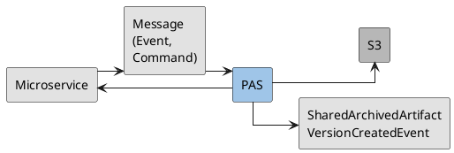
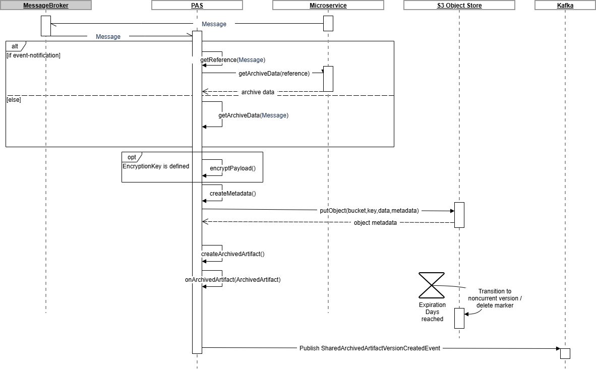
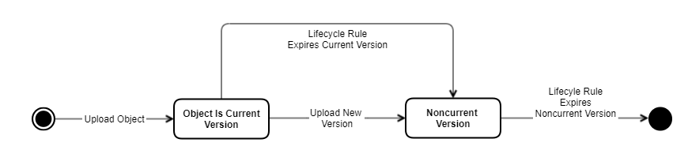
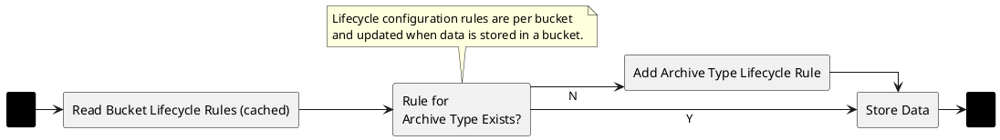
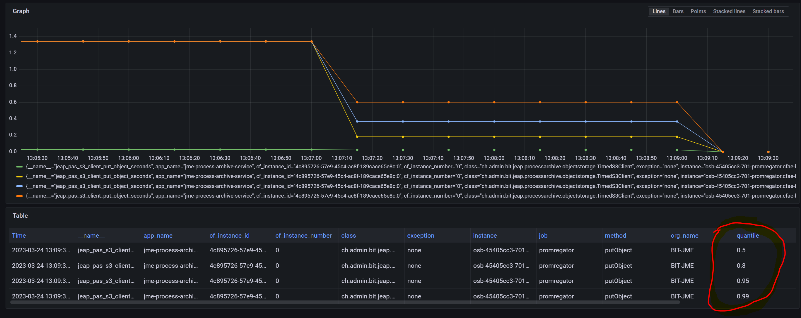

# Process Archive Service

## Context

The Process-Archive-Service (PAS) is responsible for storing process data for traceability purposes. The PAS is a
reusable microservice that gets integrated into a business application.

Archiving of data is triggered by messages (domain events, commands). Each record to be archived is identified by a
"reference id" and, if applicable, additionally by a version number. Ideally the reference id is globally unique;
at the very least it must be unique within the context in which the PAS is supposed to archive data.

For every newly created artifact, the PAS produces a
[SharedArchivedArtifactVersionCreatedEvent](https://github.com/jeap-admin-ch/jeap-message-type-registry/tree/main/descriptor/_shared/event/sharedarchivedartifactversioncreatedevent).



| # | Step |
| --- | --- |
| 1 | A message triggers the archiving of data |
| 2 | PAS fetches the data to be archived from the microservice (optional; data can also be read from the message when using the Event-Carried-State-Transfer pattern) |
| 3 | PAS stores the data to be archived in an S3 object store |
| 4 | PAS reports the completed archiving of data to any Archived-Artifact listeners that may be present |
| 5 | PAS produces a [SharedArchivedArtifactVersionCreatedEvent](https://github.com/jeap-admin-ch/jeap-message-type-registry/tree/main/descriptor/_shared/event/sharedarchivedartifactversioncreatedevent) |

## Runtime View

In the standard flow (message notification), the PAS, triggered by a message from a microservice of a business
application, fetches process data for archiving from a microservice via REST into an object store. In the
alternative flow (event-carried state transfer), fetching the data from a microservice is omitted, and the PAS
extracts the process data to be archived directly from the message. The PAS generates archiving metadata, which it
stores in the object store together with the process data. Storing the data in the object store produces further
metadata (object metadata). The PAS accumulates all data related to an archiving operation (process data, metadata,
object metadata) in an Archived Artifact and thereby serves an internal listener interface through which the PAS
announces completed archiving operations.



The archiving operation is performed synchronously. Accordingly, the PAS does not need its own database. If a
problem occurs (S3 unavailable, microservice unavailable for the REST call or timeout, etc.), the retry mechanism
of jEAP Messaging's error handling takes over.

## PAS as Message Consumer

The PAS must be configured to listen to the messages that should trigger the archiving of process data. These
messages must be identified in the JSON document `resources/processarchive/messages.json` using the following two
attributes:

:::warning
It is only possible to specify one archive data configuration per message type.

Before PAS version 11, this configuration file was called `events.json`, and the configuration keys that start with
`message*` were called `event*` or `domainEvent*`. For backward-compatibility reasons, the old names are all still
supported.
:::

| Attribute | Description | Optional | Example |
| --- | --- | --- | --- |
| messageName | Name of the message to be consumed | no | JmeDecreeCreatedEvent |
| topicName | Name of the topic from which the message should be consumed | no | jme-process-archive-decreecreated |
| clusterName | The logical Kafka cluster name where the topic exists. <br/>Default: if no `clusterName` is configured, the default cluster is used | yes | aws |
| condition | Class name of an implementation of the interface `ArchiveDataCondition` from the `jeap-process-archive-plugin-api` module. If a condition is configured, data is only archived if the condition evaluates to `true` for a consumed message.<br/><br/>Available since jeap-process-archive-service **version 7.2.0**. | yes | `"condition": "ch.admin.bit.jeap.test.processarchive.TestCondition",` |

### Determining the Data to Archive

Based on a received message, the PAS must be able to determine the data to be archived. Two different mechanisms
are available for this:

#### Case: Event Notification

If a message does not contain any data but only the reference and version of a record (which was, e.g., newly
created or changed), then an implementation of the plugin interface
[ArchiveDataReferenceProvider](https://github.com/jeap-admin-ch/jeap-process-archive-service/blob/main/jeap-process-archive-plugin-api/src/main/java/ch/admin/bit/jeap/processarchive/plugin/api/archivedata/ArchiveDataReferenceProvider.java)
from the [jeap-process-archive-plugin-api](https://github.com/jeap-admin-ch/jeap-process-archive-service/tree/main/jeap-process-archive-plugin-api)
module must be specified for archiving. This implementation must be able to extract from the message the reference
id and, if applicable, the version under which the record to be archived can be read. A reference provider is
specified per message with the following attributes:

| Attribute | Description | Optional | Example |
| --- | --- | --- | --- |
| archiveDataReferenceProvider | Fully qualified class name of the reference provider implementation | no | ch.admin.bit.jeap.jme.processarchive.service.provider.DiagramVersionCreatedArchiveDataReferenceProvider |
| uri | URI of the record to be archived, with an `{id}` URI parameter for the reference id of the record to be archived, and, if applicable, also a `{version}` URI parameter for the version of the record to be archived, if this record is managed with archiving in mind. | no | `https://dev-jme-internal.bit.admin.ch/jme-process-archive-resource-service/api/diagrams/{id}/archival?version={version}` |
| oauthClientId | OAuth2 client ID from the Spring OAuth2 configuration used to obtain a token for accessing the record to be archived | yes* | jme-process-archive-resource-service<br/>\* = if not specified, the API is called without authentication, which in practice is uncommon |
| correlationProvider | An implementation of a [MessageCorrelationProvider](https://github.com/jeap-admin-ch/jeap-process-archive-service/blob/main/jeap-process-archive-plugin-api/src/main/java/ch/admin/bit/jeap/processarchive/plugin/api/archivedata/MessageCorrelationProvider.java): supplies the value for the processId attribute of the archived record. Optional; the default implementation uses the processId attribute from the message. | yes | see example below |

Example of a `MessageCorrelationProvider` implementation
([DecreeCorrelationProvider.java](https://github.com/jme-admin-ch/jme-process-archive-example/blob/main/jme-process-archive-service/src/main/java/ch/admin/bit/jeap/jme/processarchive/service/provider/DecreeCorrelationProvider.java)):

```java
package ch.admin.bit.jeap.jme.processarchive.service.provider;

import ch.admin.bit.jeap.processarchive.plugin.api.archivedata.MessageCorrelationProvider;
import ch.admin.bit.jme.decree.JmeDecreeCreatedEvent;

public class DecreeCorrelationProvider implements MessageCorrelationProvider<JmeDecreeCreatedEvent> {

    /**
     * Example of a MessageCorrelationProvider implementation. This example returns the processId of the message,
     * which is the default behavior.
     * An actual implementation would extract the origin process id from the message payload.
     * This implementation only demonstrates the use of such a provider.
     */
    @Override
    public String getOriginProcessId(JmeDecreeCreatedEvent event) {
        return event.getProcessId();
    }
}
```

#### Case: Event-Carried State Transfer

If a message directly contains all the data to be archived, then an implementation of the plugin interface
[MessageArchiveDataProvider](https://github.com/jeap-admin-ch/jeap-process-archive-service/blob/main/jeap-process-archive-plugin-api/src/main/java/ch/admin/bit/jeap/processarchive/plugin/api/archivedata/MessageArchiveDataProvider.java)
from the [jeap-process-archive-plugin-api](https://github.com/jeap-admin-ch/jeap-process-archive-service/tree/main/jeap-process-archive-plugin-api)
module must be specified for archiving. This implementation must be able to extract the data to be archived from the
message. A message archive data provider is specified per message with the following attributes:

| Attribute | Description | Optional | Example |
| --- | --- | --- | --- |
| messageArchiveDataProvider | Fully qualified class name of the message archive data provider implementation | no | ch.admin.bit.jeap.jme.processarchive.service.provider.DecreeCreatedDataProvider |
| correlationProvider | An implementation of a [MessageCorrelationProvider](https://github.com/jeap-admin-ch/jeap-process-archive-service/blob/main/jeap-process-archive-plugin-api/src/main/java/ch/admin/bit/jeap/processarchive/plugin/api/archivedata/MessageCorrelationProvider.java): supplies the value for the processId attribute of the archived record. Optional; the default implementation uses the processId attribute from the message. | yes | see example above |

### Example Configuration

The following file gives an example of the configuration of message processing by the PAS. It lists all the
messages the PAS should listen to, with name and topic, and it also defines for each of these messages how the PAS
should determine the data to be archived.

[jme-process-archive-service / src / main / resources / processarchive / messages.json](https://github.com/jme-admin-ch/jme-process-archive-example/blob/main/jme-process-archive-service/src/main/resources/processarchive/messages.json):

```json
{
  "messages": [
    {
      "id": "decree-document",
      "messageName": "JmeDecreeDocumentCreatedEvent",
      "topicName": "jme-process-archive-decreedocumentcreated",
      "archiveDataReferenceProvider": "ch.admin.bit.jeap.jme.processarchive.service.provider.DecreeDocumentCreatedArchiveDataReferenceProvider",
      "uri": "${decree-document.archive.uri}",
      "featureFlag": "FEATURE_DOCUMENT_CREATED"
    },
    {
      "id": "decree",
      "messageName": "JmeDecreeCreatedEvent",
      "topicName": "jme-process-archive-decreecreated",
      "messageArchiveDataProvider": "ch.admin.bit.jeap.jme.processarchive.service.provider.DecreeCreatedDataProvider",
      "correlationProvider": "ch.admin.bit.jeap.jme.processarchive.service.provider.DecreeCorrelationProvider",
      "featureFlag": "FEATURE_DECREE_CREATED"
    },
    {
      "id": "decree-summary",
      "messageName": "JmeDecreeCreatedEvent",
      "topicName": "jme-process-archive-decreecreated",
      "messageArchiveDataProvider": "ch.admin.bit.jeap.jme.processarchive.service.provider.DecreeSummaryDataProvider",
      "correlationProvider": "ch.admin.bit.jeap.jme.processarchive.service.provider.DecreeCorrelationProvider",
      "featureFlag": "FEATURE_DECREE_SUMMARY"
    },
    {
      "messageName": "JmeDiagramVersionCreatedEvent",
      "topicName": "jme-process-archive-diagramversioncreated",
      "archiveDataReferenceProvider": "ch.admin.bit.jeap.jme.processarchive.service.provider.DiagramVersionCreatedArchiveDataReferenceProvider",
      "condition": "ch.admin.bit.jeap.jme.processarchive.service.condition.ArchiveDiagramCondition",
      "uri": "${diagram.archive.uri}",
      "featureFlag": "FEATURE_DIAGRAM_VERSION_CREATED"
    },
    {
      "messageName": "JmeCreateDeclarationCommand",
      "topicName": "jme-messaging-create-declaration",
      "messageArchiveDataProvider": "ch.admin.bit.jeap.jme.processarchive.service.provider.CreateDeclarationCommandDataProvider",
      "correlationProvider": "ch.admin.bit.jeap.jme.processarchive.service.provider.CreateDeclarationCommandReferenceProvider",
      "condition": "ch.admin.bit.jeap.jme.processarchive.service.condition.CreateDeclarationCommandArchiveCondition"
    }
  ]
}
```

## SharedArchivedArtifactVersionCreatedEvent

The PAS publishes a `SharedArchivedArtifactVersionCreatedEvent` for every archived artifact, notifying consumers
that a new artifact has been created in the archive. The event's definition can be found in the jEAP Message Type
Registry: [SharedArchivedArtifactVersionCreatedEvent](https://github.com/jeap-admin-ch/jeap-message-type-registry/blob/main/descriptor/_shared/event/sharedarchivedartifactversioncreatedevent/SharedArchivedArtifactVersionCreatedEvent_v2.0.0.avdl).

The PAS sets the value `System_DataSchemaType` (e.g. `JME_DecreeDocument`) as the variant in the event.

| Config Property | Mandatory | Content | Example |
| --- | --- | --- | --- |
| `jeap.processarchive.archivedartifact.event-topic` | Y | Name of the topic to which the Shared ArchivedArtifactVersionCreatedEvent is published | `jme-process-archive-artifactversioncreated` |
| `jeap.processarchive.archivedartifact.system-id` | Y | Value of the `systemId` attribute in the Shared ArchivedArtifactVersionCreatedEvent (freely selectable) | `${transparenza.archivedartifact.system-id}`<br/>`ch.admin.bit.Example` |
| `jeap.processarchive.archivedartifact.enabled` | N | Set to `false` to disable the publication of the SharedArchivedArtifactVersionCreatedEvent. Default is `true`. | `false` |

## Archived-Artifact Listener

The PAS accumulates all data related to an archiving operation (process data, metadata, object metadata) in an
Archived-Artifact record. Once the PAS has completed archiving a record, it announces this via the
[ArtifactArchivedListener](https://github.com/jeap-admin-ch/jeap-process-archive-service/blob/main/jeap-process-archive-plugin-api/src/main/java/ch/admin/bit/jeap/processarchive/plugin/api/archivedartifact/ArtifactArchivedListener.java)
plugin interface from the [jeap-process-archive-plugin-api](https://github.com/jeap-admin-ch/jeap-process-archive-service/tree/main/jeap-process-archive-plugin-api)
module, exposing the Archived-Artifact record in the process. An implementation of the
[ArtifactArchivedListener](https://github.com/jeap-admin-ch/jeap-process-archive-service/blob/main/jeap-process-archive-plugin-api/src/main/java/ch/admin/bit/jeap/processarchive/plugin/api/archivedartifact/ArtifactArchivedListener.java)
interface must be instantiated as a Spring bean.

The `ArchivedArtifactListener` interface is used so that information about archived process records can be stored
in an archive catalog, so that archived records can be searched for and retrieved. In particular, the coordinates
of the archived records in S3 (bucket, key) must be recorded in the archive catalog and linked, e.g., to the
reference id of the record.

The interface makes the following information available:

| Information | Description |
| --- | --- |
| Process Id | Id of the process in the context of which the data to be archived was created, changed, or deleted |
| Reference Id | Id of the record to be archived. Together with the version, it must uniquely identify the record. |
| Reference Id Type | Type of the class that is stored in the catalog |
| Version | Version of the record to be archived. Can be empty if the record is not versioned. |
| Payload | The data to be archived (binary) |
| Content Type | The content type of the payload |
| System | Business system that defines the schema |
| Schema | Name of the schema of the payload (corresponds to the `archiveType` attribute for Avro schemas with a descriptor) |
| Schema Version | Version of the payload's schema |
| Storage Object Bucket | Name of the bucket in which the data was archived |
| Storage Object Key | Key of the object in which the data was archived (prefix + ID) |
| Storage Object Version Id | Id of the version of the object in which the data was archived. Assigned by the object store. |
| Expiration Days | Retention period specification in days |
| Additional Metadata | Additional metadata defined by the business application |

### Publishing Archived Artifacts via Feature Flag (from PAS version 8.14.0)

To let the PAS support continuous deployment, the publication of Archived Artifacts can be activated per message
using a feature flag:

```java
...
{
  "messages": [
    {
      "messageName": "EventName1",
      ...
      "featureFlag": "NAME_OF_FEATURE_FLAG_1"
    },
    {
      "messageName": "CommandName2",
      ...
      "featureFlag": "NAME_OF_FEATURE_FLAG_2"
    }, 
  ]
...
```

If the feature flag is not active at the time of processing, the artifact is not registered with the listeners.
Once the feature flag is activated, new artifacts are registered. Old artifacts that were processed but not sent
before the feature flag was activated are not registered retroactively.

The state of the feature flag can be configured as follows:

```java
togglz:
  features:
    NAME_OF_FEATURE_FLAG_1:
      enabled: true
    NAME_OF_FEATURE_FLAG_2:
      enabled: false
```

Since the PAS uses the Feature-Flag Starter, the PAS provides the same metrics on the state of feature flags:

```java
# HELP feature_flag Feature Flags
# TYPE feature_flag gauge
feature_flag{client="jme-process-archive-service",name="NAME_OF_FEATURE_FLAG_1"} 1.0
feature_flag{client="jme-process-archive-service",name="NAME_OF_FEATURE_FLAG_2"} 0.0
```

See Feature Flags (TODO Link) for more details.

## Standardized Archive Data REST Interface

For the standard flow, microservices must implement a standardized REST interface through which they make process
data available for archiving. Not all data of a business application is relevant in the long term. The microservice
only needs to provide the relevant data for the interface.

The archive REST interface must provide the data to be archived for a reference id and, if applicable, a version
number, as described in Versionierung von Geschäftsobjekten (TODO Link).
The PAS does not support sub-resource versions. The archive REST interface must also populate the following
HTTP headers:

| Header | Description | Optional | Example |
| --- | --- | --- | --- |
| Content-Type | Content type of the data (if not encoded in UTF-8, the charset should also be specified). In general, using Avro is recommended, but jeap-process-archive-service supports any format. | no | `avro/binary`<br/>`text/html; charset=UTF-8` |
| Archive-Data-System | System name of the system archiving the data. When using Avro schemas, must match the system name in the Archive Type Registry; otherwise must match the system name of the archive type from the PAS configuration. | no | JME |
| Archive-Data-Schema | Name of the archive type, and thus the schema, of the data to be archived. When using Avro schemas, must match the archive type name in the Archive Type Registry; otherwise must match the archive type name of the archive type from the PAS configuration. | no | Archive-Data-Schema |
| Archive-Data-Schema-Version | Version of the schema of the data to be archived (positive integer). When using Avro schemas, must match a version of the type in the Archive Type Registry; otherwise must match the version of an archive type from the PAS configuration. | no | 1 |
| Archive-Metadata-* | Additional custom metadata for the data to be archived | yes | Archive-Metadata-Issuer |
| Archive-Storage-Bucket | Specifies the S3 bucket for the data to be archived. Should generally be defined by the [Object Storage Strategy](#object-storage-strategy). | yes | bit-jme-processarchive-obs-decree-dev |
| Archive-Storage-Prefix | Specifies the prefix to be prepended to the reference id of the data to be archived in the S3 object key. Should generally be defined by the [Object Storage Strategy](#object-storage-strategy). | yes | some-prefix/ |

The following code gives a simple example of an implementation of the archive REST interface for an unversioned
artifact
([ArchiveController.java](https://github.com/jme-admin-ch/jme-process-archive-example/blob/main/jme-process-archive-resource-service/src/main/java/ch/admin/bit/jeap/jme/processarchive/resource/web/ArchiveController.java)):

```java
package ch.admin.bit.jeap.jme.processarchive.resource.web;

import ch.admin.bit.jeap.jme.processarchive.resource.domain.DecreeDocumentRepository;
import ch.admin.bit.jeap.processarchive.test.DecreeReference;
import ch.admin.bit.jeap.processarchive.test.decreedocument.v1.DecreeDocument;
import ch.admin.bit.jeap.processarchive.web.AvroWebConstants;
import io.swagger.v3.oas.annotations.Operation;
import io.swagger.v3.oas.annotations.responses.ApiResponse;
import io.swagger.v3.oas.annotations.tags.Tag;
import jakarta.servlet.http.HttpServletResponse;
import lombok.RequiredArgsConstructor;
import org.springframework.http.HttpStatus;
import org.springframework.web.bind.annotation.GetMapping;
import org.springframework.web.bind.annotation.PathVariable;
import org.springframework.web.bind.annotation.RequestMapping;
import org.springframework.web.bind.annotation.RestController;
import org.springframework.web.server.ResponseStatusException;

import java.nio.ByteBuffer;

/**
 * This does not need to be a separate controller. Archival decree documents could also be provided by the
 * DecreeController itself e.g. at the path /api/decree/{id}/archival
 */
@Tag(name = "Archive", description = "Provide archive data.")
@RestController
@RequestMapping("/api/archive")
@RequiredArgsConstructor
public class ArchiveController {
    private static final String ARCHIVE_DATA_SYSTEM_HEADER = "archive-data-system";
    private static final String ARCHIVE_DATA_SCHEMA_HEADER = "archive-data-schema";
    private static final String DECREE_DOCUMENT_SCHEMA = "DecreeDocument";
    private static final String ARCHIVE_DATA_SCHEMA_VERSION_HEADER = "archive-data-schema-version";
    private static final int DECREE_DOCUMENT_SCHEMA_VERSION = 1;
    private static final String ARCHIVE_METADATA_HEADER_PREFIX = "archive-metadata-";

    private final DecreeDocumentRepository decreeDocumentRepository;

    /**
     * The returned {@link DecreeDocument} (an avro-generated class) will be transparently serialized to binary avro
     * by jeap-process-archive-web as long as the produced media type is specified as "avro/binary".
     */
    @GetMapping(value = "/decreedocuments/{id}", produces = AvroWebConstants.AVRO_BINARY)
    @Operation(summary = "Provide decree document archive data.", responses = @ApiResponse(responseCode = "200", description = "success"))
    public DecreeDocument getArchivalDecreeDocument(@PathVariable("id") String id, HttpServletResponse response) {
        response.addHeader(ARCHIVE_DATA_SYSTEM_HEADER, "JME");
        response.addHeader(ARCHIVE_DATA_SCHEMA_HEADER, DECREE_DOCUMENT_SCHEMA);
        response.addHeader(ARCHIVE_DATA_SCHEMA_VERSION_HEADER, String.valueOf(DECREE_DOCUMENT_SCHEMA_VERSION));
        response.addHeader(ARCHIVE_METADATA_HEADER_PREFIX + "issuer", "John Smith");
        ch.admin.bit.jeap.jme.processarchive.resource.domain.DecreeDocument domainDocument = decreeDocumentRepository.getDecreeDocument(id);

        if (domainDocument == null) {
            throw new ResponseStatusException(HttpStatus.NOT_FOUND, "Decree document with id " + id + " not found");
        }

        return DecreeDocument.newBuilder()
                .setDecreeReferenceBuilder(DecreeReference.newBuilder()
                        .setId(domainDocument.getDecreeId())
                        .setType("Example"))
                .setCreatedAt(domainDocument.getCreatedAt().toInstant())
                .setPdf(ByteBuffer.wrap(domainDocument.getPdf()))
                .setDocumentId(domainDocument.getId())
                .build();
    }
}
```

The following code gives a simple example of an implementation of the archive REST interface for a versioned
artifact
([DiagramController.java](https://github.com/jme-admin-ch/jme-process-archive-example/blob/main/jme-process-archive-resource-service/src/main/java/ch/admin/bit/jeap/jme/processarchive/resource/web/DiagramController.java)):

```java
package ch.admin.bit.jeap.jme.processarchive.resource.web;

import ch.admin.bit.jeap.jme.processarchive.resource.domain.DiagramDTO;
import ch.admin.bit.jeap.jme.processarchive.resource.domain.DiagramRepository;
import ch.admin.bit.jeap.jme.processarchive.resource.domain.MessagePublisher;
import ch.admin.bit.jeap.processarchive.test.diagram.v1.Diagram;
import ch.admin.bit.jeap.processarchive.web.AvroWebConstants;
import io.swagger.v3.oas.annotations.Operation;
import io.swagger.v3.oas.annotations.responses.ApiResponse;
import io.swagger.v3.oas.annotations.tags.Tag;
import jakarta.servlet.http.HttpServletResponse;
import lombok.RequiredArgsConstructor;
import org.springframework.web.bind.annotation.*;

import java.util.Optional;
import java.util.UUID;

@Tag(name = "Diagram", description = "Manage diagrams.")
@RestController
@RequestMapping("/api/diagrams")
@RequiredArgsConstructor
public class DiagramController {
    private static final String ARCHIVE_DATA_SYSTEM_HEADER = "archive-data-system";
    private static final String ARCHIVE_DATA_SCHEMA_HEADER = "archive-data-schema";
    private static final String DIAGRAM_SCHEMA = "Diagram";
    private static final String ARCHIVE_DATA_SCHEMA_VERSION_HEADER = "archive-data-schema-version";
    private static final String DIAGRAM_SCHEMA_VERSION = "1";

    private final DiagramRepository diagramRepository;
    private final MessagePublisher messagePublisher;

    @PutMapping("/{id}")
    @Operation(summary = "Create or update a diagram.", responses = @ApiResponse(responseCode = "200", description = "success"))
    public DiagramDTO saveDiagram(@PathVariable("id") String id, @RequestBody DiagramDTO diagram) {
        if (diagram.getId() == null) {
            diagram.setId(id);
        }
        diagram = diagramRepository.saveDiagram(diagram);
        messagePublisher.diagramVersionCreated(diagram.getId(), diagram.getVersion(), createNewProcessId());
        return diagram;
    }

    @GetMapping("/{id}")
    @Operation(summary = "Get a diagram.", responses = @ApiResponse(responseCode = "200", description = "success"))
    public DiagramDTO getDiagram(@PathVariable("id") String id, @RequestParam("version") Optional<Integer> version) {
        return version.isPresent() ? diagramRepository.getDiagram(id, version.get()) : diagramRepository.getDiagram(id);
    }

    @GetMapping(value = "/{id}/archival", produces = AvroWebConstants.AVRO_BINARY)
    @Operation(summary = "Get a diagram for archival storage.", responses = @ApiResponse(responseCode = "200", description = "success"))
    public Diagram getArchivalDiagram(@PathVariable("id") String id, @RequestParam("version") int version, HttpServletResponse response) {
        response.addHeader(ARCHIVE_DATA_SYSTEM_HEADER, "JME");
        response.addHeader(ARCHIVE_DATA_SCHEMA_HEADER, DIAGRAM_SCHEMA);
        response.addHeader(ARCHIVE_DATA_SCHEMA_VERSION_HEADER, DIAGRAM_SCHEMA_VERSION);
        DiagramDTO dto = diagramRepository.getDiagram(id, version);
        return Diagram.newBuilder()
                .setId(dto.getId())
                .setName(dto.getName())
                .setVersion(dto.getVersion())
                .setGraph(dto.getGraph())
                .build();
    }

    // Typically, the creation of a new diagram version would be embedded in a business process. But this example does
    // not set up a process, instead we just create a new process id here for simplicity.
    // See the jme-process-context-example project for an example for modelling a process and tracking its progress.
    private String createNewProcessId() {
        return UUID.randomUUID().toString();
    }

}
```

#### Transporting Archive Data as Avro over REST Interfaces

The module "jeap-process-archive-web" registers, via Spring Boot autoconfiguration, a converter for classes
generated from Avro schemas that are used as return values on a REST controller (Spring MVC). The module can be
integrated into a microservice as follows:

```java
<!-- Autoconfigure HTTP converters for binary avro -->
<dependency>
  <groupId>ch.admin.bit.jeap</groupId>
  <artifactId>jeap-process-archive-web</artifactId>
  <version>${jeap-process-archive.version}</version>
</dependency>
```

The REST controller can return an instance of an Avro-generated class and specify "avro/binary" as the content
type; the payload is then automatically converted to binary Avro:

```java
// produces = "avro/binary" activates the converter in jeap-process-archive-web
@GetMapping(value = "/decreedocuments/{id}", produces = "avro/binary")
public DecreeDocument getArchivalDecreeDocument(@PathVariable("id") String id, HttpServletResponse response) {
  // ... fetch domain object

  // DecreeDocument is here an Avro-generated class for a schema version of an archive type */
  DecreeDocument archiveDocument = DecreeDocument.newBuilder()
    /** ... mapping domain object to archive data */
    .build();

  // The converter in jeap-process-archive-web automatically serializes archiveDocument as binary Avro */
  return archiveDocument;
}
```

The Java bindings for archive types are generated in the builder of the
[Archive Type Registry](archive-type-registry.md) and uploaded to the Maven repository. From there, the bindings
can be obtained via a dependency in the `pom.xml`:

```xml
<!-- pom.xml -->
<dependencies>
    <dependency>
        <groupId>ch.admin.bit.jme.archivetype.jme</groupId>
        <artifactId>decree-v1</artifactId>
        <version>1</version>
    </dependency>
    <!-- ... -->
</dependencies>
```

See [jme-process-archive-resource-service / pom.xml](https://github.com/jme-admin-ch/jme-process-archive-example/blob/main/jme-process-archive-resource-service/pom.xml)
for a complete example.

## Integration with an S3 Object Store

### Connection

The connection to the S3 object store into which the process data should be archived can be configured under the
property path `jeap.processarchive.objectstorage.connection` using the following properties:

| Property | Description | Default |
| --- | --- | --- |
| access-url | S3 URL | |
| region | S3 AWS region | `AWS_GLOBAL` |
| access-key | S3 access key | |
| secret-key | S3 secret key | |

#### Specific Configuration for AWS S3

The properties `access-url`, `access-key`, and `secret-key` do not need to be configured if the PAS instance itself
is deployed in AWS. In this case, the credentials from the context (IAM role) are used.

The project-specific region should be set as the region. For more information on buckets and regions, see the
[AWS documentation](https://docs.aws.amazon.com/AmazonS3/latest/userguide/UsingBucket.html).

### Requirements for the S3 Object Store Buckets

:::warning Bucket Naming
Observe the [naming convention](../../naming-conventions.md) for S3 buckets!

S3 bucket names on AWS have the following requirements: [Bucket naming rules](https://docs.aws.amazon.com/AmazonS3/latest/userguide/bucketnamingrules.html)
:::

The bucket or buckets into which the PAS is supposed to archive data must already have been created in the
configured S3 object store before data is archived. Object Lock must be enabled for the bucket(s), which implicitly
also activates versioning on the bucket(s). This ensures that archived data cannot be overwritten and can only be
deleted after a certain period has elapsed. The following AWS CLI command can be used to create a bucket named
`<bucket-name>` with Object Lock enabled on StorageGrid:

```bash
aws s3api --endpoint-url <StorageGRID endpoint> create-bucket --bucket <bucket-name> --object-lock-enabled-for-bucket 
```

On AWS S3:

```bash
aws s3api create-bucket --bucket <bucket-name> --object-lock-enabled-for-bucket 
```


#### Object Lock and ADO (Access During Outage) with DELL ECS

On S3 from DELL ECS there is a risk of data loss during an outage if ADO and Object Lock are enabled at the same
time.

- Object Lock is indispensable in the context of the PAS -- the audit trail must not be modified

Therefore, ADO must be disabled. Rationale:

- Data loss on the audit trail is unacceptable
- Temporary outages due to an outage are tolerable
  - Access to the data in the PAS is not time-critical and therefore does not need to be guaranteed at all times
  - Error handling can cope with temporary outages

### Object Storage Strategy

Buckets and keys used to archive process data are determined by the configured Object Storage Strategy. If a REST
endpoint for data to be archived specifies the bucket name and/or the prefix in the HTTP headers, the value
determined for this by the Object Storage Strategy is ignored and the value from the HTTP header is used instead.

#### Default Object Storage Strategy

Without special configuration, the Default Object Storage Strategy is active and archives all process data into a
single (configurable) bucket. The reference id of the respective process record is used as the key. Through
configuration, the Default Object Storage Strategy can be instructed to additionally prefix the reference id.

The Default Object Storage Strategy can be configured under the property path
`jeap.processarchive.objectstorage.storage` using the following properties:

| Property | Description | Default |
| --- | --- | --- |
| bucket | Name of the S3 bucket into which process data is archived. | |
| prefix-mode | Which prefix should be used for the keys of the process records? | DAY (since PAS version 4.10.0, before that NONE) |

The following prefix modes can be configured:

| Prefix Mode | Description | Prefix Example |
| --- | --- | --- |
| NONE | No prefix | |
| DAY | Prefix made up of year, month, and day | 20210614/ |
| MONTH | Prefix made up of year and month | 202106/ |
| YEAR | Prefix made up of year | 2021/ |

#### Custom Object Storage Strategy

For more specific requirements, in particular when more than one bucket should be used, a custom Object Storage
Strategy can be defined. To do this, the plugin interface
[ObjectStorageStrategy](https://github.com/jeap-admin-ch/jeap-process-archive-service/blob/main/jeap-process-archive-plugin-api/src/main/java/ch/admin/bit/jeap/processarchive/plugin/api/storage/ObjectStorageStrategy.java)
from the [jeap-process-archive-plugin-api](https://github.com/jeap-admin-ch/jeap-process-archive-service/tree/main/jeap-process-archive-plugin-api)
module must be implemented and instantiated as a Spring bean.

This can be done as follows:

1. Create the strategy in the PAS instance:

   ```java
   public class CustomStrategy implements ObjectStorageStrategy {
     ...
   }
   ```

2. Create the Spring configuration `ch.admin.<amt>.<domain>.CustomConfiguration.java` with:

   ```java
   @AutoConfiguration(before = ObjectStorageConfiguration.class)
   public class CustomConfiguration {
     @Bean
     CustomStrategy customStrategy() {
       return new CustomStrategy(...);
     }
   }
   ```

3. Create the file `src/main/resources/META-INF/spring/org.springframework.boot.autoconfigure.AutoConfiguration.imports`
   with the following content:
   1. `ch.admin.<amt>.<domain>.CustomConfiguration`

### Hash Provider

The PAS determines a hash code for every archived process record and adds it to the metadata of the S3 object that
stores the record. The concrete hashing method must be defined via an implementation of the plugin interface
[HashProvider](https://github.com/jeap-admin-ch/jeap-process-archive-service/blob/main/jeap-process-archive-plugin-api/src/main/java/ch/admin/bit/jeap/processarchive/plugin/api/storage/HashProvider.java)
from the [jeap-process-archive-plugin-api](https://github.com/jeap-admin-ch/jeap-process-archive-service/tree/main/jeap-process-archive-plugin-api)
module and instantiated as a Spring bean.

### Integration

The integration of a PAS instance into a business application is described in the
[Process Archive How-To](how-to.md).

### Archive Data Types Defined via Avro Schema

The PAS technically supports arbitrary archive data types; in general, archive data is stored as a byte stream. It
is recommended to define and serialize archive data using Avro schemas (see also the
[Archive Type Registry](archive-type-registry.md)). This enables validation of the archive data's schema.

#### Schema Validation in the PAS

The PAS validates archive data against an Avro schema when the content type of the data is "avro/binary". The
specific schema against which validation is performed is determined from the coordinates
system/archive-type/version.

The Avro schema definitions required for this, for one (or more) business system(s), must be present in the PAS
and can be obtained and included in the PAS as follows, using a Maven dependency on the generated artifact from the
[Archive Type Registry](archive-type-registry.md):

:::info
**Important**: The PAS must know all schemas of archive type versions to be archived. After defining the archive
type and merging it into the default branch of the [Archive Type Registry](archive-type-registry.md), the next
step should be to add the dependency in the PAS before data is archived with the schema!
:::

```xml
<!-- pom.xml example -->
<dependencies>
        <!-- Archive Type Java Binding Dependencies -->
        <dependency>
            <groupId>ch.admin.bit.jme.archivetype.jme</groupId>
            <artifactId>diagram-v1</artifactId>
            <version>1</version>
        </dependency>
        <dependency>
            <groupId>ch.admin.bit.jme.archivetype.jme</groupId>
            <artifactId>decree-v1</artifactId>
            <version>1</version>
        </dependency>
        <dependency>
            <groupId>ch.admin.bit.jme.archivetype.jme</groupId>
            <artifactId>decree-v2</artifactId>
            <version>2</version>
        </dependency>
        <dependency>
            <groupId>ch.admin.bit.jme.archivetype.jme</groupId>
            <artifactId>decree-v3</artifactId>
            <version>3</version>
        </dependency>
        <dependency>
            <groupId>ch.admin.bit.jme.archivetype.jme</groupId>
            <artifactId>decree-document-v1</artifactId>
            <version>1</version>
        </dependency>
</dependencies>
```

See example
([jme-process-archive-service / pom.xml](https://github.com/jme-admin-ch/jme-process-archive-example/blob/main/jme-process-archive-service/pom.xml)):

```xml
<?xml version="1.0" encoding="UTF-8"?>
<project xmlns:xsi="http://www.w3.org/2001/XMLSchema-instance"
         xmlns="http://maven.apache.org/POM/4.0.0"
         xsi:schemaLocation="http://maven.apache.org/POM/4.0.0 http://maven.apache.org/xsd/maven-4.0.0.xsd">
    <modelVersion>4.0.0</modelVersion>

    <parent>
        <groupId>ch.admin.bit.jeap</groupId>
        <artifactId>jme-process-archive-example</artifactId>
        <version>1.1.0-SNAPSHOT</version>
    </parent>

    <artifactId>jme-process-archive-service</artifactId>
    <name>${project.artifactId}</name>
    <description>Example Process Archive Service (PAS) instance that archives artifacts referenced by
        consumed domain events into an encrypted, S3-compatible object store.</description>
    <packaging>jar</packaging>

    <properties>
        <main-class>ch.admin.bit.jeap.processarchive.service.ProcessArchiveApplication</main-class>
    </properties>

    <dependencies>
        <dependency>
            <groupId>ch.admin.bit.jeap.jme.messagetype.jme</groupId>
            <artifactId>jme-decree-document-created-event</artifactId>
            <version>1.0.0</version>
        </dependency>
        <dependency>
            <groupId>ch.admin.bit.jeap.jme.messagetype.jme</groupId>
            <artifactId>jme-decree-created-event</artifactId>
            <version>1.0.0</version>
        </dependency>
        <dependency>
            <groupId>ch.admin.bit.jeap.jme.messagetype.jme</groupId>
            <artifactId>jme-diagram-version-created-event</artifactId>
            <version>1.0.0</version>
        </dependency>
        <dependency>
            <groupId>ch.admin.bit.jeap.jme.messagetype.jme</groupId>
            <artifactId>jme-create-declaration-command</artifactId>
            <version>1.0.0</version>
        </dependency>
        <dependency>
            <groupId>ch.admin.bit.jeap</groupId>
            <artifactId>jeap-process-archive-plugin-api</artifactId>
            <version>${jeap-process-archive-service.version}</version>
        </dependency>
        <dependency>
            <groupId>ch.admin.bit.jeap</groupId>
            <artifactId>jeap-process-archive-web</artifactId>
            <version>${jeap-process-archive-service.version}</version>
        </dependency>
        <dependency>
            <groupId>ch.admin.bit.jeap</groupId>
            <artifactId>jeap-process-archive-adapter-opensearch</artifactId>
            <version>${jeap-process-archive-service.version}</version>
        </dependency>
        <!-- needed if backfill is activated -->
        <dependency>
            <groupId>ch.admin.bit.jeap</groupId>
            <artifactId>jeap-process-archive-adapter-db</artifactId>
            <version>${jeap-process-archive-service.version}</version>
        </dependency>
        <dependency>
            <groupId>ch.admin.bit.jeap</groupId>
            <artifactId>jeap-process-archive-service</artifactId>
            <version>${jeap-process-archive-service.version}</version>
        </dependency>
        <dependency>
            <groupId>ch.admin.bit.jeap</groupId>
            <artifactId>jeap-messaging-avro</artifactId>
        </dependency>
        <!-- BLAKE3 hashing for the HashProvider plugin implementation -->
        <dependency>
            <groupId>org.bouncycastle</groupId>
            <artifactId>bcprov-jdk18on</artifactId>
        </dependency>
        <dependency>
            <groupId>ch.admin.bit.jeap</groupId>
            <artifactId>jeap-messaging-contract-annotations</artifactId>
        </dependency>
        <dependency>
            <groupId>ch.admin.bit.jeap</groupId>
            <artifactId>jeap-spring-boot-vault-starter</artifactId>
        </dependency>
        <dependency>
            <groupId>ch.admin.bit.jeap</groupId>
            <artifactId>jeap-spring-boot-db-migration-starter</artifactId>
        </dependency>
        <dependency>
            <groupId>com.fasterxml.jackson.datatype</groupId>
            <artifactId>jackson-datatype-jsr310</artifactId>
        </dependency>
        <dependency>
            <groupId>org.postgresql</groupId>
            <artifactId>postgresql</artifactId>
            <scope>runtime</scope>
        </dependency>

        <dependency>
            <groupId>org.springframework.boot</groupId>
            <artifactId>spring-boot-starter-test</artifactId>
            <scope>test</scope>
        </dependency>
        <dependency>
            <groupId>ch.admin.bit.jeap</groupId>
            <artifactId>jme-process-archive-events</artifactId>
            <version>${project.version}</version>
            <scope>test</scope>
        </dependency>

        <dependency>
            <groupId>ch.admin.bit.jeap.jme.archivetype.jme</groupId>
            <artifactId>diagram-v1</artifactId>
            <version>1</version>
        </dependency>
        <dependency>
            <groupId>ch.admin.bit.jeap.jme.archivetype.jme</groupId>
            <artifactId>decree-v1</artifactId>
            <version>1</version>
        </dependency>
        <dependency>
            <groupId>ch.admin.bit.jeap.jme.archivetype.jme</groupId>
            <artifactId>decree-v2</artifactId>
            <version>2</version>
        </dependency>
        <dependency>
            <groupId>ch.admin.bit.jeap.jme.archivetype.jme</groupId>
            <artifactId>decree-v3</artifactId>
            <version>3</version>
        </dependency>
        <dependency>
            <groupId>ch.admin.bit.jeap.jme.archivetype.jme</groupId>
            <artifactId>decree-document-v1</artifactId>
            <version>1</version>
        </dependency>
        <dependency>
            <groupId>ch.admin.bit.jeap.jme.archivetype.jme</groupId>
            <artifactId>decree-summary-v1</artifactId>
            <version>1</version>
        </dependency>
        <dependency>
            <groupId>ch.admin.bit.jeap.jme.indextype.jme</groupId>
            <artifactId>jme-decree-document-v1</artifactId>
            <version>1.0</version>
        </dependency>
        <dependency>
            <groupId>ch.admin.bit.jeap.jme.indextype.jme</groupId>
            <artifactId>jme-decree-v1</artifactId>
            <version>1.0</version>
        </dependency>
    </dependencies>

    <build>
        <plugins>
            <plugin>
                <groupId>org.apache.maven.plugins</groupId>
                <artifactId>maven-compiler-plugin</artifactId>
            </plugin>
            <plugin>
                <groupId>org.springframework.boot</groupId>
                <artifactId>spring-boot-maven-plugin</artifactId>
                <configuration>
                    <mainClass>${main-class}</mainClass>
                </configuration>
                <executions>
                    <execution>
                        <phase>none</phase>
                    </execution>
                    <execution>
                        <id>spring-boot</id>
                        <goals>
                            <goal>build-info</goal>
                        </goals>
                    </execution>
                </executions>
            </plugin>
        </plugins>
    </build>
</project>
```

The Archive Type Versions on the classpath must additionally be made known to the PAS explicitly at runtime, using
an `ArchiveTypeProvider` bean
([JmeArchiveTypeProvider.java](https://github.com/jme-admin-ch/jme-process-archive-example/blob/main/jme-process-archive-service/src/main/java/ch/admin/bit/jeap/jme/processarchive/service/provider/JmeArchiveTypeProvider.java)):

```java
package ch.admin.bit.jeap.jme.processarchive.service.provider;

import ch.admin.bit.jeap.processarchive.plugin.api.archivetype.ArchiveTypeProvider;
import ch.admin.bit.jeap.processarchive.test.decreedocument.v1.DecreeDocument;
import ch.admin.bit.jeap.processarchive.test.decreesummary.v1.DecreeSummary;
import ch.admin.bit.jeap.processarchive.test.diagram.v1.Diagram;
import org.apache.avro.specific.SpecificRecordBase;
import org.springframework.stereotype.Component;

import java.util.List;

@Component
public class JmeArchiveTypeProvider implements ArchiveTypeProvider {


    @Override
    public List<Class<? extends SpecificRecordBase>> getArchiveTypeVersions() {
        return List.of(
                ch.admin.bit.jeap.processarchive.test.decree.v1.Decree.class,
                ch.admin.bit.jeap.processarchive.test.decree.v2.Decree.class,
                ch.admin.bit.jeap.processarchive.test.decree.v3.Decree.class,
                DecreeDocument.class,
                DecreeSummary.class,
                Diagram.class);
    }
}
```

For the bean to be picked up by Spring, an entry is also required in the file
`META-INF/spring/org.springframework.boot.autoconfigure.AutoConfiguration.imports`
([org.springframework.boot.autoconfigure.AutoConfiguration.imports](https://github.com/jme-admin-ch/jme-process-archive-example/blob/main/jme-process-archive-service/src/main/resources/META-INF/spring/org.springframework.boot.autoconfigure.AutoConfiguration.imports)):

```java
ch.admin.bit.jeap.jme.processarchive.service.provider.JmeArchiveTypeProvider
ch.admin.bit.jeap.jme.processarchive.service.provider.JmeHashProvider
```

### Archive Data Types Defined via Configuration

:::info
Only known archive types can be archived in the PAS. Certain metadata, such as the expiration period, is required
per archive type. Avro-based archive types are registered in a type-safe manner via the `ArchiveTypeProvider` (see
above). All other archive types are not automatically schema-validated and must be listed in the configuration.
:::

Archive type configuration for non-Avro archive types (from PAS version 11.x):

```yaml
jeap:
  processarchive:
    registry:
      types:
        - archive-type: JsonExample                                        # Type, system, and version together define a key for a version of an archive data type
          system: JME
          version: 1
          expiration-days: 365                                             # Determines the retention period via an S3 lifecycle policy, see details below on this page
          reference-id-type: ch.admin.bit.jeap.jme.JsonExampleReferenceId  # Can generally be chosen freely; required for generating the SharedArchivedArtifactVersionCreatedEvent
```

### Data Expiration and Locking

The archive type descriptor must specify, per archive data type, a retention period in days after which the
archive data expires (attribute `expirationDays` in the descriptor). During this period, the data in object storage
is locked against manipulation (overwriting, deletion). It is generally the responsibility of the system
maintaining the archive to delete the data after this period. The PAS does not delete any data.

To support this, however, the PAS creates
[lifecycle configurations](https://docs.aws.amazon.com/AmazonS3/latest/userguide/object-lifecycle-mgmt.html) on S3
buckets before storing archive data. These lifecycle configuration rules ensure

1. that data in the newest version undergoes a transition from *Current Version* to *Noncurrent Version* after
   *expirationDays* days. A [Delete Marker](https://docs.aws.amazon.com/AmazonS3/latest/userguide/DeleteMarker.html)
   is created as the "Current Version"
2. that data in a noncurrent version (a newer version has been placed on top) is effectively deleted after
   *expirationDays* days in the noncurrent state

It therefore takes *2 * expirationDays* days until the data is effectively physically deleted.



#### Example of the Expiration of a Versioned Object

In the following example, an object is created on S3 and overwritten twice with a newer version. The table shows
how the periods for current/noncurrent expiry apply. After 10 days, a version is marked as noncurrent each time,
and then deleted after another 10 days:

| Version | Uploaded as Current Version On | Expiry | Moved to Noncurrent | Noncurrent Expiry | Really Deleted |
| --- | --- | --- | --- | --- | --- |
| **3** | 5.1. | **10d** | 15.1. | **10d** | 25.1. |
| **2** | 1.1. | 10d | 11.1. | 10d | 21.1. |
| **1** | 1.1. | 10d | 11.1. | 10d | 21.1. |

The versions can be thought of as a stack. The following image illustrates the deletion of an object on S3.
Deletion here simply means that a "Delete Marker" is placed on top of the stack. The noncurrent versions beneath it
can still be read using their version ID until they are effectively physically deleted. Once all noncurrent
versions have been deleted and only the Delete Marker remains, it too is deleted after `expirationDays` days (see
[the AWS documentation on lifecycle configuration](https://docs.aws.amazon.com/AmazonS3/latest/userguide/lifecycle-configuration-examples.html#lifecycle-config-conceptual-ex7)).


#### Creating a Lifecycle Policy on the Bucket by the PAS

The PAS creates lifecycle rules for archive data on every bucket on which archive data is stored.

- Lifecycle rules are created for all archive types known to the PAS of a business application on the bucket
- If, when storing archive data, it is found that the lifecycle rule for the data type is missing, missing
  lifecycle rules for all archive types are added additively to the lifecycle configuration on the bucket
- This ensures that no concurrency issues arise because several PAS instances simultaneously attempt to
  read/update/write the lifecycle policy, and that rules not managed by the PAS are not deleted from the bucket



#### Validating that the Lifecycle for an Object Expires

The expiry date of an object on S3 can be checked using the following command:

```bash
aws s3api --endpoint-url <StorageGRID endpoint> head-object --bucket <bucket> --key <key>
```

On AWS S3:

```bash
aws s3api head-object --bucket <bucket> --key <key>
```

The response contains an "Expiration" header that specifies the expiry date of the object:

```json
{
      "AcceptRanges": "bytes",
      "Expiration": "expiry-date=\"Thu, 01 Oct 2020 09:07:48 GMT\", rule-id=\"rule2\"",
      "LastModified": "2020-06-23T09:07:48+00:00",
      "ContentLength": 921,
      "ETag": "\"9762f8a803bc34f5340579d4446076f7\""
      "ContentType": "binary/octet-stream",
      "Metadata": {}
}
```

### Locking and Expiration

The PAS places a lock on the archived data in the S3 object store, which protects the data from manipulation for a
certain period. The period is specified per archive data type by the attribute `expirationDays`. As described in
the preceding section, the PAS also stores a configuration in the S3 object store that releases the archived
objects for automatic deletion by the S3 object store after this period has elapsed. The lock on an object also
protects against such automated deletion, i.e. should an automated deletion be scheduled before the lock expires,
the deletion would be postponed until the lock has expired.

The following AWS CLI command can be used to check when the lock on an archive object expires:

```java
aws s3api --endpoint-url <StorageGRID endpoint> get-object-retention --bucket <bucket> --key <key>
```

On AWS S3:

```java
aws s3api get-object-retention --bucket <bucket> --key <key>
```

The response describes, under the entry `Retention` in the attribute `Mode`, the locking mode used (see the
"Configuration" section below), and in the attribute `RetainUntilDate` the expiry date of the retention period on
the archive object.

```java
    "Retention": {
        "Mode": "COMPLIANCE",
        "RetainUntilDate": "2022-09-07T00:00:00+00:00"
    }
```

#### Configuration

:::info
From version 6.3.1
:::

The behavior of locking and expiration can be controlled with the following properties:

| Property | Description | Default |
| --- | --- | --- |
| jeap.processarchive.objectstorage.objectLockEnabled | If `true`, object locking is enabled | true |
| jeap.processarchive.objectstorage.objectLockMode | The object locking mode. Possible values are "COMPLIANCE" and "GOVERNANCE". For more information, see the AWS documentation: [Using S3 Object Lock - Amazon Simple Storage Service](https://docs.aws.amazon.com/AmazonS3/latest/userguide/object-lock.html#object-lock-retention-modes) | COMPLIANCE |
| jeap.processarchive.objectstorage.schemaOverwriteAllowed | If `true`, overwriting Avro schemas on S3 is allowed. This usually does not make sense because schemas for a published archive type version are immutable.<br/><br/>This property was previously set for migration reasons because Avro schemas were stored in a PAS's source code and could theoretically be changed. Since the switch to obtaining archive types as immutable Maven artifacts, this is no longer the case. | false |

:::warning
With the "COMPLIANCE" mode, objects may not be deletable for a very long time, which may not be desirable in
non-prod environments.
:::

### Schema Storage on the Bucket

Schemas for archive data are generally maintained at development time in the
[Archive Type Registry](archive-type-registry.md) and packaged into the archive-data-producing application and the
PAS of the business application during the build.

To allow the system maintaining/reading the archive easy access to the schema, and to keep the schema close to the
data, the schema is stored on the bucket together with the data. For archive types defined via Avro schema, the
schema is stored as an `.avpr` ([Avro Protocol](https://avro.apache.org/docs/current/spec.html#Protocol+Declaration))
file. This is a JSON Avro schema format that contains all type definitions and is self-contained, i.e. no
resolution of imports is required, for example. By convention, the Avro Protocol contains exactly one type that
corresponds to the name of the archive type.

The schema is stored only once per archive type version. To ensure that existing schemas are never overwritten,
the following property can be set:

```java
# Currently defaults to true for backward-compatibility reasons; will be changed to false as the default in a future PAS version
jeap.processarchive.objectstorage.schema-overwrite-allowed: false
```

The key for the schema's location on the bucket is determined according to the following pattern:

```java
Schema-Location:
/archive-data-schema/<system>_<archivetype>_<archivetype version>.<extension>

Example:
/archive-data-schema/JME_Decree_1.avpr
```

The location of the schema is recorded as metadata on the archived object, under the key **"schema-file-key"**:

```json
{
  // ...
  "schema-file-key" : "/archive-data-schema/JME_Decree_1.avpr"
}
```

## Encryption

### Storage on Object Storage

If encryption is defined in the descriptor of a record to be archived (see the
[Archive Type Registry](archive-type-registry.md)), the PAS will encrypt the payload before storing it in S3. The
encryption is performed using the jEAP Crypto library and a key management system supported by it (Vault, AWS KMS,
etc.).

#### Encryption Key Definition (from PAS version 6.10.0)

```json
{
  "archiveType": "Decree",
  // ....
  "encryptionKey" : {
    "keyId": "my-archive-data-key" // Name of key in the  jEAP Cypto configuration of the PAS, which will then point to a key in a Key Management System (Vault, AWS KMS, ...)
  }
}
```

`keyId` is the ID of the key in the jEAP Crypto configuration. The key is used to store data encrypted in S3. If no
key is defined, no encryption takes place.

For encryption to work, two prerequisites must be met:

1) A jEAP Crypto starter is present as a dependency (for Hashicorp Vault, AWS KMS, ...)

2) jEAP Crypto is configured and has access to the key. Both are validated when the PAS starts up, by performing a
test encryption.

For both, see jEAP Crypto. For example:

```xml
1) Crypto Starter Dependency (pom.xml), AWS KMS Example
<dependency>
  <groupId>ch.admin.bit.jeap</groupId>
  <artifactId>jeap-crypto-aws-kms-starter</artifactId>
</dependency>

2) JEAP Crypto Key is configured
jeap:
  crypto:
    awskms:
      keys:
        my-archive-data-key: // Key ID, referenced in archive type descriptor
          key-arn: "${test-key-arn}"
```

#### Legacy Encryption Definition (Hashicorp Vault only)

The encryption configuration in the descriptor contains 2 attributes:

```json
{
  "archiveType": "Decree",
  // ....
  "encryption" : {
    "secretEnginePath": "transit/jme",
    "keyName": "jme-process-archive-example-s3-key"
  },
}
```

These 2 attributes are the reference to a key, which must exist in Vault. On startup, the PAS checks the encryption
keys defined for the configured records to make sure these attributes are correctly defined and that the required
keys are available in Vault.

If no record needs to be encrypted in S3, no instance of Vault is needed.

### Receiving Encrypted Kafka Records with jeap-messaging

The PAS can also receive Kafka records encrypted with jeap-messaging / jeap-crypto. See
Jeap Messaging Library (TODO Link)
for the configuration, which has nothing PAS-specific to consider. The PAS behaves in this respect like any other
jEAP Messaging consumer.

## Metrics

The PAS provides various metrics. They all have the prefix **jeap_pas_*** and are Prometheus/Micrometer timers with
`_count`/`_max`/`_sum`.

For the S3 metrics, the 0.5/0.8/0.95/0.99 quantiles of the timers are also published.



| Name | Type | Description |
| --- | --- | --- |
| jeap_pas_archive_message_seconds | Timer | Processing time of a message from fetch to commit |
| jeap_pas_archive_message_seconds_count | Counter | The number of archived artifacts per time |
| jeap_pas_remote_archive_data_factory_seconds | Timer | Response times of the domain service per message type |
| jeap_pas_put_object_with_lifecycle_policy_seconds | Timer | Processing time for storing archive data |
| jeap_pas_get_object_properties_seconds | Timer | Processing time for fetching metadata |
| jeap_pas_put_object_seconds | Timer | Processing time for storing a schema |
| jeap_pas_encrypt_payload_seconds | Timer | Processing time for encryption (jEAP Crypto) |
| jeap_pas_s3_client_put_object_seconds | Timer | Response times from S3 for storing an object |
| jeap_pas_s3_client_does_object_exist_seconds | Timer | Response times from S3 for checking whether an object exists |
| jeap_pas_s3_client_head_object_seconds | Timer | Response times from S3 for querying an object's metadata (head request) |
| jeap_pas_s3_client_get_bucket_lifecycle_configuration_seconds | Timer | Response times from S3 for querying the lifecycle configuration |
| jeap_pas_s3_client_put_bucket_lifecycle_configuration_seconds | Timer | Response times from S3 for storing a lifecycle configuration |

All standard Kafka metrics are also available.

## Development

For local development and local testing, the necessary PAS runtime environment must be made available, in
particular Kafka and an S3 object store. If records are to be encrypted in S3, an instance of Vault is required.

The example project [jme-process-archive-example](https://github.com/jme-admin-ch/jme-process-archive-example)
shows how these components can be started with a [configuration](https://github.com/jme-admin-ch/jme-process-archive-example/tree/main/docker)
for Docker. MinIO is used as the S3 object store.

For integration tests, a simple in-memory implementation of the `ObjectStorageRepository` used by the PAS is also
available, which can be activated via the Spring profile `ObjectStorageConfiguration.JEAP_PAS_TEST_INMEMORY_PROFILE`.

## Example

The example project [jme-process-archive-example](https://github.com/jme-admin-ch/jme-process-archive-example)
shows how a PAS can be instantiated and how the data of a resource can be archived with the PAS. A detailed
description is given in the [readme.md](https://github.com/jme-admin-ch/jme-process-archive-example/blob/main/README.md).

## See also

- [Archive Type Registry](archive-type-registry.md)
- [Process Archive Backfill](backfill.md)
- [Process Archive How-To](how-to.md)
- [Process Archive Reader Library](reader-library.md)
