# Architecture Documentation of the Process Context Service

## Introduction and Goals

The Process Context Service is a **generic, largely passive** service that provides a process
context to the microservices participating in a process in an event-driven architecture.

### Task

In an orchestration-based architecture, the process context is maintained by the process
engine (orchestrator). The process context essentially comprises:

- Process request (order, triggering event)
- Status of the individual process steps
- Results of the individual process steps

Based on this information, the orchestrator can

- Decide
    - which activities are required
    - when an activity can be started (dependencies)
- Parametrize the activities at start (data flow)

In an event-driven architecture, there is no central orchestrator. Various microservices are
meant to react independently to events and execute the required actions. This architecture has
advantages, but also disadvantages:

- Transparency:
    - Which process instances exist?
    - What state are they in?
    - What has happened so far?
- Impeded data flow, especially with indirect dependencies -- dependencies between the various
  worker services
- Complex dependencies
    - As long as an activity can/must always be started based on **exactly one** event, this
      is simple. But as soon as several events need to be combined (join) to start an
      activity, it quickly becomes complex.

The Process Context Service addresses these disadvantages of the event-driven architecture by
providing a central process context to the autonomously acting microservices.

The Process Context Service is strictly passive.

- It instantiates a process instance via a command from the origin.
- It listens for messages (events, commands) from the workers and updates the process
  context.
- It publishes events about changes to the process context, to which the workers can react.

The Process Context Service is not an orchestrator and must **never**:

- Decide which activities are to be executed -- this is the responsibility of the workers
  (decentralized).
- Trigger an activity by means of a command.

The Process Context Service is a "dumb" service. It does not know when a process must be
instantiated. A process is instantiated by means of a command (REST API).

### Key Domain Terms

| Term | Meaning |
| --- | --- |
| Process | A process is a set of logically linked individual activities (tasks) that are executed to achieve a certain goal. |
| Process Template | Template for how a process runs, defines the expected tasks and their cardinality |
| Process Instance | Instance of a process, instantiated based on a process template |
| Task Type | Description of a task within a process, in particular by task name and task cardinality |
| Task Instance | Instance of a task; depending on cardinality, there can be several instances per task type |
| Mandatory Single-Instance Task | Task with a cardinality of 1, must be executed exactly once in the process |
| Optional Single-Instance Task | Task with a cardinality of 0...1, optionally executed once in the process |
| Multi-Instance Task | Task with a cardinality of 0...n, optionally executed possibly multiple times in the process |
| Pending Message | A message for which, on receipt, no process instance existed yet (originProcessId still unknown). These messages are assigned to the process instance as soon as it is created, e.g. by a later-received event. |
| Process Snapshot | The state of a process instance at a certain point in time, for the purpose of archiving this state with a Process Archive Service instance. |

### Quality Goals

| Prio | Category | Quality Goal | Rationale |
| --- | --- | --- | --- |
| 1 | Functional suitability | Correctness | The states of tasks and processes must be kept consistent, and events resulting from them must be produced correctly. This also considering the asynchronous nature of communication via events, as well as handling eventual consistency. |
| 2 | Portability | Adaptability | Teams must be able to fulfil the requirements of their process management by configuring the Process Context Service. |
| 3 | Maintainability | Reusability | Multiple teams should be able to use the same basis for the Process Context Service of their business application. |
| 4 | Usability | Understandability | Configuring process templates must be understandable and simple. |
| 5 | Security | Authenticity | Access to the Process Context Service is protected via authentication and authorization (roles on UI/APIs, permissions on topics) so that only authorized users can view processes, and only authorized clients can manipulate processes. |
| 6 | Reliability | Fault tolerance | The use of plugins, asynchronous communication via domain events with eventual consistency, occasional short-lived inconsistencies between process instances and process templates during deployments, etc. give rise to some potential sources of error. The service should be designed so that it can handle minor inconsistencies and otherwise implements robust error handling. |

Less important:

- Availability: due to the decoupling / asynchronous communication and the passive nature of
  the service, high availability is less important. The frontend, too, is not necessarily to
  be considered business-critical, as it serves more the traceability / analyzability of
  processes.

### Stakeholders

| Role | Expectations |
| --- | --- |
| Business user | Understandable and accessible overview of the state of business processes, search functions |
| RTE | Efficiency gains through a reusable solution |
| Developer in the feature team | Simple configuration, deployment, and operation of the service, good documentation, configuration options that allow the team's requirements regarding process transparency and control to be met |
| System architect | Fulfilment of the quality requirements |

## Constraints

The general provisions of the Topic Based Overview apply, in particular relevant for the
Process Context Service are

- Authentication and Authorization (TODO Link)
- Styleguide and Naming Convention for REST APIs
- [Messaging](../index.md) & [Kafka](../kafka/index.md)
- Structuring of Deployables for Frontend / Backend (TODO Link)
- Logging (TODO Link) & Distributed Tracing (TODO Link)

## Context Boundaries

### Business Context

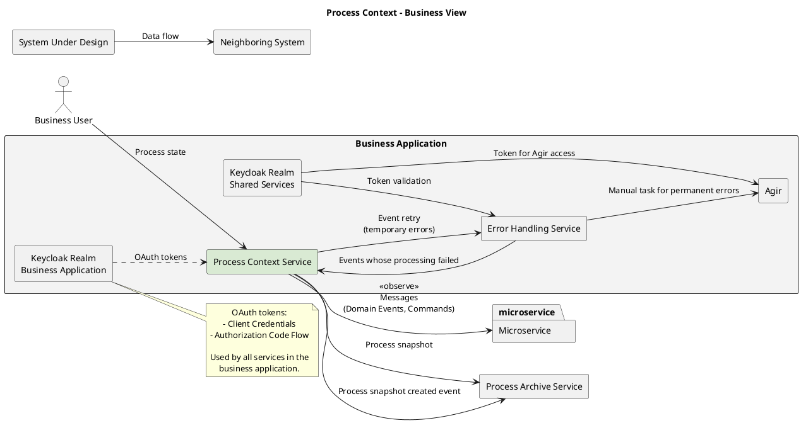

| Data flow | Description |
| --- | --- |
| Message (domain events, commands) | Messages (domain events, commands) relevant for the process state, containing a process ID or correlatable to a process instance via reference or payload in the message. Can create new process instances if marked accordingly in the process template. |
| Process snapshot created events | Event notification when process snapshots are created |
| Process state | Presentation of the state of the process and its tasks as a checklist in a user interface for the business user interested in the process state. Provision of the process state at a certain point in time as a process snapshot for archiving by a Process Archive Service instance. |

### Technical Context

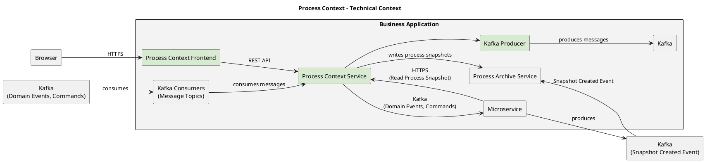

Not shown for clarity: Error Handling Service, Keycloak realms.

| Component | Channel | Description |
| --- | --- | --- |
| Browser | HTTPS | Read-only access to the REST API of the Process Context Service to display the state of the process |
| Microservice | Kafka | Microservices produce domain events which are consumed by the Process Context Service to update the state of the process instance |
| Process Archive Service | Kafka, HTTPS | Is informed about new snapshots via the [`ProcessSnapshotCreatedEvent`](https://github.com/jeap-admin-ch/jeap-message-type-registry/tree/main/descriptor/jeap/event/processsnapshotcreatedevent), retrieves snapshots for archiving via the REST API |
| Error Handling Service | Kafka | `MessageProcessingFailedEvent` for events whose processing failed is produced on the error topic; retries for failed events are published back to the topic on which they were originally produced |

## Solution Strategy

## Building Block View

### Whitebox Overall System

```plantuml
@startuml
title Process Context Service – White-box Overview

left to right direction

skinparam shadowing false
skinparam componentStyle rectangle
skinparam packageStyle rectangle
skinparam defaultTextAlignment center

package "Process Context Service" as processContextService {
  component "Application Core" as applicationCore #D9D2E9

  component "Ports" as ports #FFF2CC
  component "Driving Adapters" as drivingAdapters #CFE2F3
  component "Driven Adapters" as drivenAdapters #D9EAD3

  component "Process Context Frontend" as processContextFrontend
  component "REST API Adapter" as restApiAdapter #CFE2F3
  component "Kafka Consumer Adapter" as kafkaConsumerAdapter #CFE2F3
  component "Kafka Producer Adapter" as kafkaProducerAdapter #D9EAD3

  component "Domain Services & Model" as domainServicesModel #D9D2E9
  component "Plugin API Model" as pluginApiModel #D9D2E9

  component "ProcessUpdateService" as processUpdateService
  component "ProcessInstanceService" as processInstanceService

  component "Internal Message Producer" as internalMessageProducer #FFF2CC
  component "Template Repository" as templateRepository #FFF2CC
  component "Repositories" as repositories #FFF2CC
  component "ProcessSnapshot Repository" as processSnapshotRepository #FFF2CC

  component "Kafka Producer Adapter" as kafkaProducerAdapter2 #D9EAD3
  component "JSON Template Adapter" as jsonTemplateAdapter #D9EAD3
  component "Spring JPA Persistence Adapter" as springJpaPersistenceAdapter #D9EAD3
  component "S3 Object Storage Adapter" as s3ObjectStorageAdapter #D9EAD3

  component "Plugin API:\nCustom Conditions\nMessage Data Extractors" as pluginApi #FFF2CC
}

component "Process Context Frontend" as frontend
component "Kafka" as kafka #D9EAD3

frontend --> restApiAdapter : REST API
restApiAdapter ..> applicationCore : uses

kafkaConsumerAdapter --> applicationCore : uses
kafkaProducerAdapter ..> applicationCore : uses

applicationCore ..> processUpdateService : uses
applicationCore ..> processInstanceService : uses

processUpdateService ..> internalMessageProducer : uses
processInstanceService ..> repositories : uses
processInstanceService ..> templateRepository : uses
processInstanceService ..> processSnapshotRepository : uses

kafkaProducerAdapter2 ..> internalMessageProducer : implements
jsonTemplateAdapter ..> templateRepository : implements
springJpaPersistenceAdapter ..> repositories : implements
s3ObjectStorageAdapter ..> processSnapshotRepository : implements

applicationCore ..> pluginApiModel : uses
pluginApiModel ..> pluginApi : supports

kafkaConsumerAdapter ..> kafka : consumes
kafkaProducerAdapter ..> kafka : produces
kafkaProducerAdapter2 ..> kafka : produces

legend right
  |= Color |= Meaning |
  | <back:#D9D2E9>Lavender</back> | Application core and domain model |
  | <back:#FFF2CC>Yellow</back> | Ports and repository interfaces |
  | <back:#CFE2F3>Blue</back> | Driving adapters |
  | <back:#D9EAD3>Green</back> | Driven adapters |
endlegend

@enduml
``

| Component | Description |
| --- | --- |
| Domain Services | Domain logic and access across multiple aggregate roots, transaction control |
| Domain Model | Domain logic within an aggregate root (e.g. status changes / processing of events in the process) |
| Message Consumer Port | Receives events (task events, domain events) that can lead to changes in the process state (status, tasks) |
| Command Port | Receives commands to create new processes |
| Query Port | Offers query capabilities for processes (implemented e.g. as a read-only repository) |
| Event Producer Port | Offers the ability to publish task events, process status notification events |
| ProcessInstance Repository (Port) | Repository interface for process instances. Assumption: to avoid unnecessary mapping between JPA and the domain model, the domain model itself is persisted. An independent persistence model would be desirable, but the effort for the mapping is hard to justify |
| ProcessSnapshot Repository (Port) | Repository interface for persisting process snapshots |

### Whitebox Components Level 1

#### Domain Services & Model

```plantuml
@startuml
title Process Context Composition

left to right direction

skinparam shadowing false
skinparam componentStyle rectangle
skinparam packageStyle rectangle
skinparam defaultTextAlignment center

component "Kafka Broker" as kafkaBroker

queue "process-outdated-internal" as processOutdatedInternal

package "Domain Services & Model" as domainServicesModel #FFFFFF {
  component "<<domain service>>\nProcess Update Service" as processUpdateService #D9D2E9
  component "<<domain service>>\nProcess Instance Service" as processInstanceService #D9D2E9

  component "<<domain model>>\nMessage" as message #D9D2E9
  component "<<domain model>>\nProcess Instance" as processInstance #D9D2E9
}

database "Process\nInstance Repository" as processInstanceRepository
database "Process\nSnapshot Repository" as processSnapshotRepository

processUpdateService ..> message : <<consumes>>
processUpdateService ..> kafkaBroker : <<produces>>

processInstanceService ..> kafkaBroker : <<consumes>>
processInstanceService ..> processInstanceRepository
processInstanceService ..> processSnapshotRepository

processInstance ..> message : <<read-only ref>>

kafkaBroker --> processOutdatedInternal

@enduml
``

#### REST API

| Path | Verb | Body | Description | Authorization |
| --- | --- | --- | --- | --- |
| `/processes/{originProcessId}` | GET | Process Instance | Returns a specific process instance | Process View Role (typically assigned via OAuth Auth Code Flow to the business user of the frontend) |
| `/processes/{originProcessId}/messages` | GET | Message (Paged) | Returns a page of messages of a process instance | Process View Role |
| `/processes/{originProcessId}/message-data` | GET | Message Data (Paged) | Returns a page of messages of a process instance | Process View Role |
| `/processes/{originProcessId}/process-data` | GET | Process Data (Paged) | Returns a page of messages of a process instance | Process View Role |
| `/processes/{originProcessId}/process-relations` | GET | Process Relation (Paged) | Returns a page of messages of a process instance | Process View Role |
| `/processes/{originProcessId}/relations` | GET | Relations (Paged) | Returns a page of messages of a process instance | Process View Role |
| `/processes` | POST | Query | Search process instances | Process View Role |
| `/snapshot/{originProcessId}/{version}` | GET | | Returns a process snapshot version (see [Process Archive REST Interface for Process Snapshots](index.md#process-archive-rest-interface-for-process-snapshots)) | Snapshot View Role |

### Domain Model

In the following diagrams, the stereotype `<<domainentity>>` means that a class so marked
additionally has the following properties:

- id
- createdAt
- modifiedAt
- version

#### Aggregate Roots

```plantuml

@startuml
title Process Context Aggregate Roots

skinparam classAttributeIconSize 0
skinparam shadowing false

class "Pending Message" as PendingMessage
class "Process Instance" as ProcessInstance
class "Process Template" as ProcessTemplate
class Message {
  (incoming Message or Task-Event)
}
class "Process Snapshot" as ProcessSnapshot

ProcessInstance *-- ProcessTemplate

ProcessInstance --> Message : ref
PendingMessage --> Message : ref

ProcessSnapshot ..> ProcessInstance : represents

@enduml

```

| | |
| --- | --- |
| Process Instance | Process instance with status, task instances, process template, ... |
| Process Template | Process template that defines the tasks etc. to be executed for a process |
| Pending Message | Events which, on receipt, could not yet be correlated to an existing process instance. These are assigned to the process instance as soon as it is created. |
| Message | Messages (domain events, commands, or task events) with their message key/value data |
| Process Snapshot | Representation of a process instance at a certain point in time |

#### Aggregate ProcessInstance

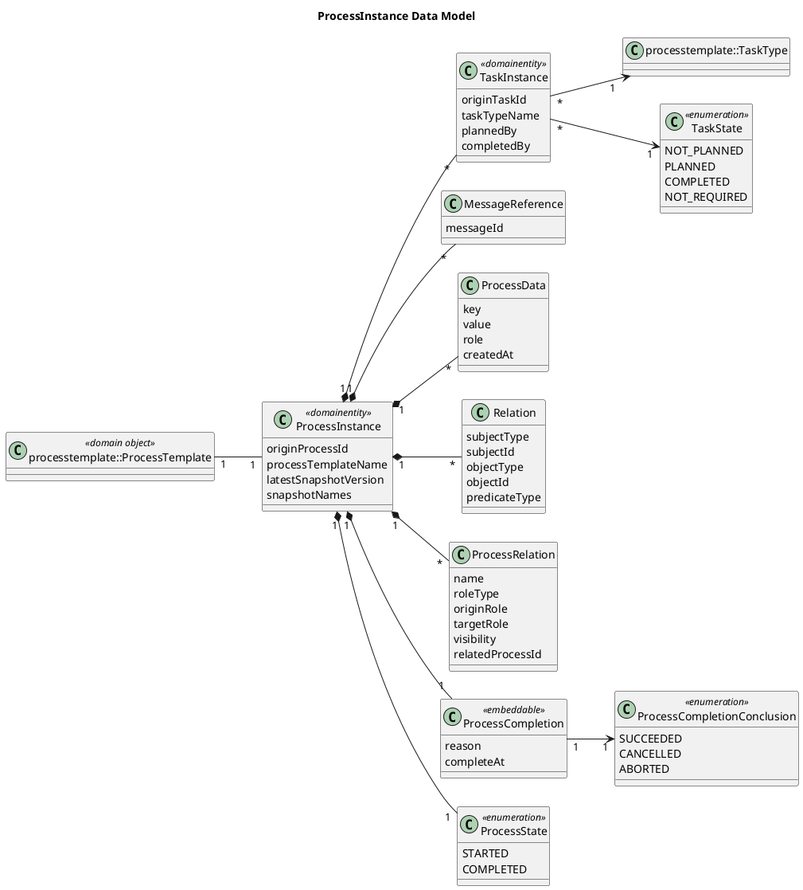

#### Aggregate Message

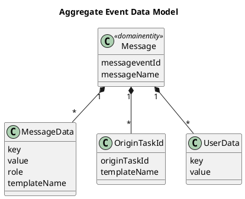

#### Aggregate PendingMessage

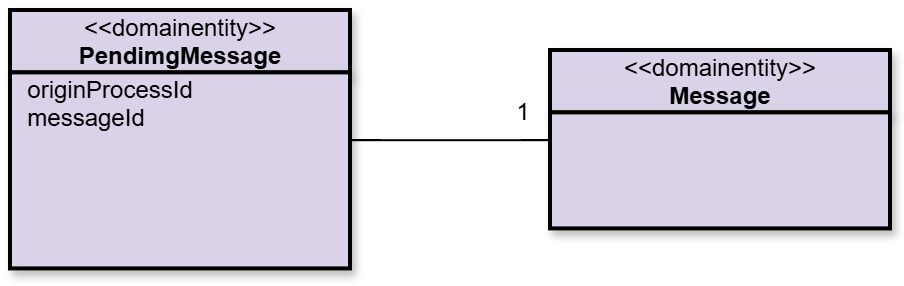

#### Aggregate ProcessTemplate

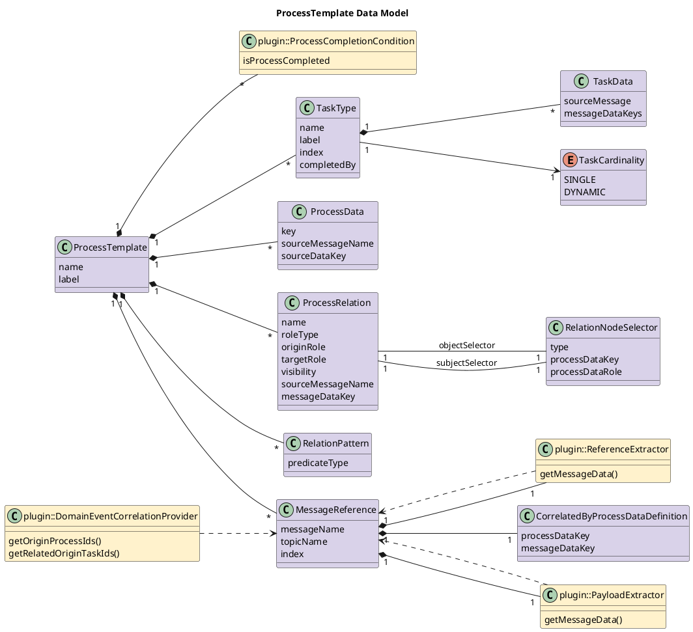

#### Aggregate ProcessSnapshot

A process snapshot represents the state of a process instance at a certain point in time. Its
purpose is the archiving of process states for the sake of traceability. A process snapshot
therefore does not represent the complete state of a process instance, but only the portion
needed for traceability. Snapshots are stored in the
[recommended Avro format](../process-archive-service/archive-type-registry.md)
for archiving by the Process Archive Service.

### Plugin API

#### Aggregate ProcessContext

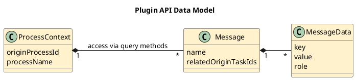

## Events

### Published Events (Process Status Events)

| EventType | References | Payload | Description |
| --- | --- | --- | --- |
| `ProcessSnapshotCreatedEvent` | originProcessId | snapshotVersion | A process snapshot version was created |

### Consumed Messages

| Message Type | References | Payload | Description |
| --- | --- | --- | --- |
| DomainEvent, Command | Depending on the message, references to the process/task are extracted by a correlation provider. Data is extracted by a custom payload/reference extractor. | | |

## Internal Messages

Internal Kafka messages are used to decouple the individual processing steps within the
Process Context Service (see [Runtime View](#runtime-view)). In particular, this concerns
decoupling from the partitioning of the originating topic, shortening transactions,
simplifying error handling, and generally increasing robustness.

These internal technical messages are modeled as jEAP domain events.

| Topic | Message Type | Payload | Description |
| --- | --- | --- | --- |
| process-instance-outdated | [`ProcessContextOutdatedEvent`](https://github.com/jeap-admin-ch/jeap-message-type-registry/tree/main/descriptor/jeap/event/processcontextoutdatedevent) | originProcessId; processUpdateType (MESSAGE_RECEIVED, PROCESS_CREATION_MESSAGE_RECEIVED, MIGRATION_TRIGGERED); messageId (if not a migration event); templateName (if a process creation event) | An event has occurred for a process instance that potentially affects the state of the instance -- the state of the process instance must be recalculated (or the instance must be created). |

## Runtime View

### Publication of Domain Events

When status changes occur in the process (process snapshot created) that trigger a domain
event, this event should be successfully published before the triggering event is
acknowledged. This ensures idempotent processing. If problems occur during processing, the
original event is forwarded to error handling and acknowledged. On a retry, idempotent
processing takes effect again.

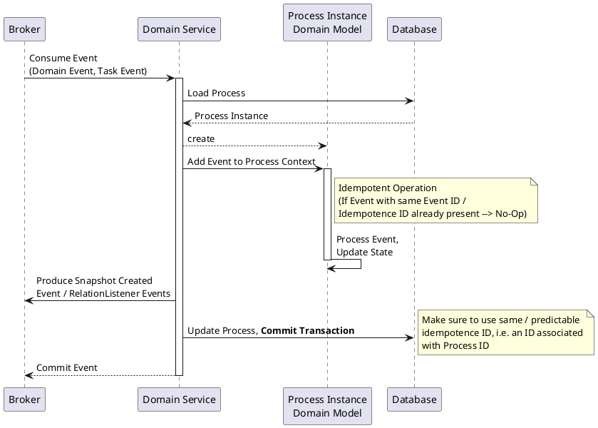

### Processing Chain from Consumed Messages to Produced Events

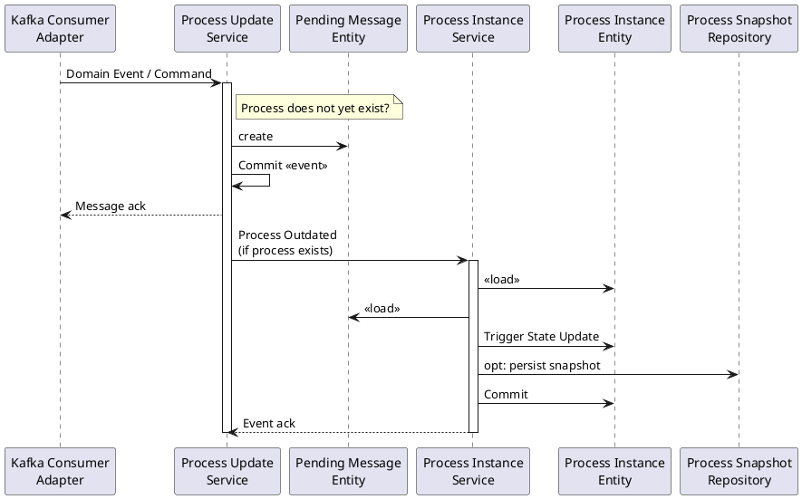

## Deployment View

### Infrastructure Level 1

The Process Context Service must support multiple instances. Operation of the app is the
responsibility of the teams; it is not realistic to impose the restriction on them that the
service a) is never scaled, and this is also never monitored, and b) never performs a
zero-downtime deployment (which requires at least temporary support for multiple instances).

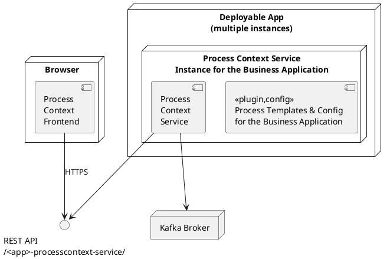

## Cross-Cutting Concepts

### Architectural Pattern

Ports-and-adapters architecture

- The domain model is at the center and can be tested separately
- The domain model implements the domain logic and is not anemic (no models with pure
  getters/setters)

### Persistence

- Process Instance: the domain model is persisted directly using JPA annotations on the
  fields of the class (no unnecessary getters/setters needed, encapsulation of the business
  logic is ensured)
- Process Template: loaded as JSON, persisted in the database
- Process Snapshot: stored in an S3 object store as Avro binary together with the metadata
  needed by the [Process Archive Service](../process-archive-service/index.md)

### Lifecycle / Versioning of Process Templates

Currently, the Process Context Service does not yet support versioning or migration of
process templates.

In the meantime, for non-backward-compatible changes to process templates (i.e. deleting /
renaming tasks, events, process data, ...), a new template must be created and, for example,
suffixed with V2.

Concept to be implemented: [Process Context Service Template Migration](template-migration.md)

### Handling Asynchronous Notifications and Eventual Consistency

Event processing per process instance must not happen in parallel. Serial processing of
events per process instance is important! However, the order does not matter. What matters is
solely the avoidance of race conditions.

This is to be implemented using internal processing events (see [Runtime View](#runtime-view)
and [Design Decisions](#design-decisions)). These events use, for example, the process
instance ID as the Kafka record key, which ensures serialization of the consumption of events
per process instance ID (see also [Kafka How-To](../kafka/kafka-how-to.md)).

### Late Correlation

Correlation based on process data allows a message to be assigned to a process instance based
on information that only becomes known to the process instance after the process has started.
It does not matter whether this information was already known to the process instance at the
time the message to be assigned was published or not.

If the message that writes the process data is processed before the message that is to be
correlated based on this process data, then the message to be correlated can already be
correlated in the ProcessUpdateService, based on a search for a process with the relevant
process data. If the messages arrive in the reverse order, correlation cannot take place in
the ProcessUpdateService, since the search for a process with the relevant process data is in
this case unsuccessful. The message still to be correlated can therefore initially simply be
stored in the ProcessUpdateService. Correlation can only take place later, once the relevant
process data becomes known (late correlation).

Late correlation takes place in the service that writes the process data, i.e. the
ProcessInstanceService. If this service creates new process data for a process instance based
on the data of a message newly added to the process instance, the service must check whether
this might allow certain already-received messages to now be newly correlated with the process
instance. To do this, the ProcessInstanceService performs a search, on the message data of
the events received so far, for the process data on the basis of which a correlation should
take place.

Correlation based on process data can therefore take place either already upon receipt of a
message in the ProcessUpdateService (early correlation), or only later, during the processing
of another message in the ProcessInstanceService (late correlation). It must be ensured that
correlation always takes place, even if an attempt at early correlation and an attempt at late
correlation occur practically simultaneously. The PCS ensures this with the help of
transactions.

To prevent race conditions, the processing of an event in the ProcessUpdateService as well as
in the ProcessInstanceService was split into two transactions each. In both cases, the data
generated due to the message is first saved in one transaction, and then the database queries
to determine correlations are performed in a second transaction. This split ensures that,
regardless of how these transactions between the ProcessUpdateService and the
ProcessInstanceService are interleaved, a correlation will always take place if one is
possible.

The following diagram schematically shows these transactions and the data involved.

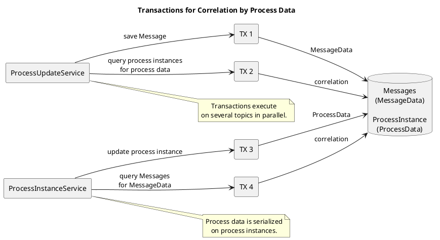

### Idempotency

**Process creation**

Via origin process ID: if already present, the command to create the process is ignored.

**Idempotent consumer**

See *Runtime View*.

### Error Handling

#### Error Handling for Events

The [Error Handling Service](../error-handling/index.md)
is used for errors that occur while processing an event. To this end, errors should be
classified, as described in the MessageProcessingFailed event documentation, into permanent /
temporary:

| Exception | Classification |
| --- | --- |
| `org.springframework.dao.TransientDataAccessException` | Temporary |
| `org.apache.kafka.common.errors.RetryableException` | Temporary |
| Everything else | Permanent |

#### Error Handling for REST APIs

See the styleguide and naming convention for REST APIs.

### Logging

See Logging (TODO Link) in the Microservices Blueprint.

Log levels:

| Level | Usage | Examples |
| --- | --- | --- |
| ERROR | Errors | - |
| WARN | Unexpected states which do not necessarily represent errors | - |
| INFO | Status transitions in processes | General information during startup; start of process instances; process status changes; planning / completing of tasks |
| DEBUG | Further details for analysis purposes (events, requests/responses, ...) | Request/response details; consumed/produced event records |

## Design Decisions

### Architectural Pattern

| | |
| --- | --- |
| Decision | Ports & Adapters, with an active domain model that implements the domain logic |
| Rationale | Clear structure, transaction boundaries, and domain logic are clearly located. Calculation of status transitions is centrally encapsulated in the model and not distributed. Separation of infrastructure / domain. Plugins of business applications can be implemented as adapters against ports (interface), i.e. encapsulated behind ports. |
| Alternatives considered | Layered architecture: somewhat less clearly defined structure |
| Time / context | Before start of implementation |

### Persistence

| | |
| --- | --- |
| Decision | **Option 1: domain model persisted directly using JPA** |
| Rationale | Lower effort & complexity. Conversion to event sourcing only if later needed/sensible. |
| Alternatives considered | See table below |
| Time / context | Before start of implementation |

| Option | Name | Description | Advantages | Disadvantages |
| --- | --- | --- | --- | --- |
| 1 | Domain model persisted directly using JPA | Classic JPA model, current state is persisted/updated | Low effort, simple implementation | Domain model has JPA dependencies, lower traceability since only the current state is known, not the history (partially visible through occurred events) |
| 2 | Domain model in-memory only, persistence via event sourcing (in database) | Domain model is pure Java; status transitions are persisted as events (ProcessInstantiated, EventReceived, ProcessCompleted, ...). Loading of the process context via event replay. | Good traceability, good expected performance through pure inserts to the database (no updates) | More complicated analyzability of the database, higher implementation effort due to an additional "layer" (for event sourcing), more complex implementation due to decoupling of model/persistence (every status transition must be modeled by an event) |

### Asynchronous Processing of Events Affecting Process State

Two-stage decision:

- Solution DB-centric (optimistic/pessimistic locking), or
- Solution event-driven (internal forwarding or trigger)

If event-driven:

- Forwarding with payload or trigger
- If trigger: payload for conditions yes/no
- If payload yes: how does it reach the condition (extract, DB, or topic)

| | |
| --- | --- |
| Decision | **Architecture also internally event-driven (Option 3)** -- the algorithm is 3-staged: consumption of the incoming event, persisting the event type in the process context, producing a technical event to update the process/task status (only the event type is persisted; references serve purely for traceability/analyzability in the UI, e.g. linking to an MRN); calculation of updates to the process/task status, producing a technical event to trigger reactions to the new state; calculating reactions (snapshots, process complete event), persisting them and, if not already done, producing corresponding domain events. Integration between the 3 stages takes place via technical Kafka events (no domain event definition), which keeps the transaction boundaries small and makes the partitioning, and thus the parallelism, independent of the originating topics. This also results in 4 aggregate roots -- one per stage (process-relevant events, process instance, process reactions) plus the process template. |
| Rationale | Clean decoupling, no DB-centric and thus non-scaling design |
| Alternatives considered | See table below |
| Time / context | Before start of implementation |

| Option | 1) Lock table for processing events per process (pessimistic locking) |
| --- | --- |
| Description | Pessimistic locking on a table specially created for this purpose (e.g. one row per process instance) in the database blocks processing if a process instance is already being modified. |
| Advantages | Simple implementation, least effort |
| Disadvantages | Scales poorly, suboptimal expected performance (unverified assumption). Since the parallel processing of events for the same process instance represents a special case, pessimistic locking optimizes for the special case. |
| Evolution potential | Locking can be replaced by another implementation. If conditions can access incoming events directly, an adapted solution will still need to provide their payloads. |

| Option | 2) Forward incoming events directly to an internal processing topic, keyed per process instance |
| --- | --- |
| Description | Events are forwarded to an internal processing topic, keyed by the origin process ID, so that serial processing can be ensured while still being able to partition/scale. |
| Advantages | Conditions can work directly on the incoming event and have all its data available. |
| Disadvantages | An event contract is needed for every forwarding (an exception might be possible so that no contract is needed). Teams would need to deal with the internals of the Process Context Service in order to formulate the contracts. |
| Evolution potential | Can be replaced by another implementation. If teams have captured contracts, they might be able to remove them again. If conditions can access incoming events directly, an adapted solution will still need to provide their payloads. |

| Option | 3) Store data from the incoming event, produce an internal trigger/processing event/command |
| --- | --- |
| Description | Incoming event types are persisted, then an internal processing event is produced. Its processing is serialized per process instance via the process instance ID as key. The topic of data extraction is somewhat simplified if, as described in the requirements for the Process Context Service, not the incoming event itself, but only its type & references are part of the model. |
| Advantages | No locking needed. Scaling of consumers possible (in return for possibly more DB overhead due to persisting the incoming event). Consumers of incoming events are simple & performant; internal topics can be partitioned/scaled independently. |
| Disadvantages | The original payload of the incoming event is harder to transport to the processing component -- either the necessary data from the original payload must be extracted and persisted (requiring a plugin that knows what "important" data is), or the entire event is persisted in the database, or the event is read again from the topic using an offset, or conditions cannot access the payload, and only the event type is persisted, with references serving traceability in the UI. Higher complexity/effort due to a separate processing component. |
| Evolution potential | Good decoupling, can be evolved well |

| Option | 4) Lock table for processing events per process (optimistic locking) |
| --- | --- |
| Description | Processing takes place directly in the event consumer of the incoming event. Conflicts are detected on commit to the database; processing takes place again after reloading the state. Status events may be produced multiple times in this case. |
| Advantages | Simple implementation, no "real" locks on the database. A special table is still needed for this (the process instance entity itself is not necessarily always changed, but possibly only a part of it). Since the parallel processing of events for the same process instance represents a special case, optimistic locking is a better fit for the problem (rollback in the special case instead of optimizing for the special case). |
| Disadvantages | Multiple event production may be difficult to trace. Since processing at the consumer of the status events must in any case be designed to be idempotent, this is acceptable. |
| Evolution potential | Same as *Option 1* |

Not considered in detail:

- Other cluster synchronization options such as Hazelcast
- Event sourcing directly on Kafka

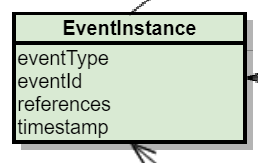

## Risks and Technical Debt

Currently none

## Glossary

Currently no entries

## Further Reading

- [jEAP Messaging](../index.md)
- [Ports and Adapters, Aggregate Roots, and Domain Events](https://paucls.wordpress.com/2018/05/31/ddd-aggregate-roots-and-domain-events-publication/)
- [Spring Data JPA -- Domain Events](https://docs.spring.io/spring-data/jpa/docs/current/reference/html/#core.domain-events)
