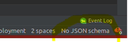
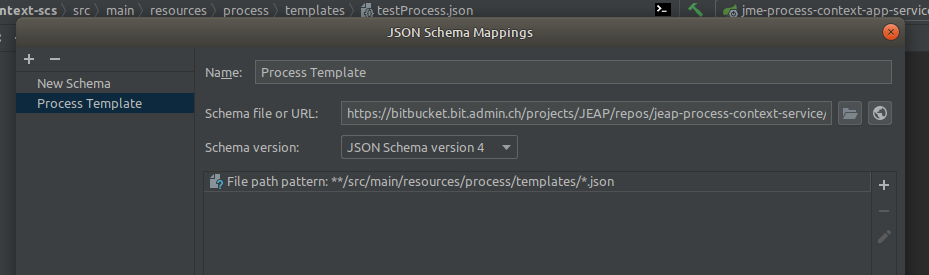
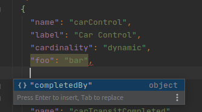
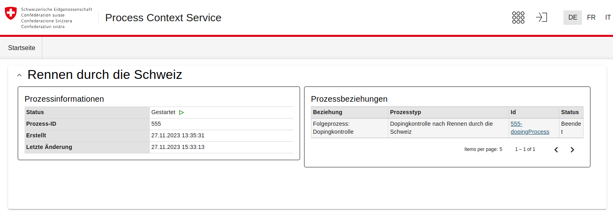
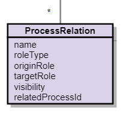

# Process Context Service How-To

## Overview

This article describes the integration of an instance of the Process Context Service for a
business application. For documentation of the service itself, see
[Process Context Service](index.md).

## Steps for Setting up a Process Context Service for a Business Application

### Creating a Microservice Instance Based on the Process Context Library

A Process Context Service is instantiated per business application, i.e. there is a source
code repository per instance with the following content:

- POM with references to the Process Context Library & the Plugin API
- Configuration files (`application-<env>.yml`)
- Optional: Java code for conditions / plugins

An instance of a Process Context Service can initially be created following this template
(please check that the latest versions of the parent & the Process Context Library are used)
([`jme-process-context-scs/pom.xml`](https://github.com/jme-admin-ch/jme-process-context-example/blob/main/jme-process-context-scs/pom.xml)
in [jme-process-context-example](https://github.com/jme-admin-ch/jme-process-context-example)):

```xml
<?xml version="1.0" encoding="UTF-8"?>
<project xmlns:xsi="http://www.w3.org/2001/XMLSchema-instance"
         xmlns="http://maven.apache.org/POM/4.0.0"
         xsi:schemaLocation="http://maven.apache.org/POM/4.0.0 http://maven.apache.org/xsd/maven-4.0.0.xsd">
    <modelVersion>4.0.0</modelVersion>

    <parent>
        <groupId>ch.admin.bit.jeap</groupId>
        <artifactId>jme-process-context-example</artifactId>
        <version>21.3.0-SNAPSHOT</version>
    </parent>

    <artifactId>jme-process-context-scs</artifactId>
    <name>${project.artifactId}</name>
    <packaging>jar</packaging>

    <properties>
        <main-class>ch.admin.bit.jeap.processcontext.Application</main-class>
    </properties>

    <dependencies>
        <dependency>
            <groupId>ch.admin.bit.jeap</groupId>
            <artifactId>jme-process-context-events</artifactId>
            <version>${project.version}</version>
        </dependency>
        <dependency>
            <groupId>ch.admin.bit.jeap</groupId>
            <artifactId>jeap-process-context-scs</artifactId>
            <version>${jeap-process-context-service.version}</version>
        </dependency>
        <dependency>
            <groupId>ch.admin.bit.jeap</groupId>
            <artifactId>jeap-process-context-plugin-api</artifactId>
            <version>${jeap-process-context-service.version}</version>
        </dependency>

        <dependency>
            <groupId>ch.admin.bit.jeap</groupId>
            <artifactId>jeap-spring-boot-monitoring-starter</artifactId>
        </dependency>
        <dependency>
            <groupId>ch.admin.bit.jeap</groupId>
            <artifactId>jeap-messaging-contract-annotations</artifactId>
        </dependency>

        <!-- Test dependencies -->
        <dependency>
            <groupId>org.springframework.boot</groupId>
            <artifactId>spring-boot-starter-test</artifactId>
            <scope>test</scope>
        </dependency>
        <dependency>
            <groupId>ch.admin.bit.jeap</groupId>
            <artifactId>jeap-spring-boot-security-starter-test</artifactId>
            <scope>test</scope>
        </dependency>
        <dependency>
            <groupId>au.com.dius.pact.provider</groupId>
            <artifactId>junit5</artifactId>
            <scope>test</scope>
        </dependency>
        <dependency>
            <groupId>com.h2database</groupId>
            <artifactId>h2</artifactId>
            <scope>test</scope>
        </dependency>
        <dependency>
            <groupId>ch.admin.bit.jeap</groupId>
            <artifactId>jeap-messaging-infrastructure-kafka-test</artifactId>
            <scope>test</scope>
        </dependency>
    </dependencies>
    <build>
        <plugins>
            <plugin>
                <groupId>org.springframework.boot</groupId>
                <artifactId>spring-boot-maven-plugin</artifactId>
                <configuration>
                    <mainClass>${main-class}</mainClass>
                </configuration>
                <executions>
                    <execution>
                        <!-- Skip repackaging to avoid building a fat jar -->
                        <phase>none</phase>
                    </execution>
                    <execution>
                        <id>spring-boot</id>
                        <goals>
                            <goal>build-info</goal>
                        </goals>
                    </execution>
                </executions>
            </plugin>
        </plugins>
    </build>
</project>
```

This template shows instantiation within a multi-module project. In the case of multi-module
projects, it is essential to ensure that the `jeap-spring-boot-parent` version used by the
parent matches the `jeap-spring-boot-parent` version used by the PCS dependencies. If the PCS
instance to be created is not part of a multi-module project, use
`jeap-process-context-service-instance` directly as the Maven project parent, which -- compared
to the template above -- makes the explicit declaration of the dependencies
`jeap-process-context-scs` and `jeap-process-context-plugin-api` unnecessary:

```xml
<parent>
    <groupId>ch.admin.bit.jeap</groupId>
    <artifactId>jeap-process-context-service-instance</artifactId>
    <version>use-the-latest-version-here</version>
    <relativePath/> <!-- lookup parent from repository -->
</parent>
```

The Process Context Example
([`jme-process-context-scs`](https://github.com/jme-admin-ch/jme-process-context-example/tree/main/jme-process-context-scs))
also contains examples for configuration (`application-*.yml`).

#### Ordering Kafka Topics for Events Produced/Consumed by the Process Context Service

The Process Context Service publishes and consumes events; accordingly, the following
[Kafka topics](../kafka/kafka-how-to.md) need to be ordered for each instance of a Process
Context Service (see also the
[example configuration](https://github.com/jme-admin-ch/jme-process-context-example/blob/main/jme-process-context-scs/src/main/resources/application.yml#L11)):

| Configuration key<br/>`jeap.processcontext.kafka.topic.*` | Messaging contract needed in the PCS | Suggested name | Usage | Recommended partitions |
| --- | --- | --- | --- | --- |
| process-outdated-internal | N | `<system>-process-processoutdated-internal` | Internal | Controls the internal maximum parallelization within the PCS. Increase in case of high load (e.g. from 3 to 6, see also "Concurrency" below). |
| process-snapshot-created | N | `<system>-process-snapshotcreated` | ProcessSnapshotCreatedEvent | |

#### Scaling / Concurrency

The PCS scales with the number of instances and partitions on the consumed topics.

- The number of partitions of the topics carrying events from the business applications
  controls the parallelism when consuming incoming events
    - Usually no scaling is necessary here, since the events are consumed very quickly
- The number of partitions of the topic for the `ProcessOutdatedEvent` controls the
  parallelism of internal processing in the PCS (state updates etc.)
    - For PCS instances with very high load, an increase in the number of partitions on these
      two topics is recommended, see "Recommended partitions" in the previous section

The maximum possible concurrency is calculated from

- number of instances * listener concurrency
    - number of instances: scaling of the infrastructure, number of container instances
    - listener concurrency: configuration in Spring, parallelization via threading:

```shell
spring:
  kafka:
    listener:
      concurrency: 3
```

#### Role Ordering in PAMS

| Semantic role | Usage |
| --- | --- |
| `<system>_@processinstance_#view` | PAMS role for users of the Process Context UI. **Must be created/ordered in PAMS and assigned to users.** |

The system name must be entered in the following two properties:

- `jeap.security.oauth2.resourceserver.system-name`
- `jeap.processcontext.frontend.system-name`

For an example, see
([`jme-process-context-scs/src/main/resources/application.yml`](https://github.com/jme-admin-ch/jme-process-context-example/blob/main/jme-process-context-scs/src/main/resources/application.yml)
in jme-process-context-example):

```yaml
server:
  servlet:
    context-path: /process-context

spring:
  application:
    name: jme-process-context-scs
  jpa:
    properties:
      hibernate:
        default_schema: data
  datasource:
    hikari:
      schema: ${spring.jpa.properties.hibernate.default_schema}
  flyway:
    # Flyway creates automatically the default schema if it doesn't exist
    default-schema: ${spring.jpa.properties.hibernate.default_schema}
  main:
    banner-mode: off
jeap:
  messaging:
    kafka:
      error-topic-name: jme-messageprocessing-failed
      system-name: JME
      service-name: ${spring.application.name}
  processcontext:
    release:
      min-version: 17
    kafka:
      filters:
        JmeRaceStartedEvent: ch.admin.bit.jeap.jme.processcontext.event.JmeRaceStartedEventMessageFilter
      topic:
        process-outdated-internal: "jme-process-event-received"
        process-snapshot-created: "jme-process-snapshotcreated"
    frontend:
      clientId: "process-context"
      silentRenew: true
      systemName: "jme"
      autoLogin: true
      renewUserInfoAfterTokenRenew: true
      logoutRedirectUri: "https://localhost:8080/logout"
    objectstorage:
      snapshot-retention-days: 3
  security:
    oauth2:
      resourceserver:
        system-name: "jme"
logging:
  level:
    org:
      apache:
        kafka: WARN
      springframework:
        kafka: WARN
    io:
      confluent:
        kafka: WARN
```

### Creating Process Templates (= Process Definition)

See also: [Process Context Service -- Process Definition (Process Template)](index.md#process-definition-process-template)

The Process Context Service loads Process Templates as resources from the classpath following
the pattern `process/templates/*.json`:


See the complete `raceProcess.json` example in
[Process Context Service](index.md#process-definition-process-template), also available at
[`jme-process-context-scs/src/main/resources/process/templates/raceProcess.json`](https://github.com/jme-admin-ch/jme-process-context-example/blob/main/jme-process-context-scs/src/main/resources/process/templates/raceProcess.json).

#### Setting up the JSON Schema for Process Templates

A JSON schema is available for Process Templates, which supports editing Process Templates in
the IDE with code completion and validation. To use it, open a Process Template JSON file and
select "No JSON schema" in the bottom right of IntelliJ:



Now create a new JSON schema mapping using "New/Edit Schema Mapping":

- Schema URL: [https://raw.githubusercontent.com/jeap-admin-ch/jeap-process-context-service/main/jeap-process-context-repository-template-json/src/main/schema/process-template-schema.json](https://raw.githubusercontent.com/jeap-admin-ch/jeap-process-context-service/main/jeap-process-context-repository-template-json/src/main/schema/process-template-schema.json)
- File path pattern: `**/src/main/resources/process/templates/*.json`



Process Templates are now validated and offer code completion:



### Instantiation of Processes from a Microservice

#### Message (Domain Event or Command)

Instances of a process in the Process Context Service can be created by means of a message
(domain event or command). For an instance to be created upon receipt of a message, the
property `triggersProcessInstantiation` or the property `processInstantiationCondition`
(*from PCS version 5.30.0*) must be set on the corresponding message declaration in the
process template.

In the first case, the corresponding process instance is always created; in the second case,
the process instance is only created if the condition configured in the property is met. The
condition must be implemented in a class that implements the interface
`ProcessInstantiationCondition` and, in the method `triggersProcessInstantiation`, decides
based on the received event whether a process instance should be created or not.

The Process Context Service, upon receipt of a message, only creates a new process instance if
no instance with the given process ID already exists. The process ID (e.g. a natural business
ID or a UUID) is read by default from the `processId` attribute of the message. Alternatively,
a `CorrelationProvider` can be specified in the message declaration in the process template.

Example of unconditional process instantiation upon receipt of a message:

```json
...
  "messages": [
    {
      "messageName": "JmeRacePreparedEvent",
      "topicName": "jme-race-prepared",
      "triggersProcessInstantiation": true
    }
...
```

Example of conditional process instantiation upon receipt of a domain event:

```json
...
  "messages": [
    {
      "messageName": "JmeRacePreparedEvent",
      "topicName": "jme-race-prepared",
      "processInstantiationCondition": "ch.admin.bit.jeap.jme.processcontext.condition.RacePreparedProcessInstantiationCondition"
    }
...
```

The property `triggersProcessInstantiation` can additionally be specified alongside a
process instantiation condition if needed. If it is `false`, this disables the specified
condition, i.e. no process instance is created even if the condition is met.

Example of a process instantiation condition:

```java
...
public class RacePreparedProcessInstantiationCondition implements ProcessInstantiationCondition<JmeRacePreparedEvent> {
    @Override
    public boolean triggersProcessInstantiation(JmeRacePreparedEvent event) {
        // Don't create a process if the race car id is "test-car"
        return !"test-car".equals(event.getPayload().getRaceCarNumber());
    }
}
```

::::warning
**It must be ensured that a message can start a process for only *one* process template.**
The same message type may be configured, in several process templates, to start a process of
that template. In this case, however, process instantiation conditions must be specified on
the message declarations in the different process templates that mutually exclude each other.

If, at startup, the PCS finds process template configurations that are guaranteed to lead to
the creation of processes of different process templates upon receipt of a message, the PCS
will abort its startup with a corresponding exception and an explanatory error log entry. Such
configurations can be, for example, that the same message type is configured with
`"triggersProcessInstantiation": true` in two process templates, or that
`"triggersProcessInstantiation": true` is configured in one process template while, for the
same message type, a process instantiation condition is configured in another template, or
that the same process instantiation condition is configured for the same message type in two
process templates.

The background is that the process ID must be globally unique within the Process Context
Service.
::::

### Consuming Process-Related Domain Events

To update the state of a process instance by means of messages, the messages must be
referenced in the process template as described under
[Process Context Service -- Messages](index.md#messages). It is only necessary to ensure that
the Process Context Service of the business application has at least read permission on the
topics on which these messages are published.

The PCS supports the multiple-cluster concept. See
[Support for Multiple Kafka Clusters](../jeap-messaging-library/support-for-multiple-kafka-clusters.md)
for details. If domain events need to be read from different clusters, the cluster can
optionally be defined per domain event, indicating where the topic exists.

**The internal messages of the PCS are always sent and received on the default cluster.**

### Implementation of Custom Conditions for Task Completion

The way conditions work for the completion of tasks is described under
[Process Context Service -- Task Completion via Message (Domain Event)](index.md#task-completion-via-message-domain-event).

If the conditions provided by default are not sufficient, custom conditions can be
implemented in Java code. These are placed on the classpath of the Process Context Service
(`src/main/java` or in a dependency) and referenced from the process template via the class
name; see also
[the example](https://github.com/jme-admin-ch/jme-process-context-example/tree/main/jme-process-context-scs/src/main/java/ch/admin/bit/jeap/jme/processcontext/condition).

### Implementation of Custom PayloadExtractors

The `PayloadExtractor` mechanism is described under
[Process Context Service -- PayloadExtractor](index.md#payloadextractor).

A possible implementation is available in the JME Process Context Example. In this example, a
few elements from the payload are stored as event data (key/value)
([`jme-process-context-scs/src/main/java/ch/admin/bit/jeap/jme/processcontext/event/JmeRaceMobileCheckpointPassedEventPayloadExtractor.java`](https://github.com/jme-admin-ch/jme-process-context-example/blob/main/jme-process-context-scs/src/main/java/ch/admin/bit/jeap/jme/processcontext/event/JmeRaceMobileCheckpointPassedEventPayloadExtractor.java)):

```java
package ch.admin.bit.jeap.jme.processcontext.event;

import ch.admin.bit.jeap.jme.processcontext.event.race.mobilecheckpoint.passed.JmeRaceMobileCheckpointPassedEventPayload;
import ch.admin.bit.jeap.processcontext.plugin.api.message.MessageData;
import ch.admin.bit.jeap.processcontext.plugin.api.message.PayloadExtractor;

import java.time.ZoneOffset;
import java.time.format.DateTimeFormatter;
import java.util.Set;

public class JmeRaceMobileCheckpointPassedEventPayloadExtractor implements PayloadExtractor<JmeRaceMobileCheckpointPassedEventPayload> {

    @Override
    public Set<MessageData> getMessageData(JmeRaceMobileCheckpointPassedEventPayload payload) {
        return Set.of(
                new MessageData("taskId", payload.getTaskId()),
                new MessageData("state", payload.getState()),
                new MessageData("date", payload.getControlDate().atZone(ZoneOffset.UTC).format(DateTimeFormatter.ISO_DATE_TIME)));
    }
}
```

### (Optional) Implementation of a Plugin for Relation Notification

Based on process data that arises, the PCS can determine typed relationships between business
objects (subject --predicate--> object). This can be used, for example, to establish these
relationships within the PCS for traceability purposes, and to implement a business-application-
specific plugin to notify this relationship, e.g. via an event or command.

```java
// Definition of process data, extracted from event data
"processData": [
  {
    "key": "mobileCheckpoint",
    "source": {
      "message": "JmeRaceMobileCheckpointPassedEvent",
      "messageDataKey": "mobileCheckpoint"
    }
  }
],
// Definition of a relationship of a certain type, established when process data identifying subject/object are present
"relationSystemId": "ch.admin.race.RaceSys",
"relationPatterns": [
  {
    "predicateType": "ch.admin.race.PassedControlpoint",
    "subject": {
      "type": "ch.admin.race.RaceCarId",
      "selector": {
        "processDataKey": "raceCarId",
        "role": "RaceParticipant"
      }
    },
    "object": {
      "type": "ch.admin.jeap.race.Controlpoint",
      "selector": {
        "processDataKey": "passedControlpoint"
      }
    }
  }
]
```

A Spring bean that processes these relations and, based on them, e.g. triggers an event, can
now simply be provided in the PCS instance. Typically, this aspect is solved once per system
group and provided as a library. To do so, the bean must implement the following interface
([`jeap-process-context-plugin-api/src/main/java/ch/admin/bit/jeap/processcontext/plugin/api/relation/RelationListener.java`](https://github.com/jeap-admin-ch/jeap-process-context-service/blob/main/jeap-process-context-plugin-api/src/main/java/ch/admin/bit/jeap/processcontext/plugin/api/relation/RelationListener.java)):

```java
package ch.admin.bit.jeap.processcontext.plugin.api.relation;

import java.util.Collection;

/**
 * Can be implemented by process context service instances to be notified when new relations have been discovered
 * in a process instance.
 */
public interface RelationListener {

    /**
     * Invoked when new relations have been added to a process
     *
     * @param relations New relations discovered between business entities (subject -- predicate -- object),
     *                 as defined by relation patterns in the process template.
     */
    void relationsAdded(Collection<Relation> relations);
}
```

Publishing of relations can be enabled per relation pattern using a feature flag. If no
feature flag is configured, the relations are always published.

If a feature flag is configured for a relation pattern, the relation is only published if the
feature flag is active at the time of processing.

```java
...
  "relationPatterns": [
    {
      "predicateType": "ch.admin.race.PassedControlpoint",
      ...
      "featureFlag": "FEATURE_CONTROL_POINT"
    },
    {
      "predicateType": "ch.admin.race.PostChecksResultProcessed",
      ...
      "featureFlag": "FEATURE_POST_CHECK_RESULT"
    }
  ],
...
```

In this case, 2 feature flags must be configured for the relations to be published:

```java
togglz:
  features:
    FEATURE_CONTROL_POINT:
      enabled: true
    FEATURE_POST_CHECK_RESULT:
      enabled: true
```

See [Feature Flag in the PCS](index.md#relationpatterns-with-feature-flag-from-pcs-v1312) for
more information about feature flags.

### (Optional) Configuring MessageFilters

If not all messages of a type are relevant, a `MessageFilter` can be defined. Messages that do
not meet the specified filter criterion are ignored by the PCS.

Since filtering is centralized for the whole PCS rather than per template, `MessageFilters`
are defined in the application configuration (e.g. `application.yml`) -- not in the
individual templates.

Example of the definition in the application configuration
([`jme-process-context-scs/src/main/resources/application.yml`](https://github.com/jme-admin-ch/jme-process-context-example/blob/main/jme-process-context-scs/src/main/resources/application.yml)):

```yaml
processcontext:
    release:
      min-version: 17
    kafka:
      filters:
        JmeRaceStartedEvent: ch.admin.bit.jeap.jme.processcontext.event.JmeRaceStartedEventMessageFilter
```

Example of an implementation of a MessageFilter
([`jme-process-context-scs/src/main/java/ch/admin/bit/jeap/jme/processcontext/event/JmeRaceStartedEventMessageFilter.java`](https://github.com/jme-admin-ch/jme-process-context-example/blob/main/jme-process-context-scs/src/main/java/ch/admin/bit/jeap/jme/processcontext/event/JmeRaceStartedEventMessageFilter.java)):

```java
package ch.admin.bit.jeap.jme.processcontext.event;

import ch.admin.bit.jeap.jme.processcontext.event.race.started.JmeRaceStartedEvent;
import ch.admin.bit.jeap.processcontext.plugin.api.message.MessageFilter;
import lombok.extern.slf4j.Slf4j;

@Slf4j
public class JmeRaceStartedEventMessageFilter implements MessageFilter<JmeRaceStartedEvent> {

    @Override
    public boolean filter(JmeRaceStartedEvent message) {
        log.info("Filtering JmeRaceStartedEvent Event: {}", message);
        if (message.getReferences().getWeatherAlertSubjectReference() != null && message.getReferences().getWeatherAlertSubjectReference().getWeatherAlertSubject().toLowerCase().contains("filter")) {
            log.info("WeatherAlertSubjectReference '{}' contains 'filter': ignoring message", message.getReferences().getWeatherAlertSubjectReference());
            return false;
        }
        return true;
    }
}
```

### Receiving Encrypted Kafka Records with jeap-messaging

The PCS can also receive Kafka records encrypted with jeap-messaging / jeap-crypto. See
jEAP Crypto -- Integration (TODO Link)
for the configuration and required dependencies (`jeap-vault-starter` and
`jeap-crypto-vault-starter`).

The Kafka record carries a reference to the wrapping key used, from Vault. Usually only
configuring the Vault URL (`jeap.vault.system-name`) and the system name is necessary.

### Configuring Housekeeping

The Process Context Service automatically deletes old data from the database. Deletion of
process instances always includes the associated process updates and process events.
Housekeeping can be configured as follows:

| Configuration key<br/>`jeap.processcontext.housekeeping.*` | Default value | Description |
| --- | --- | --- |
| `cron-expression` | `0 20 0 * * *` | The housekeeping job runs daily at 00:20 |
| `lock-at-least` | 5 seconds | Minimal time for the lock for this job |
| `lock-at-most` | 30 minutes | Maximal time for the lock for this job |
| `completed-process-instances-max-age` | 180 days (P180D) | Completed processes are deleted after 180 days. Note: [Duration syntax](https://docs.oracle.com/javase/8/docs/api/java/time/Duration.html#parse-java.lang.CharSequence-)! |
| `started-process-instances-max-age` | 365 days (P365D) | Non-completed processes are deleted after 365 days. Note: [Duration syntax](https://docs.oracle.com/javase/8/docs/api/java/time/Duration.html#parse-java.lang.CharSequence-)! |
| `events-max-age` | 90 days (P90D) | Events are deleted after 90 days, if they are not referenced by a process instance. Note: [Duration syntax](https://docs.oracle.com/javase/8/docs/api/java/time/Duration.html#parse-java.lang.CharSequence-)! |
| `page-size` | 100 | Number of records deleted at once |

See also
([`jeap-process-context-domain/src/main/java/ch/admin/bit/jeap/processcontext/domain/housekeeping/HouseKeepingConfigProperties.java`](https://github.com/jeap-admin-ch/jeap-process-context-service/blob/main/jeap-process-context-domain/src/main/java/ch/admin/bit/jeap/processcontext/domain/housekeeping/HouseKeepingConfigProperties.java)):

```java
package ch.admin.bit.jeap.processcontext.domain.housekeeping;

import lombok.Data;
import org.springframework.boot.context.properties.ConfigurationProperties;
import org.springframework.context.annotation.Configuration;

import java.time.Duration;
import java.time.temporal.ChronoUnit;

/**
 * Configuration for the automatic housekeeping
 */
@Configuration
@ConfigurationProperties(prefix = "jeap.processcontext.housekeeping")
@Data
public class HouseKeepingConfigProperties {

    /**
     * How often to run the scheduler? Must be a cron expression. Default: Once a Day at 00:20
     * see {@link org.springframework.scheduling.support.CronExpression}
     */
    private String cronExpression = "0 20 0 * * *";

    /**
     * Minimal time to keep a lock at this job,
     * see {@link net.javacrumbs.shedlock.spring.annotation.SchedulerLock}
     */
    private Duration lockAtLeast = Duration.of(5, ChronoUnit.SECONDS);
    /**
     * Maximal time to keep a lock at this job,
     * see {@link net.javacrumbs.shedlock.spring.annotation.SchedulerLock}
     */
    private Duration lockAtMost = Duration.of(30, ChronoUnit.MINUTES);

    /**
     * Delete completed process instances older than this value [duration]. Default is 180 days
     */
    private Duration completedProcessInstancesMaxAge = Duration.of(180, ChronoUnit.DAYS);

    /**
     * Delete started process instances older than this value [duration]. Default is 365 days
     */
    private Duration startedProcessInstancesMaxAge = Duration.of(365, ChronoUnit.DAYS);

    /**
     * Delete events without correlation with a process instance older than this value [duration]. Default is 90 days
     */
    private Duration eventsMaxAge = Duration.of(90, ChronoUnit.DAYS);

    /**
     * Delete completed maintenance jobs older than this value [duration]. Default is 30 days
     */
    private Duration completedMaintenanceJobsMaxAge = Duration.of(30, ChronoUnit.DAYS);

    /**
     * Size for the queries [pages]. Default is 500
     */
    private int pageSize = 500;

    /**
     * Max. pages to housekeep in one run. This limits the amount of time one housekeeping run can max. spend
     * (the time to delete maxPages * pageSize elements of each kind).
     */
    private int maxPages = 100000;
}
```

### Configuring the Process Template Migration Scheduler

See [Process Context Service -- Changes to Existing Templates (Migration)](index.md#changes-to-existing-templates-migration).

### Process Relations

From version 7.1.0 of the process-context-service, relationships between different process
instances can be displayed:



For the PCS to know which processes are related to each other, this can be defined in the
process template according to the following structure:

```java
"processRelationPatterns": [
  {
    "name": "aName",                // unique name for i18n purposes (same concept as already implemented in the PCS)
    "roleType":   "origin",         // origin | target
    "originRole": "fallback text",  // relevant if relationRole=target|both
    "targetRole": "fallback text",  // relevant if relationRole=origin|both
    "visibility": "both",           // origin | target | both
    "source": {
      "messageName": "SomeMessage",
      "messageDataKey": "relatedProcessId"
    }
  }
]
```

The following rules apply:

- The name in "name" must be unique per ProcessRelationPattern.
- The message defined under `source.messageName` must also be defined in the process
  template under "messages".

**How it works**

When a message is correlated with the process instance, it is checked whether the message is
declared as a source (`source.messageName`) in a `processRelationPattern`.

If this is the case, the message is expected to contain the declared `messageDataKey` (in the
example above, `relatedProcessId`), and the value of this key/value pair is stored in the
`ProcessRelation` entity's `RelatedProcessId` field. The information from the template, such
as RoleType, Visibility, OriginRole, TargetRole, is also added to the entity.



**I18N**

For the texts originRole and targetRole to be displayed in the UI depending on the language,
they must be defined in `messaging.properties`. Otherwise, the corresponding text is taken as
a fallback from the process template.

```java
someProcess.aName.originRole=Vorprozess
someProcess.aName.targetRole=Folgeprozess
```

### Internationalization of a Template (i18n)

The following elements of a process are displayed in the UI and must be translated:

- Template name
- Task names
- Reason for process completions
- Relations origin and target roles
- Keys of user data of messages
- Keys of task data

Translations (DE, FR, IT) must be defined in the `process/messages` directory:

- `messages.properties` (DE)
- `messages_fr.properties` (FR)
- `messages_it.properties` (IT)

#### Defining Translations

Name of a process:

```text
<process-name>.label=Rennen durch die Schweiz
```

Name of a task:

```text
<process-name>.task.<task-name>=Rennen starten
```

Key of a task data entry:

```text
<process-name>.task.<task-name>.data.<key>=Treibstofftyp
```

User data of messages:

```text
userData.<key-name>=Vorname
...
```

Reason for a process completion:

```text
<process-name>.completion.<completion-name>=Sofortiger Abbruch des Rennens wegen Wetterwarnung
```

The completion name must either be defined in the process template:

```yaml
"completedBy": {
	"message": "JmeRaceWeatherAlertActivatedEvent",
	"conclusion": "aborted",
	"name": "raceWeatherAlertAborted"
}
```

or in Java code if a programmatically formulated completion condition is used:

```java
 @Override
public ProcessCompletionConditionResult isProcessCompleted(ProcessContext processContext) {
	...
	return ProcessCompletionConditionResult.completedBuilder()
		.conclusion(ProcessCompletionConclusion.CANCELLED)
		.name("tooManyMaintenanceStopsProcessCompletionCondition")
		.build();
	...
}
```

Relations origin roles:

```text
<process-name>.<relation-name>.originRole=Eine Beschreibung für die Origin Rolle
```

Relations target roles:

```text
<process-name>.<relation-name>.targetRole=Eine Beschreibung für die Target Rolle
```

#### Default Translations

Default translations are already predefined for general elements and do not need to be
defined again in the instance. However, these default translations can be overridden in the
instance.

List of currently defined default translations
([`jeap-process-context-domain/src/main/resources/default-messages/messages.properties`](https://github.com/jeap-admin-ch/jeap-process-context-service/blob/main/jeap-process-context-domain/src/main/resources/default-messages/messages.properties)):

```text
#Default completion conditions defined in jeap-process-context for all processes
completion.allTasksInFinalStateProcessCompletionCondition=Alle Prozessaufgaben haben einen Endzustand erreicht
completion.legacyProcessCompletionCondition=Alle Aufgaben wurden geplant und zu einem endgültigen Stand gebracht

# Default Message UserData
userData.id=Benutzer-ID
userData.familyName=Nachname
userData.givenName=Vorname
userData.businessPartnerName=Geschäftspartner
userData.businessPartnerId=Geschäftspartner-ID
```

#### Examples

German
([`jme-process-context-scs/src/main/resources/process/messages/messages.properties`](https://github.com/jme-admin-ch/jme-process-context-example/blob/main/jme-process-context-scs/src/main/resources/process/messages/messages.properties)):

```text
#Process name
raceProcess.label=Rennen durch die Schweiz

#Tasks
raceProcess.task.raceStart=Rennen starten
raceProcess.task.passRaceControlpoint=Kontrollpunkt passieren
raceProcess.task.passRaceMobileCheckpoint=Mobilen Checkpoint passieren
raceProcess.task.passRaceDestination=Ziel passieren
raceProcess.task.validateRace=Rennstrecke validieren
raceProcess.task.raceCarPostChecks=Rennwagen Nachkontrolle
raceProcess.task.raceCarRefuel=Rennwagen betanken
raceProcess.task.raceCarRefuel.data.parkingSpotNumber=Parkplatznummer
raceProcess.task.raceCarRefuel.data.fuelType=Treibstofftyp
raceProcess.task.raceCarRefuel.data.fuelAmount=Treibstoffmenge
raceProcess.task.raceCarTirePressureCheck=Reifendruck prüfen
raceProcess.task.objectsOnRoadSpotted=Objekte auf der Fahrbahn
raceProcess.task.cancelRace=Abbruch des Rennens
raceProcess.task.triggerSafetyCar=Einsatz Safety Car auslösen
raceProcess.task.racePrepared=Rennen vorbereiten

#Custom completion conditions
raceProcess.completion.raceWeatherAlertAborted=Sofortiger Abbruch des Rennens wegen Wetterwarnung
raceProcess.completion.raceCancelled=Sofortiger Abbruch des Rennens aufgrund einer Entscheidung der Rennleitung
raceProcess.completion.tooManyMaintenanceStopsProcessCompletionCondition=Das Auto wurde disqualifiziert und das Rennen wurde wegen zu vieler Wartungsstopps abgesagt

# DopingProcess
dopingProcess.label=Dopingkontrolle nach Rennen durch die Schweiz
dopingProcess.processRelationToRaceProcess.originRole=Vorprozess: Rennen durch die Schweiz
dopingProcess.processRelationToRaceProcess.targetRole=Folgeprozess: Dopingkontrolle
dopingProcess.task.dopingProcessStart=Doping Kontrolle starten

# Document Review Process
documentReviewProcess.label=Process for a simple document review process
documentReviewProcess.task.finishVersionReview=Finish version review
documentReviewProcess.task.finishReview=Finish review

# Performance Test Processes
perfestHighMessageCount.label=Perftest High Message Count
perfestHighMessageCount.task.raceStarted=Rennen gestartet
perfestHighMessageCount.task.objectsOnRoadSpotted=Objekte auf der Fahrbahn gesichtet
perfestHighMessageCount.completion.allControlPointsPassedCompletionCondition=Done
perfestSimpleProcess.label=Perftest Simple Process
perfestSimpleProcess.task.processCreated=Prozess erstellt
perfestSimpleProcess.task.controlpointPassed=Kontrollpunkt passiert
perfestSimpleProcess.completion.tenControlPointsPassedCompletionCondition=Done
perfestProcessRelations.label=Perftest Process Relations
perfestProcessRelations.task.processCreated=Prozess erstellt
perfestProcessRelations.task.raceCancelled=Rennen abgebrochen
perfestProcessRelations.completion.tenControlPointsPassedCompletionCondition=Done
perfestProcessRelations.processRelation.targetRole=Ziel
perfestProcessRelations.processRelation.originRole=Quelle
perfestProcessContextQueries.label=Perftest Queries
perfestProcessContextQueries.task.documentReviewed=Review abgeschlossen
perfestProcessContextQueries.completion.completed=Done

# Define userData Keys that are not default
userData.customsOffice=Dienststelle
```

French
([`jme-process-context-scs/src/main/resources/process/messages/messages_fr.properties`](https://github.com/jme-admin-ch/jme-process-context-example/blob/main/jme-process-context-scs/src/main/resources/process/messages/messages_fr.properties)):

```text
#Process name
raceProcess.label=Course à travers la Suisse

#Tasks
raceProcess.task.raceStart=Démarrer la course
raceProcess.task.passRaceControlpoint=Passer le point de contrôle
raceProcess.task.passRaceMobileCheckpoint=Passer un point de contrôle mobile
raceProcess.task.passRaceDestination=Passer la ligne d'arrivée
raceProcess.task.validateRace=Valider le circuit
raceProcess.task.raceCarPostChecks=Suivi des voitures de course
raceProcess.task.raceCarRefuel=Faire le plein des voitures de course
raceProcess.task.raceCarRefuel.data.parkingSpotNumber=Numéro de place de parking
raceProcess.task.raceCarRefuel.data.fuelType=Type de carburant
raceProcess.task.raceCarRefuel.data.fuelAmount=Quantité de carburant
raceProcess.task.raceCarTirePressureCheck=Vérifier la pression des pneus
raceProcess.task.objectsOnRoadSpotted=Objets sur la chaussée
raceProcess.task.cancelRace=Abandon de la course
raceProcess.task.triggerSafetyCar=Déclencher l'intervention de la voiture de sécurité
raceProcess.task.racePrepared=Préparer la course

#Custom completion conditions
raceProcess.completion.raceWeatherAlertAborted=Course interrompue immédiatement en raison d'une alerte météorologique
raceProcess.completion.raceCancelled=Course interrompue immédiatement en raison d'une décision du comité de course
raceProcess.completion.tooManyMaintenanceStopsProcessCompletionCondition=La voiture a été disqualifiée et sa course a été annulée en raison d'un trop grand nombre d'arrêts de maintenance

# DopingProcess
dopingProcess.label=Contrôle antidopage après une course à travers la Suisse
dopingProcess.processRelationToRaceProcess.originRole=Avant-processus : course à travers la Suisse
dopingProcess.processRelationToRaceProcess.targetRole=Suivi du processus : contrôle antidopage
dopingProcess.task.dopingProcessStart=Démarrer le contrôle antidopage

# Document Review Process
documentReviewProcess.label=Processus de révision de document
documentReviewProcess.task.finishVersionReview=Terminer la révision de version
documentReviewProcess.task.finishReview=Terminer la révision

# Performance Test Processes
perfestHighMessageCount.label=Perftest nombre élevé de messages
perfestHighMessageCount.task.raceStarted=Course démarrée
perfestHighMessageCount.task.objectsOnRoadSpotted=Objets repérés sur la chaussée
perfestHighMessageCount.completion.allControlPointsPassedCompletionCondition=Terminé
perfestSimpleProcess.label=Perftest processus simple
perfestSimpleProcess.task.processCreated=Processus créé
perfestSimpleProcess.task.controlpointPassed=Point de contrôle passé
perfestSimpleProcess.completion.tenControlPointsPassedCompletionCondition=Terminé
perfestProcessRelations.label=Perftest relations de processus
perfestProcessRelations.task.processCreated=Processus créé
perfestProcessRelations.task.raceCancelled=Abandon de la course
perfestProcessRelations.completion.tenControlPointsPassedCompletionCondition=Terminé
perfestProcessRelations.processRelation.targetRole=Cible
perfestProcessRelations.processRelation.originRole=Source
perfestProcessContextQueries.label=Perftest Queries
perfestProcessContextQueries.task.documentReviewed=Révision du document terminée
perfestProcessContextQueries.completion.completed=Terminé

# Define userData Keys that are not default
userData.customsOffice=Bureau de douane
```

Italian
([`jme-process-context-scs/src/main/resources/process/messages/messages_it.properties`](https://github.com/jme-admin-ch/jme-process-context-example/blob/main/jme-process-context-scs/src/main/resources/process/messages/messages_it.properties)):

```text
#Process name
raceProcess.label=Corsa attraverso la Svizzera

#Tasks
raceProcess.task.raceStart=Iniziare la gara
raceProcess.task.passRaceControlpoint=Passare il punto di controllo
raceProcess.task.passRaceMobileCheckpoint=Passare il punto di controllo mobile
raceProcess.task.passRaceDestination=Raggiungere l'obiettivo
raceProcess.task.validateRace=Convalidare la pista
raceProcess.task.raceCarPostChecks=Controllo dell'auto da corsa
raceProcess.task.raceCarRefuel=Rifornire l'auto da corsa
raceProcess.task.raceCarRefuel.data.parkingSpotNumber=Numero del posto auto
raceProcess.task.raceCarRefuel.data.fuelType=Tipo di carburante
raceProcess.task.raceCarRefuel.data.fuelAmount=Quantità di carburante
raceProcess.task.raceCarTirePressureCheck=Controllare la pressione dei pneumatici
raceProcess.task.objectsOnRoadSpotted=Oggetti presenti sulla carreggiata
raceProcess.task.cancelRace=Abbandono della gara
raceProcess.task.triggerSafetyCar=Attivare l'intervento della safety car
raceProcess.task.racePrepared=Preparare la gara

#Custom completion conditions
raceProcess.completion.raceWeatherAlertAborted=Gara interrotta immediatamente a causa dell'allerta meteo
raceProcess.completion.raceCancelled=Gara interrotta immediatamente a causa di una decisione del comitato di gara
raceProcess.completion.tooManyMaintenanceStopsProcessCompletionCondition=L'auto è stata squalificata e la sua gara è stata annullata per il numero eccessivo di soste di manutenzione.

# DopingProcess
dopingProcess.label=Controllo antidoping dopo la gara in Svizzera
dopingProcess.processRelationToRaceProcess.originRole=Processo preliminare: gara in Svizzera
dopingProcess.processRelationToRaceProcess.targetRole=Processo successivo: controllo antidoping
dopingProcess.task.dopingProcessStart=Avviare il controllo antidoping

# Document Review Process
documentReviewProcess.label=Processo di revisione documenti
documentReviewProcess.task.finishVersionReview=Completare la revisione della versione
documentReviewProcess.task.finishReview=Completare la revisione

# Performance Test Processes
perfestHighMessageCount.label=Perftest numero elevato di messaggi
perfestHighMessageCount.task.raceStarted=Gara iniziata
perfestHighMessageCount.task.objectsOnRoadSpotted=Oggetti avvistati sulla carreggiata
perfestHighMessageCount.completion.allControlPointsPassedCompletionCondition=Completato
perfestSimpleProcess.label=Perftest processo semplice
perfestSimpleProcess.task.processCreated=Processo creato
perfestSimpleProcess.task.controlpointPassed=Punto di controllo superato
perfestSimpleProcess.completion.tenControlPointsPassedCompletionCondition=Completato
perfestProcessRelations.label=Perftest relazioni di processo
perfestProcessRelations.task.processCreated=Processo creato
perfestProcessRelations.task.raceCancelled=Abbandono della gara
perfestProcessRelations.completion.tenControlPointsPassedCompletionCondition=Completato
perfestProcessRelations.processRelation.targetRole=Destinazione
perfestProcessRelations.processRelation.originRole=Origine
perfestProcessContextQueries.label=Perftest Queries
perfestProcessContextQueries.task.documentReviewed=Revisione del documento completata
perfestProcessContextQueries.completion.completed=Completato

# Define userData Keys that are not default
userData.customsOffice=Ufficio doganale
```

## Monitoring

The PCS publishes various metrics, see [Process Context Service -- Metrics](index.md#metrics)
for a list.

## Further Reading

- [Architecture Documentation of the Process Context Service](architecture-documentation.md)

