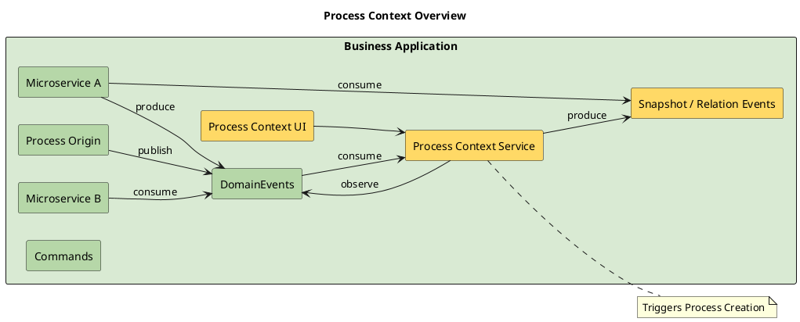
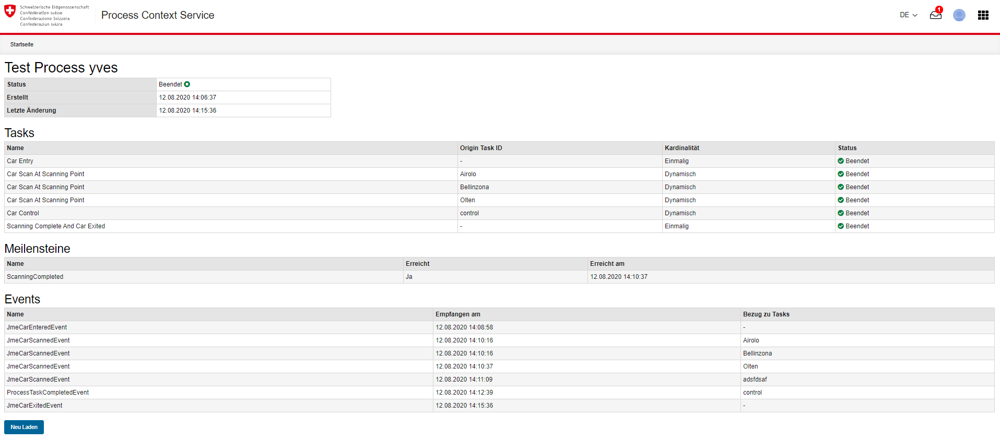
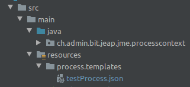
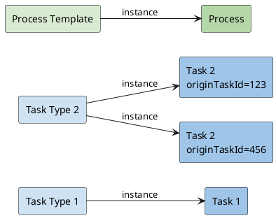
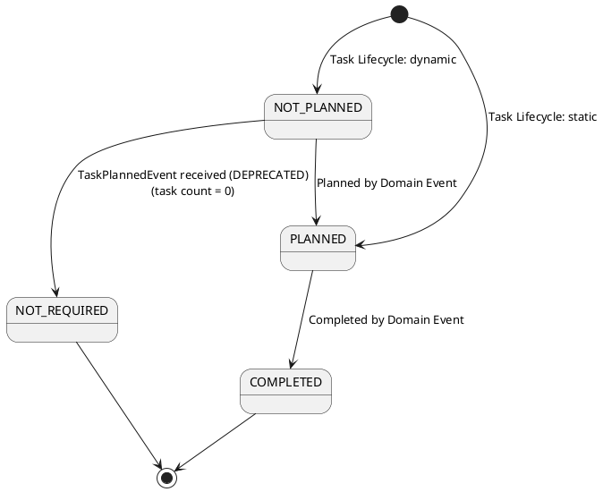
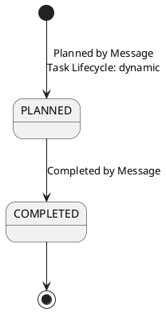
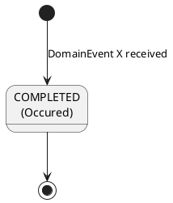
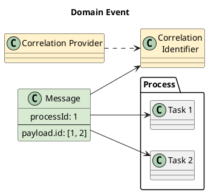
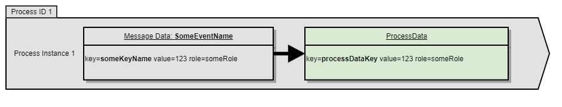

# Process Context Service

## Overview

The Process Context Service addresses the challenge of providing a process context for
cross-service processes in an event-driven architecture, without controlling the execution
of the processes themselves through a central
[process engine](https://en.wikipedia.org/wiki/Business_Process_Engine)
([choreography over orchestration](https://stackoverflow.com/questions/4127241/orchestration-vs-choreography)).
This allows a process to be tracked and analyzed, and events to be triggered in reaction to
changed process states or milestones being reached (e.g. the completion of certain tasks).
The Process Context Service is provided by jEAP as a library and is then instantiated per
business application by a development team. The application-specific process definitions are
defined within that instance.

- This article describes the purpose and features of the Process Context Service for teams
  that want to use the service.
- For a step-by-step guide to setting up a Process Context Service for a business
  application, see [Process Context Service How-To](how-to.md).
- For detailed documentation of the internal architecture of the service, see
  [Architecture Documentation of the Process Context Service](architecture-documentation.md).

### Context Overview



### UI

Example: `https://ref-jme-internal.bit.admin.ch/process-context/process/vault`



#### Deep Links

| | |
| --- | --- |
| View name | `ProcessInstanceById` |
| Path | `/views/process-instance-by-id` |
| Description | Opens the process instance referenced by `originProcessId`. If the referenced process instance is not found, the user is redirected to the start page. |
| Parameters | See table below |
| Available from | 5.9.0 |

Parameters:

| Name | Type/Format | Optional | Description |
| --- | --- | --- | --- |
| `originProcessId` | string/uuid | No | The originProcessId of the process instance |

#### TraceId Information and Link to the Logging System (Splunk/AWS Cloudwatch)

Since version 7.16.1 it is possible to view the traceId of messages in the user interface.
This simplifies debugging and increases traceability.

Next to the traceId there is a new button that links to Splunk/Cloudwatch to display the
relevant log entries.

The link that is followed is configured for Splunk by default. The link can be configured for
other systems using the following property, for example for Cloudwatch:

```text
log.deep-link.base-url: https://eu-central-2.console.aws.amazon.com/cloudwatch/home?region=eu-central-2#logsV2:logs-insights$3FqueryDetail$3D~(end~0~start~-259200~timeType~'RELATIVE~unit~'seconds~editorString~'fields*20*40timestamp*2c*20*40message*2c*20*40log*0a*7c*20filter*20traceId*20*3d*20*22{traceId}*22*0a*7c*20sort*20*40timestamp*20desc*0a*7c*20limit*2020~source~(~'))
```

The traceId can be added to the URL using the `{traceId}` variable.

### Published Event

| EventType | References | Payload | Description |
| --- | --- | --- | --- |
| `ProcessSnapshotCreatedEvent` | `originProcessId` | `version` | A new process snapshot version was created |

### Consumed Messages (Task Events / Commands)

| Message Type | References | Payload | Description |
| --- | --- | --- | --- |
| *DomainEvent, Command* | Depending on the *DomainEvent/Command*, a message is by default assigned to 0..n process instances via the `originProcessId` field on the domain event; alternatively, the correlation can be extracted via a `CorrelationProvider` (see the "messages" section) | | |

## Process Definition (Process Template)

A process definition is described as a Process Template in the form of a JSON document.
This section explains the structure of a Process Template. The Process Context Service loads
Process Templates as resources from the classpath, following the pattern
`process/templates/*.json`:



Complete example of a Process Template
([`jme-process-context-scs/src/main/resources/process/templates/raceProcess.json`](https://github.com/jme-admin-ch/jme-process-context-example/blob/main/jme-process-context-scs/src/main/resources/process/templates/raceProcess.json)
in [jme-process-context-example](https://github.com/jme-admin-ch/jme-process-context-example)):

```json
{
  "name": "raceProcess",
  "tasks": [
    {
      "name": "racePrepared",
      "observes": {
        "message": "JmeRacePreparedEvent"
      }
    },
    {
      "name": "raceStart",
      "completedBy": {
        "message": "JmeRaceStartedEvent"
      }
    },
    {
      "name": "passRaceControlpoint",
      "lifecycle": "dynamic",
      "plannedBy": {
        "message": "JmeRaceControlpointPlannedEvent"
      },
      "completedBy": {
        "message": "JmeRaceControlpointPassedEvent"
      }
    },
    {
      "name": "passRaceDestination",
      "completedBy": {
        "message": "JmeRaceDestinationReachedEvent"
      }
    },
    {
      "name": "validateRace",
      "lifecycle": "static",
      "completedBy": {
        "message": "JmeRaceValidatedEvent"
      }
    },
    {
      "name": "raceCarPostChecks",
      "lifecycle": "dynamic",
      "plannedBy": {
        "message": "JmeRaceCarPostChecksPlannedEvent"
      },
      "completedBy": {
        "message": "JmeRaceCarPostChecksCompletedEvent"
      }
    },
    {
      "name": "raceCarRefuel",
      "lifecycle": "dynamic",
      "cardinality": "single-instance",
      "plannedBy": {
        "message": "JmeRaceDestinationReachedEvent"
      },
      "completedBy": {
        "message": "JmeRaceCarRefuellingCompletedEvent"
      },
      "taskData": [
        {
          "sourceMessage": "JmeRaceDestinationReachedEvent",
          "messageDataKeys": ["parkingSpotNumber"]
        },
        {
          "sourceMessage": "JmeRaceCarRefuellingCompletedEvent",
          "messageDataKeys": ["fuelType", "fuelAmount"]
        }
      ]
    },
    {
      "name": "raceCarTirePressureCheck",
      "lifecycle": "dynamic",
      "plannedBy": {
        "message": "JmeRaceCarMaintenanceRequiredEvent"
      },
      "completedBy": {
        "message": "JmeRaceCarTirePressureCheckedEvent"
      }
    },
    {
      "name": "objectsOnRoadSpotted",
      "observes": {
        "message": "JmeRaceObjectsOnRoadSpottedEvent"
      }
    },
    {
      "name": "cancelRace",
      "observes": {
        "message": "JmeCancelRaceCommand"
      }
    },
    {
      "name": "triggerSafetyCar",
      "observes": {
        "message": "JmeRaceObjectsOnRoadSpottedEvent",
        "condition": "ch.admin.bit.jeap.jme.processcontext.condition.TriggerSafetyCarTaskInstantiationCondition"
      }
    }
  ],
  "messages": [
    {
      "messageName": "JmeRacePreparedEvent",
      "topicName": "jme-race-prepared",
      "payloadExtractor": "ch.admin.bit.jeap.jme.processcontext.event.JmeRacePreparedEventPayloadExtractor",
      "triggersProcessInstantiation": true,
      "processInstantiationCondition": "ch.admin.bit.jeap.jme.processcontext.condition.RacePreparedProcessInstantiationCondition"
    },
    {
      "messageName": "JmeRaceStartedEvent",
      "topicName": "jme-race-started",
      "referenceExtractor": "ch.admin.bit.jeap.jme.processcontext.event.JmeRaceStartedEventReferenceExtractor"
    },
    {
      "messageName": "JmeRaceControlpointPassedEvent",
      "topicName": "jme-race-controlpoint-passed",
      "correlationProvider": "ch.admin.bit.jeap.jme.processcontext.event.JmeRaceControlpointPassedEventCorrelationProvider",
      "referenceExtractor": "ch.admin.bit.jeap.jme.processcontext.event.JmeRaceControlpointPassedEventReferenceExtractor"
    },
    {
      "messageName": "JmeRaceControlpointPlannedEvent",
      "topicName": "jme-race-controlpoint-planned",
      "clusterName": "other",
      "correlationProvider": "ch.admin.bit.jeap.jme.processcontext.event.JmeRaceControlpointPlannedEventCorrelationProvider"
    },
    {
      "messageName": "JmeRaceDestinationReachedEvent",
      "topicName": "jme-race-destination-reached",
      "correlationProvider": "ch.admin.bit.jeap.jme.processcontext.event.JmeSingleInstanceTaskCorrelationProvider",
      "referenceExtractor": "ch.admin.bit.jeap.jme.processcontext.event.JmeRaceDestinationReachedEventReferenceExtractor"
    },
    {
      "messageName": "JmeRaceMobileCheckpointPassedEvent",
      "topicName": "jme-race-mobilecheckpoint-passed",
      "payloadExtractor": "ch.admin.bit.jeap.jme.processcontext.event.JmeRaceMobileCheckpointPassedEventPayloadExtractor",
      "referenceExtractor": "ch.admin.bit.jeap.jme.processcontext.event.JmeRaceMobileCheckpointPassedEventReferenceExtractor"
    },
    {
      "messageName": "JmeRaceMobileCheckpointPlannedEvent",
      "topicName": "jme-race-mobilecheckpoint-planned",
      "correlationProvider": "ch.admin.bit.jeap.jme.processcontext.event.JmeRaceMobileCheckpointPlannedEventCorrelationProvider"
    },
    {
      "messageName": "JmeRaceCarPostChecksPlannedEvent",
      "topicName": "jme-race-carpostchecks-planned",
      "correlationProvider": "ch.admin.bit.jeap.jme.processcontext.event.JmeRaceCarPostChecksPlannedEventCorrelationProvider"
    },
    {
      "messageName": "JmeRaceCarPostChecksCompletedEvent",
      "topicName": "jme-race-carpostchecks-completed",
      "correlationProvider": "ch.admin.bit.jeap.jme.processcontext.event.JmeRaceCarPostChecksCompletedEventCorrelationProvider",
      "payloadExtractor": "ch.admin.bit.jeap.jme.processcontext.event.JmeRaceCarPostChecksCompletedEventPayloadExtractor",
      "correlatedBy": {
        "messageDataKey": "race-car-number",
        "processDataKey": "race-car-number"
      }
    },
    {
      "messageName": "JmeRaceWeatherAlertActivatedEvent",
      "topicName": "jme-race-weather-alert-activated",
      "referenceExtractor": "ch.admin.bit.jeap.jme.processcontext.event.JmeRaceWeatherAlertActivatedReferenceExtractor",
      "correlatedBy": {
        "messageDataKey": "weatherAlertSubject",
        "processDataKey": "weatherAlertSubject"
      }
    },
    {
      "messageName": "JmeRaceCarMaintenanceRequiredEvent",
      "topicName": "jme-race-maintenance-required",
      "correlationProvider": "ch.admin.bit.jeap.jme.processcontext.event.JmeRaceCarMaintenanceRequiredEventCorrelationProvider"
    },
    {
      "messageName": "JmeRaceCarRefuellingCompletedEvent",
      "topicName": "jme-race-refuelling-completed",
      "correlationProvider": "ch.admin.bit.jeap.jme.processcontext.event.JmeSingleInstanceTaskCorrelationProvider",
      "payloadExtractor": "ch.admin.bit.jeap.jme.processcontext.event.JmeRaceCarRefuellingCompletedEventPayloadExtractor"
    },
    {
      "messageName": "JmeRaceCarTirePressureCheckedEvent",
      "topicName": "jme-race-tire-pressure-checked",
      "correlationProvider": "ch.admin.bit.jeap.jme.processcontext.event.JmeRaceCarTirePressureCheckedEventCorrelationProvider"
    },
    {
      "messageName": "JmeRaceObjectsOnRoadSpottedEvent",
      "topicName": "jme-race-objects-spotted",
      "payloadExtractor": "ch.admin.bit.jeap.jme.processcontext.event.JmeRaceObjectsOnRoadSpottedEventPayloadExtractor"
    },
    {
      "messageName": "JmeRaceValidatedEvent",
      "topicName": "jme-race-validated"
    },
    {
      "messageName": "JmeCancelRaceCommand",
      "topicName": "jme-race-cancelrace",
      "referenceExtractor": "ch.admin.bit.jeap.jme.processcontext.command.JmeCancelRaceCommandReferenceExtractor"
    }
  ],
  "processData": [
    {
      "key": "race-id",
      "source": {
        "message": "JmeRacePreparedEvent",
        "messageDataKey": "race-id"
      }
    },
    {
      "key": "race-car-number",
      "source": {
        "message": "JmeRacePreparedEvent",
        "messageDataKey": "race-car-number"
      }
    },
    {
      "key": "mobileCheckpoint",
      "source": {
        "message": "JmeRaceMobileCheckpointPassedEvent",
        "messageDataKey": "mobileCheckpoint"
      }
    },
    {
      "key": "passedControlpoint",
      "source": {
        "message": "JmeRaceControlpointPassedEvent",
        "messageDataKey": "controlpoint"
      }
    },
    {
      "key": "raceCarId",
      "source": {
        "message": "JmeRaceStartedEvent",
        "messageDataKey": "raceCarId"
      }
    },
    {
      "key": "weatherAlertSubject",
      "source": {
        "message": "JmeRaceStartedEvent",
        "messageDataKey": "weatherAlertSubject"
      }
    },
    {
      "key": "postChecksCompletedRaceCarNumber",
      "source": {
        "message": "JmeRaceCarPostChecksCompletedEvent",
        "messageDataKey": "race-car-number"
      }
    },
    {
      "key": "cancelled-race-id",
      "source": {
        "message": "JmeCancelRaceCommand",
        "messageDataKey": "race-id"
      }
    }
  ],
  "relationSystemId": "ch.admin.jme.Race",
  "relationPatterns": [
    {
      "predicateType": "ch.admin.race.PassedControlpoint",
      "subject": {
        "type": "ch.admin.race.RaceCarId",
        "selector": {
          "processDataKey": "raceCarId",
          "role": "RaceParticipant"
        }
      },
      "object": {
        "type": "ch.admin.jeap.race.Controlpoint",
        "selector": {
          "processDataKey": "passedControlpoint"
        }
      },
      "featureFlag": "FEATURE_CONTROL_POINT"
    },
    {
      "predicateType": "ch.admin.race.PostChecksResultProcessed",
      "subject": {
        "type": "ch.admin.race.RaceId",
        "selector": {
          "processDataKey": "race-id"
        }
      },
      "object": {
        "type": "ch.admin.jeap.race.RaceCarNumber",
        "selector": {
          "processDataKey": "postChecksCompletedRaceCarNumber"
        }
      },
      "featureFlag": "FEATURE_POST_CHECK_RESULT"
    }
  ],
  "completions": [
    {
      "completedBy": {
        "message": "JmeRaceWeatherAlertActivatedEvent",
        "conclusion": "aborted",
        "name": "raceWeatherAlertAborted"
      }
    },
    {
      "completedBy": {
        "message": "JmeCancelRaceCommand",
        "conclusion": "aborted",
        "name": "raceCancelled"
      }
    },
    {
      "completedBy": {
        "condition": "ch.admin.bit.jeap.jme.processcontext.condition.TooManyMaintenanceStopsProcessCompletionCondition"
      }
    },
    {
      "completedBy": {
        "condition": "ch.admin.bit.jeap.processcontext.plugin.api.condition.AllTasksInFinalStateProcessCompletionCondition"
      }
    }
  ],
  "snapshots": [
    {
      "createdOn" : {
        "completion": "any"
      }
    }
  ]
}
```

### Process

At the start of the template, the name of the process template is declared:

```json
{
  "name": "testProcess"
  ...
}
```

### Tasks

A task represents a (usually automated) work step in a process. The Process Template defines
which task types a process contains. The process is then considered complete once all of its
task types have been planned and completed. Dependencies between task types are currently not
modeled.



At runtime, task instances are created within a process based on the template. A task type
follows a specific *lifecycle* and a specific *cardinality*:

::::note
PCS versions before 5.13.0 only support *cardinality* in the forms *single* and *dynamic*. PCS
versions from 5.13.0 onwards continue to support these old cardinality configurations and
translate them to lifecycle/cardinality pairs as follows:

- `cardinality=single` becomes `lifecycle=static`, `cardinality=single-instance`
- `cardinality=dynamic` becomes `lifecycle=dynamic`, `cardinality=multi-instance`

We recommend migrating old cardinality configurations in the process definitions of a PCS
instance to the new configuration style as part of an upgrade to a PCS version >= 5.13.0,
since the old configuration style will no longer be supported in the future. To migrate:

- replace `cardinality=single` with `lifecycle=static`
- replace `cardinality=dynamic` with `lifecycle=dynamic`
::::

| Lifecycle | Task instantiation | Default cardinality | Initial state | Task instance ID | Further possible states |
| --- | --- | --- | --- | --- | --- |
| *static* | When the process is created | single-instance | PLANNED | | COMPLETED |
| *dynamic* | With domain events | multi-instance | NOT_PLANNED | With `CorrelationProvider` | PLANNED (1...n instances), NOT_REQUIRED (0 instances), COMPLETED |
| *observed* | Upon receipt of a message | multi-instance | NOT_PLANNED | Since the task can never be changed again after instantiation, its TaskId is not relevant | COMPLETED |

| Cardinality | Task instantiation |
| --- | --- |
| *single-instance* | Only one task instance of the task type can be created |
| *multi-instance* | Several task instances of the task type can be created |

The `tasks` block in the process template lists the task types of a process, for example:

```json
"tasks": [
    {
      "name": "singleTask",
      "label": "Mandatory static single-instance task, completed when a certain domain event is received, lifecycle=static (default), cardinality=single-instance (default)",
      "completedBy": {
        "message": "MyExampleEvent"
      }
    },
    {
      "name": "dynamicTaskCompletedByDomainEvent",
      "label": "Dynamic multi-instance task, instance count planned when a certain domain event is received, completed when a certain domain event is received, cardinality=multi-instance (default for dynamic lifecycle)",
      "lifecycle": "dynamic",
      "plannedBy": {
        "message": "MyPlanningEvent"
      },
      "completedBy": {
        "message": "MyExampleEvent"
      }
    }
]
```

#### State Transitions of a Task

A task is initially created as PLANNED (lifecycle=static) or NOT_PLANNED (lifecycle=dynamic):



#### Tasks Planned by Messages

Tasks can be planned by messages. These tasks are always planned dynamically and are optional.
Currently, optional tasks are generally only supported with cardinality 'multi-instance'
(0...N).

```json
"lifecycle": "dynamic",
"plannedBy": {
    "message": "JmeCarScannedEvent"
}
```

Such tasks are only instantiated when the specified message arrives, i.e. unlike regular
tasks, no instance with status `NOT_PLANNED` is kept in reserve. Accordingly, an optional task
only blocks the associated process state if it has been created and not yet completed. An
unplanned optional task therefore has no influence on the process state.



#### Task Instantiation Conditions (from Version 7.2.0)

For dynamic tasks, task instantiation conditions can be configured which programmatically
compute, based on the incoming message, whether the task should be instantiated. The task is
only created if the condition evaluates to "*true*".

The configuration must be set in the "plannedBy" block:

```json
{
      "name": "MyConditionalTask",
      "lifecycle": "dynamic",
      "plannedBy": {
        "domainEvent": "TestEvent",
        "condition": "ch.admin.bit.jeap.processcontext.repository.template.json.TestTaskInstantiationCondition"
      }
}
```

Conditions can be implemented against the following interface
([`jeap-process-context-plugin-api/src/main/java/ch/admin/bit/jeap/processcontext/plugin/api/condition/TaskInstantiationCondition.java`](https://github.com/jeap-admin-ch/jeap-process-context-service/blob/main/jeap-process-context-plugin-api/src/main/java/ch/admin/bit/jeap/processcontext/plugin/api/condition/TaskInstantiationCondition.java)
in [jeap-process-context-service](https://github.com/jeap-admin-ch/jeap-process-context-service)):

```java
package ch.admin.bit.jeap.processcontext.plugin.api.condition;

import ch.admin.bit.jeap.processcontext.plugin.api.context.Message;

/**
 * Classes implementing this interface can be used as conditions to decide whether a Task should be instantiated
 */
public interface TaskInstantiationCondition {

    /**
     * Method to determine whether a Task should be instantiated based on the incoming message information
     * @param message The received message
     * @return <b>true</b> if the task should be instantiated, <b>false</b> otherwise
     */
    boolean instantiate(Message message);

}
```

An example implementation
([`jeap-process-context-scs/src/test/java/ch/admin/bit/jeap/processcontext/taskinstantiation/SimpleInstantiationCondition.java`](https://github.com/jeap-admin-ch/jeap-process-context-service/blob/main/jeap-process-context-scs/src/test/java/ch/admin/bit/jeap/processcontext/taskinstantiation/SimpleInstantiationCondition.java)):

```java
package ch.admin.bit.jeap.processcontext.taskinstantiation;

import ch.admin.bit.jeap.processcontext.plugin.api.condition.TaskInstantiationCondition;
import ch.admin.bit.jeap.processcontext.plugin.api.context.Message;

public class SimpleInstantiationCondition implements TaskInstantiationCondition {
    @Override
    public boolean instantiate(Message message) {
        return message.getMessageData().stream().anyMatch(messageData -> {
            return messageData.getKey().equals("someField") && messageData.getValue().equals("foo");
        });
    }
}
```

#### Task Completion via Message (Domain Event)

Tasks can transition to state COMPLETED via a message. Changes to the state of tasks are
evaluated whenever the process context changes (due to incoming events).

Behavior:

- single-instance tasks: completed when an event of the referenced type, correlated to the
  process instance, is received
- multi-instance tasks: completed when an event of the referenced type, correlated to the
  process instance, with a task ID matching a task, is received

JSON definition:

```json
"completedBy": {
  "message": "JmeCarScannedEvent"
}
```

#### Observation Tasks

An observation task is essentially the projection of an event into the task list. The purpose
is to visualize important events within the task list for the business user.

```java
{
    "name": "objectsOnRoadSpotted",
    "label": "Objekte auf der Fahrbahn",
    "lifecycle": "observed",
    "observes": {
        "message": "JmeRaceObjectsOnRoadSpottedEvent"
   }
}
```

Note: `"lifecycle": "observed"` is optional, since the lifecycle is already unambiguous due to
the "observes" block.

When the domain event occurs, the observation task is instantiated and immediately assumes
the status COMPLETE.



##### Instantiation Condition (from V7.2.0)

Analogous to dynamic tasks, the instantiation of an observation task can be controlled using a
condition. See [Task Instantiation Conditions](#task-instantiation-conditions-from-version-720)
above.

The interface to implement is the same (`TaskInstantiationCondition`); the configuration looks
slightly different, since the condition must now be configured in the "observes" block:

```java
    {
      "name": "triggerSafetyCar",
      "label": "Einsatz Safety Car auslösen",
      "observes": {
        "message": "JmeRaceObjectsOnRoadSpottedEvent",
        "condition": "ch.admin.bit.jeap.jme.processcontext.condition.TriggerSafetyCarTaskInstantiationCondition"
      }
    }
```

An example implementation is available in the
[jme-process-context-example](https://github.com/jme-admin-ch/jme-process-context-example)
project, in the file `TriggerSafetyCarTaskInstantiationCondition`.

#### Task Data (from PCS Version 9.3.0)

A task can be linked with message data from the messages that started or completed it. Such
*task data* is then displayed on the task by the PCS UI. This means task data can be used to
document arbitrary additional information about the start or end of a task.

To declare task data, a message type must be specified from which message data should be
extracted as task data, along with the keys of the message data entries to be extracted. The
following declaration would, for task type `raceCarRefuel`, make available as task data the
message data entry with the key `parkingSpotNumber` from a message of type
`JmeRaceDestinationReachedEvent`, and the message data entries with the keys `fuelType` and
`fuelAmount` from a message of type `JmeRaceCarRefuellingCompletedEvent`:

```json
    {
      "name": "raceCarRefuel",
      ...
      "plannedBy": {
        "message": "JmeRaceDestinationReachedEvent"
      },
      "completedBy": {
        "message": "JmeRaceCarRefuellingCompletedEvent"
      },
      "taskData": [
        {
          "sourceMessage": "JmeRaceDestinationReachedEvent",
          "messageDataKeys": ["parkingSpotNumber"]
        },
        {
          "sourceMessage": "JmeRaceCarRefuellingCompletedEvent",
          "messageDataKeys": ["fuelType", "fuelAmount"]
        }
      ]
    }
```

::::note
A declared `sourceMessage` must reference a message type that starts or completes the task,
i.e. a message type that is already listed in `plannedBy` or `completedBy`. The declared
`messageDataKeys` must address message data entries that are made available by a payload
extractor or reference extractor for messages of the referenced message type.
::::

[Translations](how-to.md#defining-translations) can be defined for the extracted keys, for
display of task data in the PCS UI.

#### User Data (from PCS Version 9.3.0)

A task is automatically linked by the PCS with the user data (`MessageUser`) from the
[messages](../message-types.md#events) that started or completed it. Such *user data* is
displayed by the PCS UI on tasks under "started by" and "completed by". The PCS always
displays all available user data. [Translations](how-to.md#defining-translations) can be
defined for the labels of user data.

### Messages

The `messages` block of the process template references the messages to be consumed. A
`CorrelationProvider` can optionally be specified, which can correlate events with process
instances (default: the `originProcessId` field on the message).

| Attribute | Required | Description |
| --- | --- | --- |
| `messageName` | mandatory | Name of the [message type](../message-types.md) as defined in the [Message Type Registry](../message-type-registry/index.md) |
| `topicName` | mandatory | The Kafka topic from which the message should be consumed |
| `clusterName` | optional | The logical Kafka cluster name where the topic exists. See [Support for Multiple Kafka Clusters](../jeap-messaging-library/support-for-multiple-kafka-clusters.md) for details. Default: if no cluster name is configured, the default cluster is used |
| `correlationProvider` | optional | An instance of a `CorrelationProvider` (see next section) that can extract process ID(s) and (optionally) task ID(s) from a message. Default: messages are correlated to a process instance using the domain event attribute `processId`. A task ID is not extracted by default |
| `payloadExtractor` | optional | An instance of a `PayloadExtractor` that can extract data from the payload of a message. The extracted data is persisted in the database by the Process Context Service and is available for further processing, e.g. in a custom condition |
| `referenceExtractor` | optional | An instance of a `ReferenceExtractor` that can extract data from the references of a message. The extracted data is persisted in the database by the Process Context Service and is available for further processing, e.g. in a custom condition |
| `correlatedBy` | optional | This attribute declares that a message should be correlated to a process instance based on a match between one of its message data entries and a process data entry of the process instance. Such a correlation is specified by giving a process data key and a message data key. A message can be correlated to a process instance exactly when the message contains data for the specified message data key and this data (value, role) is found exactly under the named process data key in the process data of the process instance |
| `triggersProcessInstantiation` | optional | If set to `true`: when the Process Context Service receives this message, it will create an instance if no instance with the process ID exists yet. The process ID (e.g. a UUID or a natural business ID) is read by default from the `processId` attribute of the event. Alternatively, a `CorrelationProvider` can be specified. If set to `false`, no process instance is created, even if a `processInstantiationCondition` is configured. Default is `null` |
| `processInstantiationCondition` | optional | An instance of `ProcessInstantiationCondition` that decides, based on the message, whether the process should be instantiated. If `triggersProcessInstantiation` is set to `false`, the condition is not evaluated. See the table below for the possible outcomes |

| triggersProcessInstantiation | processInstantiationCondition | Process is instantiated |
| --- | --- | --- |
| (not set) | (not set) | No |
| (not set) | set | If the condition is met |
| false | (not set) | No |
| false | set | No |
| true | (not set) | Yes |
| true | set | If the condition is met |

```json
  "messages": [
    {
      "messageName": "JmeCarEnteredEvent",
      "topicName": "jme-process-car-entered"
    },
    {
      "messageName": "JmeCarScannedEvent",
      "topicName": "jme-process-car-scanned",
      "clusterName": "my-cluster",
      "correlationProvider": "ch.admin.bit.jeap.jme.processcontext.event.JmeCarScannedEventCorrelationProvider",
      "payloadExtractor": "ch.admin.bit.jeap.jme.processcontext.event.JmeRaceMobileCheckpointPassedEventPayloadExtractor",
      "referenceExtractor": "ch.admin.bit.jeap.jme.processcontext.event.JmeRaceMobileCheckpointPassedEventReferenceExtractor",
      "correlatedBy": {
        "processDataKey": "some-process-data-key",
        "messageDataKey": "some-event-data-key"
      },
      "triggersProcessInstantiation": true, // A process instance is created for every message of this type
      // or alternatively: a process instance is created for certain messages of this type if they meet the condition
      "processInstantiationCondition": "ch.admin.bit.jeap.jme.processcontext.condition.RacePreparedProcessInstantiationCondition"
    },
```

#### Correlation Provider

- To correlate domain events with a process, the `processId` attribute of a domain event is
  used by default. Alternatively, a correlation provider can be implemented that can extract
  one or more process IDs from a message.
- Single-instance tasks, which must occur exactly once in a process, can be unambiguously
  correlated to a message via the message's name. Dynamically instantiated tasks require a
  correlation provider that can extract a task instance ID from a message, in order to
  unambiguously assign a message to a task in the process.



The message completion condition uses the origin task ID extracted from the message to mark
tasks as completed when a) the name of the message matches and b) the origin task ID matches.

A correlation provider provides 0..n process IDs and 0...n origin task IDs per message.

```java
public interface MessageCorrelationProvider<M extends Message> {

    Set<String> getOriginProcessIds(M message, ProcessCorrelationRepository processCorrelationRepository)

    Set<String> getRelatedOriginTaskIds(M message);
}
```

#### Correlation by Process ID vs. Correlation by Process Data

A message correlation provider assigns a message to a process instance by being able to
associate the message with its process ID. Typically, a domain event correlation provider
extracts the corresponding process ID directly from the message (from the message attribute
"processId", from the message references, or from the message payload).

But what if a message needs to be correlated that was created before the actual process
instance was created? Or if a message needs to be correlated whose publisher does not know the
process ID of the process to which the message would belong? Here, correlation based on
[process data](#processdata) can help. Process data can be defined per process instance.
However, process data has a more general purpose and can in particular also be created
dynamically during the course of a process through the processing of a domain event.

Two messages are involved in correlation via process data. One message writes, based on
message data, a kind of ID into the process data of a process instance. The other message
references the same ID in its message data. Through a `correlatedBy` entry on the type of the
second message in the template of the affected process instance, the second message can be
correlated with the process instance of the first message. It does not matter which of the
two messages is processed first by the Process Context Service. Correlation based on process
data allows a message to be assigned to a process instance based on information that only
becomes known to the process instance after the process has started. It does not matter
whether this information was already known to the process instance at the time the message to
be assigned was published or not.

#### PayloadExtractor

To extract specific data from the payload of a message, an instance of a `PayloadExtractor`
can be implemented.

```java
public interface PayloadExtractor<E extends MessagePayload> {

    default Set<MessageData> getMessageData(E payload) {
        return Collections.emptySet();
    }

}
```

This data is persisted in the database as "MessageData". A MessageData entry is represented
by a key, value, and optionally a role.

This collection of MessageData can be retrieved in a custom condition via the ProcessContext
and used for specific processing.

#### ReferenceExtractor

To extract specific data from the message references of a message, an instance of a
`ReferenceExtractor` can be implemented.

```java
public interface ReferenceExtractor<E extends MessageReferences> {

    default Set<MessageData> getMessageData(E references) {
        return Collections.emptySet();
    }
}
```

This data is persisted in the database as "MessageData". A MessageData entry is represented by
a key, value, and optionally a role.

This collection of MessageData can be retrieved in a custom condition via the ProcessContext
and used for specific processing.

#### Receiving Encrypted Kafka Records with jeap-messaging

The PCS can also receive Kafka records encrypted with jeap-messaging / jeap-crypto. See jEAP
Crypto for the configuration and required dependencies (`jeap-vault-starter` and
`jeap-crypto-vault-starter`).

The Kafka record carries a reference to the wrapping key used, from Vault. Usually only
configuring the Vault URL (`jeap.vault.system-name`) and the system name is necessary.

#### MessageFilter

Not all instances of a given `MessageType` are relevant for the PCS of a business
application. In particular, events from shared services may originate from a different
business application and therefore be irrelevant.

To process only relevant messages, the PCS offers the option of filtering messages based on
their content. Messages that do not meet the defined filter criterion are ignored by the PCS.

Since filtering should apply centrally to the entire PCS and not per template, the
`MessageFilters` are defined in the application configuration (e.g. `application.yml`) -- and
**not** in the individual templates.

In the configuration file (`application.yml`), a corresponding `MessageFilter` can be defined
per `MessageType`:

```yaml
jeap:
  processcontext:
    kafka:
      filters:
        EventOne: ch.admin.bit.EventOneMessageFilter
        EventTwo: ch.admin.bit.EventTwoMessageFilter
        OtherEvent: ch.admin.bit.OtherEventMessageFilter
        ...
```

Each MessageFilter instance must implement the `MessageFilter` interface and provide the
`filter` method
([`jeap-process-context-plugin-api/src/main/java/ch/admin/bit/jeap/processcontext/plugin/api/message/MessageFilter.java`](https://github.com/jeap-admin-ch/jeap-process-context-service/blob/main/jeap-process-context-plugin-api/src/main/java/ch/admin/bit/jeap/processcontext/plugin/api/message/MessageFilter.java)):

```java
package ch.admin.bit.jeap.processcontext.plugin.api.message;

import ch.admin.bit.jeap.messaging.model.Message;

/**
 * Represents a filter for messages of a specific type.
 *
 * @param <M> the type of message to filter
 */
public interface MessageFilter<M extends Message> {

    /**
     * Determines whether the given message should be filtered.
     *
     * @param message the message to evaluate
     * @return {@code true} if the message should be processed; {@code false} to ignore it
     */
    boolean filter(M message);

}
```

### ProcessData

So that events which only arise during the course of a process can also be correlated, we
have extended the ProcessTemplate with 'ProcessData':

```json
...
"processData": [
    {
        "key": "processDataKey",
        "source": {
            "message": "SomeEventName",
            "messageDataKey" : "someKeyName"
        }
    }
]
```

Briefly explained: when an event named 'SomeEventName' arrives, the PCS checks whether an
EventData entry with `key='someKeyName'` exists. If so, the value and the role are stored
under the key 'processDataKey' in 'ProcessData'.



### Relation Patterns

Through observation of domain events, the PCS keeps track of the relationships between
business objects established in the course of processes, on behalf of the NVZ, as a *triple*
(business object, relationship type, business object).

The process template declares which relationships between business objects are expected in
the course of the process. Specifically, it defines the relationship in which a certain type
of business object (possibly in a certain role) stands to another certain type of business
object (possibly also in a certain role) in the course of this process. In the process
template, this could look as follows:

```json
...
"relationPatterns": [
    {
        "object": {
            "type": "ch.test.Object",
            "selector": {
                "processDataKey": "objectKey"
            }
        },
        "subject": {
            "type": "ch.test.Subject",
            "selector": {
                "processDataKey": "subjectKey"
            }
        },
        "predicateType": "ch.test.predicate.Knows"
    }
]
...
```

#### Relation Patterns with Multiple processDataKeys

If more than one instance of a processDataKey exists, a relation is by default created per
pair (cartesian product). This behavior can lead to relations being created that do not apply
in the specific use case. The following example illustrates this issue:

The process has four ProcessData instances relating to two different assessments:

| Key | Value | Role | Comment |
| --- | --- | --- | --- |
| `assessmentId` | a1 | *(empty)* | First version of the assessment |
| `assessmentId` | a2 | *(empty)* | Second version of the assessment |
| `assessmentArtefactId` | a1 | *(empty)* | Artifact of the first version of the assessment |
| `assessmentArtefactId` | a2 | *(empty)* | Artifact of the second version of the assessment |

The cartesian product would result in four relations, of which only two would be factually
correct:

| Object (Assessment) | Subject (Artefact) | Comment |
| --- | --- | --- |
| a1 | a1 | Correct |
| a1 | a2 | Incorrect |
| a2 | a1 | Incorrect |
| a2 | a2 | Correct |

The "joinType" property of a RelationPatterns declaration can be used in such cases to create
only certain relations:

##### Determining Relations via joinType (from Version 7.11.0)

The property is configured as follows:

```java
"relationPatterns": [
    {
      "object": {
        [...]
        }
      },
      "subject": {
        [...]
      },
      "predicateType": "ch.test.predicate.Knows",
      "joinType": "byValue" // Possible values: "byValue", "byRole"
    }
  ]
```

If the property is set, relations are created according to the joinType as follows:

| Value | Condition |
| --- | --- |
| byValue | If the values of two ProcessData instances are identical and not null |
| byRole | If the role values of two ProcessData instances are identical and not null |

In the example above, a RelationPattern with "joinType=byValue" would create the factually
correct relations:

| Object (Assessment) | Subject (Artefact) | Comment |
| --- | --- | --- |
| a1 | a1 | Correct |
| a2 | a2 | Correct |

#### RelationPatterns with Feature Flag (from PCS V13.12)

All ID types and predicates that a business application reports to Transparenza must be
registered on Transparenza beforehand. If they are not yet registered, errors occur when
publishing relations.

So that the PCS supports continuous deployment, the publishing of relations can be activated
per RelationPattern using a feature flag.

```java
"relationPatterns": [
    {
      "object": {
        [...]
        }
      },
      "subject": {
        [...]
      },
      "predicateType": "ch.test.predicate.Knows",
      "featureFlag": "NAME_OF_FEATURE_FLAG_1"
    },
    {
      "object": {
        [...]
        }
      },
      "subject": {
        [...]
      },
      "predicateType": "ch.test.predicate.Knows",
      "featureFlag": "NAME_OF_FEATURE_FLAG_2"
    }
]
```

If the feature flag is not active at the time of processing, the relation is not published to
Transparenza. As soon as the feature flag is activated, new relations are sent to
Transparenza. Old relations that were processed but not sent before activation of the feature
flag are not retroactively published to Transparenza.

The state of the feature flag can be configured as follows:

```yaml
togglz:
  features:
    NAME_OF_FEATURE_FLAG_1:
      enabled: true
    NAME_OF_FEATURE_FLAG_2:
      enabled: false
```

Since the feature flag starter is used by the PCS, the PCS delivers the same metrics about the
state of feature flags:

```text
# HELP feature_flag Feature Flags
# TYPE feature_flag gauge
feature_flag{client="jme-process-archive-service",name="NAME_OF_FEATURE_FLAG_1"} 1.0
feature_flag{client="jme-process-archive-service",name="NAME_OF_FEATURE_FLAG_2"} 0.0
```

See Feature Flags for more details.

### Process Completion (from PCS V5.19)

When a process is created, it is in the `started` state. When certain conditions are met, the
process can transition to the `completed` state. The process is then considered finished.

When a process is completed, the following three process attributes are determined:

| Attribute name | Description | Value range |
| --- | --- | --- |
| `conclusion` | Completion status | `succeeded` -- process completed successfully; `cancelled` -- process controlled-aborted, participating systems in a consistent state; `aborted` -- process uncontrolled-aborted, participating systems possibly in an inconsistent state |
| `reason` | Completion reason | String |
| `completedAt` | Completion timestamp (determined by the PCS) | Timestamp |

The conditions leading to the completion of a process can be configured in the process
template. More than one condition can be configured.

#### Process Completion via a Message

A process can be completed upon receipt of a specific message. The following configuration is
required for this:

```json
...
"completions": [
    {
      "completedBy": {
        "message": "JmeRaceWeatherAlertActivatedEvent",
        "conclusion": "aborted",
        "reason": "Race aborted immediately because of weather alert."
      }
    }
]
...
```

With this configuration, a process is completed upon receipt of a `JmeRaceWeatehrAlertActivatedEvent`
event with completion status `aborted` and the reason "Race aborted immediately because of
weather alert." Several such conditions can be defined at the same time.

#### Process Completion via a Custom Condition

A process can also be completed by the occurrence of a custom condition:

```json
...
"completions": [
    {
      "completedBy": {
        "condition": "ch.admin.bit.jeap.jme.processcontext.condition.TooManyMaintenanceStopsProcessCompletionCondition"
      }
    }
]
...
```

With this configuration, a process is completed when the code in the custom class
`TooManyMaintenanceStopsProcessCompletionCondition` indicates so. Several such conditions can
be configured at the same time (with separate `completedBy` definitions).

The specified condition class must implement the following interface:

```java
public interface ProcessCompletionCondition {

    ProcessCompletionConditionResult isProcessCompleted(ProcessContext processContext);

}
```

A custom condition for completing a process must, based on the process context, decide whether
the process is complete or not yet. If the process is not complete, the result
`ProcessCompletionConditionResult.IN_PROGRESS` must be returned. If the process is complete,
the matching completion status (`conclusion`) and the associated completion reason (`reason`)
must be returned:

```java
@Override
public ProcessCompletionConditionResult isProcessCompleted(ProcessContext processContext) {
    // isCompleted = ... check some condition on processContext
    if (isCompleted) {
        return ProcessCompletionConditionResult.completedBuilder()
            .conclusion(conclusion)
            .reason(reason)
            .build();
    } else {
        return ProcessCompletionConditionResult.IN_PROGRESS;
    }
}
```

#### Process Completion when all Tasks are Completed

There is a predefined condition, `AllTasksInFinalStateProcessCompletionCondition`, that
completes a process when all tasks of the process have been completed:

```json
...
"completions": [
    {
      "completedBy": {
        "condition": "ch.admin.bit.jeap.processcontext.plugin.api.condition.AllTasksInFinalStateProcessCompletionCondition"
      }
    }
]
...
```

#### Default Process Completion

If the `completions` attribute is not defined in a process template, i.e. it is not explicitly
defined when a process should be considered complete, then a process is considered complete
once all tasks that must be planned have been planned, and all planned tasks have been
completed.

### Process Snapshots

The Process Context Service can (from version 7.19.x) capture the current state of a process
in a snapshot when a certain condition is met for the first time. The creation of a snapshot
is publicly announced by publishing a corresponding event. Several snapshots can be created
for a process instance over the course of a process. The different snapshots of a process
instance are numbered consecutively with integer version numbers.

The Process Context Service makes the created process snapshots available via a REST
interface that is compatible with the archive data interface defined by the
[Process Archive Service](../process-archive-service/index.md). This allows the process
snapshots of a PCS instance to be archived by a PAS instance. The Process Context Service
stores the created process snapshots in an S3 object storage and retains the snapshots for a
defined number of days, after which the snapshots are automatically deleted.

#### Process Snapshot Creation upon Process Completion

The configuration below creates a snapshot of a process instance when it reaches an arbitrary
final state.

```json
...
  "snapshots": [
    {
      "createdOn" : {
        "completion": "any"
      }
    }
  ]
...
```

Instead of "any", a specific final state can also be specified, so that the snapshot is only
created when this specific final state is reached:

- "succeeded"
- "cancelled"
- "aborted"

#### Configuration of the S3 Storage for Process Snapshots

Under the root `jeap.processcontext.objectstorage`, the following properties can be
configured:

| Property | Description | Default | Optional |
| --- | --- | --- | --- |
| `snapshot-bucket` | Name of the bucket in which the snapshots should be stored | | No |
| `snapshot-retention-days` | Number of days for which snapshots should be retained | 3 | Yes -- default applies |

::::note
If no snapshot bucket name is configured, the process snapshot feature is not active. If the
Process Context Service, in this case, finds at startup a process template that configures
process snapshots, the Process Context Service will abort startup with a corresponding
exception.
::::

The connection to the S3 storage can be configured under the following root
`jeap.processcontext.objectstorage.connection`:

| Property | Description | Default | Optional |
| --- | --- | --- | --- |
| `access-url` | URL for accessing the S3 storage | | No |
| `region` | Region of the S3 storage | aws-global | Yes |
| `access-key` | Access key for accessing the S3 storage | | No |
| `secret-key` | Secret key for accessing the S3 storage | | No |

::::note
At startup, the Process Context Service checks access to S3 (or the configured bucket) and
will abort startup with a corresponding exception if access is not possible.
::::

#### Notification of Process Snapshot Creation

When a new process snapshot is created for a process instance, the Process Context Service
publishes a `ProcessSnapshotCreatedEvent`. The `processId` on the event corresponds to the
origin process ID of the process for which the snapshot was created. The payload of the event
contains the field `snapshotVersion`, which contains the version number of the created
snapshot.

The topic on which the Process Context Service should publish the `ProcessSnapshotCreatedEvent`
must be configured as follows:

| Property | Description | Default | Optional |
| --- | --- | --- | --- |
| `jeap.processcontext.kafka.topic.process-snapshot-created` | Name of the topic on which the creation of a process snapshot should be notified | | Yes, if no process snapshots are configured in the defined process templates |

#### Process Archive REST Interface for Process Snapshots

The Process Context Service makes the created process snapshots available via a REST
interface that is compatible with the archive data interface defined by the
[Process Archive Service](../process-archive-service/index.md).

| | |
| --- | --- |
| Request method | `GET` |
| Request path | `/api/snapshot/{processOriginId}` |
| Request parameters | `version` (optional) |
| Request auth method | jEAP OAuth2 bearer token with semantic role: system = system name; resource = `processsnapshot`; operation = `view` |
| Response code | `200`: snapshot version found; `403`: access denied; `404`: snapshot version not found |
| Response type | `avro/binary` |
| Response content | Binary Avro representation of the snapshot |
| Response header | According to the Process Archive Service's archive data interface |

For example, the following request would query, on the JME Process Context Example in the
"dev" environment, the snapshot for a process with the origin process ID `foobar` in version
`2`:

```text
GET https://dev-jme-internal.bit.admin.ch/jme-process-context-scs/api/snapshot/foobar?version=2
```

Specifying the version is optional. Without a version, the latest available process snapshot
version is returned.

For a Process Archive Service instance to be able to validate the process snapshot archive
data objects of a Process Context Service instance, the PAS instance must be made aware of the
schema of the process snapshots. To do so, the
[process snapshot schema](https://github.com/jeap-admin-ch/jeap-archive-type-registry/tree/main/archive-types/jeap/processsnapshot)
defined by the PCS must first be added to the
[Archive Type Registry](../process-archive-service/archive-type-registry.md) of the
respective business application.

Care must be taken that a PAS instance is made aware of the process snapshot schema versions
matching the PCS versions currently and previously in use.

| PCS versions | Process snapshot schema version |
| --- | --- |
| 7.19.x | 1 |

### Changes to Existing Templates (Migration)

The hash value of the process template (JSON) is persisted as soon as a process instance is
created.

If a template is changed, a migration takes place following the concept described in
[Process Context Service Template Migration](template-migration.md).

Migration is triggered:

- On-the-fly: as soon as an event is processed on a process instance and a change to the
  process template is detected.
- Time-controlled: by a scheduler, by default running every 60 minutes and migrating at most
  500 process instances
    - The migration scheduler triggers a process update event for process instances that may
      need to be migrated.
    - It is recommended to configure the scheduler so that migration events can be processed
      in the time between two runs. Otherwise, multiple migration events are triggered for
      instances that have not yet been migrated.

Configuration (showing default values):

```yaml
jeap:
  processcontext:
    template:
      migration:
        lock-at-least: PT1M                # Minimal time to keep a lock at the migration triggering job.
        lock-at-most: PT20M                # Max time to keep a lock at the migration triggering job.
        batch-size: 500                    # How many process instances to migrate at most in one batch (only considers non-completed process instances for migration)
        max-created-at-age-days: 180       # How old a process instance should be at most to be considered for migration
        cron-expression: 0 10 * * * *      # How often to run the migration scheduler. Must be a cron expression. Default: At :10 past every hour.
```

## Metrics

The PCS publishes a number of metrics that allow the PCS to be monitored and analyzed in
operation.

### Counters

| Metric name | Dimensions | Value |
| --- | --- | --- |
| `jeap_pcs_process_created_instances_total` | process_template | Number of processes created |
| `jeap_pcs_processes_completed_total` | process_template | Number of processes completed |
| `jeap_pcs_messages_received_total` | first_processing | Number of domain events received |
| `jeap_pcs_process_updates_processed_total` | | Number of process updates processed |
| `jeap_pcs_failed_process_updates_total` | | Number of process updates that failed |
| `jeap_pcs_snapshot_created_total` | process_template | Number of process snapshots created |

### Timers

Timers define several timelines for a metric name with the following suffixes. In addition, a
histogram bucket is created for the 50%, 80%, and 99% quantiles of all measurements
(quantile tag).

| Suffix | Meaning |
| --- | --- |
| `_seconds` | Measured duration |
| `_seconds_count` | Number of measured durations |
| `_seconds_sum` | Total sum of measured durations |
| `_seconds_max` | Maximum measured duration |

| Metric name | Dimensions | Measures |
| --- | --- | --- |
| `jeap_pcs_process_message` | quantile | Receipt of a message |
| `jeap_pcs_early_correlate_message` | quantile | Correlation of a message to an origin process ID, either via the correlation provider or via process data |
| `jeap_pcs_update_process_state` | quantile | Processing of an outdated event (includes process update processing) |
| `jeap_pcs_handle_message_for_process_instance` | quantile | Processing of a single message as part of the update of a process instance |
| `jeap_pcs_process_update` | quantile | Update of the state of a process instance, incl. task creation etc. |
| `jeap_pcs_housekeeping_cleanup` | quantile | Duration of a housekeeping run |
| `jeap_pcs_late_correlate_message` | quantile | Late correlation (correlation of a message via newly created process data) |
| `jeap_pcs_produce_process_snapshot_created_event` | quantile | Producing the snapshot created event |
| `jeap_pcs_update_migrate` | quantile | Processing of an event for migrating a process instance due to a changed template |
| `jeap_pcs_create_snapshot` | quantile | Creating a process snapshot |
| `jeap_pcss_s3_client_put_object` | quantile | S3 client PUT (snapshot) |
| `jeap_pcs_s3_client_get_object` | quantile | S3 client GET (snapshot) |
| `jeap_pcs_s3_client_head_bucket` | quantile | S3 client HEAD (snapshot) |
| `jeap_pcs_s3_client_get_bucketlifecycleconfiguration` | quantile | S3 client GET lifecycle config (snapshot) |
| `jeap_pcs_s3_client_put_bucketlifecycleconfiguration` | quantile | S3 client PUT lifecycle config (snapshot) |
| `jeap_pcs_s3_client_list_objects` | quantile | S3 client list objects (snapshot) |
| `jeap_pcs_transparenza_relations_commands_created` | relationsCount, quantile | Creating `TransparenzaCreateRelationCommand` messages (with hashing and signing of data) for relations newly detected in the PCS. Only when the Transparenza listener is used |
| `jeap_pcs_transparenza_relations_commands_sent` | commandsCount, quantile | Sending `TransparenzaCreateRelationCommand` messages. Only when the Transparenza listener is used |
| `jeap_pcs_repository*` | - | Repository / query timers for database access |
| `jeap_pcs_migration_trigger` | - | Time taken to trigger process instance migration for modified templates |
| `jeap_pcs_handle_pending_messages` | quantile | Time taken to find and handle pending messages when a new process instance is created |
