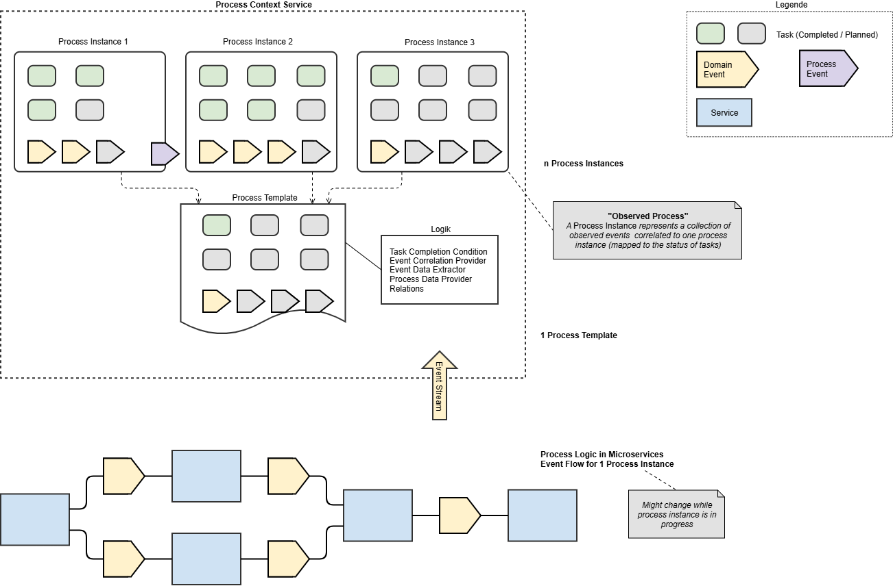
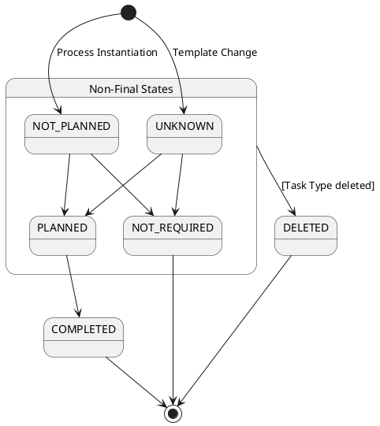

# Process Context Service Template Migration

## Context

1) The Process Context Service **logs** events and assigns them to a process context. This
   makes the state of a process transparent.

2) For a process, **conditions** can also be formulated for when certain **milestones** are
   reached and when **tasks in the process are considered complete**. This in turn influences
   when the **process is considered complete**, namely when all of its tasks are done.

Processes in the Process Context Service are instantiated by the process origin, usually a
service that represents the **starting point** of the process. The actual **process logic
resides in the services** that consume and produce events associated with the process.

Processes can be open for a **longer period of time** until they are completed (usually
days/weeks), i.e. spanning **deployments and releases of new features/process logic** in the
services.

The pure **logging** can happen relatively **independently of the evolution of the process
over time**. The **logic** for reaching milestones and for completing tasks (and thus also the
process) is **more tightly coupled** to the occurrence of **expected events, and thus the
flow**, of the process as defined in the template.

## Constraints

| # | Constraint | Description |
| --- | --- | --- |
| **R1** | Logging | The Process Context Service acts in a logging capacity. It cannot intervene in, or control, the actual process flow, but only represents it. The process flow is determined solely by the current logic in the services participating in the process. Planning of tasks for dynamic tasks is also the responsibility of the services participating in the process. |
| **R2** | "There is no process" | It follows that there is always exactly one productive version of a process (exception: participating services implement some kind of migration logic, e.g. based on the payload of events). One could also argue that there is in fact no process, but only instances of linked event streams. |
| **R3** | Changes in business logic and event stream are a fact, determined by the current productive version of the system, consisting of 1..n services | The fact that process flows change over time while processes are still open is determined by the participating services and their business logic. The truly difficult part of the migration topic is therefore to be found in the participating services -- they must ensure that the changed event flow also works with flows that are already instantiated. The Process Context Service perceives, as a symptom of this, that the "observed process" -- or the event flow -- no longer matches the process template that was active at the time the process was instantiated. It must therefore be able to handle the fact that the process template changes. |
| **R4** | Done means done | Completed processes remain completed and are unaffected by changed process templates. The same applies to completed tasks. |

## Automated Migration Rules

These rules are automated and are carried out automatically by the Process Context Service
after a change to a template, either time-based in batch mode, or as soon as an event is
received for a process instance.

In general:

- For a changed template, for process instances in a **non-final** state, a re-evaluation of
  the state is **always** triggered, in order to apply new definitions (new process data
  etc.).

### Task

| Process template change | Task instance state | Migration rule |
| --- | --- | --- |
| New dynamic task type | - | Create task instance in state UNKNOWN |
| New single task type | - | Create task instance in state UNKNOWN |
| Task type deleted | Non-final state | Change task instance state to DELETED |
| Task type deleted | Final state | No action |

### Event

| Process template change | Migration rule |
| --- | --- |
| New event reference | No action (event is consumed from now on) |
| Event reference deleted | No action (event is no longer consumed; already-existing events remain) |

#### Event Data

| Process template change | Migration rule |
| --- | --- |
| New event data definition | No action (event data is generated from now on) |
| Deleted event data definition | No action (existing event data remains) |

### Process Data

| Process template change | Migration rule |
| --- | --- |
| New process data definition | No action (process data is generated from now on) |
| Deleted process data definition | No action (existing process data remains) |

### Relations

| Process template change | Migration rule |
| --- | --- |
| New relation pattern | No action (relation is created from now on) |
| Deleted relation pattern | No action (existing relation remains) |

## Specific Migration Rules

All elements that were created with status **UNKNOWN** (tasks) during the automated
migration must be migrated by means of a DB script. This migration is context-dependent and
must be implemented by the project.
