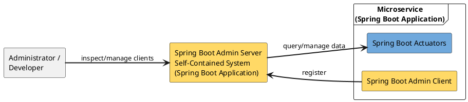

# Spring Boot Admin

## Overview

[Spring Boot Admin](https://github.com/codecentric/spring-boot-admin) is a monitoring/management tool for
Spring Boot applications. It provides a simple way to visualize the application metrics provided by Spring
Boot Actuator. Spring Boot Admin is itself also a Spring Boot application and can be adapted to specific
project needs via Spring mechanisms.

Quote from [jaxenter.de](https://jaxenter.de/spring-boot-ueberwachen-56688):

> "Often the monitoring tools are maintained by another team, and it often takes weeks until they are
> properly configured. This is where Spring Boot Admin helps."



A Spring Boot Admin setup basically consists of a *Spring Boot Admin Server* and the *Spring Boot
applications* to be monitored by it. The applications to be monitored must explicitly register with the
Spring Boot Admin Server as a *Spring Boot Admin Client* in order to be monitored by it. The Spring Boot
Admin Server regularly reads the application metrics of its clients from their Actuator interfaces and
visualizes this data in a GUI.

An advantage of Spring Boot Admin is that different information about the monitored applications can be
viewed centrally in one place.

## Integration

### Setting up Spring Boot Admin

The Spring Boot Admin UI is provided by a third party and is not a product supported by jEAP. It can be
obtained directly from [https://github.com/codecentric/spring-boot-admin](https://github.com/codecentric/spring-boot-admin).

### Spring Boot Admin Server Security

The seed project protects access to the Spring Boot Admin Server with HTTP Basic-Auth. Two different users
are defined:

- The *admin* user has the role ADMIN. This user is used to log in to the Admin Server's UI.
- The *client* user has the role CLIENT. Applications can use this user to register with the Admin Server for
  monitoring.

The admin user is configured via the following properties:

**admin user configuration**

```java
spring.security.user.name=admin
spring.security.user.password=secret
```

The client user is configured via the following properties:

**client user configuration**

```java
spring.boot.admin.client.username=client
spring.boot.admin.client.password=secret
```

> **Warning**: The simple Basic-Auth protection preconfigured by Spring Boot Admin for accessing the
> monitoring data of registered clients is generally not a sufficient measure to protect sensitive data,
> such as is typically present on the PROD and ABN (acceptance) environments.

### Integrating applications as a Spring Boot Admin Client

For an application to automatically register with the Spring Boot Admin Server for monitoring, the
dependency **spring-boot-admin-starter-client** must be added to the application, and the following must be
configured:

- The URL of the Spring Boot Admin Server that the application wants to be monitored by
- The credentials of the user with which the application should log in to the Spring Boot Admin Server
- The credentials with which the Spring Boot Admin Server should access the application's Actuator endpoints

**Spring Boot Admin Client configuration**

```yaml
spring:
  boot:
    admin:
      client:
        url: https://<<route to the spring boot admin server>>
        username: <<username of the spring boot admin server client user>>
        password: <<password of the spring boot admin server client user>>
        instance:
          metadata:
            user:
              name: <<username to access the client application's actuator endpoints>>
              password: <<password to access the client application's actuator endpoints>>
```

### Spring Boot Admin Client Security

A Spring Boot Admin Client must grant the Spring Boot Admin Server access to its Actuator endpoints. It is
essential to keep in mind that these endpoints can in principle expose sensitive data (see the section
[Security](spring-boot-admin-actuators.md#security)). The Actuator endpoints must be protected accordingly.

The Spring Boot Starter **jeap-spring-boot-monitoring-starter** (see
[Monitoring Endpoints](monitoring-endpoints.md#integration)) offers a way to make the Actuator endpoints
essential for monitoring an application available with Basic-Auth protection. This feature is disabled by
default for security reasons. It can be enabled and configured as follows:

```yaml
# The following configuration belongs in application-dev.yml and application-ref.yml - never in application-prod.yml!

# Enable endpoints for Spring Boot Admin (default: false)
jeap.monitor.actuator.enable-admin-endpoints=true

# Username/password for the actuator user who receives the ACTUATOR role and thus access to the admin endpoints
jeap.monitor.actuator.user=actuator
jeap.monitor.actuator.password={bcrypt}<your-hash-here>

# Additional endpoints for the application that the user with the ACTUATOR role is allowed to access
jeap.monitor.actuator.additional-permitted-endpoints=\
    org.springframework.boot.actuate.autoconfigure.condition.ConditionsReportEndpoint, \
    org.springframework.boot.actuate.cache.CachesEndpoint
```

If the property `jeap.monitor.actuator.enable-admin-endpoints` is set to `true`, a predefined set of
monitoring endpoints is activated and made accessible for the user with the ACTUATOR role. This predefined
set of monitoring endpoints usually should not need to be adjusted by monitored applications. The predefined
set of endpoints is configured as follows:

**jeap-actuator-spring-boot.properties**
([source on GitHub](https://github.com/jeap-admin-ch/jeap-spring-boot-starters/blob/main/jeap-spring-boot-monitoring-starter/src/main/resources/jeap-actuator-spring-boot.properties))

```properties
management.endpoint.beans.enabled=true
management.endpoint.configprops.enabled=true
management.endpoint.env.enabled=true
management.endpoint.loggers.enabled=true
management.endpoint.metrics.enabled=true
management.endpoint.scheduledtasks.enabled=true
management.endpoint.threaddump.enabled=true
```

This configuration extends the base configuration made by the jeap-monitoring-starter:

**jeap-actuator.properties**
([source on GitHub](https://github.com/jeap-admin-ch/jeap-spring-boot-starters/blob/main/jeap-spring-boot-monitoring-starter/src/main/resources/jeap-actuator.properties))

```properties
management.endpoints.enabled-by-default=false
management.endpoints.web.exposure.include=*
management.endpoints.jmx.exposure.exclude=*
management.endpoint.info.enabled=true
management.endpoint.health.enabled=true
management.endpoint.health.show-details=when-authorized
management.endpoint.health.show-components=when-authorized
management.endpoint.health.probes.enabled=true
management.health.readinessState.enabled=true
management.health.livenessState.enabled=true
# Roles which are allowed to show details
management.endpoint.health.roles=ACTUATOR
management.endpoint.prometheus.enabled=true
#Exposes any property that start with info.*
management.info.env.enabled=true
jeap.monitor.prometheus.user=prometheus
# Hash that does not correlate to any real value - override in application
jeap.monitor.prometheus.password={SHA-1}582e9ddb3407ab793502c96ccd2b53acec24037d
jeap.monitor.actuator.user=actuator
# Hash that does not correlate to any real value - override in application
jeap.monitor.actuator.password={SHA-1}582e9ddb3407ab793502c96ccd2b53acec24037d
# Whether default endpoints for Spring Boot Admin should be enabled
jeap.monitor.actuator.enable-admin-endpoints=false
# Default endpoints that users with the ACTUATOR role will be allowed to access (if the endpoint is enabled)
jeap.monitor.actuator.permitted-endpoints=\
    org.springframework.boot.actuate.beans.BeansEndpoint, \
    org.springframework.boot.actuate.context.properties.ConfigurationPropertiesReportEndpoint, \
    org.springframework.boot.actuate.env.EnvironmentEndpoint, \
    org.springframework.boot.actuate.logging.LoggersEndpoint, \
    org.springframework.boot.micrometer.metrics.actuate.endpoint.MetricsEndpoint, \
    org.springframework.boot.actuate.scheduling.ScheduledTasksEndpoint, \
    org.springframework.boot.actuate.management.ThreadDumpEndpoint
# Additional application-provided endpoints that users with the ACTUATOR role will be allowed to access (if the endpoint is enabled)
jeap.monitor.actuator.additional-permitted-endpoints=
# Maximum number of jeap_relation metrics that will be saved for prometheus
jeap.monitor.metrics.rest.maximum-allowable-jeap-relation-metrics=2000
# Maximum number of jeap_rest_endpoint_without_jwt metrics that will be saved for prometheus
jeap.monitor.metrics.security.maximum-allowable-metrics=1000
```

If an application wants to offer additional endpoints for monitoring, these can be listed in the property
`jeap.monitor.actuator.additional-permitted-endpoints`. If this option is used, security aspects according
to the discussion in
[Spring Boot Admin and Spring Boot Actuators](spring-boot-admin-actuators.md) must be considered, and the
jEAP requirements for the use of Spring Boot Admin must be observed. This also applies if the Spring Boot
Actuator security configuration itself is done independently of the `jeap-spring-boot-monitoring-starter`.

> **Warning**: The simple Basic-Auth protection of the client Actuators preconfigured by the
> jeap-spring-boot-monitoring-starter is generally not a sufficient measure to protect sensitive data, such
> as is typically present on the PROD and ABN environments.

## Further documentation

- [Spring Boot Admin](https://github.com/codecentric/spring-boot-admin/blob/master/README.md)
- [Spring Boot applications monitoring, tutorial by jaxenter.de](https://jaxenter.de/spring-boot-ueberwachen-56688)
