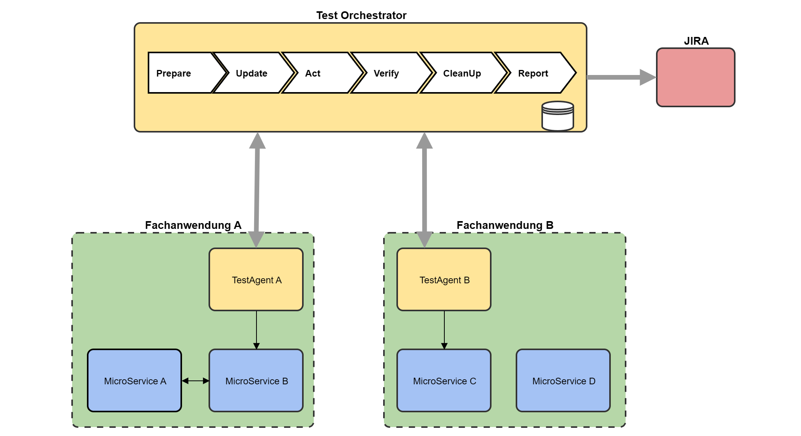
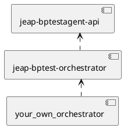

# Business Process Testautomation

## Goal

The automated business process tests (Business Process Tests) are intended to test the interaction between different business applications, and they form the top of the test pyramid. Functional correctness should not be verified in the business process tests.

## Architecture Overview



### Component Responsibilities

| Component | Responsibilities |
| --- | --- |
| TestOrchestrator | - Orchestrates the test of the business process<br/>- Interacts with the TestAgents of the business applications via a simple, standardized REST API<br/>- Exposes a simple, standardized REST API so that TestAgents can report statuses and data from the business application back to the orchestrator |
| Business application A & B | The individual microservices of the business applications should not need to be adapted for the business process tests. There may be individual exceptions. |
| TestAgent A & B | - Enables the Test Orchestrator to interact with the business application.<br/>- Exposes a simple, standardized REST API that can be used by the Test Orchestrator<br/>- Notifies statuses and data to the REST API of the Test Orchestrator |
| JIRA | Jira (with the ZephyrScale plugin) acts as the reporting tool. The test results are transferred automatically by the TestOrchestrator via REST API after every test run. |

## Test Orchestrator

To implement a Test Orchestrator, the jEAP library [jeap-bptest-orchestrator](https://github.com/jeap-admin-ch/jeap-bptest-orchestrator) can be used. This in turn has a dependency on the jEAP library [jeap-bptestagent-api](https://github.com/jeap-admin-ch/jeap-bptestagent-api), which can also be used for the TestAgents.



### Build your own Orchestrator

#### Organizational

Since an orchestrator operates across business applications, it must be decided where it should be hosted. Reporting is done via the Jira plugin ZephyrScale. This means a Jira project must also exist to which the orchestrator can deliver its report (to send the test report to Jira, a technical Jira user is required).

The following questions must be answered:

- Where are the test cases documented?
- In which project are the test runs reported?
- In which repository is the source code for the TestOrchestrator created?
- Where is the TestOrchestrator deployed?

#### Technical

:::info
An example implementation can be found in the project [jme-bptest-example](https://github.com/jme-admin-ch/jme-bptest-example), in the module [jme-bptest-orchestrator](https://github.com/jme-admin-ch/jme-bptest-example/tree/main/jme-bptest-orchestrator). The example shows the instantiation in a multi-module project. In this case, make sure that the `jeap-spring-boot-parent` version used by the project's parent matches the `jeap-spring-boot-parent` version used by the Test Orchestrator dependency. If the Test Orchestrator instance to be created is not part of a multi-module project, then set up the Test Orchestrator as described below, using `jeap-bptest-orchestrator-instance` as the parent project.
:::

To build your own orchestrator, the following steps must be carried out:

1. Create a Spring Boot application, for example with the jEAP Initializer.
2. Use `jeap-bptest-orchestrator-instance` as the project parent:

   ```xml
   <parent>
       <groupId>ch.admin.bit.jeap</groupId>
       <artifactId>jeap-bptest-orchestrator-instance</artifactId>
       <version>use-the-latest-version-here</version>
       <relativePath/> <!-- lookup parent from repository -->
   </parent>
   ```

3. Create a `TestCaseController` analogous to the example (source: [TestCaseController.java](https://github.com/jme-admin-ch/jme-bptest-example/blob/main/jme-bptest-orchestrator/src/main/java/ch/admin/bit/jeap/jme/bptest/orchestrator/web/TestCaseController.java) in `jme-bptest-example`, branch `main`):

   ```java
   package ch.admin.bit.jeap.jme.bptest.orchestrator.web;

   import ch.admin.bit.jeap.testagent.api.notification.LogDto;
   import ch.admin.bit.jeap.testagent.api.notification.NotificationDto;
   import ch.admin.bit.jeap.testorchestrator.domain.TestConclusion;
   import ch.admin.bit.jeap.testorchestrator.services.LogService;
   import ch.admin.bit.jeap.testorchestrator.services.NotificationService;
   import ch.admin.bit.jeap.testorchestrator.services.TestCaseService;
   import ch.admin.bit.jeap.testorchestrator.services.TestRunService;
   import io.swagger.v3.oas.annotations.Operation;
   import io.swagger.v3.oas.annotations.tags.Tag;
   import lombok.RequiredArgsConstructor;
   import lombok.extern.slf4j.Slf4j;
   import org.springframework.web.bind.annotation.*;

   @RestController
   @RequiredArgsConstructor
   @Slf4j
   @Tag(name = "TestOrchestrator API")
   @RequestMapping(value = "/api/tests")
   class TestCaseController {

       private final TestCaseService testCaseService;
       private final LogService logService;
       private final NotificationService notificationService;
       private final TestRunService testRunService;

       @Operation(summary = "Start Test Run and return Test ID. Available TestCases: OrderBillingHappyPath")
       @PostMapping("/{testCase}")
           // This must not be marked as @Transactional. Otherwise the test run will not yet be persisted when test agents
           // invoke the log endpoint during the prepare phase.
       String startTestRun(@PathVariable String testCase) {
           return testCaseService.startTestRun(testCase);
       }

       @Operation(summary = "Log")
       @PostMapping("/{testId}/logs")
       void log(@PathVariable String testId, @RequestBody LogDto logDto) {
           logService.log(testId, logDto);
       }

       @Operation(summary = "Notify")
       @PostMapping("/{testId}/notifications")
       public void notify(@PathVariable String testId, @RequestBody NotificationDto notificationDto) {
           notificationService.notify(testId, notificationDto);
       }

       @Operation(summary = "Get the overall test conclusion of a test run for this testId")
       @GetMapping("/{testId}/conclusion")
       public TestConclusion getOverallTestConclusion(@PathVariable String testId) {
           return testRunService.getOverallTestConclusion(testId);
       }

   }
   ```

4. Create an implementation of a `TestCase` analogous to the example (source: [OrderBillingHappyPath.java](https://github.com/jme-admin-ch/jme-bptest-example/blob/main/jme-bptest-orchestrator/src/main/java/ch/admin/bit/jeap/jme/bptest/orchestrator/testcases/OrderBillingHappyPath.java) in `jme-bptest-example`, branch `main`):

   ```java
   package ch.admin.bit.jeap.jme.bptest.orchestrator.testcases;

   import ch.admin.bit.jeap.testagent.api.act.ActionDto;
   import ch.admin.bit.jeap.testagent.api.act.ActionResultDto;
   import ch.admin.bit.jeap.testagent.api.prepare.PreparationDto;
   import ch.admin.bit.jeap.testagent.api.prepare.PreparationResultDto;
   import ch.admin.bit.jeap.testagent.api.update.DynamicDataDto;
   import ch.admin.bit.jeap.testagent.api.verify.ReportDto;
   import ch.admin.bit.jeap.testorchestrator.adapter.testagent.TestAgentWebClient;
   import ch.admin.bit.jeap.testorchestrator.domain.events.ExecuteDoneEvent;
   import ch.admin.bit.jeap.testorchestrator.domain.events.NotificationEvent;
   import ch.admin.bit.jeap.testorchestrator.domain.events.TestRunFinishedEvent;
   import ch.admin.bit.jeap.testorchestrator.services.TestCaseBaseInterface;
   import ch.admin.bit.jeap.testorchestrator.services.TestReportService;
   import ch.admin.bit.jeap.testorchestrator.services.TestRunService;
   import lombok.RequiredArgsConstructor;
   import lombok.extern.slf4j.Slf4j;
   import org.springframework.context.ApplicationEventPublisher;
   import org.springframework.stereotype.Service;

   import java.util.Map;


   @Service
   @RequiredArgsConstructor
   @Slf4j
   public class OrderBillingHappyPath implements TestCaseBaseInterface {

       final private ApplicationEventPublisher applicationEventPublisher;
       final private TestAgentWebClient testAgentWebClient;
       final private TestReportService testReportService;
       final private TestRunService testRunService;

       final private static String ORDER_TEST_AGENT = "OrderTestAgent";
       final private static String BILLING_TEST_AGENT = "BillingTestAgent";


       @Override
       public String getTestCaseName() {
           return "OrderBillingHappyPath";
       }

       @Override
       public String getJiraProjectKey() {
           return "JEAP";
       }

       @Override
       public String getZephyrTestCaseKey() {
           return "JEAP-T16";
       }

       @Override
       public void prepare(String testId, PreparationDto preparationDto) {
           // The preparationDto is built in the TestCaseService (with the callback Url and the testName)
           // But you can add additional Data like in this example:
           preparationDto.setData(Map.of("demoKey", "demoValue"));
           PreparationResultDto prepResultDtoMonoOrderTestAgent = testAgentWebClient.prepare(ORDER_TEST_AGENT, testId, preparationDto);
           PreparationResultDto prepResultDtoMonoBillingTestAgent = testAgentWebClient.prepare(BILLING_TEST_AGENT, testId, preparationDto);
           //Optional: Do something with the PreparationResultDto
           log.info("Prepare: end");
       }

       @Override
       public void execute(String testId) {
           ActionDto actionDto = ActionDto.builder()
                   .action("submitOrder")
                   .build();
           ActionResultDto actionResultDto = testAgentWebClient.act(ORDER_TEST_AGENT, testId, actionDto);
           Map<String, String> parameters = testRunService.getParameters(testId);
           //Optional: Do something with the ActionResultDto or the parameters
           log.info("Execute: end");
       }

       @Override
       public void verify(String testId) {
           ReportDto reportDtoBilling = testAgentWebClient.verify(BILLING_TEST_AGENT, testId);
           testReportService.persistTestResult(testId, reportDtoBilling);

           ReportDto reportDtoOrder = testAgentWebClient.verify(ORDER_TEST_AGENT, testId);
           testReportService.persistTestResult(testId, reportDtoOrder);
           log.info("Verify: end");
       }

       @Override
       public void cleanUp(String testId) {
           testAgentWebClient.delete(BILLING_TEST_AGENT, testId);
           testAgentWebClient.delete(ORDER_TEST_AGENT, testId);

           TestRunFinishedEvent testRunFinishedEvent = new TestRunFinishedEvent(this, testId);
           applicationEventPublisher.publishEvent(testRunFinishedEvent);
           log.info("CleanUp: end");
       }

       @Override
       public void onApplicationEvent(NotificationEvent notificationEvent) {
           switch (notificationEvent.getNotification()) {
               case "Order-Created":
                   log.info("Order-Created");
                   DynamicDataDto dynamicDataDto = new DynamicDataDto(notificationEvent.getData());
                   this.testAgentWebClient.update(BILLING_TEST_AGENT, notificationEvent.getTestId(), dynamicDataDto);
                   break;
               case "Order-Closed":
                   log.info("Order-Closed");
                   ExecuteDoneEvent executeDoneEvent = new ExecuteDoneEvent(this,
                           this.getTestCaseName(),
                           notificationEvent.getTestId());
                   applicationEventPublisher.publishEvent(executeDoneEvent);
                   break;
               default:
                   throw new IllegalStateException("Notification '" + notificationEvent.getNotification() + "' not expected");
           }
       }
   }
   ```

5. The TestOrchestrator needs a PostgreSQL database.
6. Finally, the corresponding TestAgents must also be available. If this is not yet the case, see [Test-Support](#test-support).

##### Configuration

The following orchestrator-specific configuration must be specified in the corresponding `application.yml`:

```yaml
orchestrator:
  callbackUrl: http://localhost:8300/jme-bptest-orchestrator-service
  testagentURLs:
    OrderTestAgent: "http://localhost:8271/jme-bptest-order-testagent-service"
    BillingTestAgent: "http://localhost:8270/jme-bptest-billing-testagent-service"
  zephyr:
    restApiUrl: https://jira.bit.admin.ch/rest/atm/1.0
    zephyrEnvironment: LOCAL
    username: <<name of the technical Jira user>>
    password: <<password of the technical Jira user>>
```

| Parameter | Description |
| --- | --- |
| `orchestrator.callbackUrl` | This URL is given to the TestAgents during prepare, so they can call the orchestrator back (notify and log) |
| `orchestrator.testRunTimeout` | The `testRunTimeout` defines the time in **milliseconds** (default value: 30000 -> 30 seconds) for which the test may run. If the test has not finished after this time has elapsed, it is aborted. In JIRA Zephyr the test is then marked as `FAIL`. |
| `orchestrator.readTimeout` | Read timeout in **seconds** during which the Test Orchestrator waits for a response from Test Agents (default: 5 seconds) |
| `orchestrator.testagentURLs` | List of the test agents with their URL |
| `orchestrator.zephyr.restApiUrl` | The REST API of the productive Jira can be reused as-is |
| `orchestrator.zephyr.zephyrEnvironment` | You can tell Zephyr on which environment the test ran. However, this string must be registered as an environment in the project's Zephyr admin. |
| `orchestrator.zephyr.username` | Name of the technical Jira user. Caution: do not enter directly in the yml, but via secrets |
| `orchestrator.zephyr.password` | Password of the technical Jira user. Caution: do not enter directly in the yml, but via secrets |

:::info
It is currently not yet possible to configure OAuth2 client credentials for cases where the Test Agents protect their API.
:::

### Test-Support

To make it easy to test test-case implementations, the `jeap-bptest-orchestrator` project provides three helper classes: [TestCaseRunner](https://github.com/jeap-admin-ch/jeap-bptest-orchestrator/blob/main/jeap-bptest-orchestrator/src/main/java/ch/admin/bit/jeap/testorchestrator/testsupport/TestCaseRunner.java), [TestCaseMockTool](https://github.com/jeap-admin-ch/jeap-bptest-orchestrator/blob/main/jeap-bptest-orchestrator/src/main/java/ch/admin/bit/jeap/testorchestrator/testsupport/TestCaseMockTool.java) and [TestCaseTestBase](https://github.com/jeap-admin-ch/jeap-bptest-orchestrator/blob/main/jeap-bptest-orchestrator/src/main/java/ch/admin/bit/jeap/testorchestrator/testsupport/TestCaseTestBase.java):

#### TestCaseRunner

With a `TestCaseRunner` instance, the flow of a test case can be simulated in a unit test for the test-case implementation under test. In doing so, the `prepare`, `execute`, `verify` and `cleanUp` phases are run through in a way comparable to `TestCaseService`.

The Test-Case-Runner also takes over the reception and distribution of events, so that no Spring context needs to be started up for the unit test. To do so, Spring application events must be published via the Test-Case-Runner's `ApplicationEventPublisher` (`getApplicationEventPublisher()`). For notifications from simulated Test Agents, the methods `notify(NotificationDto)` and `notifyAsync(NotificationDto, long, TimeUnit)` are available.

Test execution can be either synchronous (`run(TestCaseBaseInterface)`) or asynchronous (`runAsync(TestCaseBaseInterface)`). Asynchronous notifications are only allowed during asynchronous test execution. For most test cases, synchronous execution should be sufficient.

The Test-Case-Runner is stateful, and a single instance can only be used for one test execution.

The two examples [OrderBillingHappyPathTest](https://github.com/jme-admin-ch/jme-bptest-example/blob/main/jme-bptest-orchestrator/src/test/java/ch/admin/bit/jeap/jme/bptest/orchestrator/testcases/OrderBillingHappyPathTest.java) and [OrderBillingHappyPathAsyncTest](https://github.com/jme-admin-ch/jme-bptest-example/blob/main/jme-bptest-orchestrator/src/test/java/ch/admin/bit/jeap/jme/bptest/orchestrator/testcases/OrderBillingHappyPathAsyncTest.java) should show how to use the Test-Case-Runner.

#### TestCaseMockTool

Communication of a test case with the Test Agents is usually done exclusively via a Test-Agent-Web-Client. Accordingly, by mocking this client, the interaction between the test case and the Test Agents can be simulated and verified in a unit test in an almost arbitrary way, in a simple manner.

The test-support class `TestCaseMockTool` provides a collection of methods that can be used to simulate and verify the typical interactions between a test case and the Test Agents via a *Mockito* mock of the Test-Agent-Web-Client. The example [OrderBillingHappyPathTest](https://github.com/jme-admin-ch/jme-bptest-example/blob/main/jme-bptest-orchestrator/src/test/java/ch/admin/bit/jeap/jme/bptest/orchestrator/testcases/OrderBillingHappyPathTest.java) should make the use of the Test-Case-Mock-Tool clear. Of course, the Test-Agent-Web-Client mock used in a unit test does not need to be configured and verified exclusively with methods of the Test-Case-Mock-Tool; if needed, the mock can also be configured and verified directly via the *Mockito* API.

#### TestCaseTestBase

A simple abstract base class for test-case unit-test classes. For every test-method execution, it provides the following things pre-initialized:

- an instance of `TestCaseRunner`
- an instance of `TestCaseMockTool`
- the test ID under which the `TestCaseRunner` will execute the test case
- a Mockito mock of `TestAgentWebClient`
- a Mockito mock of `TestReportService`

## Test Agent / Test Simulator

:::info
A simulator is the same as a TestAgent, with the only difference being that it does not call any further services.
:::

As a rule, one Test Agent is built per business application. Every TestAgent is based on the jEAP library [jeap-bptestagent-api](https://github.com/jeap-admin-ch/jeap-bptestagent-api), which defines the API for the orchestrator.

- The TestAgent enables the Business Test Orchestrator to interact with the business application.
- The TestAgent exposes a simple, standardized REST API that is called by the Test Orchestrator.
- The TestAgent notifies statuses and data to the REST API of the Test Orchestrator.
- The TestAgent can deliver log messages to the orchestrator. These are persisted in the orchestrator.

```plantuml
@startuml
skinparam linetype ortho
skinparam nodesep 40
skinparam ranksep 30
skinparam rectangle {
  BorderColor Black
}
skinparam component {
  BorderColor Black
}
component "jeap-bptestagent-api" as n1
component "your_own_testagent" as n0

n0 -[dashed]-> n1

n1 -[hidden]-> n0
@enduml
```



### TestAgent API

The REST API for the orchestrator is defined by the following interface (source: [TestAgentOperations.java](https://github.com/jeap-admin-ch/jeap-bptestagent-api/blob/main/src/main/java/ch/admin/bit/jeap/testagent/api/TestAgentOperations.java) in `jeap-bptestagent-api`, branch `main`):

```java
package ch.admin.bit.jeap.testagent.api;

import ch.admin.bit.jeap.testagent.api.act.ActionDto;
import ch.admin.bit.jeap.testagent.api.act.ActionResultDto;
import ch.admin.bit.jeap.testagent.api.prepare.PreparationDto;
import ch.admin.bit.jeap.testagent.api.prepare.PreparationResultDto;
import ch.admin.bit.jeap.testagent.api.update.DynamicDataDto;
import ch.admin.bit.jeap.testagent.api.verify.ReportDto;
import io.swagger.v3.oas.annotations.Operation;
import io.swagger.v3.oas.annotations.tags.Tag;
import org.springframework.http.ResponseEntity;
import org.springframework.web.bind.annotation.*;

@Tag(name = "TestAgent API", description = """
        Every TestAgent/Simulator implements this API. \
        The Orchestrator uses this API to orchestrate the Business Process Tests\
        """)
@RequestMapping(value = "/api/tests")
public interface TestAgentOperations {

    @Operation(summary = "Prepare")
    @PutMapping("/{testId}")
    ResponseEntity<PreparationResultDto> prepare(@PathVariable String testId, @RequestBody PreparationDto preparationDto);

    @Operation(summary = "Update")
    @PutMapping("/{testId}/dynamicdata")
    void update(@PathVariable String testId, @RequestBody DynamicDataDto dynamicDataDto);

    @Operation(summary = "Act")
    @PostMapping("/{testId}/actions")
    ResponseEntity<ActionResultDto> act(@PathVariable String testId, @RequestBody ActionDto actionDto);

    @Operation(summary = "Verify")
    @GetMapping("/{testId}/report")
    ResponseEntity<ReportDto> verify(@PathVariable String testId);

    @Operation(summary = "Clean up")
    @DeleteMapping("/{testId}")
    void cleanUp(@PathVariable String testId);

}
```

| Name | Method | Resource | Request Body | Response | Purpose |
| --- | --- | --- | --- | --- | --- |
| Prepare | PUT | `/api/tests/<test_id>` | [PreparationDto](https://github.com/jeap-admin-ch/jeap-bptestagent-api/blob/main/src/main/java/ch/admin/bit/jeap/testagent/api/prepare/PreparationDto.java) | [PreparationResultDto](https://github.com/jeap-admin-ch/jeap-bptestagent-api/blob/main/src/main/java/ch/admin/bit/jeap/testagent/api/prepare/PreparationResultDto.java) | The TestAgent is asked to prepare the business application for a test. Similarly, a simulator can be prepared for a test.<br/>- The request body references an `initialState` known to the Test Agent/Simulator (optionally, the body can contain parameters as key/value pairs)<br/>- The response body allows information about the initial state to be returned to the orchestrator (this information may potentially be required for initializing other business applications) |
| Update | PUT | `/api/tests/<test_id>/dynamicdata` | [DynamicDataDto.java](https://github.com/jeap-admin-ch/jeap-bptestagent-api/blob/main/src/main/java/ch/admin/bit/jeap/testagent/api/update/DynamicDataDto.java) | - | Pass dynamic data to the business application or the simulator (key/value pairs).<br/>This may be necessary if the information (e.g. an id) was not yet known at the start of the process. |
| Act | POST | `/api/tests/<test_id>/actions` | [ActionDto](https://github.com/jeap-admin-ch/jeap-bptestagent-api/blob/main/src/main/java/ch/admin/bit/jeap/testagent/api/act/ActionDto.java) | [ActionResultDto](https://github.com/jeap-admin-ch/jeap-bptestagent-api/blob/main/src/main/java/ch/admin/bit/jeap/testagent/api/act/ActionResultDto.java) | Trigger an action on the test.<br/>- The request body references the action known to the TestAgent/Simulator (optionally, the body can contain parameters as key/value pairs)<br/>This is used to trigger an action on a simulator or a business application that is required for the process to continue. |
| Verify | GET | `/api/tests/<test_id>/report` | - | [ReportDto](https://github.com/jeap-admin-ch/jeap-bptestagent-api/blob/main/src/main/java/ch/admin/bit/jeap/testagent/api/verify/ReportDto.java) | Verify whether the expectations (data, interactions) were met:<br/>- whether the business application or the simulator has reached the expected state<br/>- whether the expected interactions (with the simulator) have taken place |
| CleanUp | DELETE | `/api/tests/` | - | - | Delete test data |

### Build your own TestAgent

:::info
Reference implementations of two TestAgents can be found in the [jme-bptest-example](https://github.com/jme-admin-ch/jme-bptest-example) example ([jme-bptest-billing-testagent-service](https://github.com/jme-admin-ch/jme-bptest-example/tree/main/jme-bptest-billing-testagent-service), [jme-bptest-order-testagent-service](https://github.com/jme-admin-ch/jme-bptest-example/tree/main/jme-bptest-order-testagent-service)).
:::

## Links

| Link | Description |
| --- | --- |
| [jeap-bptestagent-api](https://github.com/jeap-admin-ch/jeap-bptestagent-api) | API definition between the orchestrator and TestAgents / simulators |
| [jeap-bptest-orchestrator](https://github.com/jeap-admin-ch/jeap-bptest-orchestrator) | jEAP library as the basis for implementing an orchestrator |
| [jme-bptest-example](https://github.com/jme-admin-ch/jme-bptest-example) | Example with 2 test agents and an orchestrator implementation |
