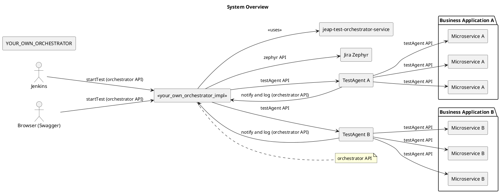
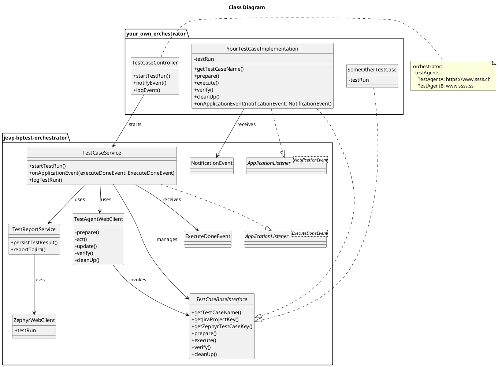
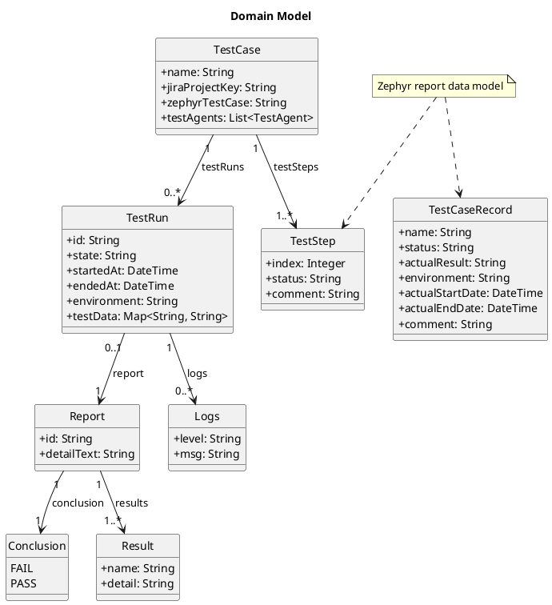
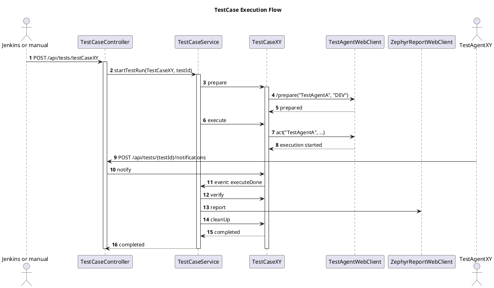

# jEAP BusinessTest Orchestrator - Architecture

## Context

### External View

### Interfaces

#### Orchestrator REST API

| Operation | Method | Path | Description |
| --- | --- | --- | --- |
| `startTest` | POST | `/api/tests/{testCaseName}` | Starts a test run for the test case `testCaseName`. A `testId` is generated and returned. |
| `notifyEvent` | POST | `/api/tests/{testId}/notifications` Body: `{` `testId: <testId>,` `notification: <the Notification>` `producer: <which TestAgent>` `data: Map<Key, Value>` `}` [`NotificationDto.java`](https://github.com/jeap-admin-ch/jeap-bptestagent-api/blob/main/src/main/java/ch/admin/bit/jeap/testagent/api/notification/NotificationDto.java) | The test agent/simulator reports an event/state/progress of the business application. These events allow the orchestrator to: - trigger actions so the process can continue (e.g. simulate an arrival) - detect the progress of the test  This avoids the orchestrator having to poll the test agent to detect whether a given state has been reached. |
| `log` | POST | `/api/tests/<testId>/logs` Body: `{` `logMessage: <logMessage>,` `logLevel: <logLevel>,` `source: <testAgentName>` `}` [`LogDto.java`](https://github.com/jeap-admin-ch/jeap-bptestagent-api/blob/main/src/main/java/ch/admin/bit/jeap/testagent/api/notification/LogDto.java) | Test agents can report events and intermediate steps to the orchestrator. The orchestrator passes these messages 1:1 to the logger. Logs from the test agents are persisted in the orchestrator DB. |

## Building Block View

## Class Diagram

The class diagram only shows a partial excerpt, meant to illustrate how the framework and the test case implementation relate to each other.

Not shown in the diagram: all helper classes and domain classes (see the domain model for those).

## Domain Model

## Sequence Diagram

