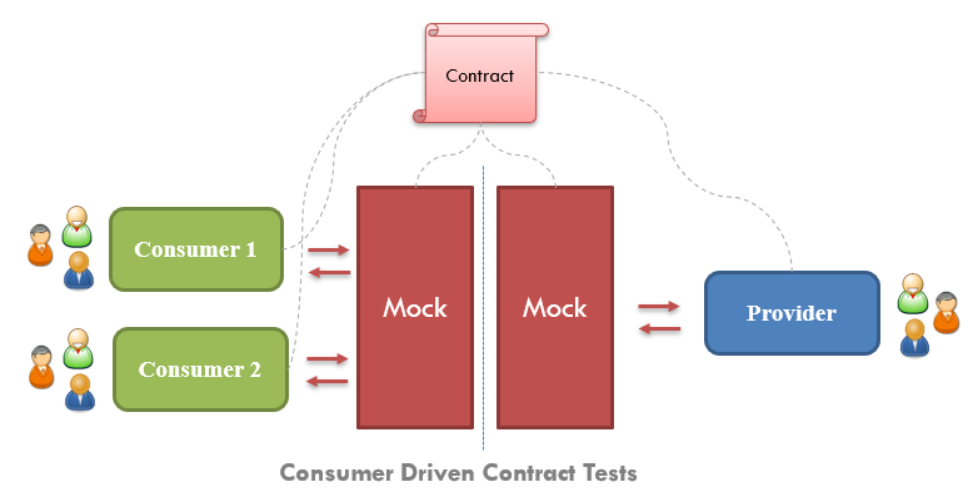
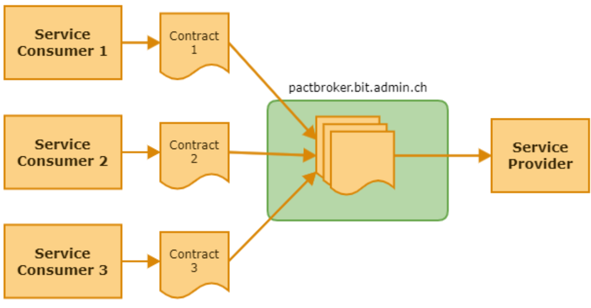
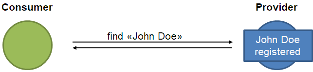

# Consumer-Driven Contract Tests

## Motivation

The goal of Consumer-Driven Contract Tests (CDCT) with Pact is to achieve efficient, stable and meaningful integration tests between a service provider and its service consumers. Such tests should make the usually very complex, fragile and interdependent E2E tests on test environments with preconfigured test data as superfluous as possible.

With these tests, it is possible to automatically ask the question "can-I-deploy?", which allows us to continuously deploy to production.

:::info
The Pact framework describes the testing of HTTP interfaces and messages. We only use Pact for testing HTTP interfaces. We test the compatibility of messages with our own concept → see [can-I-Deploy für Messaging](../../messaging/message-contracts/can-i-deploy-for-messaging.md)
:::

## Read the basics

There are enough good explanations about Consumer-Driven Contract Tests (CDCT). Take your time and study the following resources:

- [What is Pact contract testing & how does it work? | PactFlow](https://pactflow.io/how-pact-works/?utm_source=ossdocs&utm_campaign=getting_started#slide-1)
- [Introduction | Pact Docs](https://docs.pact.io/)
- Checkout our example 
  - [jme-cdct-consumer-example](https://github.com/jme-admin-ch/jme-cdct-consumer-example)
  - [jme-cdct-provider-example](https://github.com/jme-admin-ch/jme-cdct-provider-example)

### The Big Picture

[](https://www.testautomatisierung.org/lexikon/consumer-driven-contract-cdc-tests/)

Image source: [Consumer Driven Contract (CDC) Tests - Testautomatisierung.org](https://www.testautomatisierung.org/lexikon/consumer-driven-contract-cdc-tests/)

### Contract = Pact = json-File

A **contract** between a **consumer** and **provider** is called a **_pact_**. Each pact is a collection of **_interactions_**. Each interaction describes:

- An expected request - describing what the consumer is expected to send to the provider
- A minimal expected response - describing the parts of the response the consumer wants the provider to return.

At the end a json-file is generated and will be uploaded to the Pact Broker.

Pact is *consumer-driven* contract testing, i.e. the pacts are specified by the consumers, but they do it in *collaboration* with the provider.

### Pact Broker

This is the place where all the pacts (aka contracts) will be uploaded.



### Consumer and Provider Mocks

Based on a contract, Pact can provide a mock provider for consumer tests and replay the pact's requests against the real provider during provider verification. This allows consumers and providers to be tested independently.

### Provider States

With a provider state, a consumer can define a condition under which a certain interaction takes place, e.g. if a consumer expects a provider to respond to a 'find' request for 'John Doe' with John Doe's data, the interaction would have to take place under the condition that 'John Doe' has been registered with the provider, i.e. the provider state "John Doe registered".



## Create Consumer Tests

### Preconditions

Maven parent: As always, use the latest `jeap-spring-boot-parent`.

```xml title="pom.xml"
...
	<parent>
		<groupId>ch.admin.bit.jeap</groupId>
		<artifactId>jeap-spring-boot-parent</artifactId>
		<version>41.10.0</version> <!-- use the latest version -->
        <relativePath/> <!-- lookup parent from repository -->
	</parent>
...
```

Maven dependencies:

```xml title="pom.xml"
<dependencies>
...
	<dependency>
    	<groupId>au.com.dius.pact.consumer</groupId>
        <artifactId>junit5</artifactId>
        <scope>test</scope>
        <!-- version managed by jeap parent -->
    </dependency>
...
</dependencies>
```

Maven plugins when using `jeap-spring-boot-parent` version >= 28.0.1:

```xml title="pom.xml"
<plugins>
...
	<plugin>
    	<groupId>au.com.dius.pact.provider</groupId>
        <artifactId>maven</artifactId>
         <!-- version managed by jeap parent -->
	</plugin>
...
</plugins>
```

Maven plugins when using `jeap-spring-boot-parent` version < 28.0.1:

```xml title="pom.xml"
<plugins>
...
	<plugin>
    	<groupId>au.com.dius.pact.provider</groupId>
        <artifactId>maven</artifactId>
         <!-- version managed by jeap parent -->
        <executions>
        	<!-- The actual publishing of pacts to the pact broker depends on a profile,
			 and gets activated in jeap pipeline builds by default. -->
         	<execution>
            	<phase>install</phase>
                <goals>
                	<goal>publish</goal>
                </goals>
			</execution>
		</executions>
	</plugin>
...
</plugins>
```

### ConsumerPactTest.java

A Consumer Pact Test is a normal JUnit test.

The annotations mentioned below are only those concerning pacts. Additional JUnit or jEAP-Security specific ones can be seen in the example → [TaskClientConsumerPactTest.java - jme-cdct-consumer-example](https://github.com/jme-admin-ch/jme-cdct-consumer-example/blob/main/src/test/java/ch/admin/bit/jeap/jme/cdct/consumer/web/api/gateway/TaskClientConsumerPactTest.java)

#### Class Annotations

```java title="ConsumerTest"
@PactConsumerTest
@PactTestFor(pactVersion = PactSpecVersion.V4)
@MockServerConfig(hostInterface = "localhost", port = "8888")
class ConsumerPactTest {
...
```

- `@PactConsumerTest`: Indicates that this class contains Pact consumer tests.
- `@PactTestFor`: Specifies the version of the Pact specification to be used.
- `@MockServerConfig`: Configures the mock server provided by Pact.

#### Pact Interaction Methods

- Methods annotated with `@Pact` define interactions between the consumer and provider using the Pact DSL.
- Each method specifies a given provider state, an interaction (request/response), and returns a Pact object.
- Interactions defined in the jme-cdc-example-consumer include requesting a task by ID, requesting multiple tasks, handling insufficient authorization, etc.

:::warning
There seems to be a bug in the Pact JUnit extension when constructor injection is used on the test class which results in the Pact extension not picking up the `@Pact` annotations on methods defining interactions. Use field injection instead.
:::

```java title="Pact Interaction Method Example"
@Pact(provider = PROVIDER, consumer = CONSUMER)
    private V4Pact requestTaskWithFixedIdTaskBeingPresentInteraction(PactBuilder builder) {
    final String path = API_PATH + "/1";
    return builder.
            given("A task with task id '1' is present").
            expectsToReceiveHttpInteraction("A GET request to " + path, httpInteractionBuilder ->  httpInteractionBuilder.
                withRequest(httpRequestBuilder -> httpRequestBuilder.
                    header(HttpHeaders.AUTHORIZATION, "Bearer " + taskReadToken).
                    method("GET").
                    path(path)).
                willRespondWith(httpResponseBuilder -> httpResponseBuilder.
                    status(200).
                    header("Content-Type", "application/json").
                    body(
                        newJsonBody(o -> {
                            o.stringValue(ID_FIELD_NAME, "1");
                            o.stringType(TITLE_FIELD_NAME, TITLE_EXAMPLE_VALUE);
                            o.stringType(CONTENT_FIELD_NAME, CONTENT_EXAMPLE_VALUE);
                        }).
                    build()))).
            toPact();
    }
```

#### Test Methods

- Test methods annotated with `@Test` execute consumer Pact tests for the interactions defined (in the example above the interaction is defined by the method with the name **requestTaskWithFixedIdTaskBeingPresentInteraction**)
- Each test method references an `@Pact` annotated method and asserts the corresponding interaction.

```java title="Test Method Example"
@Test
    @PactTestFor(pactMethod = "requestTaskWithFixedIdTaskBeingPresentInteraction")
    void testGetTaskByIdWithFixedIdTaskBeingPresent() {
        mockRestClientBuilderFactory.getAuthTokenProvider().setAuthToken(taskReadToken);

        Task result = taskClient.getTaskById("1");

        assertTaskValues(result, "1",TITLE_EXAMPLE_VALUE, CONTENT_EXAMPLE_VALUE);
    }
```

The interested reader may have noticed that authentication is integrated in these two example methods. This requires some additional configuration which can be seen in the examples → [jme-cdct-consumer-example](https://github.com/jme-admin-ch/jme-cdct-consumer-example) and [TaskClientConsumerPactTest.java](https://github.com/jme-admin-ch/jme-cdct-consumer-example/blob/main/src/test/java/ch/admin/bit/jeap/jme/cdct/consumer/web/api/gateway/TaskClientConsumerPactTest.java#L40). Alternatively, aspects of authentication might also be covered using provider states.

### Test Scope

Consumer Pact tests should focus on ensuring that the request creation and response handling are correct. Usually, only the part of the consumer that interacts directly with the external service needs to be tested (highlighted in yellow below).

[](https://docs.pact.io/5-minute-getting-started-guide#scope-of-a-consumer-pact-test)

## Create Provider Tests

### Preconditions

Maven parent: As always, use the latest `jeap-spring-boot-parent`.

Maven dependencies:

:::info
Where we need the `au.com.dius.pact.provider`, **NOT** `au.com.dius.pact.consumer`
:::

```xml title="pom.xml"
<dependencies>
...
	<dependency>
    	<groupId>au.com.dius.pact.provider</groupId>
        <artifactId>junit5</artifactId>
        <scope>test</scope>
        <!-- version managed by jeap parent -->
    </dependency>
...
</dependencies>
```

### ProviderPactTest.java

#### Class Annotations

```java title="ProviderTest"
@Provider("bit-jme-cdc-provider-service")
@PactBroker
@AllowOverridePactUrl 
@IgnoreNoPactsToVerify
class ProviderPactTest {
...
```

- `@Provider`: Specifies the provider name for Pact verification.
- `@PactBroker`: Indicates that the pacts will be fetched from a Pact Broker.
- `@AllowOverridePactUrl`: Allows externally specified pact URL to override other consumer version selectors. Needed to support the automatic verification of changed pacts.
- `@IgnoreNoPactsToVerify`: Ignores the absence of pacts to verify. Useful for new providers that do not yet have any consumers specifying pacts.

#### TestPacts-Method

This will verify this provider against all the pacts defined in the Pact Broker for this provider.

```java
@TestTemplate
@ExtendWith(PactVerificationInvocationContextProvider.class)
void testPacts(PactVerificationContext context) {
	// If there are no pacts there will be no context.
    if (context != null) {
    	context.verifyInteraction();
    }
}
```

#### State-Methods

Some (most) interactions need the provider to be in a certain state for a successful test of the interaction. For each such provider state a method needs to be implemented by the provider that puts the provider in the required state. These states correspond to the provider states defined in the consumer pact files. The provider has to coordinate the definition of the provider states required by its consumers, and the states (with their properties) must be part of the provider's documentation.

Example: The following method implements the provider state associated with the name "A task with task id '1' is present". The provider state names defined in the provider and the state names used by the consumers in their interaction specifications must match exactly (see Pact Interaction Method Example, Line 5).

```java
@State("A task with task id '1' is present")
void initStateTaskWithId1Present() {
	createTaskWithId("1", "Task with id 1", "Do this and that", "private", ZonedDateTime.now());
}
```

Example: [Source of TaskControllerProviderTest.java](https://github.com/jme-admin-ch/jme-cdct-provider-example/blob/main/jme-cdct-provider-service/src/test/java/ch/admin/bit/jeap/jme/cdct/provider/web/api/example/TaskControllerProviderTest.java)

### Test Scope

A provider pact test must check that the provider responds to consumer requests as specified in the consumer pacts. Generally, the entire part of the provider that is involved in processing the request must be tested, in particular the part that defines the structure of the response data. Other parts, in particular access to external systems, can usually be mocked.

[](https://docs.pact.io/5-minute-getting-started-guide#scope-of-a-provider-pact-test)

## Webhooks on the Pact Broker

### Why Webhooks?

1. The consumers upload their pacts (contract files) to the Pact Broker (during the build).
2. When the provider is built, it downloads the pacts and verifies itself against all the pacts.

What happens when a consumer uploads a new or a modified contract? Without a new provider build the new contract will not be verified.

This is where Pact Broker webhooks come in: the Pact Broker knows that there is a new or changed pact and which provider has to verify the new pact. With a webhook, the Pact Broker can notify the provider to run its provider tests on the new pact.

## Can-I-Deploy

:::info
can-i-deploy is the main reason why we do Consumer-Driven Contract Tests.
:::

Pact provides a CLI tool called [can-i-deploy](https://docs.pact.io/pact_broker/can_i_deploy), which can be used to check the compatibility of consumer and provider versions in environments. Specifically, before deploying a consumer or provider to an environment, it can be queried on the Pact Broker whether the version of the consumer or provider to be deployed is compatible with the consumer or provider versions already deployed in the environment. This means that can-i-deploy queries in the deployment pipeline can be used to ensure that only compatible services are deployed in an environment.

## Topics

- [jEAP Pact Integration Details](jeap-pact-integration-details.md)
