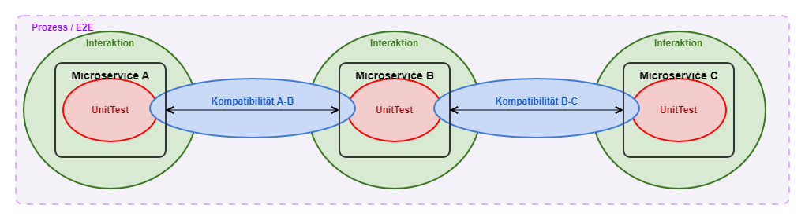

# Testing

## Overview

## Test Types

| Name | Purpose | Links |
| ---- | --- | ---- |
| Unit Tests | The fundamental property of unit tests is isolation. A unit test executes only one specific function and excludes all outside influences (communication with other systems, calls to other functions, etc.). Key techniques for ensuring this isolation include [mocking](http://de.wikipedia.org/wiki/Mock-Objekt), [parameterization](http://de.wikipedia.org/wiki/Parametrisierter_Algorithmus), and the [single responsibility principle](http://www.clean-code-developer.de/Oranger-Grad.ashx#Single_Responsibility_Principle_SRP_1) as programming methodologies used when developing testable code. | - [JUnit tutorial (vogella.com)](https://www.vogella.com/tutorials/JUnit/article.html) - [Unit / Integration Testing with Kafka](unit-integration-testing-with-kafka.md) |
| Interaction Tests | Interaction tests verify that a microservice interacts correctly with other microservices. In particular, they check whether the microservice triggers follow-up events or requests to other APIs. | - [Interaction Tests](interaction-tests.md) |
| CDC Tests | The goal of *Consumer-Driven-Contract-Tests (CDCT) with Pact* is efficient, stable, and meaningful integration tests between a service provider and its service consumers. Such tests aim to make the usually very costly, fragile end-to-end tests of interfaces on test environments with preconfigured test data largely unnecessary. | |
| Business Process Tests | The automated business process tests aim to test the interplay between different business applications and form the top of the test pyramid. Business/domain correctness should not be verified in the business process tests. | - [Business Process Testautomation](business-process-testautomation/index.md) |
| ZAP Security Tests | |  |

## Topics

- [Business Process Testautomation](business-process-testautomation/index.md)
- [Interaction Tests](interaction-tests.md)
- [Unit / Integration Testing with Kafka](unit-integration-testing-with-kafka.md)
