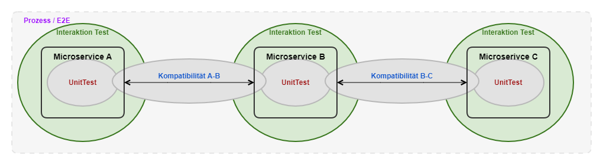
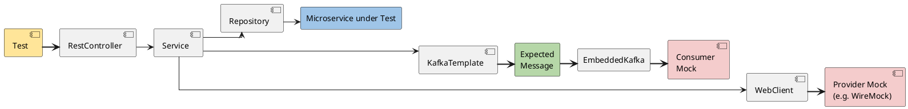
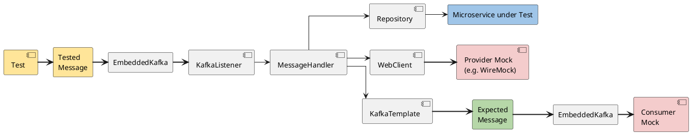
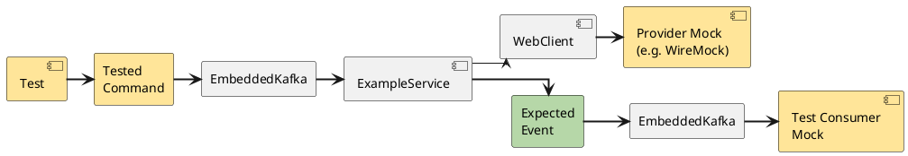

# Interaction Tests

Interaction tests verify that a microservice interacts correctly with other microservices. In particular, they check whether the microservice triggers follow-up events or requests to other APIs.

Important:

- The microservice is tested in isolation — no chained scenarios with other microservices.
- The test should ideally run locally, and therefore quickly — the goal is not to test integration with the infrastructure, but whether the interactions with other microservices actually take place.
- An interaction test is a JUnit test, more precisely an integration test (suffix `IT`).

Motivation: many small, simple tests instead of a few large, complex end-to-end tests.

## Test Scope

## Use Cases

### Handling Requests

**Verify**

- Correct response?
- Were the expected requests to other APIs triggered?
  - Request parameters filled in correctly (1)
- Were the expected commands triggered?
  - Command payload filled in correctly (1)
- Were the expected events triggered?
  - Event payload filled in correctly (1)
- Is the status of the service correct? (1)

(1) Interaction tests should primarily verify that the interactions take place and that the required data is passed on. The concrete values should only be verified as far as necessary in the interaction test, so that the interaction tests remain robust against changes to the domain logic.

### Handling Commands/Events

**Verify**

- Message is processed
- Were the expected requests to other APIs triggered?
  - Request parameters filled in correctly (1)
- Were the expected commands triggered?
  - Command payload filled in correctly (1)
- Were the expected events triggered?
  - Event payload filled in correctly (1)
- Is the status of the service correct? (1)

(1) Interaction tests should primarily verify that the interactions take place and that the required data is passed on. The concrete values should only be verified as far as necessary in the interaction test, so that the interaction tests remain robust against changes to the domain logic.

### Interaction Test Example

