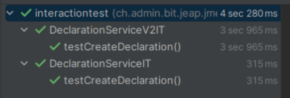

# Unit / Integration Testing with Kafka

## Integration Tests Without Kafka

Implementing a test (e.g. a Pact test) in a project that uses Kafka is relatively complicated, because an embedded Kafka needs to be available so that the Spring context can start up.

To mock Kafka, there is a test configuration in `jeap-messaging`:

[`jeap-messaging` / `jeap-messaging-infrastructure-kafka-test` / `KafkaMockTestConfig.java`](https://github.com/jeap-admin-ch/jeap-messaging/blob/main/jeap-messaging-infrastructure-kafka-test/src/main/java/ch/admin/bit/jeap/messaging/mockkafka/KafkaMockTestConfig.java)

```java
package ch.admin.bit.jeap.messaging.mockkafka;

import ch.admin.bit.jeap.messaging.avro.AvroMessage;
import ch.admin.bit.jeap.messaging.avro.AvroMessageKey;
import ch.admin.bit.jeap.messaging.kafka.KafkaConfiguration;
import ch.admin.bit.jeap.messaging.kafka.KafkaConsumerConfiguration;
import ch.admin.bit.jeap.messaging.kafka.serde.confluent.config.ConfluentSchemaRegistryAutoConfiguration;
import org.springframework.boot.autoconfigure.EnableAutoConfiguration;
import org.springframework.boot.kafka.autoconfigure.KafkaAutoConfiguration;
import org.springframework.boot.test.context.TestConfiguration;
import org.springframework.context.annotation.Bean;
import org.springframework.kafka.core.KafkaTemplate;
import org.mockito.Mockito;

@TestConfiguration
@EnableAutoConfiguration(exclude = {
        ConfluentSchemaRegistryAutoConfiguration.class,
        KafkaAutoConfiguration.class,
        KafkaConfiguration.class,
        KafkaConsumerConfiguration.class
})
public class KafkaMockTestConfig {

    @Bean
    KafkaTemplate<AvroMessageKey, AvroMessage> kafkaTemplate() {
        return Mockito.mock(KafkaTemplate.class);
    }

}
```

## Test Support in jEAP for Kafka Tests

### Base Class `KafkaIntegrationTestBase`

The base class `KafkaIntegrationTestBase` for tests with embedded Kafka, in the module `jeap-messaging-infrastructure-kafka-test`, provides the following features:

- An `EmbeddedKafka` annotation with a random port for the Kafka broker, for test isolation ([https://docs.spring.io/spring-kafka/reference/testing.html#embedded-kafka-junit5](https://docs.spring.io/spring-kafka/reference/testing.html#embedded-kafka-junit5))
- `EmbeddedKafka` configuration for integration tests. The broker address is automatically set to the embedded Kafka broker with a random port
  - For all configuration options preset in this case, see [`jeap-messaging-embedded-kafka-defaults.properties`](https://github.com/jeap-admin-ch/jeap-messaging/blob/main/jeap-messaging-infrastructure-kafka/src/main/resources/jeap-messaging-embedded-kafka-defaults.properties)
- Waits before the test until all consumer containers have been assigned a partition, to ensure that messages are actually received and processed

### Annotation `@TestKafkaListener`

The `@TestKafkaListener` annotation is an alias for `@KafkaListener`, with the difference that in this test listener the jEAP message-contract check is disabled by default. This means it is not necessary to globally disable the contract check or to create a consumer contract for the test. In addition, the test listener also listens on its own consumer group (specifically `${spring.application.name:testapp}-test`). This ensures that the test listener receives all messages sent on a topic.

```java
@TestKafkaListener(topics = JmeDeclarationCreatedEvent.TypeRef.DEFAULT_TOPIC)
public void consume(JmeDeclarationCreatedEvent event, Acknowledgment ack) {
    log.info("Consuming event in TestKafkaListener: {}", event);
    // ...
    ack.acknowledge();
}
```

### `sendSync()` in `KafkaIntegrationTestBase` Without Contract Check

The `sendSync()` method in `KafkaIntegrationTestBase` (from the module `jeap-messaging-infrastructure-kafka-test`) sets a test header on the message. This causes the contract check for producing the test message to be skipped. It is not necessary to globally disable the contract check, so it still runs — and is covered by the test — for the production code.

```java
class DeclarationServiceIT extends KafkaIntegrationTestBase {

    @Test
    void testCreateDeclaration() {
        AvroMessage event = ...
        // sendSync() sets a test header to skip the contract check for the test message
        sendSync(JmeDeclarationCreatedEvent.TypeRef.DEFAULT_TOPIC, event);

        // ...
    }
}
```

For tests that don't use the base class, the following helper can also be used, which shows the same behavior (it is used internally by `KafkaIntegrationTestBase.sendSync()`):

```java
TestMessageSender.sendSync(kafkaTemplate, topic, message);
```

## General Recommendations for Fast Spring Boot Tests with Embedded Kafka

### Reusing the Spring Context Across Multiple Tests

Starting an embedded Kafka broker is relatively fast (a few seconds). Still, for a large number of tests it's worth going through this startup only once.

The largest share of a Spring Boot test's startup time is building the Spring Boot context, including the initialization of all beans, etc. That's why Spring offers a feature with test [context caching](https://docs.spring.io/spring-framework/reference/testing/testcontext-framework/ctx-management/caching.html), which builds the Spring context for tests only once and reuses it for subsequent tests. Reusing the context depends on a caching key. The key is composed of factors such as properties, context configuration sources, active profiles, ... — for details see [the corresponding Spring documentation](https://docs.spring.io/spring-framework/reference/testing/testcontext-framework/ctx-management/caching.html).

The `@DirtiesContext` annotation forces the Spring context to be rebuilt and should therefore be avoided wherever possible. It may only be necessary for special stateful tests (e.g. caching or similar) where a new Spring context needs to be forced.

To get a stable caching key for Spring Boot tests, it's recommended to use a common base class for the tests. This ensures that properties, context configuration, etc. are the same across all tests:

```java
package ch.admin.bit.jeap.jme.interactiontest;

import ch.admin.bit.jeap.jme.interactiontest.testhelper.TestConsumer;
import ch.admin.bit.jeap.messaging.kafka.test.KafkaIntegrationTestBase;
import com.github.tomakehurst.wiremock.junit5.WireMockExtension;
import org.awaitility.Awaitility;
import org.junit.jupiter.api.extension.RegisterExtension;
import org.springframework.beans.factory.annotation.Autowired;
import org.springframework.boot.test.context.SpringBootTest;
import org.springframework.test.context.DynamicPropertyRegistry;
import org.springframework.test.context.DynamicPropertySource;

import java.time.Duration;
import java.util.concurrent.Callable;

import static com.github.tomakehurst.wiremock.core.WireMockConfiguration.wireMockConfig;

@SpringBootTest(properties =
        "jme.interactiontest.declaration.client.base-url=http://localhost:${wiremock.server.port}/declaration"
)
class IntegrationTestBase extends KafkaIntegrationTestBase {

    @RegisterExtension
    static WireMockExtension wireMock = WireMockExtension.newInstance()
            .options(wireMockConfig().dynamicPort().globalTemplating(true))
            .configureStaticDsl(true)
            .resetOnEachTest(true)
            .build();

    @DynamicPropertySource
    static void registerWireMockPort(DynamicPropertyRegistry registry) {
        registry.add("wiremock.server.port", wireMock::getPort);
    }

    @Autowired
    TestConsumer testConsumer;

    void await(Callable<Boolean> waitForItToBecomeTrue) {
        Awaitility.await()
                .atMost(Duration.ofSeconds(10))
                .until(waitForItToBecomeTrue);
    }

}
```

As the runtimes show, subsequent tests benefit strongly from context caching:



### Isolated Tests with Messaging

When reusing the Spring context across multiple tests, things like Spring Kafka consumer containers also persist for longer. This also applies to test consumers that receive messages for test assertions. A simple count of messages, or waiting for exactly one message, is therefore no longer possible.

To still isolate tests that use messaging with Kafka from one another, the following patterns can be applied:

1. Always assert against messages using a **unique ID for the test run**
   1. See the example below — e.g. keep a list of consumed messages in the test consumer, and in the test assertion check whether the expected message was received using a specific ID
   2. Anti-pattern: waiting for one message, counting messages, or similar
   3. Suitable IDs are e.g.: idempotence ID, process ID on the message, trace ID in the header, business ID in the payload
2. Use [**Awaitility**](http://www.awaitility.org/) in the test to wait until conditions are met, e.g. until a specific message has been produced
3. Use a **random port for embedded Kafka** to avoid race conditions with port allocation
   - `KafkaIntegrationTestBase` already does this
   - Otherwise set the following property: `spring.kafka.bootstrap-servers=${spring.embedded.kafka.brokers}`
4. Instantiate a **test consumer as a bean** in the test
   - This has the same lifecycle as the cached Spring context. Waiting for the partition assignment in `KafkaIntegrationTestBase` (see above) ensures that the consumer consumes all messages during the test
5. **Avoid** `@KafkaListener` annotations directly on test classes
   - These will steal partitions from each other due to having the same consumer group ID
6. **Database cleanup** in `@BeforeEach` or `@AfterEach`
   - E.g. deleting all data in the database to get a clean starting point for the test
7. Use the latest version of the **surefire/failsafe** Maven plugins — older versions sometimes cause crashes in integration tests with embedded Kafka or a lot of logging

#### Waiting for a Specific Event in the Test

The event is awaited and asserted in testCreateDeclarationV2 below.
```java
    /**
     * Test if the application receives 'create declaration' commands and processes them
     * by posting a declaration to a REST api and publishing a 'declaration created' event
     * after posting the declaration.
     */
    @Test
    void testCreateDeclarationV2() {
        String declarationEndpointPath = "/declaration";
        String declarationText = "this is a declaration";

        // given
        String idempotenceId = "test-v2";
        AvroMessage command = JmeCreateDeclarationV2CommandBuilder.create()
                .idempotenceId(idempotenceId)
                .text(declarationText)
                .build();
        stubFor(post(declarationEndpointPath)
                .willReturn(ok()
                        .withHeader(HttpHeaders.CONTENT_TYPE, MediaType.APPLICATION_JSON_VALUE)
                        .withBodyFile("declaration_1.json")));

        // when (using TestMessageSender.sendSync to avoid contract check for message producer in test)
        sendSync(JmeCreateDeclarationV2Command.TypeRef.DEFAULT_TOPIC, command);

        // then wait for a declaration created event to be published.
        await(() -> testConsumer.getConsumedEventByIdempotenceId(idempotenceId).isPresent());

        // maybe we also want to assert that vital data has been published correctly with the event
        JmeDeclarationCreatedEvent event = testConsumer.getConsumedEventByIdempotenceId(idempotenceId).get();
        assertThat(event.getPayload().getMessage())
                .contains(declarationText);
    }
}
```

#### Example of a Test Consumer

```java
package ch.admin.bit.jeap.jme.interactiontest.testhelper;


import ch.admin.bit.jeap.messaging.kafka.test.TestKafkaListener;
import ch.admin.bit.jme.declaration.JmeDeclarationCreatedEvent;
import lombok.extern.slf4j.Slf4j;
import org.springframework.kafka.support.Acknowledgment;

import java.util.List;
import java.util.Optional;
import java.util.concurrent.CopyOnWriteArrayList;

@Slf4j
public class TestConsumer {

    private final List<JmeDeclarationCreatedEvent> consumedEvents = new CopyOnWriteArrayList<>();

    // TestKafkaListener is a meta-annotation for KafkaListener that disables contract-checks for the test listener
    @TestKafkaListener(topics = JmeDeclarationCreatedEvent.TypeRef.DEFAULT_TOPIC)
    public void consume(final JmeDeclarationCreatedEvent jmeDeclarationCreatedEvent, Acknowledgment ack) {
        consumedEvents.add(jmeDeclarationCreatedEvent);
        String message = jmeDeclarationCreatedEvent.getPayload().getMessage();
        log.info("**** 4. Consuming event in TestConsumer: {}", message);
        ack.acknowledge();
    }

    public List<JmeDeclarationCreatedEvent> getConsumedEvents() {
        return List.copyOf(consumedEvents);
    }

    public Optional<JmeDeclarationCreatedEvent> getConsumedEventByIdempotenceId(String idempotenceId) {
        return consumedEvents.stream()
                .filter(event -> idempotenceId.equals(event.getIdentity().getIdempotenceId()))
                .findFirst();
    }
}
```
