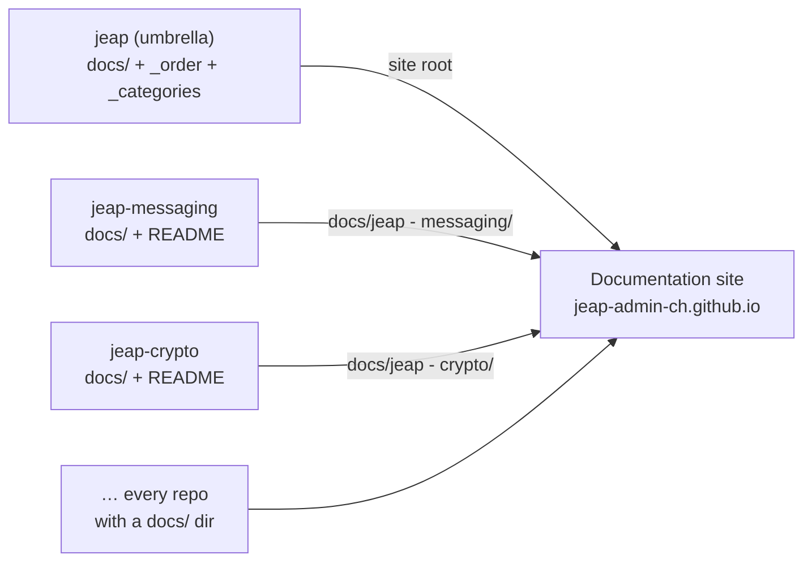

# Documenting jEAP

This page describes how jEAP documentation is **written**, **structured**, and
**published**. It is the authoritative reference for anyone adding or maintaining
docs in a jEAP repository — and for repository owners who want their docs to appear
on the public documentation site.

jEAP documentation has two homes. The **general, cross-cutting documentation**
(what jEAP is, its principles, the building-block index) is authored centrally in
this **umbrella repository** ([`jeap`](https://github.com/jeap-admin-ch/jeap)).
Documentation for an individual building block is authored **with that building
block**, in Markdown alongside its code. The public site at
[jeap-admin-ch.github.io](https://jeap-admin-ch.github.io) is **assembled at build
time** by combining this umbrella's `docs/` (placed at the site root) with the
`docs/` directory of every other jEAP repository (see
[Publishing](#publishing)). Write general docs here; write a building block's docs
in its own repository — the site picks both up automatically.

## Writing principles

Documentation is written in **English** and optimised to be read both by humans on
GitHub / the doc site and by AI coding agents navigating the corpus.

- **The `README.md` is short and context-sparing.** Its job is orientation: what the
  building block is, the most important concepts, and links into `docs/` for the
  detail. Keep depth out of the README.
- **Be context-sparing — do not rely solely on RAG.** A reader (human or agent)
  should be able to navigate to the right page and find a self-contained answer
  without loading the whole corpus.
- **One article, one topic.** Each `docs/` page is focused on a single subject.
    - Good: *Unit/Integration Testing of jEAP Security Authorization*
    - Bad: *jEAP Security Annotations and how to test them*
- **Semantic file names so agents (and people) can find pages.** The path should
  describe the content.
    - Good: `getting-started.md`
    - Good: `database/postgresql/index.md`
    - Bad: `integration/general.md`
- **Link to related topics.** Every page references the relevant neighbouring pages
  so a reader can navigate the hierarchy by following links.
- **Hierarchical specialization.** Each additional link level narrows the topic
  (e.g. `jeap` → `database` → `postgresql` → `aws-rds`). Keep the hierarchy at most
  **four levels** deep.
- **Relative links between Markdown files**, so the same links work both on GitHub
  and in the generated HTML. (See [Linking](#linking).)
- **HTTP links always point at public documentation** — the public doc site or the
  public GitHub repositories, never internal resources.
- **Diagrams are written in [Mermaid](https://mermaid.js.org/)** — fenced
  ` ```mermaid ` code blocks, rendered by the doc site. Prefer Mermaid over embedded
  images because:
    - **Automated layout** — you describe nodes and edges, the renderer handles
      positioning, so diagrams stay tidy as they evolve without manual pixel-pushing.
    - **In-place authoring in Markdown** — the diagram source lives in the `.md` file
      next to the prose, so it is version-controlled, diff-able and edited with the
      same tools as the text (no binary assets, no external diagram editor).
    - **Easily understood by AI agents** — the textual source is readable and
      editable by coding agents, which can neither parse nor modify an image.

  When authoring locally in IntelliJ IDEA, the
  [Mermaid plugin](https://plugins.jetbrains.com/plugin/20146-mermaid) previews these
  blocks in the Markdown editor.
- **Pages must be valid [MDX](https://mdxjs.com/).** Docusaurus renders every `.md`
  page as MDX, so the Markdown has to satisfy Docusaurus' MDX parser or the
  production build fails. In practice: a bare `<` is read as a JSX tag and `{ }` as a
  JS expression — escape them or wrap them in backticks when you mean them literally
  (e.g. write `` `<topic>` `` or `` `${var}` ``), and make sure any inline HTML tags
  are closed/balanced. The pages still render as plain Markdown on GitHub, so this
  only constrains a few special characters.

## Repository layouts

The structure depends on what the repository is. The four shapes below cover the
jEAP repositories.

### jEAP Umbrella repository

Holds the cross-cutting overview, concepts and the building-block index — the
material that is not specific to a single library. Its `docs/` is placed at the
**root** of the published site and provides the top-level sidebar.

```
README.md
docs/
  _order                         # top-level sidebar order (see Publishing)
  _categories                    # building-block subcategory routing (see Publishing)
  what-is-jeap.md                # definition, principles, the problems jEAP solves
  using-jeap.md                  # the Maven parents and dependency management
  building-blocks/
    index.md                     # category landing page
    libraries/index.md
    spring-boot-starters/index.md
    reusable-microservices/index.md
    tooling/index.md
  jeap-version-overview.md        # versions of jEAP libraries, starters, and products
```

### Source Code Repositiories

For libraries, Spring Boot starters, re-usable microservices and examples, documentation lives in the library's own
repository: a short README that links into a **flat** set of topic pages under `docs/`.

```
README.md                        # short: what it is, key concepts, link table into docs/
docs/
  getting-started.md
  architecture.md
  configuration.md
  usage.md                       # For examples
  <topic>.md ...
```

> **Refinement vs. the original principle.** The principle envisioned a per-topic
> `docs/<topic>/index.md` + `docs/<topic>/<subtopic>.md` hierarchy. In practice
> libraries use a **flat** `docs/<topic>.md` layout (see
> [jeap-messaging](https://github.com/jeap-admin-ch/jeap-messaging) as the reference),
> which keeps file names semantic and the README link table simple. Only introduce a
> `docs/<topic>/` subfolder when a topic genuinely needs its own set of subpages —
> and stay within the four-level depth limit.

## Linking

- **Between Markdown files: use relative paths** (e.g. `[Testing](docs/testing.md)`
  from a README, `[Architecture](architecture.md)` between sibling pages). These
  resolve correctly on GitHub and, because the publish step preserves the directory
  structure 1:1, on the doc site too.
- **To another repository's docs: use the public site URL**
  (`https://jeap-admin-ch.github.io/docs/<repo>/` for the repo's section,
  `https://jeap-admin-ch.github.io/docs/<repo>/<page>` for a specific page) or the
  public GitHub URL — never a relative path that escapes the current repository.
  The publish step folds these into site-internal links, so they are validated by
  the site build and follow the section if the repo is re-categorized.
- A folder's landing page is its **`index.md`** — link to the folder and that page is
  shown. See [Landing pages: `index.md`](#landing-pages-indexmd).

## Landing pages: `index.md`

A folder becomes a **category** in the sidebar, and its **`index.md` is the page
shown when the reader opens that category** (the Docusaurus category-index
convention). Because a folder's `_category_.json` then needs no `link` key, every
folder that appears in the sidebar should carry an `index.md` — otherwise the
category has no landing content. Keep it a **short orienting overview** that says
what the section covers and links into its pages, mirroring the
"[README is short](#writing-principles)" principle.

`index.md` files come from two places:

- **Authored by hand — in this umbrella repo.** Each curated category folder ships
  its own `index.md`: `building-blocks/index.md` and one per subcategory
  (`building-blocks/libraries/index.md`, `…/spring-boot-starters/index.md`, …). You
  write and maintain these.
- **Generated at publish time — for auto-discovered repo sections.** When a building
  block's repo is pulled into the site, its **`README.md` becomes the `index.md` of
  the repo's `docs/` section** (the landing page) — so the README *is* what a reader
  sees when opening that building block's section. A repo therefore needs no
  hand-written `docs/index.md`. (See [Publishing](#publishing) and the
  [site repository README](https://github.com/jeap-admin-ch/jeap-admin-ch.github.io/blob/main/README.md)
  for the mechanics.)

This is also why a library's own `docs/` is **flat** (`docs/<topic>.md`) with the
README as its entry point: the README already serves as the section landing page, so
there is no need for a separate `docs/index.md`.

## Publishing

The public site is built with **[Docusaurus 3](https://docusaurus.io/)** and deployed
to GitHub Pages from the
[`jeap-admin-ch.github.io`](https://github.com/jeap-admin-ch/jeap-admin-ch.github.io)
repository, which holds the site shell only — the content under its `docs/` is
**aggregated from the jEAP repositories at build time**: this umbrella's `docs/` at
the site root, plus the `docs/` of every other repo that ships one, discovered
automatically. The sidebar order and building-block categories are driven by this
repo's [`_order`](https://github.com/jeap-admin-ch/jeap/blob/main/docs/_order) and
[`_categories`](https://github.com/jeap-admin-ch/jeap/blob/main/docs/_categories)
manifests, so the structure lives **with the content** here.



What this means for you as an author:

- **To publish a building block's docs**, give its repository a top-level `docs/`
  with Markdown pages and a README linking into them — the next site build picks it
  up. No change to the site repository is needed.
- **To add or reorder general docs here**, add the file/folder under `docs/` and a
  line in [`_order`](https://github.com/jeap-admin-ch/jeap/blob/main/docs/_order).
- **Broken internal links fail the build** (`onBrokenLinks: 'throw'`), so keep
  cross-repo links pointing at the public site / GitHub as described above.

For the full pipeline — the aggregation scripts, link rewriting, deployment workflow
and how to preview locally — see the site repository's
**[README](https://github.com/jeap-admin-ch/jeap-admin-ch.github.io/blob/main/README.md)**.

## See also

- [What is jEAP?](what-is-jeap.md) — definition, principles, and the problems jEAP solves.
- [App Building Blocks](building-blocks/index.md) — the catalogue this documentation describes.
- [`docs/_order`](https://github.com/jeap-admin-ch/jeap/blob/main/docs/_order) and [
  `docs/_categories`](https://github.com/jeap-admin-ch/jeap/blob/main/docs/_categories) — the sidebar/category
  manifests.
- [jeap-admin-ch.github.io](https://github.com/jeap-admin-ch/jeap-admin-ch.github.io) — the site repository and full
  pipeline reference.
- [jEAP version overview](jeap-version-overview.md) — the versions of jEAP libraries, starters, and products.
