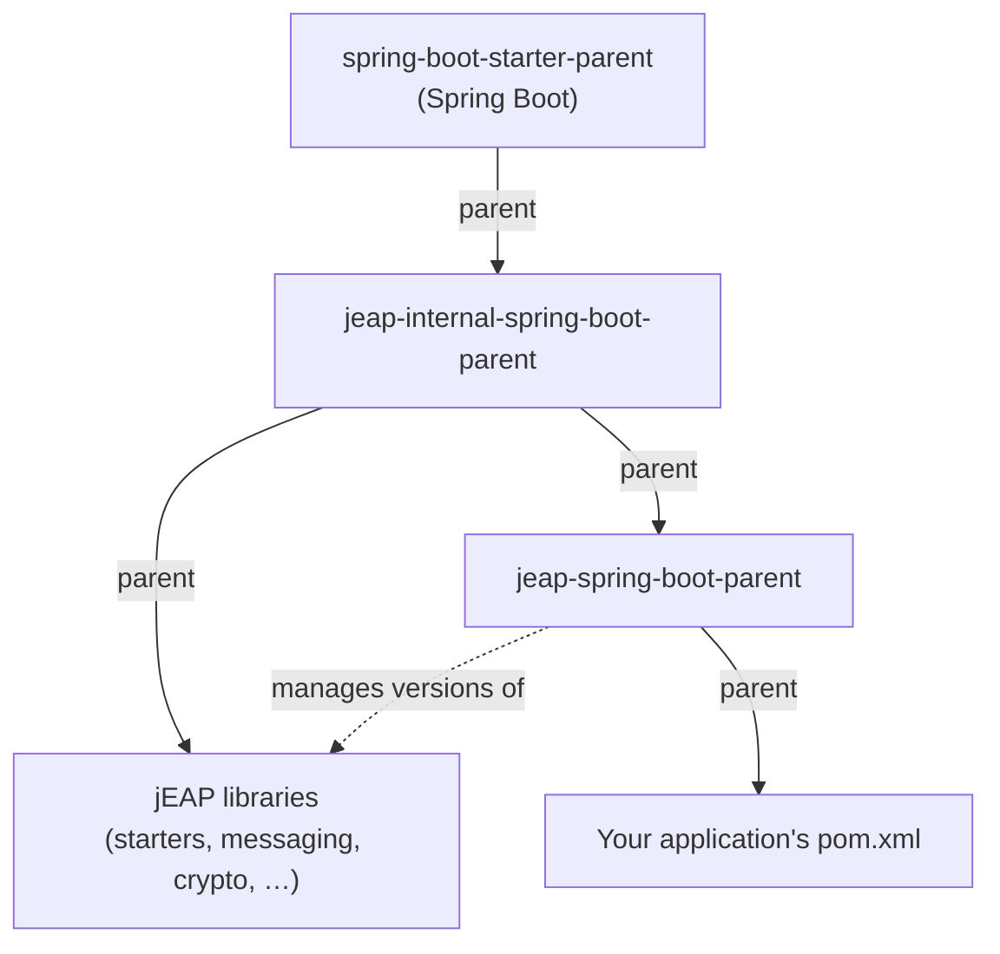
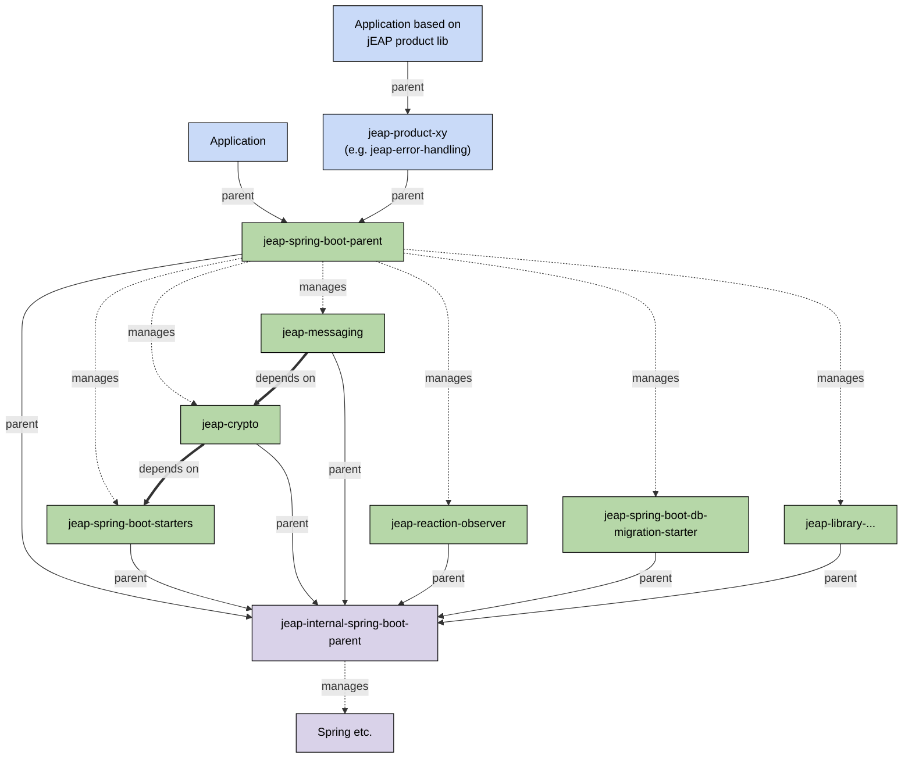

# Using jEAP

A jEAP application is a Spring Boot application that inherits the jEAP Maven parent and
composes [building blocks](building-blocks/index.md). This page explains the parent hierarchy
and the dependency-management model that hold a jEAP application together.

## Parent hierarchy

jEAP uses a two-level Maven parent chain. The internal parent is the parent of both the
jEAP libraries and the public parent; the public parent dependency-manages those libraries
and is the parent your application inherits from:



- **[jeap-internal-spring-boot-parent](https://github.com/jeap-admin-ch/jeap-internal-spring-boot-parent)**
  pins the Spring Boot version, inherits Spring Boot's dependency management for common
  third-party dependencies, and pre-configures common Maven plugins. It is the parent of the
  jEAP libraries themselves and is not meant to be used directly by applications. Keeping the
  libraries on a separate parent lets `jeap-spring-boot-parent` manage their versions without
  introducing a cyclic dependency.
- **[jeap-spring-boot-parent](https://github.com/jeap-admin-ch/jeap-spring-boot-parent)**
  inherits from the internal parent and manages the versions of the jEAP dependencies
  (starters, messaging, crypto, …). **This is the parent that applications based on jEAP
  should inherit from.**

## Dependency management

Because `jeap-spring-boot-parent` carries BOM-style dependency management, an application
declares jEAP dependencies **without a version** — the parent aligns all jEAP and Spring
versions to a tested, mutually compatible set. Do not pin individual jEAP library versions
in your application; upgrade by bumping the `jeap-spring-boot-parent` version instead.

```xml
<parent>
    <groupId>ch.admin.bit.jeap</groupId>
    <artifactId>jeap-spring-boot-parent</artifactId>
    <version><!-- the jEAP parent version --></version>
</parent>
```

The current jEAP parent version and the resulting managed versions of the jEAP libraries,
Spring dependencies and selected third-party dependencies are published in a generated
**version overview** — refer to it rather than hard-coding versions here.

## Module dependency graph

The graph below shows how the parents, the jEAP libraries and your applications relate.
Three relationships are distinguished: Maven **parent** inheritance (solid), BOM-style
**dependency management** (dotted), and an actual library **dependency** (thick).



The internal parent is the parent of all jEAP libraries and pins the Spring (and other
third-party) versions; `jeap-spring-boot-parent` inherits from it and re-publishes those
libraries as managed versions for applications. jEAP product libraries (e.g.
`jeap-error-handling`) also build on `jeap-spring-boot-parent` and act as an intermediate
parent for applications based on them.

## Building from source

jEAP libraries build with the Maven Wrapper provided in each repository:

```shell
./mvnw install
```

Individual libraries may have additional requirements (for example a specific Java
version) — see the respective repository's `README.md` or `pom.xml`.

## Next steps

- [App Building Blocks](building-blocks/index.md) — what to compose into your application.
- [What is jEAP?](what-is-jeap.md) — principles and the problems jEAP solves.
