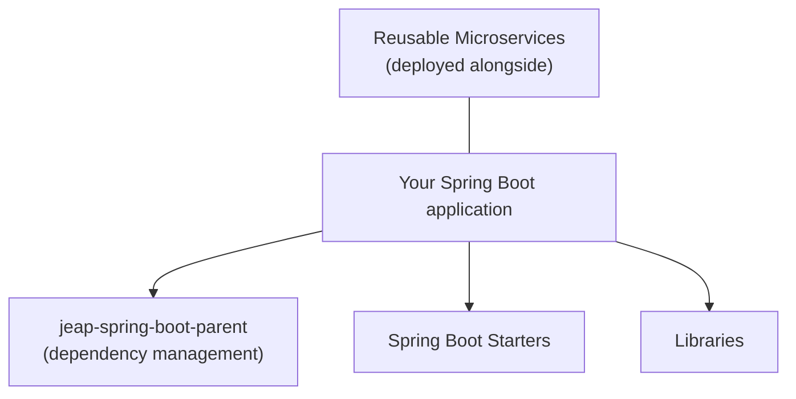

# What is jEAP?

**jEAP (Java Enterprise Application Platform)** is a suite of Spring Boot libraries,
Spring Boot starters and reusable microservice templates for building Java-based
enterprise applications. It is published as open source under the
[Apache License 2.0](https://github.com/jeap-admin-ch/jeap/blob/main/LICENSE) by the
Federal Office of Information Technology, Systems and Telecommunication (FOITT/BIT)
of the Swiss Confederation.

jEAP solves the recurring cross-functional concerns of enterprise applications —
messaging, security, persistence, observability, encryption, and more — once and in a
reusable way, so that application teams can focus on their business logic.

## Core principles

- **Convention over configuration.** Applications inherit a Maven parent that provides
  aligned dependency versions and sensible default configuration. See
  [Using jEAP](using-jeap.md).
- **Reuse cross-functional concerns.** Each concern (logging, monitoring, messaging,
  security, …) is solved in a dedicated, independently versioned library or starter.
- **Secure by default.** OAuth2/OIDC resource-server security, client-side encryption of
  data-at-rest, TLS, and certificate-based AWS credentials are provided out of the box.
- **Platform-agnostic core, cloud-native ready.** The jEAP core does not depend on a specific runtime
  platform, so business logic stays portable. Dedicated starters add first-class support
  for running on Kubernetes/OpenShift and AWS — configuration management, secrets
  management, object storage, TLS, and more.
- **First-class support for event-driven architecture** EDA a first-class, well-supported
  capability in jEAP: asynchronous messaging is built on Apache Kafka and Avro, with reliable
  delivery via the Transactional Outbox pattern and ordered consumption using the jEAP Sequential Inbox.

## Value proposition

Building on jEAP means the reusable, cross-functional aspects of an enterprise
application are already solved, tested and maintained. Teams compose their service from
[building blocks](building-blocks/index.md) and inherit a curated, version-aligned dependency
tree instead of assembling and maintaining the plumbing themselves.

jEAP follows a principle of **standardization without restriction**: rather than hiding
Spring Boot behind its own abstraction, it complements it — teams keep the full power of
the underlying framework while gaining aligned defaults for the mandatory and technically
demanding non-functional requirements. It builds on established open-source solutions and
adds building blocks only where they are missing.

The value extends well beyond initial development, where most of an application's effort
is actually spent:

- **Faster, safer delivery.** Opinionated CI/CD, automated regression testing and
  feature-flag-based releases shorten the path from commit to production.
- **Secure and compliant by default.** Zero-trust messaging, data-at-rest encryption and
  automated governance checks make compliance largely a by-product of using the platform.
- **Self-documenting applications.** OpenAPI specs, message and consumer contracts, DB
  schemas and deployments are published automatically to the architecture repository.
- **Cloud portability.** Business logic stays platform-agnostic, providing a proven
  cloud-exit strategy and low-effort migration between cloud and on-premises platforms.
- **Developer mobility.** Shared conventions and tooling let developers move between teams;
  jEAP is used by different organizations across several Swiss federal administrations.

## Problems jEAP solves

| Concern                                                       | Provided by                                                                               |
|---------------------------------------------------------------|-------------------------------------------------------------------------------------------|
| Asynchronous messaging (Kafka/Avro)                           | [Libraries](building-blocks/libraries/index.md) — jeap-messaging                                |
| Reliable message delivery (Transactional Outbox)              | jeap-messaging-outbox                                                                     |
| Ordered message processing                                    | jeap-messaging-sequential-inbox                                                           |
| Audit records                                                 | jeap-audit                                                                                |
| Client-side encryption of data-at-rest                        | jeap-crypto                                                                               |
| Transparent JWE encryption of HTTP API payloads               | jeap-spring-boot-jwe-starter                                                              |
| Certificate-based AWS credentials (IAM Roles Anywhere)        | jeap-spring-boot-roles-anywhere-starter                                                   |
| Real-time server→client events (SSE)                          | jeap-server-sent-events                                                                   |
| Search / OpenSearch indexing & querying                       | jeap-opensearch-* building blocks                                                         |
| Application setup, logging, monitoring, security, persistence | [Spring Boot Starters](building-blocks/spring-boot-starters/index.md)                           |
| Secrets, DB migration & pooling, object storage, TLS          | Spring Boot Starters                                                                      |
| Error handling of faulty messages                             | [Reusable Microservices](building-blocks/reusable-microservices/index.md) — jeap-error-handling |
| Message exchange with external parties (HTTP messagebox)      | jeap-message-exchange-service                                                             |
| Process context & process archive                             | jeap-process-context-service, jeap-process-archive-service                                |
| Architecture inventory & deployment logging                   | jeap-archrepo-service, jeap-deploymentlog-service                                         |
| Policy compliance & governance checks                         | jeap-governance-service                                                                   |
| DB schema publishing to the architecture repository           | jeap-db-schema-publisher                                                                  |
| Message contracts & business-process tests                    | jeap-message-contract-service, jeap-bptest-orchestrator                                   |
| OAuth2/OIDC mock for local development & testing              | jeap-oauth-mock-server                                                                    |
| Project bootstrapping & codebase generation                   | jeap-initializer                                                                          |
| Developer tooling, registries, Maven plugins                  | [Tooling & Registries](building-blocks/tooling/index.md)                                        |

## Next steps

- [Using jEAP](using-jeap.md) — the parent POMs and dependency management.
- [App Building Blocks](building-blocks/index.md) — the libraries, starters and microservices you compose from.
